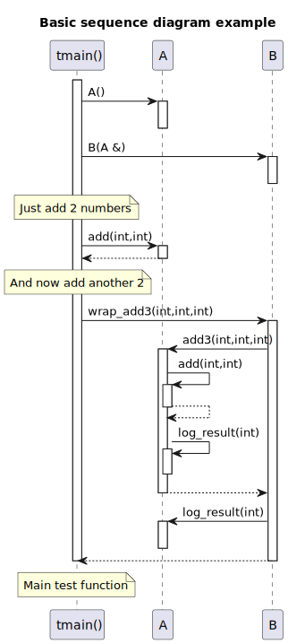

# clang-uml - C++ UML diagram generator based on Clang and PlantUML

[](https://github.com/bkryza/clang-uml/actions)
[](https://codecov.io/gh/bkryza/clang-uml)

`clang-uml` is an automatic C++ to [PlantUML](https://plantuml.com) class, sequence
and package diagram generator, driven by YAML configuration files. The main idea behind the
project is to easily maintain up-to-date diagrams within a code-base or document
legacy code. The configuration file or files for `clang-uml` define the
type and contents of each generated diagram.

`clang-uml` currently supports C++ up to version 17.

## Features
Main features supported so far include:

* **Class diagram generation**
    * Basic class properties and methods including visibility
    * Class relationships including associations, aggregations, dependencies and friendship
    * Template instantiation relationships
    * Relationship inference from C++ containers and smart pointers
    * Diagram content filtering based on namespaces, elements and relationships
    * Optional package generation from namespaces
    * Interactive links to online code to classes, methods and class fields in SVG diagrams
* **Sequence diagram generation**
    * Generation of sequence diagram from one code location to another (currently only for non-template code)
* **Package diagram generation**
    * Generation of package diagram based on C++ namespaces
    * Interactive links to online code to packages
* **Include graph diagram generation**
    * Show include graph for selected files
  
To see what `clang-uml` can do so far, checkout the diagrams generated for unit test cases [here](./docs/test_cases.md).

## Installation

### Building from source
Currently, the only method to install `clang-uml` is from source. First make sure
that you have the following dependencies installed:

```bash
# Ubuntu
apt install ccache cmake libyaml-cpp-dev clang-12 libclang-12-dev libclang-cpp12-dev

# macos
brew install ccache cmake llvm yaml-cpp
```

Then proceed with building the sources:

```bash
git clone https://github.com/bkryza/clang-uml
cd clang-uml
make submodules
# Please note that top level Makefile is just a convenience wrapper for CMake
make release
release/clang-uml --help

# To build using a specific installed version of LLVM use:
LLVM_CONFIG_PATH=/usr/bin/llvm-config-13 make release

# To build on macos, it is necessary to provide also path to LLVM cmake directory, e.g.:
export LLVM_PREFIX="/usr/local/Cellar/llvm@12/12.0.1_1"
LLVM_CONFIG_PATH="${LLVM_PREFIX}/bin/llvm-config" CMAKE_PREFIX_PATH="${LLVM_PREFIX}/lib/cmake/llvm/" make test

# Optionally
make install
# or
export PATH=$PATH:$PWD/release
```

## Usage

### Generating compile commands database
`clang-uml` requires an up-to-date
[compile_commands.json](https://clang.llvm.org/docs/JSONCompilationDatabase.html)
file, containing the list of commands used for compiling the source code.
Nowadays, this file can be generated rather easily using multiple methods:
  * For [CMake](https://cmake.org/) projects, simply invoke the `cmake` command
    as `cmake -DCMAKE_EXPORT_COMPILE_COMMANDS=ON ...`
  * For Make projects checkout [compiledb](https://github.com/nickdiego/compiledb) or [Bear](https://github.com/rizsotto/Bear)
  * For Boost-based projects try [commands_to_compilation_database](https://github.com/tee3/commands_to_compilation_database)

### Invocation
By default, `config-uml` will assume that the configuration file `.clang-uml`
and compilation database `compile_commands.json` files are in the
current directory, so if they are in the top level directory of a project,
simply run:
```bash
clang-uml
```

The output path for diagrams, as well as alternative location of
compilation database can be specified in `.clang-uml` configuration file.

For other options checkout help:
```bash
clang-uml --help
```

### Configuration file format and examples

Configuration files are written in YAML, and provide a list of diagrams
which should be generated by `clang-uml`. Basic example is as follows:

```yaml
compilation_database_dir: .
output_directory: puml
diagrams:
  myproject_class:
    type: class
    glob:
      - src/*.h
      - src/*.cc
    using_namespace:
      - myproject
    include:
      namespaces:
        - myproject
    exclude:
      namespaces:
        - myproject::detail
    plantuml:
      after:
        - 'note left of {{ alias("MyProjectMain") }}: Main class of myproject library.'
```

See [here](docs/configuration_file.md) for detailed configuration file reference guide.

## Examples
To see what `clang-uml` can do, checkout the test cases documentation [here](./docs/test_cases.md).

In order to see diagrams for the `clang-uml` itself, based on its own [config](.clang-uml) run
the following:

```bash
make clanguml_diagrams
```

and checkout the SVG diagrams in `docs/diagrams` folder.

### Class diagrams

#### Example

Source code:

```cpp
template <typename T, typename P> struct A {
    T t;
    P p;
};

struct B {
    std::string value;
};

template <typename T> using AString = A<T, std::string>;
template <typename T> using AStringPtr = A<T, std::unique_ptr<std::string>>;

template <typename T>
using PairPairBA = std::pair<std::pair<B, A<long, T>>, long>;

template <class T> using VectorPtr = std::unique_ptr<std::vector<T>>;
template <class T> using APtr = std::unique_ptr<A<double, T>>;
template <class T> using ASharedPtr = std::shared_ptr<A<double, T>>;
template <class T, class U>
using AAPtr = std::unique_ptr<std::pair<A<double, T>, A<long, U>>>;

template <typename T> using SimpleCallback = std::function<void(T, int)>;
template <typename... T> using GenericCallback = std::function<void(T..., int)>;
using VoidCallback = GenericCallback<void *>;

using BVector = std::vector<B>;
using BVector2 = BVector;

using AIntString = AString<int>;
using ACharString = AString<char>;
using AWCharString = AString<wchar_t>;
using AStringString = AString<std::string>;
using BStringString = AStringString;

class R {
    PairPairBA<bool> bapair;

    APtr<bool> abool;
    AAPtr<bool, float> aboolfloat;
    ASharedPtr<float> afloat;
    A<bool, std::string> boolstring;
    AStringPtr<float> floatstring;
    AIntString intstring;
    AStringString stringstring;
    BStringString bstringstring;

protected:
    BVector bs;

public:
    BVector2 bs2;
    SimpleCallback<ACharString> cb;
    GenericCallback<AWCharString> gcb;
    VoidCallback vcb;
    VectorPtr<B> vps;
};
```

generates the following diagram (via PlantUML):


> Open the raw image [here](https://raw.githubusercontent.com/bkryza/clang-uml/master/docs/test_cases/t00014_class.svg),
> and checkout the hover tooltips and hyperlinks to classes and methods.

### Sequence diagrams

#### Example

The following C++ code:

```cpp
#include <algorithm>
#include <numeric>
#include <vector>

namespace clanguml {
namespace t20001 {

namespace detail {
struct C {
    auto add(int x, int y) { return x + y; }
};
}

class A {
public:
    A() {}

    int add(int x, int y) { return m_c.add(x, y); }

    int add3(int x, int y, int z)
    {
        std::vector<int> v;
        v.push_back(x);
        v.push_back(y);
        v.push_back(z);
        auto res = add(v[0], v[1]) + v[2];
        log_result(res);
        return res;
    }

    void log_result(int r) {}

private:
    detail::C m_c{};
};

class B {
public:
    B(A &a)
        : m_a{a}
    {
    }

    int wrap_add(int x, int y)
    {
        auto res = m_a.add(x, y);
        m_a.log_result(res);
        return res;
    }

    int wrap_add3(int x, int y, int z)
    {
        auto res = m_a.add3(x, y, z);
        m_a.log_result(res);
        return res;
    }

private:
    A &m_a;
};

int tmain()
{
    A a;
    B b(a);

    return b.wrap_add3(1, 2, 3);
}
}
}
```

generates the following diagram (via PlantUML):



### Package diagrams

#### Example

The following C++ code:

```cpp
namespace clanguml {
namespace t30003 {

namespace ns1 {
namespace ns2_v1_0_0 {
class A {
};
}

namespace [[deprecated]] ns2_v0_9_0 {
class A {
};
}

namespace {
class Anon final {
};
}
}

namespace [[deprecated]] ns3 {

namespace ns1::ns2 {
class Anon : public t30003::ns1::ns2_v1_0_0::A {
};
}

class B : public ns1::ns2::Anon {
};
}
}
}
```

generates the following diagram (via PlantUML):


### Include diagrams

#### Example

The following C++ code structure:

```
tests/t40001
├── include
│   ├── lib1
│   │   └── lib1.h
│   └── t40001_include1.h
└── src
    └── t40001.cc

```

generates the following diagram (via PlantUML) based on include directives in the code:


### Default mappings

| UML                                    | PlantUML   |
| ----                                   | ---        |
| Inheritance                            |  |
| Association                            |  |
| Dependency                             |  |
| Aggregation                            |  |
| Composition                            |  |
| Template specialization/instantiation  |  |
| Nesting (inner class/enum)             |  |
| Include (local)                        |  |
| Include (system)                       |  |

### Diagram content filtering
For typical code bases, generating a single diagram from entire code or even a single namespace can be too big to
be useful, e.g. as part of documentation. `clang-uml` allows specifying content to be included and excluded from
each diagram using simple YAML configuration:

```yaml
include:
  # Include only elements from these namespaces
  namespaces:
    - clanguml::common
    - clanguml::config
  # Include all subclasses of ClassA (including ClassA)
  subclasses:
    - clanguml::common::ClassA
  # and specializations of template Class<T> (including Class<T>)
  specializations:
    - clanguml::common::ClassT<T>
  # and all classes depending on Class D
  dependants:
    - clanguml::common::ClassD
  # and all dependencies of ClassE
  dependencies:
    - clanguml::common::ClassE
  # and classes in direct relation to ClassB (including ClassB)
  context:
    - clanguml::common::ClassB
  # Include only inheritance relationships
  relationships:
    - inheritance
exclude:
  # Exclude all elements from detail namespace
  namespaces:
    - clanguml::common::detail
  # and also exclude ClassF
  exclude:
    - clanguml::common::ClassF
```

### Comment decorators

`clang-uml` provides a set of in-comment directives, called decorators, which allow custom control over
generation of UML diagrams from C++ and overriding default inference rules for relationships.

The following decorators are currently supported:
- [note](docs/test_cases/t00028.md) - add a PlantUML note to a C++ entity
- [skip](docs/test_cases/t00029.md) - skip the underlying C++ entity
- [skiprelationship](docs/test_cases/t00029.md) - skip only relationship generation for a class property
- [composition](docs/test_cases/t00030.md) - document the property as composition
- [association](docs/test_cases/t00030.md) - document the property as association
- [aggregation](docs/test_cases/t00030.md) - document the property as aggregation
- [style](docs/test_cases/t00031.md) - add PlantUML style to a C++ entity

### Doxygen integration
`clang-uml` decorstors can be omitted completely in [Doxygen](https://www.doxygen.nl/index.html), by adding the following
lines to the Doxygen config file:

```
ALIASES                += clanguml=""
ALIASES                += clanguml{1}=""
ALIASES                += clanguml{2}=""
ALIASES                += clanguml{3}=""
```

### Test cases

The build-in test cases used for unit testing of the `clang-uml`, can be browsed [here](./docs/test_cases.md).

## Acknowledgements
This project relies on the following great tools:
  * [libclang](https://clang.llvm.org/) - a C/C++ frontend for LLVM
  * [cppast](https://github.com/foonathan/cppast) - high-level C++ API for libclang
  * [PlantUML](https://plantuml.com/) - language and diagram for generating UML diagrams
  * [Catch2](https://github.com/catchorg/Catch2) - C++ unit test framework
  * [glob](https://github.com/p-ranav/glob) - Unix style path expansion for C++
  * [CLI11](https://github.com/CLIUtils/CLI11) - command line parser for C++
  * [inja](https://github.com/pantor/inja) - a template engine for modern C++

## LICENSE

    Copyright 2021-present Bartek Kryza <bkryza@gmail.com>

    Licensed under the Apache License, Version 2.0 (the "License");
    you may not use this file except in compliance with the License.
    You may obtain a copy of the License at

      http://www.apache.org/licenses/LICENSE-2.0

    Unless required by applicable law or agreed to in writing, software
    distributed under the License is distributed on an "AS IS" BASIS,
    WITHOUT WARRANTIES OR CONDITIONS OF ANY KIND, either express or implied.
    See the License for the specific language governing permissions and
    limitations under the License.
