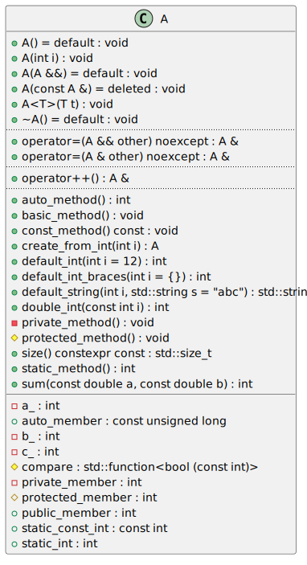
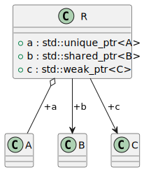
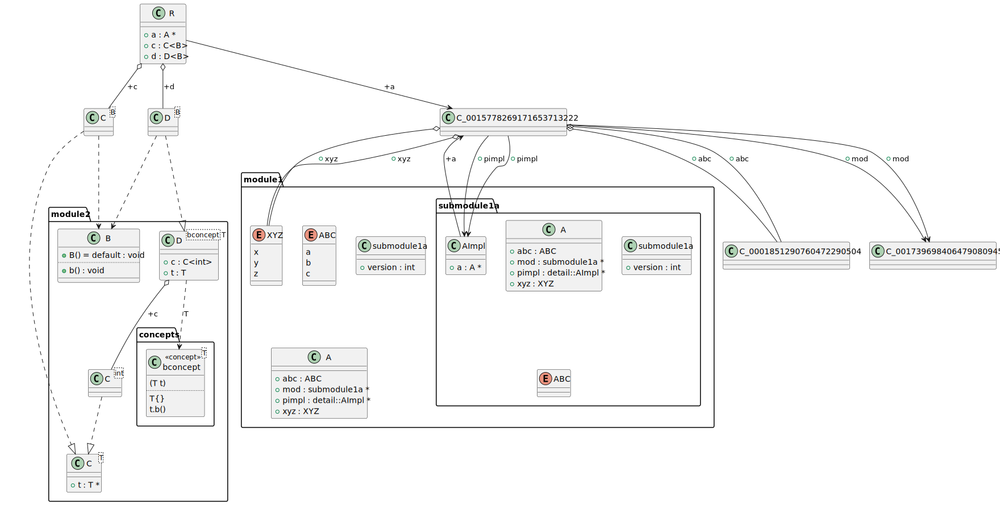

# Generating class diagrams

<!-- toc -->

* [Classes and their properties](#classes-and-their-properties)
  * [Excluding private or protected members from the diagram](#excluding-private-or-protected-members-from-the-diagram)
* [Relationships](#relationships)
  * [Relationships to classes in containers or smart pointers](#relationships-to-classes-in-containers-or-smart-pointers)
* [Inheritance diagrams](#inheritance-diagrams)
* [Generating UML packages in the diagram](#generating-uml-packages-in-the-diagram)
  * [Namespace packages](#namespace-packages)
  * [Directory packages](#directory-packages)
  * [Module packages](#module-packages)
* [Class context diagram](#class-context-diagram)
* [Disabling dependency relationships](#disabling-dependency-relationships)

<!-- tocstop -->

The minimal config required to generate a class diagram is presented below:
```yaml
# Path to the directory where `compile_commands.json` can be found
compilation_database_dir: _build
# Output directory for the diagrams
output_directory: diagrams
# Diagrams definitions
diagrams:
  # Diagram name
  t00002_class:
    # Type of diagram (has to be `class`)
    type: class
    # Include only translation units matching the following patterns
    glob:
      - src/*.cc
    # Render all names in the diagram relative to specific namespace
    using_namespace: ns1
    # Include only classes from specific namespace
    include:
      namespaces:
        - ns1::ns2
```

## Classes and their properties
The basic class diagram generated by `clang-uml` and rendered using PlantUML
looks like this:



Member types and method return types are rendered at the end after `:` sign.

Static methods and members are underlined.

In case method argument lists are too long and not required for diagram
readability, they can be suppressed completely or abbreviated by setting
`generate_method_arguments` option to either `none`, `abbreviated` or `full`
(default).


### Excluding private or protected members from the diagram
In order to only include public members in the class diagrams, we can add the
following inclusion filters:
```yaml
    include:
      access:
        - public
```

To render only classes without any properties an exclusion filter can be added:
```yaml
    exclude:
      access:
        - public
        - protected
        - private
```

## Relationships

The following table presents the PlantUML and MermaidJS arrows representing each
type of relationship generated in the class diagrams.

| UML                                    | PlantUML   | MermaidJS                                  |
| ----                                   | ---        |--------------------------------------------|
| Inheritance                            |  |   |
| Association                            |  |   |
| Dependency                             |  |   |
| Aggregation                            |  |   |
| Composition                            |  |   |
| Template specialization/instantiation  |  |   |
| Nesting (inner class/enum)             |  |   |


By default, a member from which a relationship has been added to the diagram
between 2 classes will also be rendered inside as a property inside the class
box. This behaviour can be however disabled by adding the following option to
the diagram definition:

```yaml
include_relations_also_as_members: false
```

### Relationships to classes in containers or smart pointers
`clang-uml` will automatically detect class members as well as method arguments,
which reference or own values of types relevant for a given diagram but wrapped
in smart pointers or containers and still generate relationship between these
classes, for instance the following code:

```cpp
class A { };

class B { };

class C { };

class R {
public:
    std::unique_ptr<A> a;
    std::shared_ptr<B> b;
    std::weak_ptr<C> c;
};
```

results in the following diagram:



## Inheritance diagrams

A common type of class diagram is an inheritance diagram, where only subclasses
of a specific base class are included and only the inheritance relationships are
rendered. This can be easily achieved in `clang-uml` through inclusion filters:
```yaml
    include:
      subclasses:
        - clanguml::t00039::A
      relationships:
        - inheritance
```

## Generating UML packages in the diagram
`clang-uml` supports 3 sources for generating UML packages in a diagram:
* `namespace` - default
* `directory` - based on relative directory paths within the project source tree
* `module` - based on C++20 modules

Currently, a specific diagram can only contain packages of one of the above
types.

### Namespace packages
By default, `clang-uml` will render all element names including a namespace
(relative to `using_namespace` property), e.g. `ns1::ns2::MyClass`.
In order to generate packages in the diagram for each namespace instead, the
following option must be set to `true`:

```yaml
generate_packages: true
```

which results in the following diagram:


### Directory packages
In case the code base is structured based on subdirectories instead of namespaces
(or this is a C project, where namespaces are not available), packages can be
generated based on the location of a given declaration in the filesystem tree,
by adding also the following option:

```yaml
package_type: directory
```

which results in the following diagram:



> In this case make sure that the root path of the configuration file is
> properly configured for your project, if necessary add `relative_to` option to
> denote the root path against which all relative paths in the config file are
> calculated.

 
### Module packages

Finally, to generate UML packages in the diagram based on C++20 modules, use
the following option:

```yaml
package_type: module
```

which can produce the following diagram:


Packages from modules support internal module partitions, which are represented
by `:` prefix in the name as well as conventional submodules separated by `.`.

Module paths can be rendered relative to a specific parent module, to enable
this add the following option:
```yaml
using_module: mod1.mod2
```
which will render modules relative to `mod1.mod2`.

For examples of this feature check out the following test cases documentation:
[t00071](test_cases/t00072.md) and [t00072](test_cases/t00072.md).

## Class context diagram
Sometimes it's helpful to generate a class diagram depicting only direct
relationships of a given class, e.g. within the classes' documentation page,
this can be easily achieved using `context` inclusion filter:

```yaml
    include:
      context:
        - ns1::MyClass
```

By default, the diagram will include only elements in direct relationship to
`ns1::MyClass`, but an additional option called `radius` can be added to this
filter, which will extend the context to elements related to `ns1::MyClass`
through at most N relationships, e.g:

```yaml
    include:
      context:
        - match:
            radius: 3
            pattern: ns1::MyClass
```

## Disabling dependency relationships
Dependency relationships are inferred whenever a class uses another class, thus
often dependency relationship will be rendered in addition to other
relationships such as association or inheritance. By default, `clang-uml` will
remove these redundant dependency relationships, however if it is necessary to
retain them it can be done using the following option:

```yaml
skip_redundant_dependencies: false
```

In many cases, dependency relationships between classes can clutter the diagram
too much. In such cases, it might be useful to disable dependency relationships
completely for this diagram using the following exclusion filter:
```yaml
    exclude:
      relationships:
        - dependency
```

It is also possible to only disable dependency relationships generated from
template arguments to other templates. By default, the following code:

```cpp

class A {};

class B {
  std::vector<A> a;
};
```

will generate a dependency from `B` to `A` in addition to aggregation
relationship. This can be disabled by specifying the following option:

```yaml
generate_template_argument_dependencies: false
```
