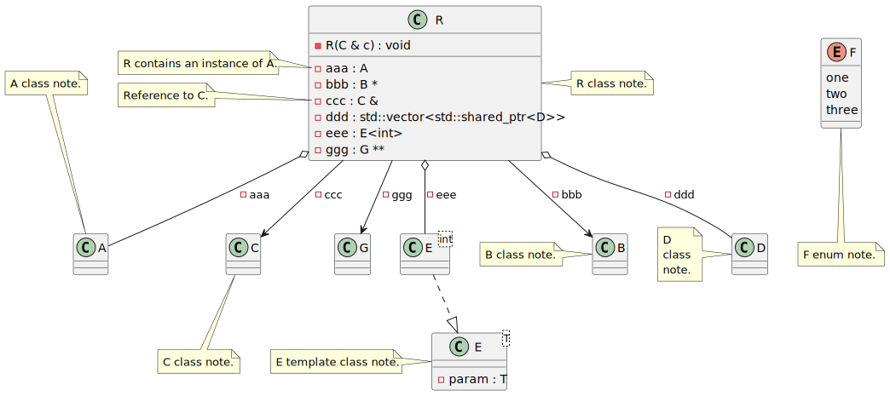
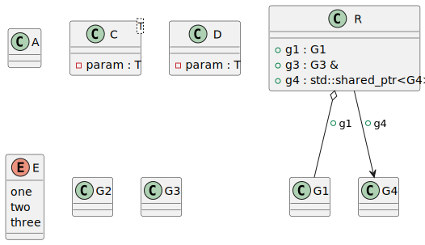

# Comment decorators

<!-- toc -->

* ['note'](#note)
* ['skip' and 'skiprelationship'](#skip-and-skiprelationship)
* ['composition', 'association' and 'aggregation'](#composition-association-and-aggregation)
* ['style'](#style)

<!-- tocstop -->

`clang-uml` provides a set of in-comment directives, called decorators, which allow custom control over
generation of UML diagrams from C++ and overriding default inference rules for relationships.

`clang-uml` decorators are specified in the following format:

```
\uml{<decorator>[:<diagram_name>][<options>] <text>}
```

or
```
@uml{<decorator>[:<diagram_name>][<options>] <text>}
```

The optional `:<diagram_name>` suffix will apply this decorator only to a specific diagram.

Currently, the following decorators are supported.

## 'note'

This decorator allows to specify directly in the code comments that should be included in the generated diagrams.

The following code:
```cpp
/// \uml{note[top] A class note.}
class A {
};

/// \uml{note[] B class note.}
class B {
};

///
/// @uml{note:t00028_class[bottom] C class note.}
/// This is class C.
class C {
};

/// \uml{note
/// D
/// class
/// note.}
class D {
};

/// \uml{note E template class note.}
template <typename T> class E {
    T param;
};

/// \uml{note:other_diagram[left] G class note.}
class G {
};

/// @uml{note[ bottom ] F enum note.}
enum class F { one, two, three };

/// \uml{note[right] R class note.}
class R {
    explicit R(C &c)
        : ccc(c)
    {
    }

    A aaa;

    B *bbb;

    C &ccc;

    std::vector<std::shared_ptr<D>> ddd;

    E<int> eee;

    G **ggg;
};
```

results in the following class diagram:



## 'skip' and 'skiprelationship'
This decorator allows to skip the specific classes or methods from the diagrams, for instance the following code:
```cpp

class A {
};

/// \uml{skip}
class B {
};

template <typename T> class C {
    T param;
};

/// @uml{skip:t00029_class}
template <typename T> class D {
    T param;
};

enum class E { one, two, three };

/// \uml{skip}
enum class F { red, green, blue };

class G1 {
};

class G2 {
};

class G3 {
};

class G4 {
};

struct R {
    G1 g1;

    /// \uml{skip}
    G2 g2;

    /// \uml{skiprelationship}
    G3 &g3;

    std::shared_ptr<G4> g4;
};
```

results in the following diagram:



## 'composition', 'association' and 'aggregation'

These decorators allow to specify explicitly the type of relationship within a class diagram that should be
generated for a given class member. For instance the following code:

```cpp

class A {
};

class B {
};

class C {
};

class D {
};

class E {
};

struct R {
    /// @uml{association[]}
    A aaa;

    /// @uml{composition[0..1:1..*]}
    std::vector<B> bbb;

    /// @uml{aggregation[0..1:1..5]}
    std::vector<C> ccc;

    /// @uml{association[:1]}
    D ddd;

    /// @uml{aggregation[:1]}
    E *eee;
};
```

results in the following diagram:


## 'style'
This decorator allows to specify in the code specific styles for diagram elements, for instance:

```cpp

/// @uml{style[#back:lightgreen|yellow;header:blue/red]}
class A {
};

/// @uml{style[#line.dotted:blue]}
enum B { one, two, three };

/// @uml{style[#pink;line:red;line.bold;text:red]}
template <typename T> class C {
    T ttt;
};

class D {
};

struct R {
    /// @uml{style[#red,dashed,thickness=2]}
    A *aaa;

    /// @uml{composition}
    /// @uml{style[#green,dashed,thickness=4]}
    std::vector<B> bbb;

    /// @uml{style[#blue,dotted,thickness=8]}
    C<int> ccc;

    /// @uml{style[#blue,plain,thickness=16]}
    D *ddd;
};
```

results in the following diagram:


