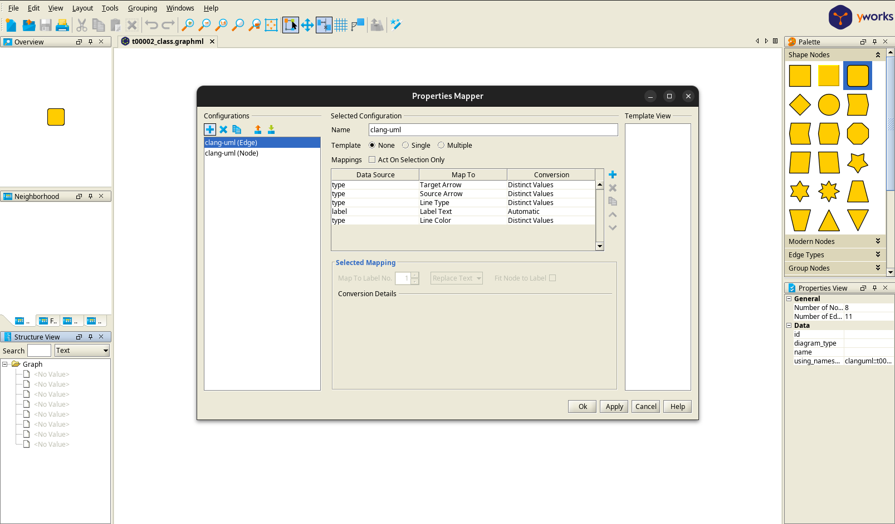
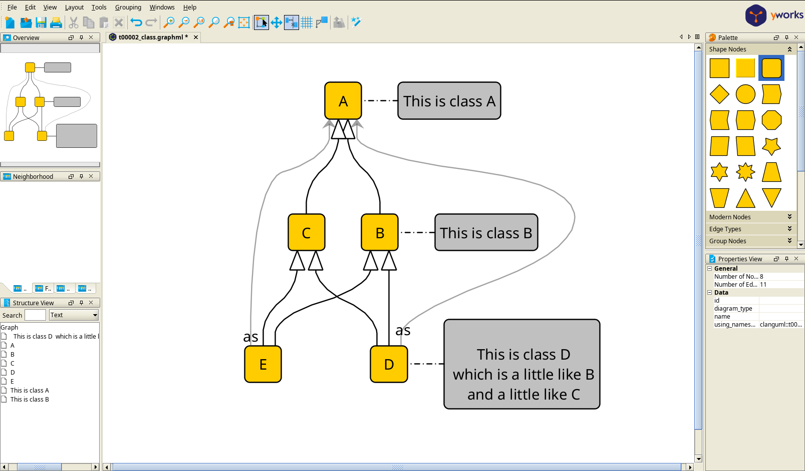

# Generator types

<!-- toc -->

* [PlantUML](#plantuml)
* [MermaidJS](#mermaidjs)
* [GraphML](#graphml)
* [JSON](#json)

<!-- tocstop -->

Currently, there are 3 types of diagram generators: `plantuml`, `mermaid`, `graphml`
and `json`.

> `graphml` generator does not support sequence diagrams

To specify, which generators should be used on the command line use option `-g`.
For instance to generate all types of diagrams run `clang-uml` as follows:

```bash
clang-uml -g plantuml -g mermaid -g json -g graphml
```

By default, only `plantuml` diagrams are generated.

## PlantUML

Generates UML diagrams in textual PlantUML format, which can then
be converted to various image formats.

In case there is a need for adding custom PlantUML directives to generated
diagrams, they can be included directly in the diagram configuration. For
example:

```yaml
  plantuml:
    before:
      - title clang-uml configuration model
      - left to right direction
    after:
      - 'note left of {{ alias("inheritable_diagram_options") }}: Options common to all diagram types.'
      - 'note right of {{ alias("config") }}: General options not used by diagrams.'
```

will add before the diagram contents (right after `@startuml`) the title and
direction hint, and after each diagram contents (right before `@enduml`)
2 notes attached to elements.

This generator also accepts a `cmd` parameter to specify a command to execute
on the generated PlantUML source file to generate actual diagram image, for
instance:
```yaml
  plantuml:
    cmd: "/usr/bin/plantuml -tsvg \"diagrams/{}.puml\""
```

Furthermore, `plantuml` generator accepts basic styling options for customizing
diagram look and layout, e.g.:
```yaml
  plantuml:
    style:
      # Apply this style to all classes in the diagram
      class: "#aliceblue;line:blue;line.dotted;text:blue"
      # Apply this style to all packages in the diagram
      package: "#back:grey"
      # Make all template instantiation relations point upwards and draw them
      # as green and dotted lines
      instantiation: "up[#green,dotted]"
```

An example PlantUML diagram is presented below:

```plantuml
@startuml
title Basic class diagram example
abstract "A" as C_0007901073918843258388
abstract C_0007901073918843258388 [[https://github.com/bkryza/clang-uml/blob/64b763d4624802c70ee9bb87af5f5444340d46ef/tests/t00002/t00002.cc#L7{This is class A}]] {
{abstract} +foo_a() = 0 : void [[[https://github.com/bkryza/clang-uml/blob/64b763d4624802c70ee9bb87af5f5444340d46ef/tests/t00002/t00002.cc#L10{foo_a}]]]
{abstract} +foo_c() = 0 : void [[[https://github.com/bkryza/clang-uml/blob/64b763d4624802c70ee9bb87af5f5444340d46ef/tests/t00002/t00002.cc#L12{foo_c}]]]
__
}
class "B" as C_0004753875669499007606
class C_0004753875669499007606 [[https://github.com/bkryza/clang-uml/blob/64b763d4624802c70ee9bb87af5f5444340d46ef/tests/t00002/t00002.cc#L16{This is class B}]] {
+foo_a() : void [[[https://github.com/bkryza/clang-uml/blob/64b763d4624802c70ee9bb87af5f5444340d46ef/tests/t00002/t00002.cc#L18{foo_a}]]]
__
}
class "C" as C_0009139995436788700062
class C_0009139995436788700062 [[https://github.com/bkryza/clang-uml/blob/64b763d4624802c70ee9bb87af5f5444340d46ef/tests/t00002/t00002.cc#L27{This is class C - class C has a long comment}]] {
+foo_c() : void [[[https://github.com/bkryza/clang-uml/blob/64b763d4624802c70ee9bb87af5f5444340d46ef/tests/t00002/t00002.cc#L30{foo_c}]]]
__
}
class "D" as C_0000487603959843317797
class C_0000487603959843317797 [[https://github.com/bkryza/clang-uml/blob/64b763d4624802c70ee9bb87af5f5444340d46ef/tests/t00002/t00002.cc#L36{D}]] {
+foo_a() : void [[[https://github.com/bkryza/clang-uml/blob/64b763d4624802c70ee9bb87af5f5444340d46ef/tests/t00002/t00002.cc#L41{foo_a}]]]
+foo_c() : void [[[https://github.com/bkryza/clang-uml/blob/64b763d4624802c70ee9bb87af5f5444340d46ef/tests/t00002/t00002.cc#L50{foo_c}]]]
__
-as : std::vector<A *> [[[https://github.com/bkryza/clang-uml/blob/64b763d4624802c70ee9bb87af5f5444340d46ef/tests/t00002/t00002.cc#L58{as}]]]
}
class "E" as C_0017903093362471729766
class C_0017903093362471729766 [[https://github.com/bkryza/clang-uml/blob/64b763d4624802c70ee9bb87af5f5444340d46ef/tests/t00002/t00002.cc#L61{E}]] {
+foo_a() : void [[[https://github.com/bkryza/clang-uml/blob/64b763d4624802c70ee9bb87af5f5444340d46ef/tests/t00002/t00002.cc#L66{foo_a}]]]
+foo_c() : void [[[https://github.com/bkryza/clang-uml/blob/64b763d4624802c70ee9bb87af5f5444340d46ef/tests/t00002/t00002.cc#L75{foo_c}]]]
__
-as : std::vector<A *> [[[https://github.com/bkryza/clang-uml/blob/64b763d4624802c70ee9bb87af5f5444340d46ef/tests/t00002/t00002.cc#L83{as}]]]
}
C_0007901073918843258388 <|-- C_0004753875669499007606

C_0007901073918843258388 <|-- C_0009139995436788700062

C_0000487603959843317797 --> C_0007901073918843258388 : -as
C_0004753875669499007606 <|-- C_0000487603959843317797

C_0009139995436788700062 <|-- C_0000487603959843317797

C_0017903093362471729766 --> C_0007901073918843258388 : -as
C_0004753875669499007606 <|-- C_0017903093362471729766

C_0009139995436788700062 <|-- C_0017903093362471729766

 note left of C_0007901073918843258388 : This is class A
 note top of C_0004753875669499007606 : This is class B
note right of C_0000487603959843317797
    
 This is class D
 which is a little like B
 and a little like C

end note

@enduml
```



The footer at the end is added by default, but can be disabled with
`--no-metadata` command line option.

## MermaidJS

This generator, creates UML diagrams in textual MermaidJS format, which can then
be used directly in some Markdown renderers (e.g. GitHub) or converted to
various image formats using [mermaid-cli](https://github.com/mermaid-js/mermaid-cli).

In case there is a need for adding custom MermaidJS directives to generated
diagrams, they can be included directly in the diagram configuration. For
example:

```yaml
  mermaid:
    before:
      - direction LR
    after:
      - 'note for {{ alias("inheritable_diagram_options") }} "Options common to all diagram types."'
      - 'note for {{ alias("config") }} "General options not used by diagrams."'
```

will add a diagram direction hint before the diagram contents (right after
diagram type, e.g. `classDiagram`), and after each diagram contents
2 notes attached to classes `inheritable_diagram_options` and `config`.

This generator also accepts a `cmd` parameter to specify a command to execute
on the generated MermaidJS source file to generate actual diagram image, for
instance:
```yaml
    mermaid:
      cmd: "mmdc -i \"diagrams/{}.mmd\" -o \"diagrams/{}_mermaid.svg\""
```

An example MermaidJS diagram is presented below:

```
---
title: Basic class diagram example
---
classDiagram
    class C_0007901073918843258388["A"]
    class C_0007901073918843258388 {
        <<abstract>>
        +foo_a() : void*
        +foo_c() : void*
    }
    click C_0007901073918843258388 href "https://github.com/bkryza/clang-uml/blob/64b763d4624802c70ee9bb87af5f5444340d46ef/tests/t00002/t00002.cc#L7" "This is class A"
    class C_0004753875669499007606["B"]
    class C_0004753875669499007606 {
        +foo_a() : void
    }
    click C_0004753875669499007606 href "https://github.com/bkryza/clang-uml/blob/64b763d4624802c70ee9bb87af5f5444340d46ef/tests/t00002/t00002.cc#L16" "This is class B"
    class C_0009139995436788700062["C"]
    class C_0009139995436788700062 {
        +foo_c() : void
    }
    click C_0009139995436788700062 href "https://github.com/bkryza/clang-uml/blob/64b763d4624802c70ee9bb87af5f5444340d46ef/tests/t00002/t00002.cc#L27" "This is class C - class C has a long comment"
    class C_0000487603959843317797["D"]
    class C_0000487603959843317797 {
        +foo_a() : void
        +foo_c() : void
        -as : std::vector&lt;A *&gt;
    }
    click C_0000487603959843317797 href "https://github.com/bkryza/clang-uml/blob/64b763d4624802c70ee9bb87af5f5444340d46ef/tests/t00002/t00002.cc#L36" "D"
    class C_0017903093362471729766["E"]
    class C_0017903093362471729766 {
        +foo_a() : void
        +foo_c() : void
        -as : std::vector&lt;A *&gt;
    }
    click C_0017903093362471729766 href "https://github.com/bkryza/clang-uml/blob/64b763d4624802c70ee9bb87af5f5444340d46ef/tests/t00002/t00002.cc#L61" "E"
    C_0007901073918843258388 <|-- C_0004753875669499007606 : 
    C_0007901073918843258388 <|-- C_0009139995436788700062 : 
    C_0000487603959843317797 --> C_0007901073918843258388 : -as
    C_0004753875669499007606 <|-- C_0000487603959843317797 : 
    C_0009139995436788700062 <|-- C_0000487603959843317797 : 
    C_0017903093362471729766 --> C_0007901073918843258388 : -as
    C_0004753875669499007606 <|-- C_0017903093362471729766 : 
    C_0009139995436788700062 <|-- C_0017903093362471729766 : 
     note for C_0007901073918843258388 "This is class A"
     note for C_0004753875669499007606 "This is class B"
    note for C_0000487603959843317797 "
 This is class D
 which is a little like B
 and a little like C
"
```

## GraphML

This generator outputs a [GraphML](http://graphml.graphdrawing.org/) graph representation of the diagram. Currently,
this generator does not include any fields or methods of classes, but only nodes
representing their names (qualified or not), templates, etc. It is also limited
to `class`, `package` and `include` diagrams only.

The config file can contain a special section in diagram config to attach
custom notes to specified nodes in the diagram, e.g.:

```yaml
    graphml:
      notes:
        'clanguml::t00002::A':
          - '{{ trim(e.comment.brief.0) }}'
        'clanguml::t00002::B':
          - '{{ trim(e.comment.brief.0) }}'
        'clanguml::t00002::D':
          - '{{ comment("D").text }}'
```

An example GraphML diagram is presented below:

```xml
<?xml version="1.0"?>
<graphml xmlns="http://graphml.graphdrawing.org/xmlns" xmlns:xsi="http://www.w3.org/2001/XMLSchema-instance" xsi:schemaLocation="http://graphml.graphdrawing.org/xmlns http://graphml.graphdrawing.org/xmlns/1.0/graphml.xsd">
 <desc><![CDATA[Basic class diagram example]]></desc>
 <key attr.name="id" attr.type="string" for="graph" id="gd0" />
 <key attr.name="diagram_type" attr.type="string" for="graph" id="gd1" />
 <key attr.name="name" attr.type="string" for="graph" id="gd2" />
 <key attr.name="using_namespace" attr.type="string" for="graph" id="gd3" />
 <key attr.name="id" attr.type="string" for="node" id="nd0" />
 <key attr.name="type" attr.type="string" for="node" id="nd1" />
 <key attr.name="name" attr.type="string" for="node" id="nd2" />
 <key attr.name="stereotype" attr.type="string" for="node" id="nd3" />
 <key attr.name="url" attr.type="string" for="node" id="nd4" />
 <key attr.name="tooltip" attr.type="string" for="node" id="nd5" />
 <key attr.name="is_template" attr.type="boolean" for="node" id="nd6" />
 <key attr.name="type" attr.type="string" for="edge" id="ed0" />
 <key attr.name="access" attr.type="string" for="edge" id="ed1" />
 <key attr.name="label" attr.type="string" for="edge" id="ed2" />
 <key attr.name="url" attr.type="string" for="edge" id="ed3" />
 <graph id="g0" edgedefault="directed" parse.nodeids="canonical" parse.edgeids="canonical" parse.order="nodesfirst">
  <data key="gd3">clanguml::t00002</data>
  <node id="n0">
   <data key="nd1">class</data>
   <data key="nd2"><![CDATA[A]]></data>
   <data key="nd3">abstract</data>
   <data key="nd6">false</data>
   <data key="nd4">https://github.com/bkryza/clang-uml/blob/f78dc1a0826578be2504188c7efe7d7b3878da63/tests/t00002/t00002.cc#L7</data>
   <data key="nd5">This is class A</data>
  </node>
  <node id="n1">
   <data key="nd1">class</data>
   <data key="nd2"><![CDATA[B]]></data>
   <data key="nd6">false</data>
   <data key="nd4">https://github.com/bkryza/clang-uml/blob/f78dc1a0826578be2504188c7efe7d7b3878da63/tests/t00002/t00002.cc#L16</data>
   <data key="nd5">This is class B</data>
  </node>
  <node id="n2">
   <data key="nd1">class</data>
   <data key="nd2"><![CDATA[C]]></data>
   <data key="nd6">false</data>
   <data key="nd4">https://github.com/bkryza/clang-uml/blob/f78dc1a0826578be2504188c7efe7d7b3878da63/tests/t00002/t00002.cc#L27</data>
   <data key="nd5">This is class C - class C has a long comment</data>
  </node>
  <node id="n3">
   <data key="nd1">class</data>
   <data key="nd2"><![CDATA[D]]></data>
   <data key="nd6">false</data>
   <data key="nd4">https://github.com/bkryza/clang-uml/blob/f78dc1a0826578be2504188c7efe7d7b3878da63/tests/t00002/t00002.cc#L36</data>
   <data key="nd5">D</data>
  </node>
  <node id="n4">
   <data key="nd1">class</data>
   <data key="nd2"><![CDATA[E]]></data>
   <data key="nd6">false</data>
   <data key="nd4">https://github.com/bkryza/clang-uml/blob/f78dc1a0826578be2504188c7efe7d7b3878da63/tests/t00002/t00002.cc#L61</data>
   <data key="nd5">E</data>
  </node>
  <node id="n5">
   <data key="nd1">note</data>
   <data key="nd2"><![CDATA[This is class A]]></data>
  </node>
  <node id="n6">
   <data key="nd1">note</data>
   <data key="nd2"><![CDATA[This is class B]]></data>
  </node>
  <node id="n7">
   <data key="nd1">note</data>
   <data key="nd2"><![CDATA[
 This is class D
 which is a little like B
 and a little like C
]]></data>
  </node>
  <edge id="e0" source="n5" target="n0">
   <data key="ed0">none</data>
  </edge>
  <edge id="e1" source="n6" target="n1">
   <data key="ed0">none</data>
  </edge>
  <edge id="e2" source="n7" target="n3">
   <data key="ed0">none</data>
  </edge>
  <edge id="e3" source="n1" target="n0">
   <data key="ed0">extension</data>
   <data key="ed1">public</data>
  </edge>
  <edge id="e4" source="n2" target="n0">
   <data key="ed0">extension</data>
   <data key="ed1">public</data>
  </edge>
  <edge id="e5" source="n3" target="n0">
   <data key="ed3">https://github.com/bkryza/clang-uml/blob/f78dc1a0826578be2504188c7efe7d7b3878da63/tests/t00002/t00002.cc#L58</data>
   <data key="ed0">association</data>
   <data key="ed2">as</data>
   <data key="ed1">private</data>
  </edge>
  <edge id="e6" source="n3" target="n1">
   <data key="ed0">extension</data>
   <data key="ed1">public</data>
  </edge>
  <edge id="e7" source="n3" target="n2">
   <data key="ed0">extension</data>
   <data key="ed1">public</data>
  </edge>
  <edge id="e8" source="n4" target="n0">
   <data key="ed3">https://github.com/bkryza/clang-uml/blob/f78dc1a0826578be2504188c7efe7d7b3878da63/tests/t00002/t00002.cc#L83</data>
   <data key="ed0">association</data>
   <data key="ed2">as</data>
   <data key="ed1">private</data>
  </edge>
  <edge id="e9" source="n4" target="n1">
   <data key="ed0">extension</data>
   <data key="ed1">public</data>
  </edge>
  <edge id="e10" source="n4" target="n2">
   <data key="ed0">extension</data>
   <data key="ed1">public</data>
  </edge>
 </graph>
</graphml>
```

To visualize GraphML, we can use of existing graph tools for instance:
* [yED](https://www.yworks.com/products/yed) - not open-source but free,
  supports subgraphs (i.e. packages) and various styles for nodes
* [Gephi](https://gephi.org/) - free and open source, however does not support
  subgraphs, only `clang-uml` graphs without packages can be visualized

For example, to visualize the above graph in `yED` we need to simply open it and
tell `yED` how to map `clang-uml`'s property names (e.g. `"url"`) to it's
internal properties. We can do this using Properties Mapper dialog accessible
through `Edit->Properties Mapper...`. The easiest way is to use this property
mapping file: [clang-uml.cnfx](https://raw.githubusercontent.com/bkryza/clang-uml/refs/heads/master/docs/assets/clang-uml.cnfx)
as a starting point, it can be loaded using the following icon:



For each mapping type (i.e. `clang-uml (Edge)` and `clang-uml (Node)` we
have to separately click `Apply` button. Finally, we can click on layout button
and the diagram is visualized in the `yED` like this:



## JSON

Generates a JSON representation of the intermediate `clang-uml` model, which
can be used for scripting, integrations as well as analysing the code base
or even generating diagrams in other formats.

An equivalent of the above PlantUML diagram in JSON is presented below:

```json
{
  "diagram_type": "class",
  "elements": [
    {
      "bases": [],
      "comment": {
        "brief": [
          " This is class A\n"
        ],
        "formatted": "\\brief This is class A",
        "paragraph": [
          " \n"
        ],
        "raw": "/// \\brief This is class A",
        "text": "\n \n"
      },
      "display_name": "A",
      "id": "7901073918843258388",
      "is_abstract": true,
      "is_nested": false,
      "is_struct": false,
      "is_template": false,
      "is_union": false,
      "members": [],
      "methods": [
        {
          "access": "public",
          "comment": {
            "formatted": "Abstract foo_a",
            "paragraph": [
              " Abstract foo_a\n"
            ],
            "raw": "/// Abstract foo_a",
            "text": "\n Abstract foo_a\n"
          },
          "display_name": "foo_a",
          "is_const": false,
          "is_consteval": false,
          "is_constexpr": false,
          "is_constructor": false,
          "is_copy_assignment": false,
          "is_coroutine": false,
          "is_defaulted": false,
          "is_deleted": false,
          "is_move_assignment": false,
          "is_noexcept": false,
          "is_operator": false,
          "is_pure_virtual": true,
          "is_static": false,
          "is_virtual": true,
          "name": "foo_a",
          "parameters": [],
          "source_location": {
            "column": 18,
            "file": "t00002.cc",
            "line": 10,
            "translation_unit": "t00002.cc"
          },
          "template_parameters": [],
          "type": "void"
        },
        {
          "access": "public",
          "comment": {
            "formatted": "Abstract foo_c",
            "paragraph": [
              " Abstract foo_c\n"
            ],
            "raw": "/// Abstract foo_c",
            "text": "\n Abstract foo_c\n"
          },
          "display_name": "foo_c",
          "is_const": false,
          "is_consteval": false,
          "is_constexpr": false,
          "is_constructor": false,
          "is_copy_assignment": false,
          "is_coroutine": false,
          "is_defaulted": false,
          "is_deleted": false,
          "is_move_assignment": false,
          "is_noexcept": false,
          "is_operator": false,
          "is_pure_virtual": true,
          "is_static": false,
          "is_virtual": true,
          "name": "foo_c",
          "parameters": [],
          "source_location": {
            "column": 18,
            "file": "t00002.cc",
            "line": 12,
            "translation_unit": "t00002.cc"
          },
          "template_parameters": [],
          "type": "void"
        }
      ],
      "name": "A",
      "namespace": "clanguml::t00002",
      "source_location": {
        "column": 7,
        "file": "t00002.cc",
        "line": 7,
        "translation_unit": "t00002.cc"
      },
      "template_parameters": [],
      "type": "class"
    },
    {
      "bases": [
        {
          "access": "public",
          "id": "7901073918843258388",
          "is_virtual": false
        }
      ],
      "comment": {
        "brief": [
          " This is class B\n"
        ],
        "formatted": "\\brief This is class B",
        "paragraph": [
          " \n"
        ],
        "raw": "/// \\brief This is class B",
        "text": "\n \n"
      },
      "display_name": "B",
      "id": "4753875669499007606",
      "is_abstract": false,
      "is_nested": false,
      "is_struct": false,
      "is_template": false,
      "is_union": false,
      "members": [],
      "methods": [
        {
          "access": "public",
          "display_name": "foo_a",
          "is_const": false,
          "is_consteval": false,
          "is_constexpr": false,
          "is_constructor": false,
          "is_copy_assignment": false,
          "is_coroutine": false,
          "is_defaulted": false,
          "is_deleted": false,
          "is_move_assignment": false,
          "is_noexcept": false,
          "is_operator": false,
          "is_pure_virtual": false,
          "is_static": false,
          "is_virtual": true,
          "name": "foo_a",
          "parameters": [],
          "source_location": {
            "column": 18,
            "file": "t00002.cc",
            "line": 18,
            "translation_unit": "t00002.cc"
          },
          "template_parameters": [],
          "type": "void"
        }
      ],
      "name": "B",
      "namespace": "clanguml::t00002",
      "source_location": {
        "column": 7,
        "file": "t00002.cc",
        "line": 16,
        "translation_unit": "t00002.cc"
      },
      "template_parameters": [],
      "type": "class"
    },
    {
      "bases": [
        {
          "access": "public",
          "id": "7901073918843258388",
          "is_virtual": false
        }
      ],
      "comment": {
        "brief": [
          " This is class C - class C has a long comment\n"
        ],
        "formatted": "@brief This is class C - class C has a long comment\n\nVivamus integer non suscipit taciti mus etiam at primis tempor sagittis sit,\neuismod libero facilisi aptent elementum felis blandit cursus gravida sociis\nerat ante, eleifend lectus nullam dapibus netus feugiat curae curabitur est\nad.",
        "paragraph": [
          " \n",
          " Vivamus integer non suscipit taciti mus etiam at primis tempor sagittis sit,\n euismod libero facilisi aptent elementum felis blandit cursus gravida sociis\n erat ante, eleifend lectus nullam dapibus netus feugiat curae curabitur est\n ad.\n"
        ],
        "raw": "/// @brief This is class C - class C has a long comment\n///\n/// Vivamus integer non suscipit taciti mus etiam at primis tempor sagittis sit,\n/// euismod libero facilisi aptent elementum felis blandit cursus gravida sociis\n/// erat ante, eleifend lectus nullam dapibus netus feugiat curae curabitur est\n/// ad.",
        "text": "\n \n\n Vivamus integer non suscipit taciti mus etiam at primis tempor sagittis sit,\n euismod libero facilisi aptent elementum felis blandit cursus gravida sociis\n erat ante, eleifend lectus nullam dapibus netus feugiat curae curabitur est\n ad.\n"
      },
      "display_name": "C",
      "id": "9139995436788700062",
      "is_abstract": false,
      "is_nested": false,
      "is_struct": false,
      "is_template": false,
      "is_union": false,
      "members": [],
      "methods": [
        {
          "access": "public",
          "comment": {
            "formatted": "Do nothing unless override is provided",
            "paragraph": [
              " Do nothing unless override is provided\n"
            ],
            "raw": "/// Do nothing unless override is provided",
            "text": "\n Do nothing unless override is provided\n"
          },
          "display_name": "foo_c",
          "is_const": false,
          "is_consteval": false,
          "is_constexpr": false,
          "is_constructor": false,
          "is_copy_assignment": false,
          "is_coroutine": false,
          "is_defaulted": false,
          "is_deleted": false,
          "is_move_assignment": false,
          "is_noexcept": false,
          "is_operator": false,
          "is_pure_virtual": false,
          "is_static": false,
          "is_virtual": true,
          "name": "foo_c",
          "parameters": [],
          "source_location": {
            "column": 18,
            "file": "t00002.cc",
            "line": 30,
            "translation_unit": "t00002.cc"
          },
          "template_parameters": [],
          "type": "void"
        }
      ],
      "name": "C",
      "namespace": "clanguml::t00002",
      "source_location": {
        "column": 7,
        "file": "t00002.cc",
        "line": 27,
        "translation_unit": "t00002.cc"
      },
      "template_parameters": [],
      "type": "class"
    },
    {
      "bases": [
        {
          "access": "public",
          "id": "4753875669499007606",
          "is_virtual": false
        },
        {
          "access": "public",
          "id": "9139995436788700062",
          "is_virtual": false
        }
      ],
      "comment": {
        "formatted": "This is class D\nwhich is a little like B\nand a little like C",
        "paragraph": [
          " This is class D\n which is a little like B\n and a little like C\n"
        ],
        "raw": "/// This is class D\n/// which is a little like B\n/// and a little like C",
        "text": "\n This is class D\n which is a little like B\n and a little like C\n"
      },
      "display_name": "D",
      "id": "487603959843317797",
      "is_abstract": false,
      "is_nested": false,
      "is_struct": false,
      "is_template": false,
      "is_union": false,
      "members": [
        {
          "access": "private",
          "comment": {
            "formatted": "All the A pointers",
            "paragraph": [
              " All the A pointers\n"
            ],
            "raw": "/// All the A pointers",
            "text": "\n All the A pointers\n"
          },
          "is_static": false,
          "name": "as",
          "source_location": {
            "column": 22,
            "file": "t00002.cc",
            "line": 58,
            "translation_unit": "t00002.cc"
          },
          "type": "std::vector<A *>"
        }
      ],
      "methods": [
        {
          "access": "public",
          "comment": {
            "formatted": "\n Forward foo_a\n     ",
            "paragraph": [
              " Forward foo_a\n"
            ],
            "raw": "/**\n     * Forward foo_a\n     */",
            "text": "\n Forward foo_a\n"
          },
          "display_name": "foo_a",
          "is_const": false,
          "is_consteval": false,
          "is_constexpr": false,
          "is_constructor": false,
          "is_copy_assignment": false,
          "is_coroutine": false,
          "is_defaulted": false,
          "is_deleted": false,
          "is_move_assignment": false,
          "is_noexcept": false,
          "is_operator": false,
          "is_pure_virtual": false,
          "is_static": false,
          "is_virtual": true,
          "name": "foo_a",
          "parameters": [],
          "source_location": {
            "column": 10,
            "file": "t00002.cc",
            "line": 41,
            "translation_unit": "t00002.cc"
          },
          "template_parameters": [],
          "type": "void"
        },
        {
          "access": "public",
          "comment": {
            "formatted": "\n Forward foo_c\n     ",
            "paragraph": [
              " Forward foo_c\n"
            ],
            "raw": "/**\n     * Forward foo_c\n     */",
            "text": "\n Forward foo_c\n"
          },
          "display_name": "foo_c",
          "is_const": false,
          "is_consteval": false,
          "is_constexpr": false,
          "is_constructor": false,
          "is_copy_assignment": false,
          "is_coroutine": false,
          "is_defaulted": false,
          "is_deleted": false,
          "is_move_assignment": false,
          "is_noexcept": false,
          "is_operator": false,
          "is_pure_virtual": false,
          "is_static": false,
          "is_virtual": true,
          "name": "foo_c",
          "parameters": [],
          "source_location": {
            "column": 10,
            "file": "t00002.cc",
            "line": 50,
            "translation_unit": "t00002.cc"
          },
          "template_parameters": [],
          "type": "void"
        }
      ],
      "name": "D",
      "namespace": "clanguml::t00002",
      "source_location": {
        "column": 7,
        "file": "t00002.cc",
        "line": 36,
        "translation_unit": "t00002.cc"
      },
      "template_parameters": [],
      "type": "class"
    },
    {
      "bases": [
        {
          "access": "public",
          "id": "4753875669499007606",
          "is_virtual": true
        },
        {
          "access": "public",
          "id": "9139995436788700062",
          "is_virtual": true
        }
      ],
      "display_name": "E",
      "id": "17903093362471729766",
      "is_abstract": false,
      "is_nested": false,
      "is_struct": false,
      "is_template": false,
      "is_union": false,
      "members": [
        {
          "access": "private",
          "comment": {
            "formatted": "All the A pointers",
            "paragraph": [
              " All the A pointers\n"
            ],
            "raw": "/// All the A pointers",
            "text": "\n All the A pointers\n"
          },
          "is_static": false,
          "name": "as",
          "source_location": {
            "column": 22,
            "file": "t00002.cc",
            "line": 83,
            "translation_unit": "t00002.cc"
          },
          "type": "std::vector<A *>"
        }
      ],
      "methods": [
        {
          "access": "public",
          "comment": {
            "formatted": "\n Forward foo_a",
            "paragraph": [
              " Forward foo_a\n"
            ],
            "raw": "///\n    /// Forward foo_a\n    ///",
            "text": "\n Forward foo_a\n"
          },
          "display_name": "foo_a",
          "is_const": false,
          "is_consteval": false,
          "is_constexpr": false,
          "is_constructor": false,
          "is_copy_assignment": false,
          "is_coroutine": false,
          "is_defaulted": false,
          "is_deleted": false,
          "is_move_assignment": false,
          "is_noexcept": false,
          "is_operator": false,
          "is_pure_virtual": false,
          "is_static": false,
          "is_virtual": true,
          "name": "foo_a",
          "parameters": [],
          "source_location": {
            "column": 10,
            "file": "t00002.cc",
            "line": 66,
            "translation_unit": "t00002.cc"
          },
          "template_parameters": [],
          "type": "void"
        },
        {
          "access": "public",
          "comment": {
            "formatted": "\n Forward foo_c",
            "paragraph": [
              " Forward foo_c\n"
            ],
            "raw": "///\n    /// Forward foo_c\n    ///",
            "text": "\n Forward foo_c\n"
          },
          "display_name": "foo_c",
          "is_const": false,
          "is_consteval": false,
          "is_constexpr": false,
          "is_constructor": false,
          "is_copy_assignment": false,
          "is_coroutine": false,
          "is_defaulted": false,
          "is_deleted": false,
          "is_move_assignment": false,
          "is_noexcept": false,
          "is_operator": false,
          "is_pure_virtual": false,
          "is_static": false,
          "is_virtual": true,
          "name": "foo_c",
          "parameters": [],
          "source_location": {
            "column": 10,
            "file": "t00002.cc",
            "line": 75,
            "translation_unit": "t00002.cc"
          },
          "template_parameters": [],
          "type": "void"
        }
      ],
      "name": "E",
      "namespace": "clanguml::t00002",
      "source_location": {
        "column": 7,
        "file": "t00002.cc",
        "line": 61,
        "translation_unit": "t00002.cc"
      },
      "template_parameters": [],
      "type": "class"
    }
  ],
  "name": "t00002_class",
  "package_type": "namespace",
  "relationships": [
    {
      "access": "public",
      "destination": "7901073918843258388",
      "source": "4753875669499007606",
      "type": "extension"
    },
    {
      "access": "public",
      "destination": "7901073918843258388",
      "source": "9139995436788700062",
      "type": "extension"
    },
    {
      "access": "private",
      "destination": "7901073918843258388",
      "label": "as",
      "source": "487603959843317797",
      "type": "association"
    },
    {
      "access": "public",
      "destination": "4753875669499007606",
      "source": "487603959843317797",
      "type": "extension"
    },
    {
      "access": "public",
      "destination": "9139995436788700062",
      "source": "487603959843317797",
      "type": "extension"
    },
    {
      "access": "private",
      "destination": "7901073918843258388",
      "label": "as",
      "source": "17903093362471729766",
      "type": "association"
    },
    {
      "access": "public",
      "destination": "4753875669499007606",
      "source": "17903093362471729766",
      "type": "extension"
    },
    {
      "access": "public",
      "destination": "9139995436788700062",
      "source": "17903093362471729766",
      "type": "extension"
    }
  ],
  "title": "Basic class diagram example",
  "using_namespace": "clanguml::t00002"
}
```

