# Generator types

<!-- toc -->

* [PlantUML](#plantuml)
* [MermaidJS](#mermaidjs)
* [JSON](#json)

<!-- tocstop -->

Currently, there are 3 types of diagram generators: `plantuml`, `mermaid`
and `json`.

To specify, which generators should be used on the command line use option `-g`.
For instance to generate all types of diagrams run `clang-uml` as follows:

```bash
clang-uml -g plantuml -g mermaid -g json
```

By default, only `plantuml` diagrams are generated.

## PlantUML

Generates UML diagrams in textual PlantUML format, which can then
be converted to various image formats.

In case there is a need for adding custom PlantUML directives to generated
diagrams, they can be included directly in the diagram configuration. For
example:

```yaml
  plantuml:
    before:
      - title clang-uml configuration model
      - left to right direction
    after:
      - 'note left of {{ alias("inheritable_diagram_options") }}: Options common to all diagram types.'
      - 'note right of {{ alias("config") }}: General options not used by diagrams.'
```

will add before the diagram contents (right after `@startuml`) the title and
direction hint, and after each diagram contents (right before `@enduml`)
2 notes attached to elements.

This generator also accepts a `cmd` parameter to specify a command to execute
on the generated PlantUML source file to generate actual diagram image, for
instance:
```yaml
  plantuml:
    cmd: "/usr/bin/plantuml -tsvg \"diagrams/{}.puml\""
```

Furthermore, `plantuml` generator accepts basic styling options for customizing
diagram look and layout, e.g.:
```yaml
  plantuml:
    style:
      # Apply this style to all classes in the diagram
      class: "#aliceblue;line:blue;line.dotted;text:blue"
      # Apply this style to all packages in the diagram
      package: "#back:grey"
      # Make all template instantiation relations point upwards and draw them
      # as green and dotted lines
      instantiation: "up[#green,dotted]"
```

An example PlantUML diagram is presented below:

```plantuml
@startuml
class "A" as C_0001371951663534295727
class C_0001371951663534295727 [[https://github.com/bkryza/clang-uml/blob/59d6fd5c7f14e028d1817274d80da29c338c2b53/tests/t00003/t00003.cc#L7{A}]] {
+A() = default : void [[[https://github.com/bkryza/clang-uml/blob/59d6fd5c7f14e028d1817274d80da29c338c2b53/tests/t00003/t00003.cc#L9{A}]]]
+A(int i) : void [[[https://github.com/bkryza/clang-uml/blob/59d6fd5c7f14e028d1817274d80da29c338c2b53/tests/t00003/t00003.cc#L10{A}]]]
+A(A &&) = default : void [[[https://github.com/bkryza/clang-uml/blob/59d6fd5c7f14e028d1817274d80da29c338c2b53/tests/t00003/t00003.cc#L21{A}]]]
+A(const A &) = deleted : void [[[https://github.com/bkryza/clang-uml/blob/59d6fd5c7f14e028d1817274d80da29c338c2b53/tests/t00003/t00003.cc#L22{A}]]]
+A<T>(T t) : void
+~A() = default : void [[[https://github.com/bkryza/clang-uml/blob/59d6fd5c7f14e028d1817274d80da29c338c2b53/tests/t00003/t00003.cc#L23{~A}]]]
..
+operator=(A && other) noexcept : A & [[[https://github.com/bkryza/clang-uml/blob/59d6fd5c7f14e028d1817274d80da29c338c2b53/tests/t00003/t00003.cc#L36{operator=}]]]
+operator=(A & other) noexcept : A & [[[https://github.com/bkryza/clang-uml/blob/59d6fd5c7f14e028d1817274d80da29c338c2b53/tests/t00003/t00003.cc#L37{operator=}]]]
..
+operator++() : A & [[[https://github.com/bkryza/clang-uml/blob/59d6fd5c7f14e028d1817274d80da29c338c2b53/tests/t00003/t00003.cc#L30{operator++}]]]
..
+auto_method() : int [[[https://github.com/bkryza/clang-uml/blob/59d6fd5c7f14e028d1817274d80da29c338c2b53/tests/t00003/t00003.cc#L28{auto_method}]]]
+basic_method() : void [[[https://github.com/bkryza/clang-uml/blob/59d6fd5c7f14e028d1817274d80da29c338c2b53/tests/t00003/t00003.cc#L25{basic_method}]]]
+const_method() const : void [[[https://github.com/bkryza/clang-uml/blob/59d6fd5c7f14e028d1817274d80da29c338c2b53/tests/t00003/t00003.cc#L27{const_method}]]]
{static} +create_from_int(int i) : A [[[https://github.com/bkryza/clang-uml/blob/59d6fd5c7f14e028d1817274d80da29c338c2b53/tests/t00003/t00003.cc#L50{create_from_int}]]]
+default_int(int i = 12) : int [[[https://github.com/bkryza/clang-uml/blob/59d6fd5c7f14e028d1817274d80da29c338c2b53/tests/t00003/t00003.cc#L44{default_int}]]]
+default_string(int i, std::string s = "abc") : std::string [[[https://github.com/bkryza/clang-uml/blob/59d6fd5c7f14e028d1817274d80da29c338c2b53/tests/t00003/t00003.cc#L45{default_string}]]]
+double_int(const int i) : int [[[https://github.com/bkryza/clang-uml/blob/59d6fd5c7f14e028d1817274d80da29c338c2b53/tests/t00003/t00003.cc#L41{double_int}]]]
-private_method() : void [[[https://github.com/bkryza/clang-uml/blob/59d6fd5c7f14e028d1817274d80da29c338c2b53/tests/t00003/t00003.cc#L67{private_method}]]]
#protected_method() : void [[[https://github.com/bkryza/clang-uml/blob/59d6fd5c7f14e028d1817274d80da29c338c2b53/tests/t00003/t00003.cc#L58{protected_method}]]]
+size() constexpr const : std::size_t [[[https://github.com/bkryza/clang-uml/blob/59d6fd5c7f14e028d1817274d80da29c338c2b53/tests/t00003/t00003.cc#L39{size}]]]
{static} +static_method() : int [[[https://github.com/bkryza/clang-uml/blob/59d6fd5c7f14e028d1817274d80da29c338c2b53/tests/t00003/t00003.cc#L26{static_method}]]]
+sum(const double a, const double b) : int [[[https://github.com/bkryza/clang-uml/blob/59d6fd5c7f14e028d1817274d80da29c338c2b53/tests/t00003/t00003.cc#L42{sum}]]]
__
-a_ : int [[[https://github.com/bkryza/clang-uml/blob/59d6fd5c7f14e028d1817274d80da29c338c2b53/tests/t00003/t00003.cc#L70{a_}]]]
{static} +auto_member : const unsigned long [[[https://github.com/bkryza/clang-uml/blob/59d6fd5c7f14e028d1817274d80da29c338c2b53/tests/t00003/t00003.cc#L55{auto_member}]]]
-b_ : int [[[https://github.com/bkryza/clang-uml/blob/59d6fd5c7f14e028d1817274d80da29c338c2b53/tests/t00003/t00003.cc#L70{b_}]]]
-c_ : int [[[https://github.com/bkryza/clang-uml/blob/59d6fd5c7f14e028d1817274d80da29c338c2b53/tests/t00003/t00003.cc#L70{c_}]]]
#compare : std::function<bool (const int)> [[[https://github.com/bkryza/clang-uml/blob/59d6fd5c7f14e028d1817274d80da29c338c2b53/tests/t00003/t00003.cc#L62{compare}]]]
-private_member : int [[[https://github.com/bkryza/clang-uml/blob/59d6fd5c7f14e028d1817274d80da29c338c2b53/tests/t00003/t00003.cc#L69{private_member}]]]
#protected_member : int [[[https://github.com/bkryza/clang-uml/blob/59d6fd5c7f14e028d1817274d80da29c338c2b53/tests/t00003/t00003.cc#L60{protected_member}]]]
+public_member : int [[[https://github.com/bkryza/clang-uml/blob/59d6fd5c7f14e028d1817274d80da29c338c2b53/tests/t00003/t00003.cc#L52{public_member}]]]
{static} +static_const_int : const int [[[https://github.com/bkryza/clang-uml/blob/59d6fd5c7f14e028d1817274d80da29c338c2b53/tests/t00003/t00003.cc#L54{static_const_int}]]]
{static} +static_int : int [[[https://github.com/bkryza/clang-uml/blob/59d6fd5c7f14e028d1817274d80da29c338c2b53/tests/t00003/t00003.cc#L53{static_int}]]]
}

'Generated with clang-uml, version 0.3.8
'LLVM version Ubuntu clang version 15.0.6
@enduml
```



The footer at the end is added by default, but can be disabled with
`--no-metadata` command line option.

## MermaidJS

This generator, creates UML diagrams in textual MermaidJS format, which can then
be used directly in some Markdown renderers (e.g. GitHub) or converted to
various image formats using [mermaid-cli](https://github.com/mermaid-js/mermaid-cli).

In case there is a need for adding custom MermaidJS directives to generated
diagrams, they can be included directly in the diagram configuration. For
example:

```yaml
  mermaid:
    before:
      - direction LR
    after:
      - 'note for {{ alias("inheritable_diagram_options") }} "Options common to all diagram types."'
      - 'note for {{ alias("config") }} "General options not used by diagrams."'
```

will add a diagram direction hint before the diagram contents (right after
diagram type, e.g. `classDiagram`), and after each diagram contents
2 notes attached to classes `inheritable_diagram_options` and `config`.

This generator also accepts a `cmd` parameter to specify a command to execute
on the generated MermaidJS source file to generate actual diagram image, for
instance:
```yaml
    mermaid:
      cmd: "mmdc -i \"diagrams/{}.mmd\" -o \"diagrams/{}_mermaid.svg\""
```

An example MermaidJS diagram is presented below:

```
classDiagram
    class C_0001371951663534295727["A"]
    class C_0001371951663534295727 {
        +A() : [default] void
        +A(int i) : void
        +A(A &&) : [default] void
        +A(const A &) : void
        +A<T>(T t) : void
        +~A() : [default] void
        +operator=(A && other) : A &
        +operator=(A & other) : A &
        +operator++() : A &
        +auto_method() : int
        +basic_method() : void
        +const_method() : [const] void
        +create_from_int(int i) : A$
        +default_int(int i = 12) : int
        +default_string(int i, std::string s = "abc") : std::string
        +double_int(const int i) : int
        -private_method() : void
        #protected_method() : void
        +size() : [const,constexpr] std::size_t
        +static_method() : int$
        +sum(const double a, const double b) : int
        -a_ : int
        +auto_member : const unsigned long
        -b_ : int
        -c_ : int
        #compare : std::function&lt;bool &lpar;const int&rpar;&gt;
        -private_member : int
        #protected_member : int
        +public_member : int
        +static_const_int : const int
        +static_int : int
    }
    click C_0001371951663534295727 href "https://github.com/bkryza/clang-uml/blob/70e70888231938ba5310a8e0e28b9351beba21ef/tests/t00003/t00003.cc#L7" "A"
```

## JSON

Generates a JSON representation of the intermediate `clang-uml` model, which
can be used for scripting, integrations as well as analysing the code base
or even generating diagrams in other formats.

An equivalent of the above PlantUML diagram in JSON is presented below:

```json
{
  "diagram_type": "class",
  "elements": [
    {
      "bases": [],
      "display_name": "clanguml::t00003::A",
      "id": "1371951663534295727",
      "is_abstract": false,
      "is_nested": false,
      "is_struct": false,
      "is_template": false,
      "is_union": false,
      "members": [
        {
          "access": "public",
          "is_static": false,
          "name": "public_member",
          "source_location": {
            "column": 9,
            "file": "../../tests/t00003/t00003.cc",
            "line": 52,
            "translation_unit": "../../tests/t00003/t00003.cc"
          },
          "type": "int"
        },
        {
          "access": "protected",
          "is_static": false,
          "name": "protected_member",
          "source_location": {
            "column": 9,
            "file": "../../tests/t00003/t00003.cc",
            "line": 60,
            "translation_unit": "../../tests/t00003/t00003.cc"
          },
          "type": "int"
        },
        {
          "access": "protected",
          "is_static": false,
          "name": "compare",
          "source_location": {
            "column": 36,
            "file": "../../tests/t00003/t00003.cc",
            "line": 62,
            "translation_unit": "../../tests/t00003/t00003.cc"
          },
          "type": "std::function<bool (const int)>"
        },
        {
          "access": "private",
          "is_static": false,
          "name": "private_member",
          "source_location": {
            "column": 9,
            "file": "../../tests/t00003/t00003.cc",
            "line": 69,
            "translation_unit": "../../tests/t00003/t00003.cc"
          },
          "type": "int"
        },
        {
          "access": "private",
          "is_static": false,
          "name": "a_",
          "source_location": {
            "column": 9,
            "file": "../../tests/t00003/t00003.cc",
            "line": 70,
            "translation_unit": "../../tests/t00003/t00003.cc"
          },
          "type": "int"
        },
        {
          "access": "private",
          "is_static": false,
          "name": "b_",
          "source_location": {
            "column": 13,
            "file": "../../tests/t00003/t00003.cc",
            "line": 70,
            "translation_unit": "../../tests/t00003/t00003.cc"
          },
          "type": "int"
        },
        {
          "access": "private",
          "is_static": false,
          "name": "c_",
          "source_location": {
            "column": 17,
            "file": "../../tests/t00003/t00003.cc",
            "line": 70,
            "translation_unit": "../../tests/t00003/t00003.cc"
          },
          "type": "int"
        },
        {
          "access": "public",
          "is_static": true,
          "name": "static_int",
          "source_location": {
            "column": 16,
            "file": "../../tests/t00003/t00003.cc",
            "line": 53,
            "translation_unit": "../../tests/t00003/t00003.cc"
          },
          "type": "int"
        },
        {
          "access": "public",
          "is_static": true,
          "name": "static_const_int",
          "source_location": {
            "column": 22,
            "file": "../../tests/t00003/t00003.cc",
            "line": 54,
            "translation_unit": "../../tests/t00003/t00003.cc"
          },
          "type": "const int"
        },
        {
          "access": "public",
          "is_static": true,
          "name": "auto_member",
          "source_location": {
            "column": 23,
            "file": "../../tests/t00003/t00003.cc",
            "line": 55,
            "translation_unit": "../../tests/t00003/t00003.cc"
          },
          "type": "const unsigned long"
        }
      ],
      "methods": [
        {
          "access": "public",
          "is_const": false,
          "is_consteval": false,
          "is_constexpr": false,
          "is_constructor": true,
          "is_copy_assignment": false,
          "is_defaulted": true,
          "is_deleted": false,
          "is_move_assignment": false,
          "is_noexcept": false,
          "is_operator": false,
          "is_pure_virtual": false,
          "is_static": false,
          "is_virtual": false,
          "name": "A",
          "parameters": [],
          "source_location": {
            "column": 5,
            "file": "../../tests/t00003/t00003.cc",
            "line": 9,
            "translation_unit": "../../tests/t00003/t00003.cc"
          },
          "type": "void"
        },
        {
          "access": "public",
          "is_const": false,
          "is_consteval": false,
          "is_constexpr": false,
          "is_constructor": true,
          "is_copy_assignment": false,
          "is_defaulted": false,
          "is_deleted": false,
          "is_move_assignment": false,
          "is_noexcept": false,
          "is_operator": false,
          "is_pure_virtual": false,
          "is_static": false,
          "is_virtual": false,
          "name": "A",
          "parameters": [
            {
              "name": "i",
              "type": "int"
            }
          ],
          "source_location": {
            "column": 5,
            "file": "../../tests/t00003/t00003.cc",
            "line": 10,
            "translation_unit": "../../tests/t00003/t00003.cc"
          },
          "type": "void"
        },
        {
          "access": "public",
          "is_const": false,
          "is_consteval": false,
          "is_constexpr": false,
          "is_constructor": true,
          "is_copy_assignment": false,
          "is_defaulted": true,
          "is_deleted": false,
          "is_move_assignment": false,
          "is_noexcept": false,
          "is_operator": false,
          "is_pure_virtual": false,
          "is_static": false,
          "is_virtual": false,
          "name": "A",
          "parameters": [
            {
              "name": "",
              "type": "clanguml::t00003::A &&"
            }
          ],
          "source_location": {
            "column": 5,
            "file": "../../tests/t00003/t00003.cc",
            "line": 21,
            "translation_unit": "../../tests/t00003/t00003.cc"
          },
          "type": "void"
        },
        {
          "access": "public",
          "is_const": false,
          "is_consteval": false,
          "is_constexpr": false,
          "is_constructor": true,
          "is_copy_assignment": false,
          "is_defaulted": false,
          "is_deleted": true,
          "is_move_assignment": false,
          "is_noexcept": false,
          "is_operator": false,
          "is_pure_virtual": false,
          "is_static": false,
          "is_virtual": false,
          "name": "A",
          "parameters": [
            {
              "name": "",
              "type": "const clanguml::t00003::A &"
            }
          ],
          "source_location": {
            "column": 5,
            "file": "../../tests/t00003/t00003.cc",
            "line": 22,
            "translation_unit": "../../tests/t00003/t00003.cc"
          },
          "type": "void"
        },
        {
          "access": "public",
          "is_const": false,
          "is_consteval": false,
          "is_constexpr": false,
          "is_constructor": false,
          "is_copy_assignment": false,
          "is_defaulted": true,
          "is_deleted": false,
          "is_move_assignment": false,
          "is_noexcept": false,
          "is_operator": false,
          "is_pure_virtual": false,
          "is_static": false,
          "is_virtual": true,
          "name": "~A",
          "parameters": [],
          "source_location": {
            "column": 13,
            "file": "../../tests/t00003/t00003.cc",
            "line": 23,
            "translation_unit": "../../tests/t00003/t00003.cc"
          },
          "type": "void"
        },
        {
          "access": "public",
          "is_const": false,
          "is_consteval": false,
          "is_constexpr": false,
          "is_constructor": false,
          "is_copy_assignment": false,
          "is_defaulted": false,
          "is_deleted": false,
          "is_move_assignment": false,
          "is_noexcept": false,
          "is_operator": false,
          "is_pure_virtual": false,
          "is_static": false,
          "is_virtual": false,
          "name": "basic_method",
          "parameters": [],
          "source_location": {
            "column": 10,
            "file": "../../tests/t00003/t00003.cc",
            "line": 25,
            "translation_unit": "../../tests/t00003/t00003.cc"
          },
          "type": "void"
        },
        {
          "access": "public",
          "is_const": false,
          "is_consteval": false,
          "is_constexpr": false,
          "is_constructor": false,
          "is_copy_assignment": false,
          "is_defaulted": false,
          "is_deleted": false,
          "is_move_assignment": false,
          "is_noexcept": false,
          "is_operator": false,
          "is_pure_virtual": false,
          "is_static": true,
          "is_virtual": false,
          "name": "static_method",
          "parameters": [],
          "source_location": {
            "column": 16,
            "file": "../../tests/t00003/t00003.cc",
            "line": 26,
            "translation_unit": "../../tests/t00003/t00003.cc"
          },
          "type": "int"
        },
        {
          "access": "public",
          "is_const": true,
          "is_consteval": false,
          "is_constexpr": false,
          "is_constructor": false,
          "is_copy_assignment": false,
          "is_defaulted": false,
          "is_deleted": false,
          "is_move_assignment": false,
          "is_noexcept": false,
          "is_operator": false,
          "is_pure_virtual": false,
          "is_static": false,
          "is_virtual": false,
          "name": "const_method",
          "parameters": [],
          "source_location": {
            "column": 10,
            "file": "../../tests/t00003/t00003.cc",
            "line": 27,
            "translation_unit": "../../tests/t00003/t00003.cc"
          },
          "type": "void"
        },
        {
          "access": "public",
          "is_const": false,
          "is_consteval": false,
          "is_constexpr": false,
          "is_constructor": false,
          "is_copy_assignment": false,
          "is_defaulted": false,
          "is_deleted": false,
          "is_move_assignment": false,
          "is_noexcept": false,
          "is_operator": false,
          "is_pure_virtual": false,
          "is_static": false,
          "is_virtual": false,
          "name": "auto_method",
          "parameters": [],
          "source_location": {
            "column": 10,
            "file": "../../tests/t00003/t00003.cc",
            "line": 28,
            "translation_unit": "../../tests/t00003/t00003.cc"
          },
          "type": "int"
        },
        {
          "access": "public",
          "is_const": false,
          "is_consteval": false,
          "is_constexpr": false,
          "is_constructor": false,
          "is_copy_assignment": false,
          "is_defaulted": false,
          "is_deleted": false,
          "is_move_assignment": false,
          "is_noexcept": false,
          "is_operator": true,
          "is_pure_virtual": false,
          "is_static": false,
          "is_virtual": false,
          "name": "operator++",
          "parameters": [],
          "source_location": {
            "column": 8,
            "file": "../../tests/t00003/t00003.cc",
            "line": 30,
            "translation_unit": "../../tests/t00003/t00003.cc"
          },
          "type": "clanguml::t00003::A &"
        },
        {
          "access": "public",
          "is_const": false,
          "is_consteval": false,
          "is_constexpr": false,
          "is_constructor": false,
          "is_copy_assignment": false,
          "is_defaulted": false,
          "is_deleted": false,
          "is_move_assignment": true,
          "is_noexcept": true,
          "is_operator": true,
          "is_pure_virtual": false,
          "is_static": false,
          "is_virtual": false,
          "name": "operator=",
          "parameters": [
            {
              "name": "other",
              "type": "clanguml::t00003::A &&"
            }
          ],
          "source_location": {
            "column": 8,
            "file": "../../tests/t00003/t00003.cc",
            "line": 36,
            "translation_unit": "../../tests/t00003/t00003.cc"
          },
          "type": "clanguml::t00003::A &"
        },
        {
          "access": "public",
          "is_const": false,
          "is_consteval": false,
          "is_constexpr": false,
          "is_constructor": false,
          "is_copy_assignment": true,
          "is_defaulted": false,
          "is_deleted": false,
          "is_move_assignment": false,
          "is_noexcept": true,
          "is_operator": true,
          "is_pure_virtual": false,
          "is_static": false,
          "is_virtual": false,
          "name": "operator=",
          "parameters": [
            {
              "name": "other",
              "type": "clanguml::t00003::A &"
            }
          ],
          "source_location": {
            "column": 8,
            "file": "../../tests/t00003/t00003.cc",
            "line": 37,
            "translation_unit": "../../tests/t00003/t00003.cc"
          },
          "type": "clanguml::t00003::A &"
        },
        {
          "access": "public",
          "is_const": true,
          "is_consteval": false,
          "is_constexpr": true,
          "is_constructor": false,
          "is_copy_assignment": false,
          "is_defaulted": false,
          "is_deleted": false,
          "is_move_assignment": false,
          "is_noexcept": false,
          "is_operator": false,
          "is_pure_virtual": false,
          "is_static": false,
          "is_virtual": false,
          "name": "size",
          "parameters": [],
          "source_location": {
            "column": 27,
            "file": "../../tests/t00003/t00003.cc",
            "line": 39,
            "translation_unit": "../../tests/t00003/t00003.cc"
          },
          "type": "std::size_t"
        },
        {
          "access": "public",
          "is_const": false,
          "is_consteval": false,
          "is_constexpr": false,
          "is_constructor": false,
          "is_copy_assignment": false,
          "is_defaulted": false,
          "is_deleted": false,
          "is_move_assignment": false,
          "is_noexcept": false,
          "is_operator": false,
          "is_pure_virtual": false,
          "is_static": false,
          "is_virtual": false,
          "name": "double_int",
          "parameters": [
            {
              "name": "i",
              "type": "const int"
            }
          ],
          "source_location": {
            "column": 10,
            "file": "../../tests/t00003/t00003.cc",
            "line": 41,
            "translation_unit": "../../tests/t00003/t00003.cc"
          },
          "type": "int"
        },
        {
          "access": "public",
          "is_const": false,
          "is_consteval": false,
          "is_constexpr": false,
          "is_constructor": false,
          "is_copy_assignment": false,
          "is_defaulted": false,
          "is_deleted": false,
          "is_move_assignment": false,
          "is_noexcept": false,
          "is_operator": false,
          "is_pure_virtual": false,
          "is_static": false,
          "is_virtual": false,
          "name": "sum",
          "parameters": [
            {
              "name": "a",
              "type": "const double"
            },
            {
              "name": "b",
              "type": "const double"
            }
          ],
          "source_location": {
            "column": 10,
            "file": "../../tests/t00003/t00003.cc",
            "line": 42,
            "translation_unit": "../../tests/t00003/t00003.cc"
          },
          "type": "int"
        },
        {
          "access": "public",
          "is_const": false,
          "is_consteval": false,
          "is_constexpr": false,
          "is_constructor": false,
          "is_copy_assignment": false,
          "is_defaulted": false,
          "is_deleted": false,
          "is_move_assignment": false,
          "is_noexcept": false,
          "is_operator": false,
          "is_pure_virtual": false,
          "is_static": false,
          "is_virtual": false,
          "name": "default_int",
          "parameters": [
            {
              "default_value": "12",
              "name": "i",
              "type": "int"
            }
          ],
          "source_location": {
            "column": 10,
            "file": "../../tests/t00003/t00003.cc",
            "line": 44,
            "translation_unit": "../../tests/t00003/t00003.cc"
          },
          "type": "int"
        },
        {
          "access": "public",
          "is_const": false,
          "is_consteval": false,
          "is_constexpr": false,
          "is_constructor": false,
          "is_copy_assignment": false,
          "is_defaulted": false,
          "is_deleted": false,
          "is_move_assignment": false,
          "is_noexcept": false,
          "is_operator": false,
          "is_pure_virtual": false,
          "is_static": false,
          "is_virtual": false,
          "name": "default_string",
          "parameters": [
            {
              "name": "i",
              "type": "int"
            },
            {
              "default_value": "\"abc\"",
              "name": "s",
              "type": "std::string"
            }
          ],
          "source_location": {
            "column": 17,
            "file": "../../tests/t00003/t00003.cc",
            "line": 45,
            "translation_unit": "../../tests/t00003/t00003.cc"
          },
          "type": "std::string"
        },
        {
          "access": "public",
          "is_const": false,
          "is_consteval": false,
          "is_constexpr": false,
          "is_constructor": false,
          "is_copy_assignment": false,
          "is_defaulted": false,
          "is_deleted": false,
          "is_move_assignment": false,
          "is_noexcept": false,
          "is_operator": false,
          "is_pure_virtual": false,
          "is_static": true,
          "is_virtual": false,
          "name": "create_from_int",
          "parameters": [
            {
              "name": "i",
              "type": "int"
            }
          ],
          "source_location": {
            "column": 14,
            "file": "../../tests/t00003/t00003.cc",
            "line": 50,
            "translation_unit": "../../tests/t00003/t00003.cc"
          },
          "type": "clanguml::t00003::A"
        },
        {
          "access": "protected",
          "is_const": false,
          "is_consteval": false,
          "is_constexpr": false,
          "is_constructor": false,
          "is_copy_assignment": false,
          "is_defaulted": false,
          "is_deleted": false,
          "is_move_assignment": false,
          "is_noexcept": false,
          "is_operator": false,
          "is_pure_virtual": false,
          "is_static": false,
          "is_virtual": false,
          "name": "protected_method",
          "parameters": [],
          "source_location": {
            "column": 10,
            "file": "../../tests/t00003/t00003.cc",
            "line": 58,
            "translation_unit": "../../tests/t00003/t00003.cc"
          },
          "type": "void"
        },
        {
          "access": "private",
          "is_const": false,
          "is_consteval": false,
          "is_constexpr": false,
          "is_constructor": false,
          "is_copy_assignment": false,
          "is_defaulted": false,
          "is_deleted": false,
          "is_move_assignment": false,
          "is_noexcept": false,
          "is_operator": false,
          "is_pure_virtual": false,
          "is_static": false,
          "is_virtual": false,
          "name": "private_method",
          "parameters": [],
          "source_location": {
            "column": 10,
            "file": "../../tests/t00003/t00003.cc",
            "line": 67,
            "translation_unit": "../../tests/t00003/t00003.cc"
          },
          "type": "void"
        },
        {
          "access": "public",
          "is_const": false,
          "is_consteval": false,
          "is_constexpr": false,
          "is_constructor": true,
          "is_copy_assignment": false,
          "is_defaulted": false,
          "is_deleted": false,
          "is_move_assignment": false,
          "is_noexcept": false,
          "is_operator": false,
          "is_pure_virtual": false,
          "is_static": false,
          "is_virtual": false,
          "name": "A",
          "parameters": [
            {
              "name": "t",
              "type": "T"
            }
          ],
          "type": "void"
        }
      ],
      "name": "A",
      "namespace": "clanguml::t00003",
      "source_location": {
        "column": 7,
        "file": "../../tests/t00003/t00003.cc",
        "line": 7,
        "translation_unit": "../../tests/t00003/t00003.cc"
      },
      "template_parameters": [],
      "type": "class"
    }
  ],
  "metadata": {
    "clang_uml_version": "0.3.8",
    "llvm_version": "Ubuntu clang version 15.0.6",
    "schema_version": 1
  },
  "name": "t00003_class",
  "relationships": [],
  "using_namespace": "clanguml::t00003"
}
```

