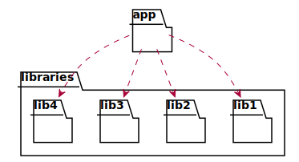

# Generating package diagrams

<!-- toc -->


<!-- tocstop -->

Package diagrams are simple diagrams, which can be useful to visualize a high
level structure of a C++ project, by rendering project's namespaces,
subdirectories or modules as UML packages and their interdependencies.

The minimal config required to generate a package diagram is presented below:
```yaml
diagrams:
  # Diagram name
  my_class_diagram:
    # Type of diagram (has to be `package`)
    type: package
    # Include only translation units matching the following patterns
    glob:
      - src/*.cc
    # Include only classes and functions from files in `src` directory
    include:
      namespaces:
        - ns1::ns2
```

For instance the following C++ code:
```cpp
namespace A::AA {
namespace A1 {
struct CA {
};
}
namespace A2 {
struct CB {
};
}
namespace A3 {
struct CC {
};
}
namespace A4 {
struct CD {
};
}
namespace A5 {
struct CE {
};
}
namespace A6 {
struct CF {
};
}
namespace A7 {
struct CG {
};
}
namespace A8 {
struct CH {
};
}
namespace A9 {
struct CI {
};
}
namespace A10 {
struct CJ {
};
}
namespace A11 {
struct CK {
};
}
namespace A12 {
struct CL {
};
}
namespace A13 {
struct CM {
};
}
namespace A14 {
struct CN {
};
}
namespace A15 {
struct CO {
};
}
namespace A16 {
struct CP {
};
}
namespace A17 {
struct CR {
};
}
}
namespace B::BB::BBB {
class CBA : public A::AA::A6::CF {
public:
    A::AA::A1::CA *ca_;
    A::AA::A2::CB cb_;
    std::shared_ptr<A::AA::A3::CC> cc_;
    std::map<std::string, std::unique_ptr<A::AA::A4::CD>> *cd_;
    std::array<A::AA::A15::CO, 5> co_;
    static A::AA::A16::CP *cp_;

    CBA() = default;

    CBA(A::AA::A14::CN *cn) { }

    friend A::AA::A17::CR;

    template <typename... Item> CBA(std::tuple<Item...> &items) { }

    void ce(const std::vector<A::AA::A5::CE> /*ce_*/) { }

    std::shared_ptr<A::AA::A7::CG> cg() { return {}; }

    template <typename T>
    void ch(std::map<T, std::shared_ptr<A::AA::A8::CH>> &ch_)
    {
    }

    template <typename T>
    std::map<T, std::shared_ptr<A::AA::A9::CI>> ci(T * /*t*/)
    {
        return {};
    }
};

void cj(std::unique_ptr<A::AA::A10::CJ> /*cj_*/) { }

std::unique_ptr<A::AA::A11::CK> ck() { return {}; }

template <typename T>
void cl(std::map<T, std::shared_ptr<A::AA::A12::CL>> & /*ch_*/)
{
}

template <typename T> std::map<T, std::shared_ptr<A::AA::A13::CM>> cm()
{
    return {};
}
}
```

results the following diagram:


By default, packages are generated from C++ namespaces in the code. However,
they can also be generated from the subdirectories in the filesystem tree or
based on C++20 modules

Subdirectory based packages can be enabled by adding the following option to
the configuration file:

```yaml
package_type: directory
```

for example check out this diagram (you can click on package names to see the 
corresponding source directory):


Module based packages can be enabled using the following option:

```yaml
package_type: module
```

for example check out this diagram (you can click on package names to see the
corresponding module source):


Diagrams can be rendered relative to a specific module using `using_module`
option:

```yaml
using_module: mod1.mod2
```
