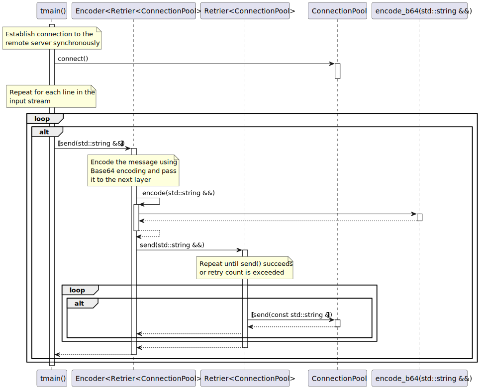
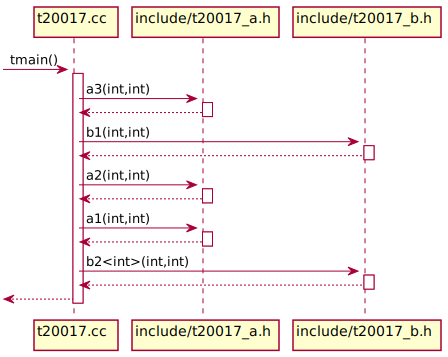
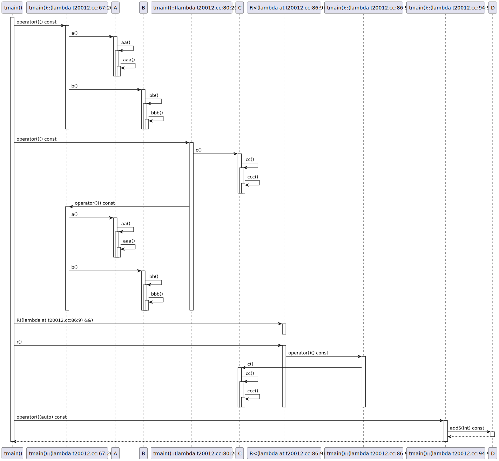
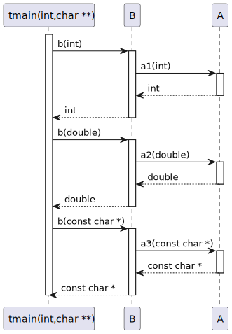
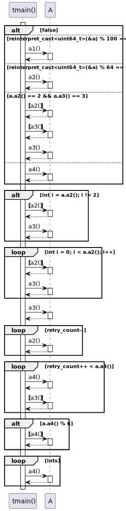

# Generating sequence diagrams

<!-- toc -->

* [Sequence diagram overview](#sequence-diagram-overview)
* [Specifying diagram location constraints](#specifying-diagram-location-constraints)
* [Grouping free functions by file](#grouping-free-functions-by-file)
* [Lambda expressions in sequence diagrams](#lambda-expressions-in-sequence-diagrams)
* [Customizing participants order](#customizing-participants-order)
* [Generating return types](#generating-return-types)
* [Generating condition statements](#generating-condition-statements)
* [Injecting call expressions manually through comments](#injecting-call-expressions-manually-through-comments)
* [Including comments in sequence diagrams](#including-comments-in-sequence-diagrams)

<!-- tocstop -->

The minimal config required to generate a sequence diagram is presented below:
```yaml
# Path to the directory where `compile_commands.json` can be found
compilation_database_dir: _build
# Output directory for the diagrams
output_directory: diagrams
# Diagrams definitions
diagrams:
  # Diagram name
  my_class_diagram:
    # Type of diagram (has to be `sequence`)
    type: sequence
    # Include only translation units matching the following patterns
    glob:
      - src/*.cc
    # Include only classes and functions from files in `src` directory
    include:
      paths:
        - src
    # Exclude calls to/from `std` namespace
    exclude:
      namespaces:
        - std
    start_from:
      - function: "main(int,const char**)"
```

## Sequence diagram overview

Consider the following diagram:



`clang-uml` generated sequence diagrams are not strictly speaking conforming to
the UML specification. In order to make them more useful for documenting modern
C++ code, the following assumptions were made:
 * Free functions are included in the sequence diagrams as standalone
   participants (in fact `clang-uml` can be used to generate sequence diagrams
   from plain old C code). Functions can also be aggregated into file
   participants, based on their place of declaration
 * Call expressions in conditional expressions in block statements (e.g. `if`
   or `while`) are rendered inside the PlantUML or MermaidJS `alt` or `loop`
   blocks but wrapped in `[`, `]` brackets
 * Lambda expressions are generated as standalone participants, whose name
   comprises the parent context where they are defined and the exact source code
   location

## Specifying diagram location constraints
Sequence diagrams require specification of location constraints in order to
determine, which call chains should be included in the diagram. Currently,
there are 3 types of constraints:
* `from` - will include all message call chains, which start at the
           locations specified in this constraint (this was previously named
           `start_from`)
* `to` - will include all message call chains, which end at the specified
         locations
* `from_to` - will include all call chains, which start and end at the specified
              locations

Currently, the constraints can be a method or a free function, both specified
using the full signature of the function, e.g.:

```yaml
    from:
      - function: "main(int,const char**)"
```
or
```yaml
    to:
      - function: "clanguml::sequence_diagram::visitor::translation_unit_visitor::VisitCXXRecordDecl(clang::CXXRecordDecl *)"
```

The locations must be fully qualified, and they must match exactly the string
representation of a given function or method in the `clang-uml` model.

In case of the `from_to` constraint, it is necessary to provide both `from`
and `to` locations as follows:
```yaml
    from_to:
      - [function: "clanguml::t20034::D::d2()",
         function: "clanguml::t20034::A::a2()"]
```

To find the exact function signature, which can be used as a `from` location,
run `clang-uml` as follows (assuming the function of interest is called `main`):

```bash
clang-uml --print-from -n main_sequence | grep main
```

or to get all possible `to` locations, run:

```bash
clang-uml --print-to -n main_sequence | grep main
```

Command line flags `--print-from` and `--print-to` will print on stdout all
functions and methods available in the diagram model, and each line of this
output can be directly used as a value of `from`, `from_to` or `to`
properties in the config file.

Since that list can be quite large, it's best to filter the output to limit
the number of lines to a subset of possible candidates.

## Grouping free functions by file
By default, `clang-uml` will generate a new participant for each call to a free
function (not method), which can lead to a very large number of participants in
the diagram. If it's an issue, an option can be provided in the diagram
definition:

```yaml
combine_free_functions_into_file_participants: true
```

which will aggregate free functions per source file where they were declared
thus minimizing the diagram size. An example of such diagram is presented below:



## Lambda expressions in sequence diagrams
Lambda expressions in sequence diagrams are... tricky. There is currently
tentative support, which follows the following rules:
  * If lambda expression is called within the scope of the diagram, the calls
    from the lambda will be placed at the lambda invocation and not declaration
  * If lambda expression is passed to some function or method, which is outside
    the scope of the diagram (e.g. used in `std::transform` call) the call will
    not be generated
  * If the lambda is passed as template argument in instantiation it will not
    be generated

Another issue is the naming of lambda participants. Currently, each lambda is
rendered in the diagram as a separate class whose name is composed of the lambda
location in the code (the only unique way of identifying lambdas I was able
to find). For example the following code:

```cpp
#include <algorithm>
#include <functional>
#include <memory>
#include <optional>
#include <utility>

namespace clanguml {
namespace t20012 {
struct A {
    void a() { aa(); }

    void aa() { aaa(); }

    void aaa() { }
};

struct B {
    void b() { bb(); }

    void bb() { bbb(); }

    void bbb() { }

    void eb() { }
};

struct C {
    void c() { cc(); }

    void cc() { ccc(); }

    void ccc() { }
};

struct D {
    int add5(int arg) const { return arg + 5; }
};

class E {
    std::optional<std::shared_ptr<B>> maybe_b;
    std::shared_ptr<A> a;

public:
    template <typename F> void setup(F &&f) { f(maybe_b); }
};

template <typename F> struct R {
    R(F &&f)
        : f_{std::move(f)}
    {
    }

    void r() { f_(); }

    F f_;
};

void tmain()
{
    A a;
    B b;
    C c;

    // The activity shouldn't be marked at the lambda definition, but
    // wherever it is actually called...
    auto alambda = [&a, &b]() {
        a.a();
        b.b();
    };

    // ...like here
    alambda();

    // There should be no call to B in the sequence diagram as the blambda
    // is never called
    [[maybe_unused]] auto blambda = [&b]() { b.b(); };

    // Nested lambdas should also work
    auto clambda = [alambda, &c]() {
        c.c();
        alambda();
    };
    clambda();

    R r{[&c]() { c.c(); }};

    r.r();

    D d;

    std::vector<int> ints{0, 1, 2, 3, 4};
    std::transform(ints.begin(), ints.end(), ints.begin(),
        [&d](auto i) { return d.add5(i); });
}
}
}
```

results in the following diagram:



In case lambda expressions are redundant and we are only interested in the calls
generate from the lambda expressions, it is possible to inline lambda
expressions in the generated diagrams by specifying the following option:

```yaml
inline_lambda_messages: true
```

For example compare the test cases [t20012](test_cases/t20012.md) and
[t20052](test_cases/t20052.md).

## Customizing participants order
The default participant order in the sequence diagram can be suboptimal in the
sense that consecutive calls can go right, then left, then right again
depending on the specific call chain in the code. It is however possible to
override this order in the diagram definition using `participants_order`
property, for instance like this:

```yaml
diagrams:
  t20029_sequence:
    type: sequence
    glob:
      - t20029.cc
    include:
      namespaces:
        - clanguml::t20029
    exclude:
      access:
        - private
    using_namespace: clanguml::t20029
    start_from:
      - function: clanguml::t20029::tmain()
    participants_order:
      - "clanguml::t20029::tmain()"
      - "clanguml::t20029::Encoder<clanguml::t20029::Retrier<clanguml::t20029::ConnectionPool>>"
      - "clanguml::t20029::Retrier<clanguml::t20029::ConnectionPool>"
      - "clanguml::t20029::ConnectionPool"
      - "clanguml::t20029::encode_b64(std::string &&)"
```

## Generating return types
By default, return messages do not contain the return type information from
the function or method. Instead, if the result is void there is no return
arrow from the activity representing the function body.

It is however possible to enable rendering of return types, by adding the
following configuration option:

```yaml
generate_return_types: true
```

This option only affects the `plantuml` and `mermaid` generators, in `json`
generator `return_type` property is always present in the message nodes.

The diagram below presents what it looks like in a PlantUML generated diagram:


## Generating condition statements
Sometimes, it is useful to include actual condition statements (for instance
contents of the `if()` condition in the `alt` or `loop` blocks in the sequence
diagrams, to make them more readable.

This can be enabled using the following option:

```yaml
generate_condition_statements: true
```

An example of a diagram with this feature enabled is presented below:


## Injecting call expressions manually through comments
In some cases, `clang-uml` is not yet able to discover a call expression target
in some line of code. This can include passing function or method address to
some executor (e.g. thread), async calls etc.

However, a call expression can be injected manually through a comment
directive
```cpp
// \uml{note CALLEE}
```

It should be placed in the comment just before such line of code, for example:

```cpp
    // \uml{call clanguml::t20038::B::bbb()}
    auto bbb_future = std::async(std::launch::deferred, &B::bbb, b);
```

also see the [t20038](test_cases/t20038.md) test case.

Please note that the callee must have fully qualified name including complete
namespace.

In order to enable this, the `.clang-uml` must contain the following option:

```yaml
add_compile_flags:
  - -fparse-all-comments
```

otherwise Clang will skip these comments during AST traversal.

## Including comments in sequence diagrams
`clang-uml` can add code comments placed directly before or next to a call
expression as notes in the diagram (see for instance
[t20038](test_cases/t20038_sequence.svg)).

This however is not enabled by default. In order to enable this feature it is
necessary to first of all force Clang to parse all comments in the source
code by adding the following compile flag at the top of `.clang-uml`:

```yaml
add_compile_flags:
  - -fparse-all-comments
```

or adding it to the `compile_commands.json` database somehow directly.

Another option needed to generate these comments in the diagram is to set

```yaml
   generate_message_comments: true
```

for each sequence diagram, which should include these comments.

In case only selected messages should have some specific comments, instead
of enabling the `generate_message_comments` option, it is possible to use
`\\uml{note TEXT}` directive in the comment above the expression, see
[t20001](test_cases/t20001_sequence.svg).
