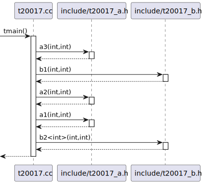

# Generating sequence diagrams

<!-- toc -->

* [Sequence diagram overview](#sequence-diagram-overview)
* [Specifying diagram entry point](#specifying-diagram-entry-point)
* [Grouping free functions by file](#grouping-free-functions-by-file)
* [Lambda expressions in sequence diagrams](#lambda-expressions-in-sequence-diagrams)
* [Customizing participants order](#customizing-participants-order)

<!-- tocstop -->

The minimal config required to generate a sequence diagram is presented below:
```yaml
# Path to the directory where `compile_commands.json` can be found
compilation_database_dir: _build
# Output directory for the diagrams
output_directory: puml
# Diagrams definitions
diagrams:
  # Diagram name
  my_class_diagram:
    # Type of diagram (has to be `sequence`)
    type: sequence
    # Include only translation units matching the following patterns
    glob:
      - src/*.cc
    # Include only classes and functions from files in `src` directory
    include:
      paths:
        - src
    # Exclude calls to/from `std` namespace
    exclude:
      namespaces:
        - std
    start_from:
      - function: "main(int,const char**)"
```

## Sequence diagram overview

Consider the following diagram:


`clang-uml` generated sequence diagrams are not strictly speaking conforming to the UML specification. In order to 
make them more useful for documenting modern C++ code, the following assumptions were made:
 * Free functions are included in the sequence diagrams as standalone participants (in fact `clang-uml` can be used
   to generate sequence diagrams from plain old C code). Functions can also be aggregated into file participants,
   based on their place of declaration
 * Call expressions in conditional expressions in block statements (e.g. `if` or `while`) are rendered inside the
   PlantUML `alt` or `loop` blocks but wrapped in `[`, `]` brackets
 * Lambda expressions are generated as standalone participants, whose name comprises the parent context where they
   are defined and the exact source code location

## Specifying diagram entry point
Sequence diagrams require an entry point for the diagram in order to determine, at which point in the code the sequence
diagram should start. Currently, the entry point can only be a method or a free function, both specified using `start_from`
configuration property, for instance:
```yaml
    start_from:
      - function: "main(int,char**)"
```
or
```yaml
start_from:
  - function: "clanguml::sequence_diagram::visitor::translation_unit_visitor::VisitCXXRecordDecl(clang::CXXRecordDecl *)"
```

The entrypoints must be fully qualified and they must match exactly the string representation of given function or
method in the `clang-uml` model, which can be frustrating after few attempts.
If not sure, the best way is to put anything in the `function`
property value at first, run the `clang-uml` on the diagram with verbose set to `-vvv` and look in the logs
for the relevant function signature. At the end of the diagram generation at this verbosity level, `clang-uml` will
generate a textual representation of all discovered activities relevant for this diagram, for instance if you're looking
_for exact signature of method `translation_unit_visitor::VisitCXXRecordDecl`, look for similar_
output in the logs:

```bash
[trace] [tid 3842954] [diagram.cc:194] Sequence id=1875210076312968845:
[trace] [tid 3842954] [diagram.cc:198]    Activity id=1875210076312968845, from=clanguml::sequence_diagram::visitor::translation_unit_visitor::VisitCXXRecordDecl(clang::CXXRecordDecl *):
[trace] [tid 3842954] [diagram.cc:208]        Message from=clanguml::sequence_diagram::visitor::translation_unit_visitor::VisitCXXRecordDecl(clang::CXXRecordDecl *), from_id=1875210076312968845, to=__UNRESOLVABLE_ID__, to_id=0, name=, type=if
[trace] [tid 3842954] [diagram.cc:217]        Message from=clanguml::sequence_diagram::visitor::translation_unit_visitor::VisitCXXRecordDecl(clang::CXXRecordDecl *), from_id=1875210076312968845, to=clanguml::sequence_diagram::visitor::translation_unit_visitor::should_include(const clang::TagDecl *), to_id=664596622746486441, name=should_include, type=call
```

Then you just need to copy and paste the signature exactly and rerun `clang-uml`.

## Grouping free functions by file
By default, `clang-uml` will generate a new participant for each call to a free function (not method), which can lead
to a very large number of participants in the diagram. If it's an issue, an option can be provided in the diagram 
definition:

```yaml
combine_free_functions_into_file_participants: true
```

which will aggregate free functions per source file where they were declared thus minimizing the
diagram size. An example of such diagram is presented below:



## Lambda expressions in sequence diagrams
Lambda expressions in sequence diagrams are... tricky. There is currently tentative support, which follows the 
following rules:
  * If lambda expression is called within the scope of the diagram, the calls from the lambda will be placed 
    at the lambda invocation and not declaration
  * If lambda expression is passed to some function or method, which is outside the scope of the diagram
    (e.g. used in `std::transform` call) the call will be generated at the point where lambda is passed as parameter
  * If the lambda is passed as template parameter in instantiation it will not be generated at the moment at all

Another issue is the naming of lambda participants. Currently, each lambda is rendered in the diagram as a separate
class whose name is composed of the lambda location in the code (the only unique way of identifying lambdas I was able
to find). For example the following code:

```cpp
#include <algorithm>
#include <functional>
#include <memory>
#include <optional>
#include <utility>

namespace clanguml {
namespace t20012 {
struct A {
    void a() { aa(); }

    void aa() { aaa(); }

    void aaa() { }
};

struct B {
    void b() { bb(); }

    void bb() { bbb(); }

    void bbb() { }

    void eb() { }
};

struct C {
    void c() { cc(); }

    void cc() { ccc(); }

    void ccc() { }
};

struct D {
    int add5(int arg) const { return arg + 5; }
};

class E {
    std::optional<std::shared_ptr<B>> maybe_b;
    std::shared_ptr<A> a;

public:
    template <typename F> void setup(F &&f) { f(maybe_b); }
};

template <typename F> struct R {
    R(F &&f)
        : f_{std::move(f)}
    {
    }

    void r() { f_(); }

    F f_;
};

void tmain()
{
    A a;
    B b;
    C c;

    // The activity shouldn't be marked at the lambda definition, but
    // wherever it is actually called...
    auto alambda = [&a, &b]() {
        a.a();
        b.b();
    };

    // ...like here
    alambda();

    // There should be no call to B in the sequence diagram as the blambda
    // is never called
    [[maybe_unused]] auto blambda = [&b]() { b.b(); };

    // Nested lambdas should also work
    auto clambda = [alambda, &c]() {
        c.c();
        alambda();
    };
    clambda();

    R r{[&c]() { c.c(); }};

    r.r();

    D d;

    std::vector<int> ints{0, 1, 2, 3, 4};
    std::transform(ints.begin(), ints.end(), ints.begin(),
        [&d](auto i) { return d.add5(i); });
}
}
}
```

generates the following diagram:


## Customizing participants order
The default participant order in the sequence diagram can be suboptimal in the sense that consecutive calls
can go right, then left, then right again depending on the specific call chain in the code. It is however
possible to override this order in the diagram definition using `participants_order` property,
for instance like this test case:

```yaml
compilation_database_dir: ..
output_directory: puml
diagrams:
  t20029_sequence:
    type: sequence
    glob:
      - ../../tests/t20029/t20029.cc
    include:
      namespaces:
        - clanguml::t20029
    exclude:
      access:
        - private
    using_namespace:
      - clanguml::t20029
    start_from:
      - function: clanguml::t20029::tmain()
    participants_order:
      - clanguml::t20029::tmain()
      - clanguml::t20029::Encoder<clanguml::t20029::Retrier<clanguml::t20029::ConnectionPool>>
      - clanguml::t20029::Retrier<clanguml::t20029::ConnectionPool>
      - clanguml::t20029::ConnectionPool
      - clanguml::t20029::encode_b64(std::string &&)
```

