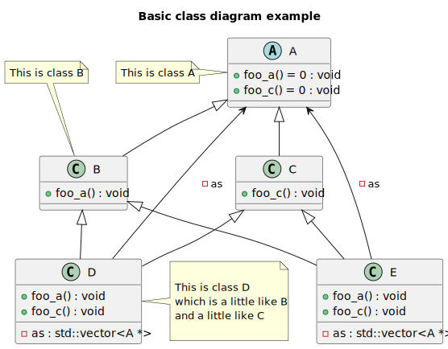

# t00002 - Basic class inheritance
## Config
```yaml
diagrams:
  t00002_class:
    type: class
    title: Basic class diagram example
    glob:
      - t00002.cc
    comment_parser: clang
    using_namespace: clanguml::t00002
    include:
      namespaces:
        - clanguml::t00002
    plantuml:
      after:
        - ' note left of {{ e.alias }} : {{ trim(e.comment.brief.0) }}'
        - ' note top of {{ e.alias }} : {{ trim(e.comment.brief.0) }}'
        - |
          note right of {{ alias("D") }}
              {{ comment("D").text }}
          end note
    mermaid:
      after:
        - ' note for {{ e.alias }} "{{ trim(e.comment.brief.0) }}"'
        - ' note for {{ e.alias }} "{{ trim(e.comment.brief.0) }}"'
        - 'note for {{ alias("D") }} "{{ comment("D").text }}"'
```
## Source code
File `tests/t00002/t00002.cc`
```cpp
#include <vector>

namespace clanguml {
namespace t00002 {

/// \brief This is class A
class A {
public:
    /// Abstract foo_a
    virtual void foo_a() = 0;
    /// Abstract foo_c
    virtual void foo_c() = 0;
};

/// \brief This is class B
class B : public A {
public:
    virtual void foo_a() override { }
};

/// @brief This is class C - class C has a long comment
///
/// Vivamus integer non suscipit taciti mus etiam at primis tempor sagittis sit,
/// euismod libero facilisi aptent elementum felis blandit cursus gravida sociis
/// erat ante, eleifend lectus nullam dapibus netus feugiat curae curabitur est
/// ad.
class C : public A {
public:
    /// Do nothing unless override is provided
    virtual void foo_c() override { }
};

/// This is class D
/// which is a little like B
/// and a little like C
class D : public B, public C {
public:
    /**
     * Forward foo_a
     */
    void foo_a() override
    {
        for (auto a : as)
            a->foo_a();
    }

    /**
     * Forward foo_c
     */
    void foo_c() override
    {
        for (auto a : as)
            a->foo_c();
    }

private:
    /// All the A pointers
    std::vector<A *> as;
};

class E : virtual public B, public virtual C {
public:
    ///
    /// Forward foo_a
    ///
    void foo_a() override
    {
        for (auto a : as)
            a->foo_a();
    }

    ///
    /// Forward foo_c
    ///
    void foo_c() override
    {
        for (auto a : as)
            a->foo_c();
    }

private:
    /// All the A pointers
    std::vector<A *> as;
};
} // namespace t00002
} // namespace clanguml

```
## Generated PlantUML diagrams

## Generated Mermaid diagrams

## Generated JSON models
```json
{
  "diagram_type": "class",
  "elements": [
    {
      "bases": [],
      "comment": {
        "brief": [
          " This is class A\n"
        ],
        "formatted": "\\brief This is class A",
        "paragraph": [
          " \n"
        ],
        "raw": "/// \\brief This is class A",
        "text": "\n \n"
      },
      "display_name": "A",
      "id": "987634239855407298",
      "is_abstract": true,
      "is_nested": false,
      "is_struct": false,
      "is_template": false,
      "is_union": false,
      "members": [],
      "methods": [
        {
          "access": "public",
          "comment": {
            "formatted": "Abstract foo_a",
            "paragraph": [
              " Abstract foo_a\n"
            ],
            "raw": "/// Abstract foo_a",
            "text": "\n Abstract foo_a\n"
          },
          "display_name": "foo_a",
          "is_const": false,
          "is_consteval": false,
          "is_constexpr": false,
          "is_constructor": false,
          "is_copy_assignment": false,
          "is_coroutine": false,
          "is_defaulted": false,
          "is_deleted": false,
          "is_move_assignment": false,
          "is_noexcept": false,
          "is_operator": false,
          "is_pure_virtual": true,
          "is_static": false,
          "is_virtual": true,
          "name": "foo_a",
          "parameters": [],
          "source_location": {
            "column": 18,
            "file": "t00002.cc",
            "line": 10,
            "translation_unit": "t00002.cc"
          },
          "template_parameters": [],
          "type": "void"
        },
        {
          "access": "public",
          "comment": {
            "formatted": "Abstract foo_c",
            "paragraph": [
              " Abstract foo_c\n"
            ],
            "raw": "/// Abstract foo_c",
            "text": "\n Abstract foo_c\n"
          },
          "display_name": "foo_c",
          "is_const": false,
          "is_consteval": false,
          "is_constexpr": false,
          "is_constructor": false,
          "is_copy_assignment": false,
          "is_coroutine": false,
          "is_defaulted": false,
          "is_deleted": false,
          "is_move_assignment": false,
          "is_noexcept": false,
          "is_operator": false,
          "is_pure_virtual": true,
          "is_static": false,
          "is_virtual": true,
          "name": "foo_c",
          "parameters": [],
          "source_location": {
            "column": 18,
            "file": "t00002.cc",
            "line": 12,
            "translation_unit": "t00002.cc"
          },
          "template_parameters": [],
          "type": "void"
        }
      ],
      "name": "A",
      "namespace": "clanguml::t00002",
      "source_location": {
        "column": 7,
        "file": "t00002.cc",
        "line": 7,
        "translation_unit": "t00002.cc"
      },
      "template_parameters": [],
      "type": "class"
    },
    {
      "bases": [
        {
          "access": "public",
          "id": "987634239855407298",
          "is_virtual": false,
          "name": "clanguml::t00002::A"
        }
      ],
      "comment": {
        "brief": [
          " This is class B\n"
        ],
        "formatted": "\\brief This is class B",
        "paragraph": [
          " \n"
        ],
        "raw": "/// \\brief This is class B",
        "text": "\n \n"
      },
      "display_name": "B",
      "id": "594234458687375950",
      "is_abstract": false,
      "is_nested": false,
      "is_struct": false,
      "is_template": false,
      "is_union": false,
      "members": [],
      "methods": [
        {
          "access": "public",
          "display_name": "foo_a",
          "is_const": false,
          "is_consteval": false,
          "is_constexpr": false,
          "is_constructor": false,
          "is_copy_assignment": false,
          "is_coroutine": false,
          "is_defaulted": false,
          "is_deleted": false,
          "is_move_assignment": false,
          "is_noexcept": false,
          "is_operator": false,
          "is_pure_virtual": false,
          "is_static": false,
          "is_virtual": true,
          "name": "foo_a",
          "parameters": [],
          "source_location": {
            "column": 18,
            "file": "t00002.cc",
            "line": 18,
            "translation_unit": "t00002.cc"
          },
          "template_parameters": [],
          "type": "void"
        }
      ],
      "name": "B",
      "namespace": "clanguml::t00002",
      "source_location": {
        "column": 7,
        "file": "t00002.cc",
        "line": 16,
        "translation_unit": "t00002.cc"
      },
      "template_parameters": [],
      "type": "class"
    },
    {
      "bases": [
        {
          "access": "public",
          "id": "987634239855407298",
          "is_virtual": false,
          "name": "clanguml::t00002::A"
        }
      ],
      "comment": {
        "brief": [
          " This is class C - class C has a long comment\n"
        ],
        "formatted": "@brief This is class C - class C has a long comment\n\nVivamus integer non suscipit taciti mus etiam at primis tempor sagittis sit,\neuismod libero facilisi aptent elementum felis blandit cursus gravida sociis\nerat ante, eleifend lectus nullam dapibus netus feugiat curae curabitur est\nad.",
        "paragraph": [
          " \n",
          " Vivamus integer non suscipit taciti mus etiam at primis tempor sagittis sit,\n euismod libero facilisi aptent elementum felis blandit cursus gravida sociis\n erat ante, eleifend lectus nullam dapibus netus feugiat curae curabitur est\n ad.\n"
        ],
        "raw": "/// @brief This is class C - class C has a long comment\n///\n/// Vivamus integer non suscipit taciti mus etiam at primis tempor sagittis sit,\n/// euismod libero facilisi aptent elementum felis blandit cursus gravida sociis\n/// erat ante, eleifend lectus nullam dapibus netus feugiat curae curabitur est\n/// ad.",
        "text": "\n \n\n Vivamus integer non suscipit taciti mus etiam at primis tempor sagittis sit,\n euismod libero facilisi aptent elementum felis blandit cursus gravida sociis\n erat ante, eleifend lectus nullam dapibus netus feugiat curae curabitur est\n ad.\n"
      },
      "display_name": "C",
      "id": "1142499429598587507",
      "is_abstract": false,
      "is_nested": false,
      "is_struct": false,
      "is_template": false,
      "is_union": false,
      "members": [],
      "methods": [
        {
          "access": "public",
          "comment": {
            "formatted": "Do nothing unless override is provided",
            "paragraph": [
              " Do nothing unless override is provided\n"
            ],
            "raw": "/// Do nothing unless override is provided",
            "text": "\n Do nothing unless override is provided\n"
          },
          "display_name": "foo_c",
          "is_const": false,
          "is_consteval": false,
          "is_constexpr": false,
          "is_constructor": false,
          "is_copy_assignment": false,
          "is_coroutine": false,
          "is_defaulted": false,
          "is_deleted": false,
          "is_move_assignment": false,
          "is_noexcept": false,
          "is_operator": false,
          "is_pure_virtual": false,
          "is_static": false,
          "is_virtual": true,
          "name": "foo_c",
          "parameters": [],
          "source_location": {
            "column": 18,
            "file": "t00002.cc",
            "line": 30,
            "translation_unit": "t00002.cc"
          },
          "template_parameters": [],
          "type": "void"
        }
      ],
      "name": "C",
      "namespace": "clanguml::t00002",
      "source_location": {
        "column": 7,
        "file": "t00002.cc",
        "line": 27,
        "translation_unit": "t00002.cc"
      },
      "template_parameters": [],
      "type": "class"
    },
    {
      "bases": [
        {
          "access": "public",
          "id": "594234458687375950",
          "is_virtual": false,
          "name": "clanguml::t00002::B"
        },
        {
          "access": "public",
          "id": "1142499429598587507",
          "is_virtual": false,
          "name": "clanguml::t00002::C"
        }
      ],
      "comment": {
        "formatted": "This is class D\nwhich is a little like B\nand a little like C",
        "paragraph": [
          " This is class D\n which is a little like B\n and a little like C\n"
        ],
        "raw": "/// This is class D\n/// which is a little like B\n/// and a little like C",
        "text": "\n This is class D\n which is a little like B\n and a little like C\n"
      },
      "display_name": "D",
      "id": "60950494980414724",
      "is_abstract": false,
      "is_nested": false,
      "is_struct": false,
      "is_template": false,
      "is_union": false,
      "members": [
        {
          "access": "private",
          "comment": {
            "formatted": "All the A pointers",
            "paragraph": [
              " All the A pointers\n"
            ],
            "raw": "/// All the A pointers",
            "text": "\n All the A pointers\n"
          },
          "is_static": false,
          "name": "as",
          "source_location": {
            "column": 22,
            "file": "t00002.cc",
            "line": 58,
            "translation_unit": "t00002.cc"
          },
          "type": "std::vector<A *>"
        }
      ],
      "methods": [
        {
          "access": "public",
          "comment": {
            "formatted": "\n Forward foo_a\n     ",
            "paragraph": [
              " Forward foo_a\n"
            ],
            "raw": "/**\n     * Forward foo_a\n     */",
            "text": "\n Forward foo_a\n"
          },
          "display_name": "foo_a",
          "is_const": false,
          "is_consteval": false,
          "is_constexpr": false,
          "is_constructor": false,
          "is_copy_assignment": false,
          "is_coroutine": false,
          "is_defaulted": false,
          "is_deleted": false,
          "is_move_assignment": false,
          "is_noexcept": false,
          "is_operator": false,
          "is_pure_virtual": false,
          "is_static": false,
          "is_virtual": true,
          "name": "foo_a",
          "parameters": [],
          "source_location": {
            "column": 10,
            "file": "t00002.cc",
            "line": 41,
            "translation_unit": "t00002.cc"
          },
          "template_parameters": [],
          "type": "void"
        },
        {
          "access": "public",
          "comment": {
            "formatted": "\n Forward foo_c\n     ",
            "paragraph": [
              " Forward foo_c\n"
            ],
            "raw": "/**\n     * Forward foo_c\n     */",
            "text": "\n Forward foo_c\n"
          },
          "display_name": "foo_c",
          "is_const": false,
          "is_consteval": false,
          "is_constexpr": false,
          "is_constructor": false,
          "is_copy_assignment": false,
          "is_coroutine": false,
          "is_defaulted": false,
          "is_deleted": false,
          "is_move_assignment": false,
          "is_noexcept": false,
          "is_operator": false,
          "is_pure_virtual": false,
          "is_static": false,
          "is_virtual": true,
          "name": "foo_c",
          "parameters": [],
          "source_location": {
            "column": 10,
            "file": "t00002.cc",
            "line": 50,
            "translation_unit": "t00002.cc"
          },
          "template_parameters": [],
          "type": "void"
        }
      ],
      "name": "D",
      "namespace": "clanguml::t00002",
      "source_location": {
        "column": 7,
        "file": "t00002.cc",
        "line": 36,
        "translation_unit": "t00002.cc"
      },
      "template_parameters": [],
      "type": "class"
    },
    {
      "bases": [
        {
          "access": "public",
          "id": "594234458687375950",
          "is_virtual": true,
          "name": "clanguml::t00002::B"
        },
        {
          "access": "public",
          "id": "1142499429598587507",
          "is_virtual": true,
          "name": "clanguml::t00002::C"
        }
      ],
      "display_name": "E",
      "id": "2237886670308966220",
      "is_abstract": false,
      "is_nested": false,
      "is_struct": false,
      "is_template": false,
      "is_union": false,
      "members": [
        {
          "access": "private",
          "comment": {
            "formatted": "All the A pointers",
            "paragraph": [
              " All the A pointers\n"
            ],
            "raw": "/// All the A pointers",
            "text": "\n All the A pointers\n"
          },
          "is_static": false,
          "name": "as",
          "source_location": {
            "column": 22,
            "file": "t00002.cc",
            "line": 83,
            "translation_unit": "t00002.cc"
          },
          "type": "std::vector<A *>"
        }
      ],
      "methods": [
        {
          "access": "public",
          "comment": {
            "formatted": "\n Forward foo_a",
            "paragraph": [
              " Forward foo_a\n"
            ],
            "raw": "///\n    /// Forward foo_a\n    ///",
            "text": "\n Forward foo_a\n"
          },
          "display_name": "foo_a",
          "is_const": false,
          "is_consteval": false,
          "is_constexpr": false,
          "is_constructor": false,
          "is_copy_assignment": false,
          "is_coroutine": false,
          "is_defaulted": false,
          "is_deleted": false,
          "is_move_assignment": false,
          "is_noexcept": false,
          "is_operator": false,
          "is_pure_virtual": false,
          "is_static": false,
          "is_virtual": true,
          "name": "foo_a",
          "parameters": [],
          "source_location": {
            "column": 10,
            "file": "t00002.cc",
            "line": 66,
            "translation_unit": "t00002.cc"
          },
          "template_parameters": [],
          "type": "void"
        },
        {
          "access": "public",
          "comment": {
            "formatted": "\n Forward foo_c",
            "paragraph": [
              " Forward foo_c\n"
            ],
            "raw": "///\n    /// Forward foo_c\n    ///",
            "text": "\n Forward foo_c\n"
          },
          "display_name": "foo_c",
          "is_const": false,
          "is_consteval": false,
          "is_constexpr": false,
          "is_constructor": false,
          "is_copy_assignment": false,
          "is_coroutine": false,
          "is_defaulted": false,
          "is_deleted": false,
          "is_move_assignment": false,
          "is_noexcept": false,
          "is_operator": false,
          "is_pure_virtual": false,
          "is_static": false,
          "is_virtual": true,
          "name": "foo_c",
          "parameters": [],
          "source_location": {
            "column": 10,
            "file": "t00002.cc",
            "line": 75,
            "translation_unit": "t00002.cc"
          },
          "template_parameters": [],
          "type": "void"
        }
      ],
      "name": "E",
      "namespace": "clanguml::t00002",
      "source_location": {
        "column": 7,
        "file": "t00002.cc",
        "line": 61,
        "translation_unit": "t00002.cc"
      },
      "template_parameters": [],
      "type": "class"
    }
  ],
  "name": "t00002_class",
  "package_type": "namespace",
  "relationships": [
    {
      "access": "public",
      "destination": "987634239855407298",
      "source": "594234458687375950",
      "type": "extension"
    },
    {
      "access": "public",
      "destination": "987634239855407298",
      "source": "1142499429598587507",
      "type": "extension"
    },
    {
      "access": "private",
      "destination": "987634239855407298",
      "label": "as",
      "source": "60950494980414724",
      "type": "association"
    },
    {
      "access": "public",
      "destination": "594234458687375950",
      "source": "60950494980414724",
      "type": "extension"
    },
    {
      "access": "public",
      "destination": "1142499429598587507",
      "source": "60950494980414724",
      "type": "extension"
    },
    {
      "access": "private",
      "destination": "987634239855407298",
      "label": "as",
      "source": "2237886670308966220",
      "type": "association"
    },
    {
      "access": "public",
      "destination": "594234458687375950",
      "source": "2237886670308966220",
      "type": "extension"
    },
    {
      "access": "public",
      "destination": "1142499429598587507",
      "source": "2237886670308966220",
      "type": "extension"
    }
  ],
  "title": "Basic class diagram example",
  "using_namespace": "clanguml::t00002"
}
```
