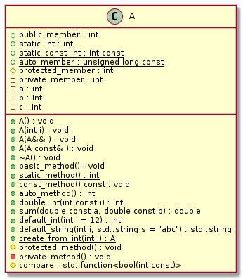

# t00003 - Class field and methods
## Config
```yaml
compilation_database_dir: ..
output_directory: puml
diagrams:
  t00003_class:
    type: class
    glob:
      - ../../tests/t00003/t00003.cc
    using_namespace:
      - clanguml::t00003
    include:
      namespaces:
        - clanguml::t00003

```
## Source code
```cpp
#include <functional>

namespace clanguml {
namespace t00003 {

class A {
public:
    A() = default;
    A(int i)
        : private_member{i}
    {
    }
    A(A &&) = default;
    A(const A &) = default;
    virtual ~A() = default;

    void basic_method() {}
    static int static_method() { return 0; }
    void const_method() const {}
    auto auto_method() { return 1; }

    auto double_int(const int i) { return 2 * i; }
    auto sum(const double a, const double b) { return a + b; }

    auto default_int(int i = 12) { return i + 10; }
    std::string default_string(int i, std::string s = "abc")
    {
        return s + std::to_string(i);
    }

    static A create_from_int(int i) { return A(i); }

    int public_member;
    static int static_int;
    static const int static_const_int = 1;
    static const auto auto_member{10UL};

protected:
    void protected_method() {}

    int protected_member;

    std::function<bool(const int)> compare = [this](const int v) {
        return private_member > v;
    };

private:
    void private_method() {}

    int private_member;
    int a, b, c;
};

int A::static_int = 1;
}
}

```
## Generated UML diagrams

