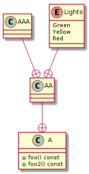

# t00004 - Nested classes and enums
## Config
```yaml
compilation_database_dir: ..
output_directory: puml
diagrams:
  t00004_class:
    type: class
    glob:
      - ../../tests/t00004/t00004.cc
    using_namespace:
      - clanguml::t00004
      - clanguml::t00004::A
      - clanguml::t00004::A::AA
    include:
      namespaces:
        - clanguml::t00004

```
## Source code
```cpp
namespace clanguml {
namespace t00004 {

class A {
public:
    void foo() const {}

    class AA {
    public:
        enum class Lights { Green, Yellow, Red };

        class AAA {
        };
    };

    void foo2() const {}
};
}
}

```
## Generated UML diagrams

