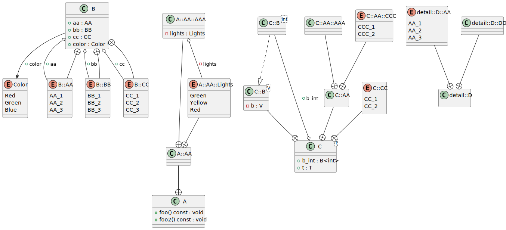

# t00004 - Nested classes and enums
## Config
```yaml
compilation_database_dir: ..
output_directory: diagrams
diagrams:
  t00004_class:
    type: class
    glob:
      - ../../tests/t00004/t00004.cc
    using_namespace:
      - clanguml::t00004
      - clanguml::t00004::A
      - clanguml::t00004::A::AA
    include:
      namespaces:
        - clanguml::t00004

```
## Source code
File t00004.cc
```cpp
namespace clanguml {
namespace t00004 {

class B {
public:
    enum AA { AA_1, AA_2, AA_3 };
};

class A {
public:
    void foo() const { }

    class AA {
    public:
        enum class Lights { Green, Yellow, Red };

        class AAA { };
    };

    void foo2() const { }
};

template <typename T> class C {
public:
    T t;

    class AA {
        class AAA { };

        enum class CCC { CCC_1, CCC_2 };
    };

    template <typename V> class B {
        V b;
    };

    B<int> b_int;

    enum class CC { CC_1, CC_2 };
};

namespace detail {
class D {
public:
    enum class AA { AA_1, AA_2, AA_3 };

    class DD { };
};
}

} // namespace t00004
} // namespace clanguml

```
## Generated PlantUML diagrams

## Generated Mermaid diagrams

## Generated JSON models
```json
{
  "diagram_type": "class",
  "elements": [
    {
      "bases": [],
      "display_name": "clanguml::t00004::B",
      "id": "1232624428734051711",
      "is_abstract": false,
      "is_nested": false,
      "is_struct": false,
      "is_template": false,
      "is_union": false,
      "members": [],
      "methods": [],
      "name": "B",
      "namespace": "clanguml::t00004",
      "source_location": {
        "column": 7,
        "file": "../../tests/t00004/t00004.cc",
        "line": 4,
        "translation_unit": "../../tests/t00004/t00004.cc"
      },
      "template_parameters": [],
      "type": "class"
    },
    {
      "constants": [
        "AA_1",
        "AA_2",
        "AA_3"
      ],
      "display_name": "clanguml::t00004::B::AA",
      "id": "1630205507215126623",
      "is_nested": true,
      "name": "B::AA",
      "namespace": "clanguml::t00004",
      "source_location": {
        "column": 10,
        "file": "../../tests/t00004/t00004.cc",
        "line": 6,
        "translation_unit": "../../tests/t00004/t00004.cc"
      },
      "type": "enum"
    },
    {
      "bases": [],
      "display_name": "clanguml::t00004::A",
      "id": "1552274940876611774",
      "is_abstract": false,
      "is_nested": false,
      "is_struct": false,
      "is_template": false,
      "is_union": false,
      "members": [],
      "methods": [
        {
          "access": "public",
          "is_const": true,
          "is_consteval": false,
          "is_constexpr": false,
          "is_constructor": false,
          "is_copy_assignment": false,
          "is_defaulted": false,
          "is_deleted": false,
          "is_move_assignment": false,
          "is_noexcept": false,
          "is_operator": false,
          "is_pure_virtual": false,
          "is_static": false,
          "is_virtual": false,
          "name": "foo",
          "parameters": [],
          "source_location": {
            "column": 10,
            "file": "../../tests/t00004/t00004.cc",
            "line": 11,
            "translation_unit": "../../tests/t00004/t00004.cc"
          },
          "type": "void"
        },
        {
          "access": "public",
          "is_const": true,
          "is_consteval": false,
          "is_constexpr": false,
          "is_constructor": false,
          "is_copy_assignment": false,
          "is_defaulted": false,
          "is_deleted": false,
          "is_move_assignment": false,
          "is_noexcept": false,
          "is_operator": false,
          "is_pure_virtual": false,
          "is_static": false,
          "is_virtual": false,
          "name": "foo2",
          "parameters": [],
          "source_location": {
            "column": 10,
            "file": "../../tests/t00004/t00004.cc",
            "line": 20,
            "translation_unit": "../../tests/t00004/t00004.cc"
          },
          "type": "void"
        }
      ],
      "name": "A",
      "namespace": "clanguml::t00004",
      "source_location": {
        "column": 7,
        "file": "../../tests/t00004/t00004.cc",
        "line": 9,
        "translation_unit": "../../tests/t00004/t00004.cc"
      },
      "template_parameters": [],
      "type": "class"
    },
    {
      "bases": [],
      "display_name": "clanguml::t00004::A::AA",
      "id": "1742499843727859552",
      "is_abstract": false,
      "is_nested": true,
      "is_struct": false,
      "is_template": false,
      "is_union": false,
      "members": [],
      "methods": [],
      "name": "A::AA",
      "namespace": "clanguml::t00004",
      "source_location": {
        "column": 11,
        "file": "../../tests/t00004/t00004.cc",
        "line": 13,
        "translation_unit": "../../tests/t00004/t00004.cc"
      },
      "template_parameters": [],
      "type": "class"
    },
    {
      "constants": [
        "Green",
        "Yellow",
        "Red"
      ],
      "display_name": "clanguml::t00004::A::AA::Lights",
      "id": "590936874508841244",
      "is_nested": true,
      "name": "A::AA::Lights",
      "namespace": "clanguml::t00004",
      "source_location": {
        "column": 20,
        "file": "../../tests/t00004/t00004.cc",
        "line": 15,
        "translation_unit": "../../tests/t00004/t00004.cc"
      },
      "type": "enum"
    },
    {
      "bases": [],
      "display_name": "clanguml::t00004::A::AA::AAA",
      "id": "1430186633004282131",
      "is_abstract": false,
      "is_nested": true,
      "is_struct": false,
      "is_template": false,
      "is_union": false,
      "members": [],
      "methods": [],
      "name": "A::AA::AAA",
      "namespace": "clanguml::t00004",
      "source_location": {
        "column": 15,
        "file": "../../tests/t00004/t00004.cc",
        "line": 17,
        "translation_unit": "../../tests/t00004/t00004.cc"
      },
      "template_parameters": [],
      "type": "class"
    },
    {
      "bases": [],
      "display_name": "clanguml::t00004::C::B<int>",
      "id": "287819369330075965",
      "is_abstract": false,
      "is_nested": false,
      "is_struct": false,
      "is_template": true,
      "is_union": false,
      "members": [],
      "methods": [],
      "name": "C::B",
      "namespace": "clanguml::t00004",
      "source_location": {
        "column": 33,
        "file": "../../tests/t00004/t00004.cc",
        "line": 33,
        "translation_unit": "../../tests/t00004/t00004.cc"
      },
      "template_parameters": [
        {
          "is_variadic": false,
          "kind": "argument",
          "template_parameters": [],
          "type": "int"
        }
      ],
      "type": "class"
    },
    {
      "bases": [],
      "display_name": "clanguml::t00004::C<T>",
      "id": "2278328177727440136",
      "is_abstract": false,
      "is_nested": false,
      "is_struct": false,
      "is_template": true,
      "is_union": false,
      "members": [
        {
          "access": "public",
          "is_static": false,
          "name": "t",
          "source_location": {
            "column": 7,
            "file": "../../tests/t00004/t00004.cc",
            "line": 25,
            "translation_unit": "../../tests/t00004/t00004.cc"
          },
          "type": "T"
        },
        {
          "access": "public",
          "is_static": false,
          "name": "b_int",
          "source_location": {
            "column": 12,
            "file": "../../tests/t00004/t00004.cc",
            "line": 37,
            "translation_unit": "../../tests/t00004/t00004.cc"
          },
          "type": "B<int>"
        }
      ],
      "methods": [],
      "name": "C",
      "namespace": "clanguml::t00004",
      "source_location": {
        "column": 29,
        "file": "../../tests/t00004/t00004.cc",
        "line": 23,
        "translation_unit": "../../tests/t00004/t00004.cc"
      },
      "template_parameters": [
        {
          "is_variadic": false,
          "kind": "template_type",
          "name": "T",
          "template_parameters": []
        }
      ],
      "type": "class"
    },
    {
      "bases": [],
      "display_name": "clanguml::t00004::C::AA",
      "id": "623940132897927654",
      "is_abstract": false,
      "is_nested": true,
      "is_struct": false,
      "is_template": false,
      "is_union": false,
      "members": [],
      "methods": [],
      "name": "C::AA",
      "namespace": "clanguml::t00004",
      "source_location": {
        "column": 11,
        "file": "../../tests/t00004/t00004.cc",
        "line": 27,
        "translation_unit": "../../tests/t00004/t00004.cc"
      },
      "template_parameters": [],
      "type": "class"
    },
    {
      "bases": [],
      "display_name": "clanguml::t00004::C::AA::AAA",
      "id": "1597801087286500866",
      "is_abstract": false,
      "is_nested": true,
      "is_struct": false,
      "is_template": false,
      "is_union": false,
      "members": [],
      "methods": [],
      "name": "C::AA::AAA",
      "namespace": "clanguml::t00004",
      "source_location": {
        "column": 15,
        "file": "../../tests/t00004/t00004.cc",
        "line": 28,
        "translation_unit": "../../tests/t00004/t00004.cc"
      },
      "template_parameters": [],
      "type": "class"
    },
    {
      "constants": [
        "CCC_1",
        "CCC_2"
      ],
      "display_name": "clanguml::t00004::C::AA::CCC",
      "id": "81819202639599734",
      "is_nested": true,
      "name": "C::AA::CCC",
      "namespace": "clanguml::t00004",
      "source_location": {
        "column": 20,
        "file": "../../tests/t00004/t00004.cc",
        "line": 30,
        "translation_unit": "../../tests/t00004/t00004.cc"
      },
      "type": "enum"
    },
    {
      "bases": [],
      "display_name": "clanguml::t00004::C::B<V>",
      "id": "1381298335849583950",
      "is_abstract": false,
      "is_nested": true,
      "is_struct": false,
      "is_template": true,
      "is_union": false,
      "members": [
        {
          "access": "private",
          "is_static": false,
          "name": "b",
          "source_location": {
            "column": 11,
            "file": "../../tests/t00004/t00004.cc",
            "line": 34,
            "translation_unit": "../../tests/t00004/t00004.cc"
          },
          "type": "V"
        }
      ],
      "methods": [],
      "name": "C::B",
      "namespace": "clanguml::t00004",
      "source_location": {
        "column": 33,
        "file": "../../tests/t00004/t00004.cc",
        "line": 33,
        "translation_unit": "../../tests/t00004/t00004.cc"
      },
      "template_parameters": [
        {
          "is_variadic": false,
          "kind": "template_type",
          "name": "V",
          "template_parameters": []
        }
      ],
      "type": "class"
    },
    {
      "constants": [
        "CC_1",
        "CC_2"
      ],
      "display_name": "clanguml::t00004::C::CC",
      "id": "2037378936100378699",
      "is_nested": true,
      "name": "C::CC",
      "namespace": "clanguml::t00004",
      "source_location": {
        "column": 16,
        "file": "../../tests/t00004/t00004.cc",
        "line": 39,
        "translation_unit": "../../tests/t00004/t00004.cc"
      },
      "type": "enum"
    },
    {
      "bases": [],
      "display_name": "clanguml::t00004::detail::D",
      "id": "612133170877135796",
      "is_abstract": false,
      "is_nested": false,
      "is_struct": false,
      "is_template": false,
      "is_union": false,
      "members": [],
      "methods": [],
      "name": "D",
      "namespace": "clanguml::t00004::detail",
      "source_location": {
        "column": 7,
        "file": "../../tests/t00004/t00004.cc",
        "line": 43,
        "translation_unit": "../../tests/t00004/t00004.cc"
      },
      "template_parameters": [],
      "type": "class"
    },
    {
      "constants": [
        "AA_1",
        "AA_2",
        "AA_3"
      ],
      "display_name": "clanguml::t00004::detail::D::AA",
      "id": "1572080057917630922",
      "is_nested": true,
      "name": "D::AA",
      "namespace": "clanguml::t00004::detail",
      "source_location": {
        "column": 16,
        "file": "../../tests/t00004/t00004.cc",
        "line": 45,
        "translation_unit": "../../tests/t00004/t00004.cc"
      },
      "type": "enum"
    },
    {
      "bases": [],
      "display_name": "clanguml::t00004::detail::D::DD",
      "id": "600916232677555492",
      "is_abstract": false,
      "is_nested": true,
      "is_struct": false,
      "is_template": false,
      "is_union": false,
      "members": [],
      "methods": [],
      "name": "D::DD",
      "namespace": "clanguml::t00004::detail",
      "source_location": {
        "column": 11,
        "file": "../../tests/t00004/t00004.cc",
        "line": 47,
        "translation_unit": "../../tests/t00004/t00004.cc"
      },
      "template_parameters": [],
      "type": "class"
    }
  ],
  "metadata": {
    "clang_uml_version": "0.4.1",
    "llvm_version": "Ubuntu clang version 16.0.6 (++20230710042027+7cbf1a259152-1~exp1~20230710162048.105)",
    "schema_version": 1
  },
  "name": "t00004_class",
  "relationships": [
    {
      "access": "public",
      "destination": "1232624428734051711",
      "source": "1630205507215126623",
      "type": "containment"
    },
    {
      "access": "public",
      "destination": "1552274940876611774",
      "source": "1742499843727859552",
      "type": "containment"
    },
    {
      "access": "public",
      "destination": "1742499843727859552",
      "source": "590936874508841244",
      "type": "containment"
    },
    {
      "access": "public",
      "destination": "1742499843727859552",
      "source": "1430186633004282131",
      "type": "containment"
    },
    {
      "access": "public",
      "destination": "1381298335849583950",
      "source": "287819369330075965",
      "type": "instantiation"
    },
    {
      "access": "public",
      "destination": "287819369330075965",
      "label": "b_int",
      "source": "2278328177727440136",
      "type": "aggregation"
    },
    {
      "access": "public",
      "destination": "2278328177727440136",
      "source": "623940132897927654",
      "type": "containment"
    },
    {
      "access": "public",
      "destination": "623940132897927654",
      "source": "1597801087286500866",
      "type": "containment"
    },
    {
      "access": "public",
      "destination": "623940132897927654",
      "source": "81819202639599734",
      "type": "containment"
    },
    {
      "access": "public",
      "destination": "2278328177727440136",
      "source": "1381298335849583950",
      "type": "containment"
    },
    {
      "access": "public",
      "destination": "2278328177727440136",
      "source": "2037378936100378699",
      "type": "containment"
    },
    {
      "access": "public",
      "destination": "612133170877135796",
      "source": "1572080057917630922",
      "type": "containment"
    },
    {
      "access": "public",
      "destination": "612133170877135796",
      "source": "600916232677555492",
      "type": "containment"
    }
  ],
  "using_namespace": "clanguml::t00004"
}
```
