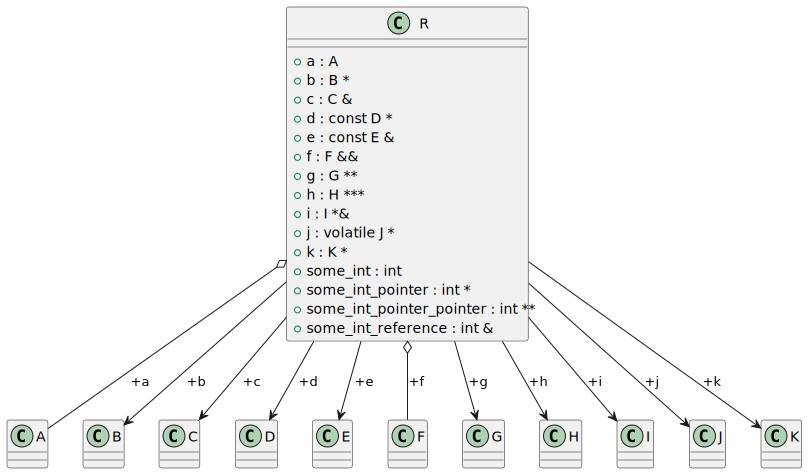

# t00005 - Basic class field relationships
## Config
```yaml
compilation_database_dir: ..
output_directory: puml
diagrams:
  t00005_class:
    type: class
    glob:
      - ../../tests/t00005/t00005.cc
    using_namespace:
      - clanguml::t00005
    include:
      namespaces:
        - clanguml::t00005

```
## Source code
File t00005.cc
```cpp
namespace clanguml {
namespace t00005 {
class A {
};

class B {
};

class C {
};

class D {
};

class E {
};

class F {
};

class G {
};

class H {
};

class I {
};

class J {
};

class K {
};

class R {
public:
    int some_int;
    int *some_int_pointer;
    int **some_int_pointer_pointer;
    int &some_int_reference;
    A a;
    B *b;
    C &c;
    const D *d;
    const E &e{};
    F &&f;
    G **g;
    H ***h;
    I *&i;
    volatile J *j;
    mutable K *k;
};
} // namespace t00005
} // namespace clanguml

```
## Generated UML diagrams

