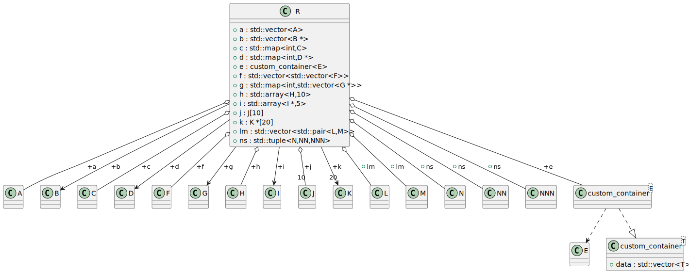

# t00006 - Class field relationships inferred from templates
## Config
```yaml
diagrams:
  t00006_class:
    type: class
    glob:
      - t00006.cc
    using_namespace: clanguml::t00006
    include:
      namespaces:
        - clanguml::t00006

```
## Source code
File `tests/t00006/t00006.cc`
```cpp
#include <array>
#include <map>
#include <vector>

namespace clanguml {
namespace t00006 {
class A { };

class B { };

class C { };

class D { };

class E { };

class F { };

class G { };

class H { };

class I { };

class J { };

class K { };

class L { };

class M { };

class N { };

class NN { };

class NNN { };

template <typename T> class custom_container {
public:
    std::vector<T> data;
};

class R {
public:
    std::vector<A> a;
    std::vector<B *> b;

    std::map<int, C> c;
    std::map<int, D *> d;

    custom_container<E> e;

    std::vector<std::vector<F>> f;
    std::map<int, std::vector<G *>> g;

    std::array<H, 10> h;
    std::array<I *, 5> i;

    J j[10];
    K *k[20];

    std::vector<std::pair<L, M>> lm;

    std::tuple<N, NN, NNN> ns;
};
} // namespace t00006
} // namespace clanguml

```
## Generated PlantUML diagrams

## Generated Mermaid diagrams

## Generated JSON models
```json
{
  "diagram_type": "class",
  "elements": [
    {
      "bases": [],
      "display_name": "A",
      "id": "989095304444672400",
      "is_abstract": false,
      "is_nested": false,
      "is_struct": false,
      "is_template": false,
      "is_union": false,
      "members": [],
      "methods": [],
      "name": "A",
      "namespace": "clanguml::t00006",
      "source_location": {
        "column": 7,
        "file": "t00006.cc",
        "line": 7,
        "translation_unit": "t00006.cc"
      },
      "template_parameters": [],
      "type": "class"
    },
    {
      "bases": [],
      "display_name": "B",
      "id": "648285260245005311",
      "is_abstract": false,
      "is_nested": false,
      "is_struct": false,
      "is_template": false,
      "is_union": false,
      "members": [],
      "methods": [],
      "name": "B",
      "namespace": "clanguml::t00006",
      "source_location": {
        "column": 7,
        "file": "t00006.cc",
        "line": 9,
        "translation_unit": "t00006.cc"
      },
      "template_parameters": [],
      "type": "class"
    },
    {
      "bases": [],
      "display_name": "C",
      "id": "323304333007297774",
      "is_abstract": false,
      "is_nested": false,
      "is_struct": false,
      "is_template": false,
      "is_union": false,
      "members": [],
      "methods": [],
      "name": "C",
      "namespace": "clanguml::t00006",
      "source_location": {
        "column": 7,
        "file": "t00006.cc",
        "line": 11,
        "translation_unit": "t00006.cc"
      },
      "template_parameters": [],
      "type": "class"
    },
    {
      "bases": [],
      "display_name": "D",
      "id": "1006912399043633492",
      "is_abstract": false,
      "is_nested": false,
      "is_struct": false,
      "is_template": false,
      "is_union": false,
      "members": [],
      "methods": [],
      "name": "D",
      "namespace": "clanguml::t00006",
      "source_location": {
        "column": 7,
        "file": "t00006.cc",
        "line": 13,
        "translation_unit": "t00006.cc"
      },
      "template_parameters": [],
      "type": "class"
    },
    {
      "bases": [],
      "display_name": "E",
      "id": "1092550394020578978",
      "is_abstract": false,
      "is_nested": false,
      "is_struct": false,
      "is_template": false,
      "is_union": false,
      "members": [],
      "methods": [],
      "name": "E",
      "namespace": "clanguml::t00006",
      "source_location": {
        "column": 7,
        "file": "t00006.cc",
        "line": 15,
        "translation_unit": "t00006.cc"
      },
      "template_parameters": [],
      "type": "class"
    },
    {
      "bases": [],
      "display_name": "F",
      "id": "965398761810782236",
      "is_abstract": false,
      "is_nested": false,
      "is_struct": false,
      "is_template": false,
      "is_union": false,
      "members": [],
      "methods": [],
      "name": "F",
      "namespace": "clanguml::t00006",
      "source_location": {
        "column": 7,
        "file": "t00006.cc",
        "line": 17,
        "translation_unit": "t00006.cc"
      },
      "template_parameters": [],
      "type": "class"
    },
    {
      "bases": [],
      "display_name": "G",
      "id": "1764732000887030464",
      "is_abstract": false,
      "is_nested": false,
      "is_struct": false,
      "is_template": false,
      "is_union": false,
      "members": [],
      "methods": [],
      "name": "G",
      "namespace": "clanguml::t00006",
      "source_location": {
        "column": 7,
        "file": "t00006.cc",
        "line": 19,
        "translation_unit": "t00006.cc"
      },
      "template_parameters": [],
      "type": "class"
    },
    {
      "bases": [],
      "display_name": "H",
      "id": "1669285599837552146",
      "is_abstract": false,
      "is_nested": false,
      "is_struct": false,
      "is_template": false,
      "is_union": false,
      "members": [],
      "methods": [],
      "name": "H",
      "namespace": "clanguml::t00006",
      "source_location": {
        "column": 7,
        "file": "t00006.cc",
        "line": 21,
        "translation_unit": "t00006.cc"
      },
      "template_parameters": [],
      "type": "class"
    },
    {
      "bases": [],
      "display_name": "I",
      "id": "2234750598599000377",
      "is_abstract": false,
      "is_nested": false,
      "is_struct": false,
      "is_template": false,
      "is_union": false,
      "members": [],
      "methods": [],
      "name": "I",
      "namespace": "clanguml::t00006",
      "source_location": {
        "column": 7,
        "file": "t00006.cc",
        "line": 23,
        "translation_unit": "t00006.cc"
      },
      "template_parameters": [],
      "type": "class"
    },
    {
      "bases": [],
      "display_name": "J",
      "id": "1335933649375465369",
      "is_abstract": false,
      "is_nested": false,
      "is_struct": false,
      "is_template": false,
      "is_union": false,
      "members": [],
      "methods": [],
      "name": "J",
      "namespace": "clanguml::t00006",
      "source_location": {
        "column": 7,
        "file": "t00006.cc",
        "line": 25,
        "translation_unit": "t00006.cc"
      },
      "template_parameters": [],
      "type": "class"
    },
    {
      "bases": [],
      "display_name": "K",
      "id": "1603190364864080123",
      "is_abstract": false,
      "is_nested": false,
      "is_struct": false,
      "is_template": false,
      "is_union": false,
      "members": [],
      "methods": [],
      "name": "K",
      "namespace": "clanguml::t00006",
      "source_location": {
        "column": 7,
        "file": "t00006.cc",
        "line": 27,
        "translation_unit": "t00006.cc"
      },
      "template_parameters": [],
      "type": "class"
    },
    {
      "bases": [],
      "display_name": "L",
      "id": "305487238408320046",
      "is_abstract": false,
      "is_nested": false,
      "is_struct": false,
      "is_template": false,
      "is_union": false,
      "members": [],
      "methods": [],
      "name": "L",
      "namespace": "clanguml::t00006",
      "source_location": {
        "column": 7,
        "file": "t00006.cc",
        "line": 29,
        "translation_unit": "t00006.cc"
      },
      "template_parameters": [],
      "type": "class"
    },
    {
      "bases": [],
      "display_name": "M",
      "id": "1664744512423723275",
      "is_abstract": false,
      "is_nested": false,
      "is_struct": false,
      "is_template": false,
      "is_union": false,
      "members": [],
      "methods": [],
      "name": "M",
      "namespace": "clanguml::t00006",
      "source_location": {
        "column": 7,
        "file": "t00006.cc",
        "line": 31,
        "translation_unit": "t00006.cc"
      },
      "template_parameters": [],
      "type": "class"
    },
    {
      "bases": [],
      "display_name": "N",
      "id": "950210019792152600",
      "is_abstract": false,
      "is_nested": false,
      "is_struct": false,
      "is_template": false,
      "is_union": false,
      "members": [],
      "methods": [],
      "name": "N",
      "namespace": "clanguml::t00006",
      "source_location": {
        "column": 7,
        "file": "t00006.cc",
        "line": 33,
        "translation_unit": "t00006.cc"
      },
      "template_parameters": [],
      "type": "class"
    },
    {
      "bases": [],
      "display_name": "NN",
      "id": "1662349735899726224",
      "is_abstract": false,
      "is_nested": false,
      "is_struct": false,
      "is_template": false,
      "is_union": false,
      "members": [],
      "methods": [],
      "name": "NN",
      "namespace": "clanguml::t00006",
      "source_location": {
        "column": 7,
        "file": "t00006.cc",
        "line": 35,
        "translation_unit": "t00006.cc"
      },
      "template_parameters": [],
      "type": "class"
    },
    {
      "bases": [],
      "display_name": "NNN",
      "id": "1963145075481599858",
      "is_abstract": false,
      "is_nested": false,
      "is_struct": false,
      "is_template": false,
      "is_union": false,
      "members": [],
      "methods": [],
      "name": "NNN",
      "namespace": "clanguml::t00006",
      "source_location": {
        "column": 7,
        "file": "t00006.cc",
        "line": 37,
        "translation_unit": "t00006.cc"
      },
      "template_parameters": [],
      "type": "class"
    },
    {
      "bases": [],
      "display_name": "custom_container<T>",
      "id": "916380191954937631",
      "is_abstract": false,
      "is_nested": false,
      "is_struct": false,
      "is_template": true,
      "is_union": false,
      "members": [
        {
          "access": "public",
          "is_static": false,
          "name": "data",
          "source_location": {
            "column": 20,
            "file": "t00006.cc",
            "line": 41,
            "translation_unit": "t00006.cc"
          },
          "type": "std::vector<T>"
        }
      ],
      "methods": [],
      "name": "custom_container",
      "namespace": "clanguml::t00006",
      "source_location": {
        "column": 29,
        "file": "t00006.cc",
        "line": 39,
        "translation_unit": "t00006.cc"
      },
      "template_parameters": [
        {
          "is_variadic": false,
          "kind": "template_type",
          "name": "T",
          "template_parameters": []
        }
      ],
      "type": "class"
    },
    {
      "bases": [],
      "display_name": "custom_container<E>",
      "id": "50153113082434858",
      "is_abstract": false,
      "is_nested": false,
      "is_struct": false,
      "is_template": true,
      "is_union": false,
      "members": [],
      "methods": [],
      "name": "custom_container",
      "namespace": "clanguml::t00006",
      "source_location": {
        "column": 29,
        "file": "t00006.cc",
        "line": 39,
        "translation_unit": "t00006.cc"
      },
      "template_parameters": [
        {
          "is_variadic": false,
          "kind": "argument",
          "template_parameters": [],
          "type": "E"
        }
      ],
      "type": "class"
    },
    {
      "bases": [],
      "display_name": "R",
      "id": "303025561016882526",
      "is_abstract": false,
      "is_nested": false,
      "is_struct": false,
      "is_template": false,
      "is_union": false,
      "members": [
        {
          "access": "public",
          "is_static": false,
          "name": "a",
          "source_location": {
            "column": 20,
            "file": "t00006.cc",
            "line": 46,
            "translation_unit": "t00006.cc"
          },
          "type": "std::vector<A>"
        },
        {
          "access": "public",
          "is_static": false,
          "name": "b",
          "source_location": {
            "column": 22,
            "file": "t00006.cc",
            "line": 47,
            "translation_unit": "t00006.cc"
          },
          "type": "std::vector<B *>"
        },
        {
          "access": "public",
          "is_static": false,
          "name": "c",
          "source_location": {
            "column": 22,
            "file": "t00006.cc",
            "line": 49,
            "translation_unit": "t00006.cc"
          },
          "type": "std::map<int,C>"
        },
        {
          "access": "public",
          "is_static": false,
          "name": "d",
          "source_location": {
            "column": 24,
            "file": "t00006.cc",
            "line": 50,
            "translation_unit": "t00006.cc"
          },
          "type": "std::map<int,D *>"
        },
        {
          "access": "public",
          "is_static": false,
          "name": "e",
          "source_location": {
            "column": 25,
            "file": "t00006.cc",
            "line": 52,
            "translation_unit": "t00006.cc"
          },
          "type": "custom_container<E>"
        },
        {
          "access": "public",
          "is_static": false,
          "name": "f",
          "source_location": {
            "column": 33,
            "file": "t00006.cc",
            "line": 54,
            "translation_unit": "t00006.cc"
          },
          "type": "std::vector<std::vector<F>>"
        },
        {
          "access": "public",
          "is_static": false,
          "name": "g",
          "source_location": {
            "column": 37,
            "file": "t00006.cc",
            "line": 55,
            "translation_unit": "t00006.cc"
          },
          "type": "std::map<int,std::vector<G *>>"
        },
        {
          "access": "public",
          "is_static": false,
          "name": "h",
          "source_location": {
            "column": 23,
            "file": "t00006.cc",
            "line": 57,
            "translation_unit": "t00006.cc"
          },
          "type": "std::array<H,10>"
        },
        {
          "access": "public",
          "is_static": false,
          "name": "i",
          "source_location": {
            "column": 24,
            "file": "t00006.cc",
            "line": 58,
            "translation_unit": "t00006.cc"
          },
          "type": "std::array<I *,5>"
        },
        {
          "access": "public",
          "is_static": false,
          "name": "j",
          "source_location": {
            "column": 7,
            "file": "t00006.cc",
            "line": 60,
            "translation_unit": "t00006.cc"
          },
          "type": "J[10]"
        },
        {
          "access": "public",
          "is_static": false,
          "name": "k",
          "source_location": {
            "column": 8,
            "file": "t00006.cc",
            "line": 61,
            "translation_unit": "t00006.cc"
          },
          "type": "K *[20]"
        },
        {
          "access": "public",
          "is_static": false,
          "name": "lm",
          "source_location": {
            "column": 34,
            "file": "t00006.cc",
            "line": 63,
            "translation_unit": "t00006.cc"
          },
          "type": "std::vector<std::pair<L,M>>"
        },
        {
          "access": "public",
          "is_static": false,
          "name": "ns",
          "source_location": {
            "column": 28,
            "file": "t00006.cc",
            "line": 65,
            "translation_unit": "t00006.cc"
          },
          "type": "std::tuple<N,NN,NNN>"
        }
      ],
      "methods": [],
      "name": "R",
      "namespace": "clanguml::t00006",
      "source_location": {
        "column": 7,
        "file": "t00006.cc",
        "line": 44,
        "translation_unit": "t00006.cc"
      },
      "template_parameters": [],
      "type": "class"
    }
  ],
  "name": "t00006_class",
  "package_type": "namespace",
  "relationships": [
    {
      "access": "public",
      "destination": "1092550394020578978",
      "source": "50153113082434858",
      "type": "dependency"
    },
    {
      "access": "public",
      "destination": "916380191954937631",
      "source": "50153113082434858",
      "type": "instantiation"
    },
    {
      "access": "public",
      "destination": "989095304444672400",
      "label": "a",
      "source": "303025561016882526",
      "type": "aggregation"
    },
    {
      "access": "public",
      "destination": "648285260245005311",
      "label": "b",
      "source": "303025561016882526",
      "type": "association"
    },
    {
      "access": "public",
      "destination": "323304333007297774",
      "label": "c",
      "source": "303025561016882526",
      "type": "aggregation"
    },
    {
      "access": "public",
      "destination": "1006912399043633492",
      "label": "d",
      "source": "303025561016882526",
      "type": "association"
    },
    {
      "access": "public",
      "destination": "50153113082434858",
      "label": "e",
      "source": "303025561016882526",
      "type": "aggregation"
    },
    {
      "access": "public",
      "destination": "965398761810782236",
      "label": "f",
      "source": "303025561016882526",
      "type": "aggregation"
    },
    {
      "access": "public",
      "destination": "1764732000887030464",
      "label": "g",
      "source": "303025561016882526",
      "type": "association"
    },
    {
      "access": "public",
      "destination": "1669285599837552146",
      "label": "h",
      "source": "303025561016882526",
      "type": "aggregation"
    },
    {
      "access": "public",
      "destination": "2234750598599000377",
      "label": "i",
      "source": "303025561016882526",
      "type": "association"
    },
    {
      "access": "public",
      "destination": "1335933649375465369",
      "label": "j",
      "multiplicity_destination": "10",
      "source": "303025561016882526",
      "type": "aggregation"
    },
    {
      "access": "public",
      "destination": "1603190364864080123",
      "label": "k",
      "multiplicity_destination": "20",
      "source": "303025561016882526",
      "type": "association"
    },
    {
      "access": "public",
      "destination": "305487238408320046",
      "label": "lm",
      "source": "303025561016882526",
      "type": "aggregation"
    },
    {
      "access": "public",
      "destination": "1664744512423723275",
      "label": "lm",
      "source": "303025561016882526",
      "type": "aggregation"
    },
    {
      "access": "public",
      "destination": "950210019792152600",
      "label": "ns",
      "source": "303025561016882526",
      "type": "aggregation"
    },
    {
      "access": "public",
      "destination": "1662349735899726224",
      "label": "ns",
      "source": "303025561016882526",
      "type": "aggregation"
    },
    {
      "access": "public",
      "destination": "1963145075481599858",
      "label": "ns",
      "source": "303025561016882526",
      "type": "aggregation"
    }
  ],
  "using_namespace": "clanguml::t00006"
}
```
