# t00007 - Smart pointers
## Config
```yaml
diagrams:
  t00007_class:
    type: class
    glob:
      - t00007.cc
    using_namespace: clanguml::t00007
    include:
      namespaces:
        - clanguml::t00007

```
## Source code
File `tests/t00007/t00007.cc`
```cpp
#include <memory>

namespace clanguml {
namespace t00007 {
class A { };

class B { };

class C { };

class R {
public:
    std::unique_ptr<A> a;
    std::shared_ptr<B> b;
    std::weak_ptr<C> c;
};
} // namespace t00007
} // namespace clanguml

```
## Generated PlantUML diagrams

## Generated Mermaid diagrams

## Generated JSON models
```json
{
  "diagram_type": "class",
  "elements": [
    {
      "bases": [],
      "display_name": "A",
      "id": "791012980272136155",
      "is_abstract": false,
      "is_nested": false,
      "is_struct": false,
      "is_template": false,
      "is_union": false,
      "members": [],
      "methods": [],
      "name": "A",
      "namespace": "clanguml::t00007",
      "source_location": {
        "column": 7,
        "file": "t00007.cc",
        "line": 5,
        "translation_unit": "t00007.cc"
      },
      "template_parameters": [],
      "type": "class"
    },
    {
      "bases": [],
      "display_name": "B",
      "id": "5571050502189662274",
      "is_abstract": false,
      "is_nested": false,
      "is_struct": false,
      "is_template": false,
      "is_union": false,
      "members": [],
      "methods": [],
      "name": "B",
      "namespace": "clanguml::t00007",
      "source_location": {
        "column": 7,
        "file": "t00007.cc",
        "line": 7,
        "translation_unit": "t00007.cc"
      },
      "template_parameters": [],
      "type": "class"
    },
    {
      "bases": [],
      "display_name": "C",
      "id": "7776249429434912544",
      "is_abstract": false,
      "is_nested": false,
      "is_struct": false,
      "is_template": false,
      "is_union": false,
      "members": [],
      "methods": [],
      "name": "C",
      "namespace": "clanguml::t00007",
      "source_location": {
        "column": 7,
        "file": "t00007.cc",
        "line": 9,
        "translation_unit": "t00007.cc"
      },
      "template_parameters": [],
      "type": "class"
    },
    {
      "bases": [],
      "display_name": "R",
      "id": "535246997770401258",
      "is_abstract": false,
      "is_nested": false,
      "is_struct": false,
      "is_template": false,
      "is_union": false,
      "members": [
        {
          "access": "public",
          "is_static": false,
          "name": "a",
          "source_location": {
            "column": 24,
            "file": "t00007.cc",
            "line": 13,
            "translation_unit": "t00007.cc"
          },
          "type": "std::unique_ptr<A>"
        },
        {
          "access": "public",
          "is_static": false,
          "name": "b",
          "source_location": {
            "column": 24,
            "file": "t00007.cc",
            "line": 14,
            "translation_unit": "t00007.cc"
          },
          "type": "std::shared_ptr<B>"
        },
        {
          "access": "public",
          "is_static": false,
          "name": "c",
          "source_location": {
            "column": 22,
            "file": "t00007.cc",
            "line": 15,
            "translation_unit": "t00007.cc"
          },
          "type": "std::weak_ptr<C>"
        }
      ],
      "methods": [],
      "name": "R",
      "namespace": "clanguml::t00007",
      "source_location": {
        "column": 7,
        "file": "t00007.cc",
        "line": 11,
        "translation_unit": "t00007.cc"
      },
      "template_parameters": [],
      "type": "class"
    }
  ],
  "name": "t00007_class",
  "package_type": "namespace",
  "relationships": [
    {
      "access": "public",
      "destination": "791012980272136155",
      "label": "a",
      "source": "535246997770401258",
      "type": "aggregation"
    },
    {
      "access": "public",
      "destination": "5571050502189662274",
      "label": "b",
      "source": "535246997770401258",
      "type": "association"
    },
    {
      "access": "public",
      "destination": "7776249429434912544",
      "label": "c",
      "source": "535246997770401258",
      "type": "association"
    }
  ],
  "using_namespace": "clanguml::t00007"
}
```
## Generated GraphML models
```xml
<?xml version="1.0"?>
<graphml xmlns="http://graphml.graphdrawing.org/xmlns" xmlns:xsi="http://www.w3.org/2001/XMLSchema-instance" xsi:schemaLocation="http://graphml.graphdrawing.org/xmlns http://graphml.graphdrawing.org/xmlns/1.0/graphml.xsd">
 <key attr.name="id" attr.type="string" for="graph" id="gd0" />
 <key attr.name="diagram_type" attr.type="string" for="graph" id="gd1" />
 <key attr.name="name" attr.type="string" for="graph" id="gd2" />
 <key attr.name="using_namespace" attr.type="string" for="graph" id="gd3" />
 <key attr.name="id" attr.type="string" for="node" id="nd0" />
 <key attr.name="type" attr.type="string" for="node" id="nd1" />
 <key attr.name="name" attr.type="string" for="node" id="nd2" />
 <key attr.name="stereotype" attr.type="string" for="node" id="nd3" />
 <key attr.name="url" attr.type="string" for="node" id="nd4" />
 <key attr.name="tooltip" attr.type="string" for="node" id="nd5" />
 <key attr.name="is_template" attr.type="boolean" for="node" id="nd6" />
 <key attr.name="type" attr.type="string" for="edge" id="ed0" />
 <key attr.name="access" attr.type="string" for="edge" id="ed1" />
 <key attr.name="label" attr.type="string" for="edge" id="ed2" />
 <key attr.name="url" attr.type="string" for="edge" id="ed3" />
 <graph id="g0" edgedefault="directed" parse.nodeids="canonical" parse.edgeids="canonical" parse.order="nodesfirst">
  <data key="gd3">clanguml::t00007</data>
  <node id="n0">
   <data key="nd1">class</data>
   <data key="nd2"><![CDATA[A]]></data>
   <data key="nd6">false</data>
   <data key="nd4">https://github.com/bkryza/clang-uml/blob/5a99d524aefa5b8d2a48d1d679ccb9ae351323ba/tests/t00007/t00007.cc#L5</data>
   <data key="nd5">A</data>
  </node>
  <node id="n1">
   <data key="nd1">class</data>
   <data key="nd2"><![CDATA[B]]></data>
   <data key="nd6">false</data>
   <data key="nd4">https://github.com/bkryza/clang-uml/blob/5a99d524aefa5b8d2a48d1d679ccb9ae351323ba/tests/t00007/t00007.cc#L7</data>
   <data key="nd5">B</data>
  </node>
  <node id="n2">
   <data key="nd1">class</data>
   <data key="nd2"><![CDATA[C]]></data>
   <data key="nd6">false</data>
   <data key="nd4">https://github.com/bkryza/clang-uml/blob/5a99d524aefa5b8d2a48d1d679ccb9ae351323ba/tests/t00007/t00007.cc#L9</data>
   <data key="nd5">C</data>
  </node>
  <node id="n3">
   <data key="nd1">class</data>
   <data key="nd2"><![CDATA[R]]></data>
   <data key="nd6">false</data>
   <data key="nd4">https://github.com/bkryza/clang-uml/blob/5a99d524aefa5b8d2a48d1d679ccb9ae351323ba/tests/t00007/t00007.cc#L11</data>
   <data key="nd5">R</data>
  </node>
  <edge id="e0" source="n3" target="n0">
   <data key="ed0">aggregation</data>
   <data key="ed2">a</data>
   <data key="ed1">public</data>
  </edge>
  <edge id="e1" source="n3" target="n1">
   <data key="ed0">association</data>
   <data key="ed2">b</data>
   <data key="ed1">public</data>
  </edge>
  <edge id="e2" source="n3" target="n2">
   <data key="ed0">association</data>
   <data key="ed2">c</data>
   <data key="ed1">public</data>
  </edge>
 </graph>
</graphml>

```
