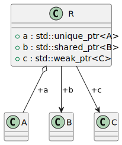

# t00007 - Smart pointers
## Config
```yaml
compilation_database_dir: ..
output_directory: puml
diagrams:
  t00007_class:
    type: class
    glob:
      - ../../tests/t00007/t00007.cc
    using_namespace:
      - clanguml::t00007
    include:
      namespaces:
        - clanguml::t00007

```
## Source code
File t00007.cc
```cpp
#include <memory>

namespace clanguml {
namespace t00007 {
class A { };

class B { };

class C { };

class R {
public:
    std::unique_ptr<A> a;
    std::shared_ptr<B> b;
    std::weak_ptr<C> c;
};
} // namespace t00007
} // namespace clanguml

```
## Generated UML diagrams

## Generated JSON models
```json
{
  "diagram_type": "class",
  "elements": [
    {
      "bases": [],
      "display_name": "clanguml::t00007::A",
      "id": "98876622534017019",
      "is_abstract": false,
      "is_nested": false,
      "is_struct": false,
      "is_template": false,
      "is_union": false,
      "members": [],
      "methods": [],
      "name": "A",
      "namespace": "clanguml::t00007",
      "source_location": {
        "column": 7,
        "file": "../../tests/t00007/t00007.cc",
        "line": 5,
        "translation_unit": "../../tests/t00007/t00007.cc"
      },
      "template_parameters": [],
      "type": "class"
    },
    {
      "bases": [],
      "display_name": "clanguml::t00007::B",
      "id": "696381312773707784",
      "is_abstract": false,
      "is_nested": false,
      "is_struct": false,
      "is_template": false,
      "is_union": false,
      "members": [],
      "methods": [],
      "name": "B",
      "namespace": "clanguml::t00007",
      "source_location": {
        "column": 7,
        "file": "../../tests/t00007/t00007.cc",
        "line": 7,
        "translation_unit": "../../tests/t00007/t00007.cc"
      },
      "template_parameters": [],
      "type": "class"
    },
    {
      "bases": [],
      "display_name": "clanguml::t00007::C",
      "id": "972031178679364068",
      "is_abstract": false,
      "is_nested": false,
      "is_struct": false,
      "is_template": false,
      "is_union": false,
      "members": [],
      "methods": [],
      "name": "C",
      "namespace": "clanguml::t00007",
      "source_location": {
        "column": 7,
        "file": "../../tests/t00007/t00007.cc",
        "line": 9,
        "translation_unit": "../../tests/t00007/t00007.cc"
      },
      "template_parameters": [],
      "type": "class"
    },
    {
      "bases": [],
      "display_name": "clanguml::t00007::R",
      "id": "66905874721300157",
      "is_abstract": false,
      "is_nested": false,
      "is_struct": false,
      "is_template": false,
      "is_union": false,
      "members": [
        {
          "access": "public",
          "is_static": false,
          "name": "a",
          "source_location": {
            "column": 24,
            "file": "../../tests/t00007/t00007.cc",
            "line": 13,
            "translation_unit": "../../tests/t00007/t00007.cc"
          },
          "type": "std::unique_ptr<A>"
        },
        {
          "access": "public",
          "is_static": false,
          "name": "b",
          "source_location": {
            "column": 24,
            "file": "../../tests/t00007/t00007.cc",
            "line": 14,
            "translation_unit": "../../tests/t00007/t00007.cc"
          },
          "type": "std::shared_ptr<B>"
        },
        {
          "access": "public",
          "is_static": false,
          "name": "c",
          "source_location": {
            "column": 22,
            "file": "../../tests/t00007/t00007.cc",
            "line": 15,
            "translation_unit": "../../tests/t00007/t00007.cc"
          },
          "type": "std::weak_ptr<C>"
        }
      ],
      "methods": [],
      "name": "R",
      "namespace": "clanguml::t00007",
      "source_location": {
        "column": 7,
        "file": "../../tests/t00007/t00007.cc",
        "line": 11,
        "translation_unit": "../../tests/t00007/t00007.cc"
      },
      "template_parameters": [],
      "type": "class"
    }
  ],
  "metadata": {
    "clang_uml_version": "0.3.8-18-gfd06d93",
    "llvm_version": "Ubuntu clang version 15.0.7",
    "schema_version": 1
  },
  "name": "t00007_class",
  "relationships": [
    {
      "access": "public",
      "destination": "98876622534017019",
      "label": "a",
      "source": "66905874721300157",
      "type": "aggregation"
    },
    {
      "access": "public",
      "destination": "696381312773707784",
      "label": "b",
      "source": "66905874721300157",
      "type": "association"
    },
    {
      "access": "public",
      "destination": "972031178679364068",
      "label": "c",
      "source": "66905874721300157",
      "type": "association"
    }
  ],
  "using_namespace": "clanguml::t00007"
}
```
