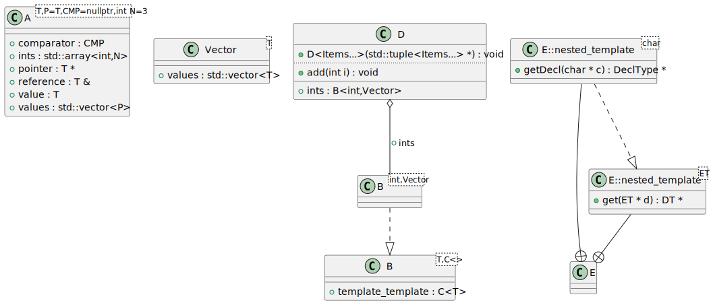

# t00008 - Template and template template relationships
## Config
```yaml
diagrams:
  t00008_class:
    type: class
    glob:
      - t00008.cc
    using_namespace: clanguml::t00008
    include:
      namespaces:
        - clanguml::t00008

```
## Source code
File `tests/t00008/t00008.cc`
```cpp
#include <array>
#include <vector>

namespace clanguml {
namespace t00008 {

using CMP = bool (*)(const int, const int);

template <typename T, typename P = T, CMP = nullptr, int N = 3> class A {
public:
    T value;
    T *pointer;
    T &reference;
    std::vector<P> values;
    std::array<int, N> ints;

    CMP comparator;
};

template <typename T> struct Vector {
    std::vector<T> values;
};

template <typename T, template <typename> typename C> struct B {
    C<T> template_template;
};

struct D {
    B<int, Vector> ints;

    template <typename... Items> D(std::tuple<Items...> * /*items*/) { }

    void add(int i) { ints.template_template.values.push_back(i); }
};

struct E {
    template <typename ET> struct nested_template {
        using DT = ET;

        static DT *get(ET *d) { return d; }
    };
};

template <> struct E::nested_template<char> {
    using DeclType = char;

    static DeclType *getDecl(char *c) { return c; }
};

} // namespace t00008
} // namespace clanguml

```
## Generated PlantUML diagrams

## Generated Mermaid diagrams

## Generated JSON models
```json
{
  "diagram_type": "class",
  "elements": [
    {
      "bases": [],
      "display_name": "A<T,P=T,CMP=nullptr,int N=3>",
      "id": "18348137047180305042",
      "is_abstract": false,
      "is_nested": false,
      "is_struct": false,
      "is_template": true,
      "is_union": false,
      "members": [
        {
          "access": "public",
          "is_static": false,
          "name": "value",
          "source_location": {
            "column": 7,
            "file": "t00008.cc",
            "line": 11,
            "translation_unit": "t00008.cc"
          },
          "type": "T"
        },
        {
          "access": "public",
          "is_static": false,
          "name": "pointer",
          "source_location": {
            "column": 8,
            "file": "t00008.cc",
            "line": 12,
            "translation_unit": "t00008.cc"
          },
          "type": "T *"
        },
        {
          "access": "public",
          "is_static": false,
          "name": "reference",
          "source_location": {
            "column": 8,
            "file": "t00008.cc",
            "line": 13,
            "translation_unit": "t00008.cc"
          },
          "type": "T &"
        },
        {
          "access": "public",
          "is_static": false,
          "name": "values",
          "source_location": {
            "column": 20,
            "file": "t00008.cc",
            "line": 14,
            "translation_unit": "t00008.cc"
          },
          "type": "std::vector<P>"
        },
        {
          "access": "public",
          "is_static": false,
          "name": "ints",
          "source_location": {
            "column": 24,
            "file": "t00008.cc",
            "line": 15,
            "translation_unit": "t00008.cc"
          },
          "type": "std::array<int,N>"
        },
        {
          "access": "public",
          "is_static": false,
          "name": "comparator",
          "source_location": {
            "column": 9,
            "file": "t00008.cc",
            "line": 17,
            "translation_unit": "t00008.cc"
          },
          "type": "CMP"
        }
      ],
      "methods": [],
      "name": "A",
      "namespace": "clanguml::t00008",
      "source_location": {
        "column": 71,
        "file": "t00008.cc",
        "line": 9,
        "translation_unit": "t00008.cc"
      },
      "template_parameters": [
        {
          "is_variadic": false,
          "kind": "template_type",
          "name": "T",
          "template_parameters": []
        },
        {
          "default": "T",
          "is_variadic": false,
          "kind": "template_type",
          "name": "P",
          "template_parameters": []
        },
        {
          "default": "nullptr",
          "is_variadic": false,
          "kind": "non_type_template",
          "template_parameters": [],
          "type": "CMP"
        },
        {
          "default": "3",
          "is_variadic": false,
          "kind": "non_type_template",
          "name": "N",
          "template_parameters": [],
          "type": "int"
        }
      ],
      "type": "class"
    },
    {
      "bases": [],
      "display_name": "Vector<T>",
      "id": "13419256118741442489",
      "is_abstract": false,
      "is_nested": false,
      "is_struct": true,
      "is_template": true,
      "is_union": false,
      "members": [
        {
          "access": "public",
          "is_static": false,
          "name": "values",
          "source_location": {
            "column": 20,
            "file": "t00008.cc",
            "line": 21,
            "translation_unit": "t00008.cc"
          },
          "type": "std::vector<T>"
        }
      ],
      "methods": [],
      "name": "Vector",
      "namespace": "clanguml::t00008",
      "source_location": {
        "column": 30,
        "file": "t00008.cc",
        "line": 20,
        "translation_unit": "t00008.cc"
      },
      "template_parameters": [
        {
          "is_variadic": false,
          "kind": "template_type",
          "name": "T",
          "template_parameters": []
        }
      ],
      "type": "class"
    },
    {
      "bases": [],
      "display_name": "B<T,C<>>",
      "id": "15748606021494945899",
      "is_abstract": false,
      "is_nested": false,
      "is_struct": true,
      "is_template": true,
      "is_union": false,
      "members": [
        {
          "access": "public",
          "is_static": false,
          "name": "template_template",
          "source_location": {
            "column": 10,
            "file": "t00008.cc",
            "line": 25,
            "translation_unit": "t00008.cc"
          },
          "type": "C<T>"
        }
      ],
      "methods": [],
      "name": "B",
      "namespace": "clanguml::t00008",
      "source_location": {
        "column": 62,
        "file": "t00008.cc",
        "line": 24,
        "translation_unit": "t00008.cc"
      },
      "template_parameters": [
        {
          "is_variadic": false,
          "kind": "template_type",
          "name": "T",
          "template_parameters": []
        },
        {
          "is_variadic": false,
          "kind": "template_template_type",
          "name": "C<>",
          "template_parameters": []
        }
      ],
      "type": "class"
    },
    {
      "bases": [],
      "display_name": "B<int,Vector>",
      "id": "11593091325657631773",
      "is_abstract": false,
      "is_nested": false,
      "is_struct": false,
      "is_template": true,
      "is_union": false,
      "members": [],
      "methods": [],
      "name": "B",
      "namespace": "clanguml::t00008",
      "source_location": {
        "column": 62,
        "file": "t00008.cc",
        "line": 24,
        "translation_unit": "t00008.cc"
      },
      "template_parameters": [
        {
          "is_variadic": false,
          "kind": "argument",
          "template_parameters": [],
          "type": "int"
        },
        {
          "is_variadic": false,
          "kind": "template_type",
          "name": "clanguml::t00008::Vector",
          "template_parameters": []
        }
      ],
      "type": "class"
    },
    {
      "bases": [],
      "display_name": "D",
      "id": "12499174870531358858",
      "is_abstract": false,
      "is_nested": false,
      "is_struct": true,
      "is_template": false,
      "is_union": false,
      "members": [
        {
          "access": "public",
          "is_static": false,
          "name": "ints",
          "source_location": {
            "column": 20,
            "file": "t00008.cc",
            "line": 29,
            "translation_unit": "t00008.cc"
          },
          "type": "B<int,Vector>"
        }
      ],
      "methods": [
        {
          "access": "public",
          "display_name": "add",
          "is_const": false,
          "is_consteval": false,
          "is_constexpr": false,
          "is_constructor": false,
          "is_copy_assignment": false,
          "is_coroutine": false,
          "is_defaulted": false,
          "is_deleted": false,
          "is_move_assignment": false,
          "is_noexcept": false,
          "is_operator": false,
          "is_pure_virtual": false,
          "is_static": false,
          "is_virtual": false,
          "name": "add",
          "parameters": [
            {
              "name": "i",
              "type": "int"
            }
          ],
          "source_location": {
            "column": 10,
            "file": "t00008.cc",
            "line": 33,
            "translation_unit": "t00008.cc"
          },
          "template_parameters": [],
          "type": "void"
        },
        {
          "access": "public",
          "display_name": "D<Items...>",
          "is_const": false,
          "is_consteval": false,
          "is_constexpr": false,
          "is_constructor": true,
          "is_copy_assignment": false,
          "is_coroutine": false,
          "is_defaulted": false,
          "is_deleted": false,
          "is_move_assignment": false,
          "is_noexcept": false,
          "is_operator": false,
          "is_pure_virtual": false,
          "is_static": false,
          "is_virtual": false,
          "name": "D",
          "parameters": [
            {
              "name": "",
              "type": "std::tuple<Items...> *"
            }
          ],
          "template_parameters": [
            {
              "is_variadic": true,
              "kind": "template_type",
              "name": "Items...",
              "template_parameters": []
            }
          ],
          "type": "void"
        }
      ],
      "name": "D",
      "namespace": "clanguml::t00008",
      "source_location": {
        "column": 8,
        "file": "t00008.cc",
        "line": 28,
        "translation_unit": "t00008.cc"
      },
      "template_parameters": [],
      "type": "class"
    },
    {
      "bases": [],
      "display_name": "E",
      "id": "14301267656419448926",
      "is_abstract": false,
      "is_nested": false,
      "is_struct": true,
      "is_template": false,
      "is_union": false,
      "members": [],
      "methods": [],
      "name": "E",
      "namespace": "clanguml::t00008",
      "source_location": {
        "column": 8,
        "file": "t00008.cc",
        "line": 36,
        "translation_unit": "t00008.cc"
      },
      "template_parameters": [],
      "type": "class"
    },
    {
      "bases": [],
      "display_name": "E::nested_template<ET>",
      "id": "12395353627920519248",
      "is_abstract": false,
      "is_nested": true,
      "is_struct": true,
      "is_template": true,
      "is_union": false,
      "members": [],
      "methods": [
        {
          "access": "public",
          "display_name": "get",
          "is_const": false,
          "is_consteval": false,
          "is_constexpr": false,
          "is_constructor": false,
          "is_copy_assignment": false,
          "is_coroutine": false,
          "is_defaulted": false,
          "is_deleted": false,
          "is_move_assignment": false,
          "is_noexcept": false,
          "is_operator": false,
          "is_pure_virtual": false,
          "is_static": true,
          "is_virtual": false,
          "name": "get",
          "parameters": [
            {
              "name": "d",
              "type": "ET *"
            }
          ],
          "source_location": {
            "column": 20,
            "file": "t00008.cc",
            "line": 40,
            "translation_unit": "t00008.cc"
          },
          "template_parameters": [],
          "type": "DT *"
        }
      ],
      "name": "E::nested_template",
      "namespace": "clanguml::t00008",
      "source_location": {
        "column": 35,
        "file": "t00008.cc",
        "line": 37,
        "translation_unit": "t00008.cc"
      },
      "template_parameters": [
        {
          "is_variadic": false,
          "kind": "template_type",
          "name": "ET",
          "template_parameters": []
        }
      ],
      "type": "class"
    },
    {
      "bases": [],
      "display_name": "E::nested_template<char>",
      "id": "269096719176302663",
      "is_abstract": false,
      "is_nested": true,
      "is_struct": true,
      "is_template": true,
      "is_union": false,
      "members": [],
      "methods": [
        {
          "access": "public",
          "display_name": "getDecl",
          "is_const": false,
          "is_consteval": false,
          "is_constexpr": false,
          "is_constructor": false,
          "is_copy_assignment": false,
          "is_coroutine": false,
          "is_defaulted": false,
          "is_deleted": false,
          "is_move_assignment": false,
          "is_noexcept": false,
          "is_operator": false,
          "is_pure_virtual": false,
          "is_static": true,
          "is_virtual": false,
          "name": "getDecl",
          "parameters": [
            {
              "name": "c",
              "type": "char *"
            }
          ],
          "source_location": {
            "column": 22,
            "file": "t00008.cc",
            "line": 47,
            "translation_unit": "t00008.cc"
          },
          "template_parameters": [],
          "type": "DeclType *"
        }
      ],
      "name": "E::nested_template",
      "namespace": "clanguml::t00008",
      "source_location": {
        "column": 23,
        "file": "t00008.cc",
        "line": 44,
        "translation_unit": "t00008.cc"
      },
      "template_parameters": [
        {
          "is_variadic": false,
          "kind": "argument",
          "template_parameters": [],
          "type": "char"
        }
      ],
      "type": "class"
    }
  ],
  "name": "t00008_class",
  "package_type": "namespace",
  "relationships": [
    {
      "access": "public",
      "destination": "15748606021494945899",
      "source": "11593091325657631773",
      "type": "instantiation"
    },
    {
      "access": "public",
      "destination": "11593091325657631773",
      "label": "ints",
      "source": "12499174870531358858",
      "type": "aggregation"
    },
    {
      "access": "public",
      "destination": "14301267656419448926",
      "source": "12395353627920519248",
      "type": "containment"
    },
    {
      "access": "public",
      "destination": "14301267656419448926",
      "source": "269096719176302663",
      "type": "containment"
    },
    {
      "access": "public",
      "destination": "12395353627920519248",
      "source": "269096719176302663",
      "type": "instantiation"
    }
  ],
  "using_namespace": "clanguml::t00008"
}
```
## Generated GraphML models
```xml
<?xml version="1.0"?>
<graphml xmlns="http://graphml.graphdrawing.org/xmlns" xmlns:xsi="http://www.w3.org/2001/XMLSchema-instance" xsi:schemaLocation="http://graphml.graphdrawing.org/xmlns http://graphml.graphdrawing.org/xmlns/1.0/graphml.xsd">
 <key attr.name="id" attr.type="string" for="graph" id="gd0" />
 <key attr.name="diagram_type" attr.type="string" for="graph" id="gd1" />
 <key attr.name="name" attr.type="string" for="graph" id="gd2" />
 <key attr.name="using_namespace" attr.type="string" for="graph" id="gd3" />
 <key attr.name="id" attr.type="string" for="node" id="nd0" />
 <key attr.name="type" attr.type="string" for="node" id="nd1" />
 <key attr.name="name" attr.type="string" for="node" id="nd2" />
 <key attr.name="stereotype" attr.type="string" for="node" id="nd3" />
 <key attr.name="url" attr.type="string" for="node" id="nd4" />
 <key attr.name="tooltip" attr.type="string" for="node" id="nd5" />
 <key attr.name="is_template" attr.type="boolean" for="node" id="nd6" />
 <key attr.name="type" attr.type="string" for="edge" id="ed0" />
 <key attr.name="access" attr.type="string" for="edge" id="ed1" />
 <key attr.name="label" attr.type="string" for="edge" id="ed2" />
 <key attr.name="url" attr.type="string" for="edge" id="ed3" />
 <graph id="g0" edgedefault="directed" parse.nodeids="canonical" parse.edgeids="canonical" parse.order="nodesfirst">
  <data key="gd3">clanguml::t00008</data>
  <node id="n0">
   <data key="nd1">class</data>
   <data key="nd2"><![CDATA[A<T,P=T,CMP=nullptr,int N=3>]]></data>
   <data key="nd6">true</data>
   <data key="nd4">https://github.com/bkryza/clang-uml/blob/ca93ebc700c4d8ac5504d33adbb899f44e90a1a4/tests/t00008/t00008.cc#L9</data>
   <data key="nd5">A</data>
  </node>
  <node id="n1">
   <data key="nd1">class</data>
   <data key="nd2"><![CDATA[Vector<T>]]></data>
   <data key="nd6">true</data>
   <data key="nd4">https://github.com/bkryza/clang-uml/blob/ca93ebc700c4d8ac5504d33adbb899f44e90a1a4/tests/t00008/t00008.cc#L20</data>
   <data key="nd5">Vector</data>
  </node>
  <node id="n2">
   <data key="nd1">class</data>
   <data key="nd2"><![CDATA[B<T,C<>>]]></data>
   <data key="nd6">true</data>
   <data key="nd4">https://github.com/bkryza/clang-uml/blob/ca93ebc700c4d8ac5504d33adbb899f44e90a1a4/tests/t00008/t00008.cc#L24</data>
   <data key="nd5">B</data>
  </node>
  <node id="n3">
   <data key="nd1">class</data>
   <data key="nd2"><![CDATA[B<int,Vector>]]></data>
   <data key="nd6">true</data>
   <data key="nd4">https://github.com/bkryza/clang-uml/blob/ca93ebc700c4d8ac5504d33adbb899f44e90a1a4/tests/t00008/t00008.cc#L24</data>
   <data key="nd5">B</data>
  </node>
  <node id="n4">
   <data key="nd1">class</data>
   <data key="nd2"><![CDATA[D]]></data>
   <data key="nd6">false</data>
   <data key="nd4">https://github.com/bkryza/clang-uml/blob/ca93ebc700c4d8ac5504d33adbb899f44e90a1a4/tests/t00008/t00008.cc#L28</data>
   <data key="nd5">D</data>
  </node>
  <node id="n5">
   <data key="nd1">class</data>
   <data key="nd2"><![CDATA[E]]></data>
   <data key="nd6">false</data>
   <data key="nd4">https://github.com/bkryza/clang-uml/blob/ca93ebc700c4d8ac5504d33adbb899f44e90a1a4/tests/t00008/t00008.cc#L36</data>
   <data key="nd5">E</data>
  </node>
  <node id="n6">
   <data key="nd1">class</data>
   <data key="nd2"><![CDATA[E::nested_template<ET>]]></data>
   <data key="nd6">true</data>
   <data key="nd4">https://github.com/bkryza/clang-uml/blob/ca93ebc700c4d8ac5504d33adbb899f44e90a1a4/tests/t00008/t00008.cc#L37</data>
   <data key="nd5">E##nested_template</data>
  </node>
  <node id="n7">
   <data key="nd1">class</data>
   <data key="nd2"><![CDATA[E::nested_template<char>]]></data>
   <data key="nd6">true</data>
   <data key="nd4">https://github.com/bkryza/clang-uml/blob/ca93ebc700c4d8ac5504d33adbb899f44e90a1a4/tests/t00008/t00008.cc#L44</data>
   <data key="nd5">E##nested_template</data>
  </node>
  <edge id="e0" source="n3" target="n2">
   <data key="ed0">instantiation</data>
   <data key="ed1">public</data>
  </edge>
  <edge id="e1" source="n4" target="n3">
   <data key="ed0">aggregation</data>
   <data key="ed2">ints</data>
   <data key="ed1">public</data>
  </edge>
  <edge id="e2" source="n6" target="n5">
   <data key="ed0">containment</data>
   <data key="ed1">public</data>
  </edge>
  <edge id="e3" source="n7" target="n5">
   <data key="ed0">containment</data>
   <data key="ed1">public</data>
  </edge>
  <edge id="e4" source="n7" target="n6">
   <data key="ed0">instantiation</data>
   <data key="ed1">public</data>
  </edge>
 </graph>
</graphml>

```
