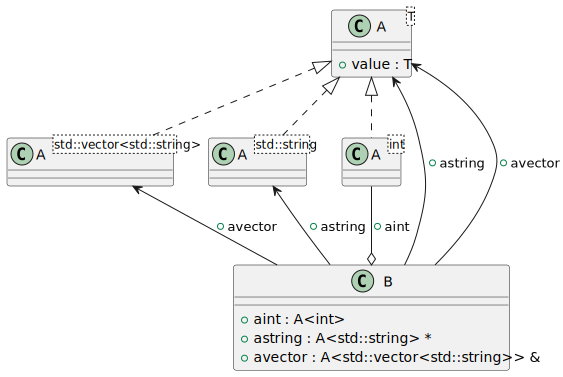

# t00009 - Template instantiation
## Config
```yaml
diagrams:
  t00009_class:
    type: class
    glob:
      - t00009.cc
    using_namespace: clanguml::t00009
    plantuml:
      style:
        instantiation: up
        association: up
        aggregation: up
    include:
      namespaces:
        - clanguml::t00009

```
## Source code
File `tests/t00009/t00009.cc`
```cpp
#include <string>
#include <vector>

namespace clanguml {
namespace t00009 {

template <typename T> class A {
public:
    T value;
};

class B {
public:
    A<int> aint;
    A<std::string> *astring;
    A<std::vector<std::string>> &avector;
};
} // namespace t00009
} // namespace clanguml

```
## Generated PlantUML diagrams

## Generated Mermaid diagrams

## Generated JSON models
```json
{
  "diagram_type": "class",
  "elements": [
    {
      "bases": [],
      "display_name": "A<T>",
      "id": "412228989111660105",
      "is_abstract": false,
      "is_nested": false,
      "is_struct": false,
      "is_template": true,
      "is_union": false,
      "members": [
        {
          "access": "public",
          "is_static": false,
          "name": "value",
          "source_location": {
            "column": 7,
            "file": "t00009.cc",
            "line": 9,
            "translation_unit": "t00009.cc"
          },
          "type": "T"
        }
      ],
      "methods": [],
      "name": "A",
      "namespace": "clanguml::t00009",
      "source_location": {
        "column": 29,
        "file": "t00009.cc",
        "line": 7,
        "translation_unit": "t00009.cc"
      },
      "template_parameters": [
        {
          "is_variadic": false,
          "kind": "template_type",
          "name": "T",
          "template_parameters": []
        }
      ],
      "type": "class"
    },
    {
      "bases": [],
      "display_name": "A<int>",
      "id": "1894387438043499",
      "is_abstract": false,
      "is_nested": false,
      "is_struct": false,
      "is_template": true,
      "is_union": false,
      "members": [],
      "methods": [],
      "name": "A",
      "namespace": "clanguml::t00009",
      "source_location": {
        "column": 29,
        "file": "t00009.cc",
        "line": 7,
        "translation_unit": "t00009.cc"
      },
      "template_parameters": [
        {
          "is_variadic": false,
          "kind": "argument",
          "template_parameters": [],
          "type": "int"
        }
      ],
      "type": "class"
    },
    {
      "bases": [],
      "display_name": "A<std::string>",
      "id": "1340793233843139195",
      "is_abstract": false,
      "is_nested": false,
      "is_struct": false,
      "is_template": true,
      "is_union": false,
      "members": [],
      "methods": [],
      "name": "A",
      "namespace": "clanguml::t00009",
      "source_location": {
        "column": 29,
        "file": "t00009.cc",
        "line": 7,
        "translation_unit": "t00009.cc"
      },
      "template_parameters": [
        {
          "is_variadic": false,
          "kind": "argument",
          "template_parameters": [],
          "type": "std::string"
        }
      ],
      "type": "class"
    },
    {
      "bases": [],
      "display_name": "A<std::vector<std::string>>",
      "id": "1370808797762248850",
      "is_abstract": false,
      "is_nested": false,
      "is_struct": false,
      "is_template": true,
      "is_union": false,
      "members": [],
      "methods": [],
      "name": "A",
      "namespace": "clanguml::t00009",
      "source_location": {
        "column": 29,
        "file": "t00009.cc",
        "line": 7,
        "translation_unit": "t00009.cc"
      },
      "template_parameters": [
        {
          "is_variadic": false,
          "kind": "argument",
          "template_parameters": [
            {
              "is_variadic": false,
              "kind": "argument",
              "template_parameters": [],
              "type": "std::string"
            }
          ],
          "type": "std::vector"
        }
      ],
      "type": "class"
    },
    {
      "bases": [],
      "display_name": "B",
      "id": "176239714450247310",
      "is_abstract": false,
      "is_nested": false,
      "is_struct": false,
      "is_template": false,
      "is_union": false,
      "members": [
        {
          "access": "public",
          "is_static": false,
          "name": "aint",
          "source_location": {
            "column": 12,
            "file": "t00009.cc",
            "line": 14,
            "translation_unit": "t00009.cc"
          },
          "type": "A<int>"
        },
        {
          "access": "public",
          "is_static": false,
          "name": "astring",
          "source_location": {
            "column": 21,
            "file": "t00009.cc",
            "line": 15,
            "translation_unit": "t00009.cc"
          },
          "type": "A<std::string> *"
        },
        {
          "access": "public",
          "is_static": false,
          "name": "avector",
          "source_location": {
            "column": 34,
            "file": "t00009.cc",
            "line": 16,
            "translation_unit": "t00009.cc"
          },
          "type": "A<std::vector<std::string>> &"
        }
      ],
      "methods": [],
      "name": "B",
      "namespace": "clanguml::t00009",
      "source_location": {
        "column": 7,
        "file": "t00009.cc",
        "line": 12,
        "translation_unit": "t00009.cc"
      },
      "template_parameters": [],
      "type": "class"
    }
  ],
  "name": "t00009_class",
  "package_type": "namespace",
  "relationships": [
    {
      "access": "public",
      "destination": "412228989111660105",
      "source": "1894387438043499",
      "type": "instantiation"
    },
    {
      "access": "public",
      "destination": "412228989111660105",
      "source": "1340793233843139195",
      "type": "instantiation"
    },
    {
      "access": "public",
      "destination": "412228989111660105",
      "source": "1370808797762248850",
      "type": "instantiation"
    },
    {
      "access": "public",
      "destination": "1894387438043499",
      "label": "aint",
      "source": "176239714450247310",
      "type": "aggregation"
    },
    {
      "access": "public",
      "destination": "1340793233843139195",
      "label": "astring",
      "source": "176239714450247310",
      "type": "association"
    },
    {
      "access": "public",
      "destination": "412228989111660105",
      "label": "astring",
      "source": "176239714450247310",
      "type": "association"
    },
    {
      "access": "public",
      "destination": "1370808797762248850",
      "label": "avector",
      "source": "176239714450247310",
      "type": "association"
    },
    {
      "access": "public",
      "destination": "412228989111660105",
      "label": "avector",
      "source": "176239714450247310",
      "type": "association"
    }
  ],
  "using_namespace": "clanguml::t00009"
}
```
