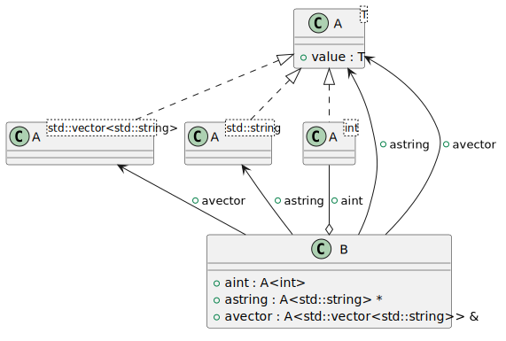

# t00009 - Template instantiation
## Config
```yaml
diagrams:
  t00009_class:
    type: class
    glob:
      - t00009.cc
    using_namespace: clanguml::t00009
    plantuml:
      style:
        instantiation: up
        association: up
        aggregation: up
    include:
      namespaces:
        - clanguml::t00009

```
## Source code
File `tests/t00009/t00009.cc`
```cpp
#include <string>
#include <vector>

namespace clanguml {
namespace t00009 {

template <typename T> class A {
public:
    T value;
};

class B {
public:
    A<int> aint;
    A<std::string> *astring;
    A<std::vector<std::string>> &avector;
};
} // namespace t00009
} // namespace clanguml

```
## Generated PlantUML diagrams

## Generated Mermaid diagrams

## Generated JSON models
```json
{
  "diagram_type": "class",
  "elements": [
    {
      "bases": [],
      "display_name": "A<T>",
      "id": "13941824339013392485",
      "is_abstract": false,
      "is_nested": false,
      "is_struct": false,
      "is_template": true,
      "is_union": false,
      "members": [
        {
          "access": "public",
          "is_static": false,
          "name": "value",
          "source_location": {
            "column": 7,
            "file": "t00009.cc",
            "line": 9,
            "translation_unit": "t00009.cc"
          },
          "type": "T"
        }
      ],
      "methods": [],
      "name": "A",
      "namespace": "clanguml::t00009",
      "source_location": {
        "column": 29,
        "file": "t00009.cc",
        "line": 7,
        "translation_unit": "t00009.cc"
      },
      "template_parameters": [
        {
          "is_variadic": false,
          "kind": "template_type",
          "name": "T",
          "template_parameters": []
        }
      ],
      "type": "class"
    },
    {
      "bases": [],
      "display_name": "A<int>",
      "id": "15187736778991125647",
      "is_abstract": false,
      "is_nested": false,
      "is_struct": false,
      "is_template": true,
      "is_union": false,
      "members": [],
      "methods": [],
      "name": "A",
      "namespace": "clanguml::t00009",
      "source_location": {
        "column": 12,
        "file": "t00009.cc",
        "line": 14,
        "translation_unit": "t00009.cc"
      },
      "template_parameters": [
        {
          "is_variadic": false,
          "kind": "argument",
          "template_parameters": [],
          "type": "int"
        }
      ],
      "type": "class"
    },
    {
      "bases": [],
      "display_name": "A<std::string>",
      "id": "8305570210168989962",
      "is_abstract": false,
      "is_nested": false,
      "is_struct": false,
      "is_template": true,
      "is_union": false,
      "members": [],
      "methods": [],
      "name": "A",
      "namespace": "clanguml::t00009",
      "source_location": {
        "column": 21,
        "file": "t00009.cc",
        "line": 15,
        "translation_unit": "t00009.cc"
      },
      "template_parameters": [
        {
          "is_variadic": false,
          "kind": "argument",
          "template_parameters": [],
          "type": "std::string"
        }
      ],
      "type": "class"
    },
    {
      "bases": [],
      "display_name": "A<std::vector<std::string>>",
      "id": "4780385186323599179",
      "is_abstract": false,
      "is_nested": false,
      "is_struct": false,
      "is_template": true,
      "is_union": false,
      "members": [],
      "methods": [],
      "name": "A",
      "namespace": "clanguml::t00009",
      "source_location": {
        "column": 34,
        "file": "t00009.cc",
        "line": 16,
        "translation_unit": "t00009.cc"
      },
      "template_parameters": [
        {
          "is_variadic": false,
          "kind": "argument",
          "template_parameters": [
            {
              "is_variadic": false,
              "kind": "argument",
              "template_parameters": [],
              "type": "std::string"
            }
          ],
          "type": "std::vector"
        }
      ],
      "type": "class"
    },
    {
      "bases": [],
      "display_name": "B",
      "id": "5324945054280890703",
      "is_abstract": false,
      "is_nested": false,
      "is_struct": false,
      "is_template": false,
      "is_union": false,
      "members": [
        {
          "access": "public",
          "is_static": false,
          "name": "aint",
          "source_location": {
            "column": 12,
            "file": "t00009.cc",
            "line": 14,
            "translation_unit": "t00009.cc"
          },
          "type": "A<int>"
        },
        {
          "access": "public",
          "is_static": false,
          "name": "astring",
          "source_location": {
            "column": 21,
            "file": "t00009.cc",
            "line": 15,
            "translation_unit": "t00009.cc"
          },
          "type": "A<std::string> *"
        },
        {
          "access": "public",
          "is_static": false,
          "name": "avector",
          "source_location": {
            "column": 34,
            "file": "t00009.cc",
            "line": 16,
            "translation_unit": "t00009.cc"
          },
          "type": "A<std::vector<std::string>> &"
        }
      ],
      "methods": [],
      "name": "B",
      "namespace": "clanguml::t00009",
      "source_location": {
        "column": 7,
        "file": "t00009.cc",
        "line": 12,
        "translation_unit": "t00009.cc"
      },
      "template_parameters": [],
      "type": "class"
    }
  ],
  "name": "t00009_class",
  "package_type": "namespace",
  "relationships": [
    {
      "access": "public",
      "destination": "13941824339013392485",
      "source": "15187736778991125647",
      "type": "instantiation"
    },
    {
      "access": "public",
      "destination": "13941824339013392485",
      "source": "8305570210168989962",
      "type": "instantiation"
    },
    {
      "access": "public",
      "destination": "13941824339013392485",
      "source": "4780385186323599179",
      "type": "instantiation"
    },
    {
      "access": "public",
      "destination": "15187736778991125647",
      "label": "aint",
      "source": "5324945054280890703",
      "type": "aggregation"
    },
    {
      "access": "public",
      "destination": "8305570210168989962",
      "label": "astring",
      "source": "5324945054280890703",
      "type": "association"
    },
    {
      "access": "public",
      "destination": "13941824339013392485",
      "label": "astring",
      "source": "5324945054280890703",
      "type": "association"
    },
    {
      "access": "public",
      "destination": "4780385186323599179",
      "label": "avector",
      "source": "5324945054280890703",
      "type": "association"
    },
    {
      "access": "public",
      "destination": "13941824339013392485",
      "label": "avector",
      "source": "5324945054280890703",
      "type": "association"
    }
  ],
  "using_namespace": "clanguml::t00009"
}
```
## Generated GraphML models
```xml
<?xml version="1.0"?>
<graphml xmlns="http://graphml.graphdrawing.org/xmlns" xmlns:xsi="http://www.w3.org/2001/XMLSchema-instance" xsi:schemaLocation="http://graphml.graphdrawing.org/xmlns http://graphml.graphdrawing.org/xmlns/1.0/graphml.xsd">
 <key attr.name="id" attr.type="string" for="graph" id="gd0" />
 <key attr.name="diagram_type" attr.type="string" for="graph" id="gd1" />
 <key attr.name="name" attr.type="string" for="graph" id="gd2" />
 <key attr.name="using_namespace" attr.type="string" for="graph" id="gd3" />
 <key attr.name="id" attr.type="string" for="node" id="nd0" />
 <key attr.name="type" attr.type="string" for="node" id="nd1" />
 <key attr.name="name" attr.type="string" for="node" id="nd2" />
 <key attr.name="stereotype" attr.type="string" for="node" id="nd3" />
 <key attr.name="url" attr.type="string" for="node" id="nd4" />
 <key attr.name="tooltip" attr.type="string" for="node" id="nd5" />
 <key attr.name="is_template" attr.type="boolean" for="node" id="nd6" />
 <key attr.name="type" attr.type="string" for="edge" id="ed0" />
 <key attr.name="access" attr.type="string" for="edge" id="ed1" />
 <key attr.name="label" attr.type="string" for="edge" id="ed2" />
 <key attr.name="url" attr.type="string" for="edge" id="ed3" />
 <graph id="g0" edgedefault="directed" parse.nodeids="canonical" parse.edgeids="canonical" parse.order="nodesfirst">
  <data key="gd3">clanguml::t00009</data>
  <node id="n0">
   <data key="nd1">class</data>
   <data key="nd2"><![CDATA[A<T>]]></data>
   <data key="nd6">true</data>
  </node>
  <node id="n1">
   <data key="nd1">class</data>
   <data key="nd2"><![CDATA[A<int>]]></data>
   <data key="nd6">true</data>
  </node>
  <node id="n2">
   <data key="nd1">class</data>
   <data key="nd2"><![CDATA[A<std::string>]]></data>
   <data key="nd6">true</data>
  </node>
  <node id="n3">
   <data key="nd1">class</data>
   <data key="nd2"><![CDATA[A<std::vector<std::string>>]]></data>
   <data key="nd6">true</data>
  </node>
  <node id="n4">
   <data key="nd1">class</data>
   <data key="nd2"><![CDATA[B]]></data>
   <data key="nd6">false</data>
  </node>
  <edge id="e0" source="n1" target="n0">
   <data key="ed0">instantiation</data>
   <data key="ed1">public</data>
  </edge>
  <edge id="e1" source="n2" target="n0">
   <data key="ed0">instantiation</data>
   <data key="ed1">public</data>
  </edge>
  <edge id="e2" source="n3" target="n0">
   <data key="ed0">instantiation</data>
   <data key="ed1">public</data>
  </edge>
  <edge id="e3" source="n4" target="n1">
   <data key="ed0">aggregation</data>
   <data key="ed2">aint</data>
   <data key="ed1">public</data>
  </edge>
  <edge id="e4" source="n4" target="n2">
   <data key="ed0">association</data>
   <data key="ed2">astring</data>
   <data key="ed1">public</data>
  </edge>
  <edge id="e5" source="n4" target="n0">
   <data key="ed0">association</data>
   <data key="ed2">astring</data>
   <data key="ed1">public</data>
  </edge>
  <edge id="e6" source="n4" target="n3">
   <data key="ed0">association</data>
   <data key="ed2">avector</data>
   <data key="ed1">public</data>
  </edge>
  <edge id="e7" source="n4" target="n0">
   <data key="ed0">association</data>
   <data key="ed2">avector</data>
   <data key="ed1">public</data>
  </edge>
 </graph>
</graphml>

```
