# t00010 - Basic template instantiation
## Config
```yaml
diagrams:
  t00010_class:
    type: class
    glob:
      - t00010.cc
    using_namespace: clanguml::t00010
    include:
      namespaces:
        - clanguml::t00010

```
## Source code
File `tests/t00010/t00010.cc`
```cpp
#include <string>
#include <vector>

namespace clanguml {
namespace t00010 {

template <typename T, typename P> class A {
public:
    T first;
    P second;
};

template <typename T> class B {
public:
    A<T, std::string> astring;
};

class C {
public:
    B<int> aintstring;
};
} // namespace t00010
} // namespace clanguml

```
## Generated PlantUML diagrams

## Generated Mermaid diagrams

## Generated JSON models
```json
{
  "diagram_type": "class",
  "elements": [
    {
      "bases": [],
      "display_name": "A<T,P>",
      "id": "17777732951236112797",
      "is_abstract": false,
      "is_nested": false,
      "is_struct": false,
      "is_template": true,
      "is_union": false,
      "members": [
        {
          "access": "public",
          "is_static": false,
          "name": "first",
          "source_location": {
            "column": 7,
            "file": "t00010.cc",
            "line": 9,
            "translation_unit": "t00010.cc"
          },
          "type": "T"
        },
        {
          "access": "public",
          "is_static": false,
          "name": "second",
          "source_location": {
            "column": 7,
            "file": "t00010.cc",
            "line": 10,
            "translation_unit": "t00010.cc"
          },
          "type": "P"
        }
      ],
      "methods": [],
      "name": "A",
      "namespace": "clanguml::t00010",
      "source_location": {
        "column": 41,
        "file": "t00010.cc",
        "line": 7,
        "translation_unit": "t00010.cc"
      },
      "template_parameters": [
        {
          "is_variadic": false,
          "kind": "template_type",
          "name": "T",
          "template_parameters": []
        },
        {
          "is_variadic": false,
          "kind": "template_type",
          "name": "P",
          "template_parameters": []
        }
      ],
      "type": "class"
    },
    {
      "bases": [],
      "display_name": "A<T,std::string>",
      "id": "14892165549935322401",
      "is_abstract": false,
      "is_nested": false,
      "is_struct": false,
      "is_template": true,
      "is_union": false,
      "members": [],
      "methods": [],
      "name": "A",
      "namespace": "clanguml::t00010",
      "source_location": {
        "column": 23,
        "file": "t00010.cc",
        "line": 15,
        "translation_unit": "t00010.cc"
      },
      "template_parameters": [
        {
          "is_variadic": false,
          "kind": "template_type",
          "name": "T",
          "template_parameters": []
        },
        {
          "is_variadic": false,
          "kind": "argument",
          "template_parameters": [],
          "type": "std::string"
        }
      ],
      "type": "class"
    },
    {
      "bases": [],
      "display_name": "B<T>",
      "id": "18428891408661668669",
      "is_abstract": false,
      "is_nested": false,
      "is_struct": false,
      "is_template": true,
      "is_union": false,
      "members": [
        {
          "access": "public",
          "is_static": false,
          "name": "astring",
          "source_location": {
            "column": 23,
            "file": "t00010.cc",
            "line": 15,
            "translation_unit": "t00010.cc"
          },
          "type": "A<T,std::string>"
        }
      ],
      "methods": [],
      "name": "B",
      "namespace": "clanguml::t00010",
      "source_location": {
        "column": 29,
        "file": "t00010.cc",
        "line": 13,
        "translation_unit": "t00010.cc"
      },
      "template_parameters": [
        {
          "is_variadic": false,
          "kind": "template_type",
          "name": "T",
          "template_parameters": []
        }
      ],
      "type": "class"
    },
    {
      "bases": [],
      "display_name": "B<int>",
      "id": "11987015515847592796",
      "is_abstract": false,
      "is_nested": false,
      "is_struct": false,
      "is_template": true,
      "is_union": false,
      "members": [],
      "methods": [],
      "name": "B",
      "namespace": "clanguml::t00010",
      "source_location": {
        "column": 12,
        "file": "t00010.cc",
        "line": 20,
        "translation_unit": "t00010.cc"
      },
      "template_parameters": [
        {
          "is_variadic": false,
          "kind": "argument",
          "template_parameters": [],
          "type": "int"
        }
      ],
      "type": "class"
    },
    {
      "bases": [],
      "display_name": "C",
      "id": "15047732631751140570",
      "is_abstract": false,
      "is_nested": false,
      "is_struct": false,
      "is_template": false,
      "is_union": false,
      "members": [
        {
          "access": "public",
          "is_static": false,
          "name": "aintstring",
          "source_location": {
            "column": 12,
            "file": "t00010.cc",
            "line": 20,
            "translation_unit": "t00010.cc"
          },
          "type": "B<int>"
        }
      ],
      "methods": [],
      "name": "C",
      "namespace": "clanguml::t00010",
      "source_location": {
        "column": 7,
        "file": "t00010.cc",
        "line": 18,
        "translation_unit": "t00010.cc"
      },
      "template_parameters": [],
      "type": "class"
    }
  ],
  "name": "t00010_class",
  "package_type": "namespace",
  "relationships": [
    {
      "access": "public",
      "destination": "17777732951236112797",
      "source": "14892165549935322401",
      "type": "instantiation"
    },
    {
      "access": "public",
      "destination": "14892165549935322401",
      "label": "astring",
      "source": "18428891408661668669",
      "type": "aggregation"
    },
    {
      "access": "public",
      "destination": "18428891408661668669",
      "source": "11987015515847592796",
      "type": "instantiation"
    },
    {
      "access": "public",
      "destination": "11987015515847592796",
      "label": "aintstring",
      "source": "15047732631751140570",
      "type": "aggregation"
    }
  ],
  "using_namespace": "clanguml::t00010"
}
```
## Generated GraphML models
```xml
<?xml version="1.0"?>
<graphml xmlns="http://graphml.graphdrawing.org/xmlns" xmlns:xsi="http://www.w3.org/2001/XMLSchema-instance" xsi:schemaLocation="http://graphml.graphdrawing.org/xmlns http://graphml.graphdrawing.org/xmlns/1.0/graphml.xsd">
 <key attr.name="id" attr.type="string" for="graph" id="gd0" />
 <key attr.name="diagram_type" attr.type="string" for="graph" id="gd1" />
 <key attr.name="name" attr.type="string" for="graph" id="gd2" />
 <key attr.name="using_namespace" attr.type="string" for="graph" id="gd3" />
 <key attr.name="id" attr.type="string" for="node" id="nd0" />
 <key attr.name="type" attr.type="string" for="node" id="nd1" />
 <key attr.name="name" attr.type="string" for="node" id="nd2" />
 <key attr.name="stereotype" attr.type="string" for="node" id="nd3" />
 <key attr.name="url" attr.type="string" for="node" id="nd4" />
 <key attr.name="tooltip" attr.type="string" for="node" id="nd5" />
 <key attr.name="is_template" attr.type="boolean" for="node" id="nd6" />
 <key attr.name="type" attr.type="string" for="edge" id="ed0" />
 <key attr.name="access" attr.type="string" for="edge" id="ed1" />
 <key attr.name="label" attr.type="string" for="edge" id="ed2" />
 <key attr.name="url" attr.type="string" for="edge" id="ed3" />
 <graph id="g0" edgedefault="directed" parse.nodeids="canonical" parse.edgeids="canonical" parse.order="nodesfirst">
  <data key="gd3">clanguml::t00010</data>
  <node id="n0">
   <data key="nd1">class</data>
   <data key="nd2"><![CDATA[A<T,P>]]></data>
   <data key="nd6">true</data>
  </node>
  <node id="n1">
   <data key="nd1">class</data>
   <data key="nd2"><![CDATA[A<T,std::string>]]></data>
   <data key="nd6">true</data>
  </node>
  <node id="n2">
   <data key="nd1">class</data>
   <data key="nd2"><![CDATA[B<T>]]></data>
   <data key="nd6">true</data>
  </node>
  <node id="n3">
   <data key="nd1">class</data>
   <data key="nd2"><![CDATA[B<int>]]></data>
   <data key="nd6">true</data>
  </node>
  <node id="n4">
   <data key="nd1">class</data>
   <data key="nd2"><![CDATA[C]]></data>
   <data key="nd6">false</data>
  </node>
  <edge id="e0" source="n1" target="n0">
   <data key="ed0">instantiation</data>
   <data key="ed1">public</data>
  </edge>
  <edge id="e1" source="n2" target="n1">
   <data key="ed0">aggregation</data>
   <data key="ed2">astring</data>
   <data key="ed1">public</data>
  </edge>
  <edge id="e2" source="n3" target="n2">
   <data key="ed0">instantiation</data>
   <data key="ed1">public</data>
  </edge>
  <edge id="e3" source="n4" target="n3">
   <data key="ed0">aggregation</data>
   <data key="ed2">aintstring</data>
   <data key="ed1">public</data>
  </edge>
 </graph>
</graphml>

```
