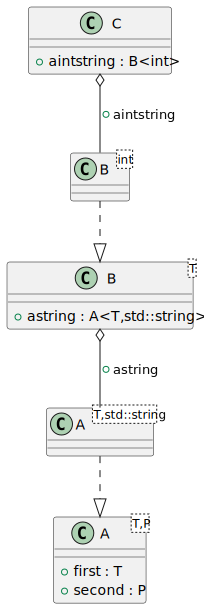

# t00010 - Basic template instantiation
## Config
```yaml
compilation_database_dir: ..
output_directory: puml
diagrams:
  t00010_class:
    type: class
    glob:
      - ../../tests/t00010/t00010.cc
    using_namespace:
      - clanguml::t00010
    include:
      namespaces:
        - clanguml::t00010

```
## Source code
File t00010.cc
```cpp
#include <string>
#include <vector>

namespace clanguml {
namespace t00010 {

template <typename T, typename P> class A {
public:
    T first;
    P second;
};

template <typename T> class B {
public:
    A<T, std::string> astring;
};

class C {
public:
    B<int> aintstring;
};
} // namespace t00010
} // namespace clanguml

```
## Generated UML diagrams

## Generated JSON models
```json
{
  "diagram_type": "class",
  "elements": [
    {
      "bases": [],
      "display_name": "clanguml::t00010::A<T,P>",
      "id": "2222216618904514099",
      "is_abstract": false,
      "is_nested": false,
      "is_struct": false,
      "is_template": true,
      "is_union": false,
      "members": [
        {
          "access": "public",
          "is_static": false,
          "name": "first",
          "source_location": {
            "file": "../../tests/t00010/t00010.cc",
            "line": 9
          },
          "type": "T"
        },
        {
          "access": "public",
          "is_static": false,
          "name": "second",
          "source_location": {
            "file": "../../tests/t00010/t00010.cc",
            "line": 10
          },
          "type": "P"
        }
      ],
      "methods": [],
      "name": "A",
      "namespace": "clanguml::t00010",
      "source_location": {
        "file": "../../tests/t00010/t00010.cc",
        "line": 7
      },
      "template_parameters": [
        {
          "is_variadic": false,
          "kind": "template_type",
          "name": "T",
          "template_parameters": []
        },
        {
          "is_variadic": false,
          "kind": "template_type",
          "name": "P",
          "template_parameters": []
        }
      ],
      "type": "class"
    },
    {
      "bases": [],
      "display_name": "clanguml::t00010::A<T,std::string>",
      "id": "1861520693741915300",
      "is_abstract": false,
      "is_nested": false,
      "is_struct": false,
      "is_template": true,
      "is_union": false,
      "members": [],
      "methods": [],
      "name": "A",
      "namespace": "clanguml::t00010",
      "source_location": {
        "file": "../../tests/t00010/t00010.cc",
        "line": 7
      },
      "template_parameters": [
        {
          "is_variadic": false,
          "kind": "template_type",
          "name": "T",
          "template_parameters": []
        },
        {
          "is_variadic": false,
          "kind": "argument",
          "template_parameters": [],
          "type": "std::string"
        }
      ],
      "type": "class"
    },
    {
      "bases": [],
      "display_name": "clanguml::t00010::B<T>",
      "id": "2303611426082708583",
      "is_abstract": false,
      "is_nested": false,
      "is_struct": false,
      "is_template": true,
      "is_union": false,
      "members": [
        {
          "access": "public",
          "is_static": false,
          "name": "astring",
          "source_location": {
            "file": "../../tests/t00010/t00010.cc",
            "line": 15
          },
          "type": "A<T,std::string>"
        }
      ],
      "methods": [],
      "name": "B",
      "namespace": "clanguml::t00010",
      "source_location": {
        "file": "../../tests/t00010/t00010.cc",
        "line": 13
      },
      "template_parameters": [
        {
          "is_variadic": false,
          "kind": "template_type",
          "name": "T",
          "template_parameters": []
        }
      ],
      "type": "class"
    },
    {
      "bases": [],
      "display_name": "clanguml::t00010::B<int>",
      "id": "1498376939480949099",
      "is_abstract": false,
      "is_nested": false,
      "is_struct": false,
      "is_template": true,
      "is_union": false,
      "members": [],
      "methods": [],
      "name": "B",
      "namespace": "clanguml::t00010",
      "source_location": {
        "file": "../../tests/t00010/t00010.cc",
        "line": 13
      },
      "template_parameters": [
        {
          "is_variadic": false,
          "kind": "argument",
          "template_parameters": [],
          "type": "int"
        }
      ],
      "type": "class"
    },
    {
      "bases": [],
      "display_name": "clanguml::t00010::C",
      "id": "1880966578968892571",
      "is_abstract": false,
      "is_nested": false,
      "is_struct": false,
      "is_template": false,
      "is_union": false,
      "members": [
        {
          "access": "public",
          "is_static": false,
          "name": "aintstring",
          "source_location": {
            "file": "../../tests/t00010/t00010.cc",
            "line": 20
          },
          "type": "B<int>"
        }
      ],
      "methods": [],
      "name": "C",
      "namespace": "clanguml::t00010",
      "source_location": {
        "file": "../../tests/t00010/t00010.cc",
        "line": 18
      },
      "template_parameters": [],
      "type": "class"
    }
  ],
  "metadata": {
    "clang_uml_version": "0.3.6-11-g75d1daa",
    "llvm_version": "Ubuntu clang version 15.0.6",
    "schema_version": 1
  },
  "name": "t00010_class",
  "relationships": [
    {
      "access": "public",
      "destination": "2222216618904514099",
      "source": "1861520693741915300",
      "type": "instantiation"
    },
    {
      "access": "public",
      "destination": "1861520693741915300",
      "label": "astring",
      "source": "2303611426082708583",
      "type": "aggregation"
    },
    {
      "access": "public",
      "destination": "2303611426082708583",
      "source": "1498376939480949099",
      "type": "instantiation"
    },
    {
      "access": "public",
      "destination": "1498376939480949099",
      "label": "aintstring",
      "source": "1880966578968892571",
      "type": "aggregation"
    }
  ],
  "using_namespace": "clanguml::t00010"
}
```
