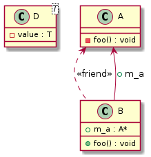

# t00011 - Friend relationships
## Config
```yaml
compilation_database_dir: ..
output_directory: puml
diagrams:
  t00011_class:
    type: class
    glob:
      - ../../tests/t00011/t00011.cc
    using_namespace:
      - clanguml::t00011
    include:
      namespaces:
        - clanguml::t00011

```
## Source code
File t00011.cc
```cpp
namespace external {
class C {
};
}

namespace clanguml {
namespace t00011 {

class B;

template <typename T> class D {
    T value;
};

class A {
private:
    void foo() {}
    friend class B;
    friend class external::C;
    // TODO
    template <typename T> friend class D;
    // TODO
    friend class D<int>;
    friend class D<A>;
};

class B {
public:
    void foo() { m_a->foo(); }
    A *m_a;
};
}
}

```
## Generated UML diagrams

