# t00011 - Friend relationships
## Config
```yaml
diagrams:
  t00011_class:
    type: class
    glob:
      - t00011.cc
    using_namespace: clanguml::t00011
    include:
      namespaces:
        - clanguml::t00011

```
## Source code
File `tests/t00011/t00011.cc`
```cpp
namespace external {
class C { };
}

namespace clanguml {
namespace t00011 {

class B;

template <typename T> class D {
    T value;
};

class A {
public:
    void foo() { }
    friend class B;
    friend class external::C;
    // TODO
    template <typename T> friend class D;
    // TODO
    friend class D<int>;
    friend class D<A>;
};

class B {
public:
    void foo() { m_a->foo(); }
    A *m_a;
};
} // namespace t00011
} // namespace clanguml

```
## Generated PlantUML diagrams

## Generated Mermaid diagrams

## Generated JSON models
```json
{
  "diagram_type": "class",
  "elements": [
    {
      "bases": [],
      "display_name": "D<T>",
      "id": "1150639902748052276",
      "is_abstract": false,
      "is_nested": false,
      "is_struct": false,
      "is_template": true,
      "is_union": false,
      "members": [
        {
          "access": "private",
          "is_static": false,
          "name": "value",
          "source_location": {
            "column": 7,
            "file": "t00011.cc",
            "line": 11,
            "translation_unit": "t00011.cc"
          },
          "type": "T"
        }
      ],
      "methods": [],
      "name": "D",
      "namespace": "clanguml::t00011",
      "source_location": {
        "column": 29,
        "file": "t00011.cc",
        "line": 10,
        "translation_unit": "t00011.cc"
      },
      "template_parameters": [
        {
          "is_variadic": false,
          "kind": "template_type",
          "name": "T",
          "template_parameters": []
        }
      ],
      "type": "class"
    },
    {
      "bases": [],
      "display_name": "A",
      "id": "1420516952857803719",
      "is_abstract": false,
      "is_nested": false,
      "is_struct": false,
      "is_template": false,
      "is_union": false,
      "members": [],
      "methods": [
        {
          "access": "public",
          "display_name": "foo",
          "is_const": false,
          "is_consteval": false,
          "is_constexpr": false,
          "is_constructor": false,
          "is_copy_assignment": false,
          "is_coroutine": false,
          "is_defaulted": false,
          "is_deleted": false,
          "is_move_assignment": false,
          "is_noexcept": false,
          "is_operator": false,
          "is_pure_virtual": false,
          "is_static": false,
          "is_virtual": false,
          "name": "foo",
          "parameters": [],
          "source_location": {
            "column": 10,
            "file": "t00011.cc",
            "line": 16,
            "translation_unit": "t00011.cc"
          },
          "template_parameters": [],
          "type": "void"
        }
      ],
      "name": "A",
      "namespace": "clanguml::t00011",
      "source_location": {
        "column": 7,
        "file": "t00011.cc",
        "line": 14,
        "translation_unit": "t00011.cc"
      },
      "template_parameters": [],
      "type": "class"
    },
    {
      "bases": [],
      "display_name": "B",
      "id": "1687427603952049829",
      "is_abstract": false,
      "is_nested": false,
      "is_struct": false,
      "is_template": false,
      "is_union": false,
      "members": [
        {
          "access": "public",
          "is_static": false,
          "name": "m_a",
          "source_location": {
            "column": 8,
            "file": "t00011.cc",
            "line": 29,
            "translation_unit": "t00011.cc"
          },
          "type": "A *"
        }
      ],
      "methods": [
        {
          "access": "public",
          "display_name": "foo",
          "is_const": false,
          "is_consteval": false,
          "is_constexpr": false,
          "is_constructor": false,
          "is_copy_assignment": false,
          "is_coroutine": false,
          "is_defaulted": false,
          "is_deleted": false,
          "is_move_assignment": false,
          "is_noexcept": false,
          "is_operator": false,
          "is_pure_virtual": false,
          "is_static": false,
          "is_virtual": false,
          "name": "foo",
          "parameters": [],
          "source_location": {
            "column": 10,
            "file": "t00011.cc",
            "line": 28,
            "translation_unit": "t00011.cc"
          },
          "template_parameters": [],
          "type": "void"
        }
      ],
      "name": "B",
      "namespace": "clanguml::t00011",
      "source_location": {
        "column": 7,
        "file": "t00011.cc",
        "line": 26,
        "translation_unit": "t00011.cc"
      },
      "template_parameters": [],
      "type": "class"
    }
  ],
  "name": "t00011_class",
  "package_type": "namespace",
  "relationships": [
    {
      "access": "public",
      "destination": "1687427603952049829",
      "label": "<<friend>>",
      "source": "1420516952857803719",
      "type": "friendship"
    },
    {
      "access": "public",
      "destination": "1420516952857803719",
      "label": "m_a",
      "source": "1687427603952049829",
      "type": "association"
    }
  ],
  "using_namespace": "clanguml::t00011"
}
```
