# t00012 - Advanced template instantiations
## Config
```yaml
diagrams:
  t00012_class:
    type: class
    glob:
      - t00012.cc
    using_namespace: clanguml::t00012
    include:
      namespaces:
        - clanguml::t00012
    plantuml:
      after:
        - 'note right of @A(C<std::map<int,std::vector<std::vector<std::vector<std::string>>>>,3,3,3>) : Long template annotation'

```
## Source code
File `tests/t00012/t00012.cc`
```cpp
#include <algorithm>
#include <array>
#include <map>
#include <string>
#include <variant>
#include <vector>

namespace clanguml {
namespace t00012 {

template <typename T, typename... Ts> class A {
    T value;
    std::variant<Ts...> values;
};

template <int... Is> class B {
    std::array<int, sizeof...(Is)> ints;
};

template <typename T, int... Is> class C {
    std::array<T, sizeof...(Is)> ints;
};

class R {
    A<int, std::string, float> a1;
    A<int, std::string, bool> a2;

    B<3, 2, 1> b1;
    B<1, 1, 1, 1> b2;

    C<std::map<int, std::vector<std::vector<std::vector<std::string>>>>, 3, 3,
        3>
        c1;
};
} // namespace t00012
} // namespace clanguml

```
## Generated PlantUML diagrams

## Generated Mermaid diagrams

## Generated JSON models
```json
{
  "diagram_type": "class",
  "elements": [
    {
      "bases": [],
      "display_name": "A<T,Ts...>",
      "id": "14186399120185058260",
      "is_abstract": false,
      "is_nested": false,
      "is_struct": false,
      "is_template": true,
      "is_union": false,
      "members": [
        {
          "access": "private",
          "is_static": false,
          "name": "value",
          "source_location": {
            "column": 7,
            "file": "t00012.cc",
            "line": 12,
            "translation_unit": "t00012.cc"
          },
          "type": "T"
        },
        {
          "access": "private",
          "is_static": false,
          "name": "values",
          "source_location": {
            "column": 25,
            "file": "t00012.cc",
            "line": 13,
            "translation_unit": "t00012.cc"
          },
          "type": "std::variant<Ts...>"
        }
      ],
      "methods": [],
      "name": "A",
      "namespace": "clanguml::t00012",
      "source_location": {
        "column": 45,
        "file": "t00012.cc",
        "line": 11,
        "translation_unit": "t00012.cc"
      },
      "template_parameters": [
        {
          "is_variadic": false,
          "kind": "template_type",
          "name": "T",
          "template_parameters": []
        },
        {
          "is_variadic": true,
          "kind": "template_type",
          "name": "Ts...",
          "template_parameters": []
        }
      ],
      "type": "class"
    },
    {
      "bases": [],
      "display_name": "B<int... Is>",
      "id": "16489368620538237973",
      "is_abstract": false,
      "is_nested": false,
      "is_struct": false,
      "is_template": true,
      "is_union": false,
      "members": [
        {
          "access": "private",
          "is_static": false,
          "name": "ints",
          "source_location": {
            "column": 36,
            "file": "t00012.cc",
            "line": 17,
            "translation_unit": "t00012.cc"
          },
          "type": "std::array<int,sizeof...(Is)>"
        }
      ],
      "methods": [],
      "name": "B",
      "namespace": "clanguml::t00012",
      "source_location": {
        "column": 28,
        "file": "t00012.cc",
        "line": 16,
        "translation_unit": "t00012.cc"
      },
      "template_parameters": [
        {
          "is_variadic": true,
          "kind": "non_type_template",
          "name": "Is",
          "template_parameters": [],
          "type": "int..."
        }
      ],
      "type": "class"
    },
    {
      "bases": [],
      "display_name": "C<T,int... Is>",
      "id": "5022476627261205034",
      "is_abstract": false,
      "is_nested": false,
      "is_struct": false,
      "is_template": true,
      "is_union": false,
      "members": [
        {
          "access": "private",
          "is_static": false,
          "name": "ints",
          "source_location": {
            "column": 34,
            "file": "t00012.cc",
            "line": 21,
            "translation_unit": "t00012.cc"
          },
          "type": "std::array<T,sizeof...(Is)>"
        }
      ],
      "methods": [],
      "name": "C",
      "namespace": "clanguml::t00012",
      "source_location": {
        "column": 40,
        "file": "t00012.cc",
        "line": 20,
        "translation_unit": "t00012.cc"
      },
      "template_parameters": [
        {
          "is_variadic": false,
          "kind": "template_type",
          "name": "T",
          "template_parameters": []
        },
        {
          "is_variadic": true,
          "kind": "non_type_template",
          "name": "Is",
          "template_parameters": [],
          "type": "int..."
        }
      ],
      "type": "class"
    },
    {
      "bases": [],
      "display_name": "A<int,std::string,float>",
      "id": "2295779191536043659",
      "is_abstract": false,
      "is_nested": false,
      "is_struct": false,
      "is_template": true,
      "is_union": false,
      "members": [],
      "methods": [],
      "name": "A",
      "namespace": "clanguml::t00012",
      "source_location": {
        "column": 45,
        "file": "t00012.cc",
        "line": 11,
        "translation_unit": "t00012.cc"
      },
      "template_parameters": [
        {
          "is_variadic": false,
          "kind": "argument",
          "template_parameters": [],
          "type": "int"
        },
        {
          "is_variadic": false,
          "kind": "argument",
          "template_parameters": [],
          "type": "std::string"
        },
        {
          "is_variadic": false,
          "kind": "argument",
          "template_parameters": [],
          "type": "float"
        }
      ],
      "type": "class"
    },
    {
      "bases": [],
      "display_name": "A<int,std::string,bool>",
      "id": "2395729448786407708",
      "is_abstract": false,
      "is_nested": false,
      "is_struct": false,
      "is_template": true,
      "is_union": false,
      "members": [],
      "methods": [],
      "name": "A",
      "namespace": "clanguml::t00012",
      "source_location": {
        "column": 45,
        "file": "t00012.cc",
        "line": 11,
        "translation_unit": "t00012.cc"
      },
      "template_parameters": [
        {
          "is_variadic": false,
          "kind": "argument",
          "template_parameters": [],
          "type": "int"
        },
        {
          "is_variadic": false,
          "kind": "argument",
          "template_parameters": [],
          "type": "std::string"
        },
        {
          "is_variadic": false,
          "kind": "argument",
          "template_parameters": [],
          "type": "bool"
        }
      ],
      "type": "class"
    },
    {
      "bases": [],
      "display_name": "B<3,2,1>",
      "id": "3912506223772908750",
      "is_abstract": false,
      "is_nested": false,
      "is_struct": false,
      "is_template": true,
      "is_union": false,
      "members": [],
      "methods": [],
      "name": "B",
      "namespace": "clanguml::t00012",
      "source_location": {
        "column": 28,
        "file": "t00012.cc",
        "line": 16,
        "translation_unit": "t00012.cc"
      },
      "template_parameters": [
        {
          "is_variadic": false,
          "kind": "argument",
          "template_parameters": [],
          "type": "3"
        },
        {
          "is_variadic": false,
          "kind": "argument",
          "template_parameters": [],
          "type": "2"
        },
        {
          "is_variadic": false,
          "kind": "argument",
          "template_parameters": [],
          "type": "1"
        }
      ],
      "type": "class"
    },
    {
      "bases": [],
      "display_name": "B<1,1,1,1>",
      "id": "113858899865604792",
      "is_abstract": false,
      "is_nested": false,
      "is_struct": false,
      "is_template": true,
      "is_union": false,
      "members": [],
      "methods": [],
      "name": "B",
      "namespace": "clanguml::t00012",
      "source_location": {
        "column": 28,
        "file": "t00012.cc",
        "line": 16,
        "translation_unit": "t00012.cc"
      },
      "template_parameters": [
        {
          "is_variadic": false,
          "kind": "argument",
          "template_parameters": [],
          "type": "1"
        },
        {
          "is_variadic": false,
          "kind": "argument",
          "template_parameters": [],
          "type": "1"
        },
        {
          "is_variadic": false,
          "kind": "argument",
          "template_parameters": [],
          "type": "1"
        },
        {
          "is_variadic": false,
          "kind": "argument",
          "template_parameters": [],
          "type": "1"
        }
      ],
      "type": "class"
    },
    {
      "bases": [],
      "display_name": "C<std::map<int,std::vector<std::vector<std::vector<std::string>>>>,3,3,3>",
      "id": "11825915317057918032",
      "is_abstract": false,
      "is_nested": false,
      "is_struct": false,
      "is_template": true,
      "is_union": false,
      "members": [],
      "methods": [],
      "name": "C",
      "namespace": "clanguml::t00012",
      "source_location": {
        "column": 40,
        "file": "t00012.cc",
        "line": 20,
        "translation_unit": "t00012.cc"
      },
      "template_parameters": [
        {
          "is_variadic": false,
          "kind": "argument",
          "template_parameters": [
            {
              "is_variadic": false,
              "kind": "argument",
              "template_parameters": [],
              "type": "int"
            },
            {
              "is_variadic": false,
              "kind": "argument",
              "template_parameters": [
                {
                  "is_variadic": false,
                  "kind": "argument",
                  "template_parameters": [
                    {
                      "is_variadic": false,
                      "kind": "argument",
                      "template_parameters": [
                        {
                          "is_variadic": false,
                          "kind": "argument",
                          "template_parameters": [],
                          "type": "std::string"
                        }
                      ],
                      "type": "std::vector"
                    }
                  ],
                  "type": "std::vector"
                }
              ],
              "type": "std::vector"
            }
          ],
          "type": "std::map"
        },
        {
          "is_variadic": false,
          "kind": "argument",
          "template_parameters": [],
          "type": "3"
        },
        {
          "is_variadic": false,
          "kind": "argument",
          "template_parameters": [],
          "type": "3"
        },
        {
          "is_variadic": false,
          "kind": "argument",
          "template_parameters": [],
          "type": "3"
        }
      ],
      "type": "class"
    },
    {
      "bases": [],
      "display_name": "R",
      "id": "4474107085863083753",
      "is_abstract": false,
      "is_nested": false,
      "is_struct": false,
      "is_template": false,
      "is_union": false,
      "members": [
        {
          "access": "private",
          "is_static": false,
          "name": "a1",
          "source_location": {
            "column": 32,
            "file": "t00012.cc",
            "line": 25,
            "translation_unit": "t00012.cc"
          },
          "type": "A<int,std::string,float>"
        },
        {
          "access": "private",
          "is_static": false,
          "name": "a2",
          "source_location": {
            "column": 31,
            "file": "t00012.cc",
            "line": 26,
            "translation_unit": "t00012.cc"
          },
          "type": "A<int,std::string,bool>"
        },
        {
          "access": "private",
          "is_static": false,
          "name": "b1",
          "source_location": {
            "column": 16,
            "file": "t00012.cc",
            "line": 28,
            "translation_unit": "t00012.cc"
          },
          "type": "B<3,2,1>"
        },
        {
          "access": "private",
          "is_static": false,
          "name": "b2",
          "source_location": {
            "column": 19,
            "file": "t00012.cc",
            "line": 29,
            "translation_unit": "t00012.cc"
          },
          "type": "B<1,1,1,1>"
        },
        {
          "access": "private",
          "is_static": false,
          "name": "c1",
          "source_location": {
            "column": 9,
            "file": "t00012.cc",
            "line": 33,
            "translation_unit": "t00012.cc"
          },
          "type": "C<std::map<int,std::vector<std::vector<std::vector<std::string>>>>,3,3,3>"
        }
      ],
      "methods": [],
      "name": "R",
      "namespace": "clanguml::t00012",
      "source_location": {
        "column": 7,
        "file": "t00012.cc",
        "line": 24,
        "translation_unit": "t00012.cc"
      },
      "template_parameters": [],
      "type": "class"
    }
  ],
  "name": "t00012_class",
  "package_type": "namespace",
  "relationships": [
    {
      "access": "public",
      "destination": "14186399120185058260",
      "source": "2295779191536043659",
      "type": "instantiation"
    },
    {
      "access": "public",
      "destination": "14186399120185058260",
      "source": "2395729448786407708",
      "type": "instantiation"
    },
    {
      "access": "public",
      "destination": "16489368620538237973",
      "source": "3912506223772908750",
      "type": "instantiation"
    },
    {
      "access": "public",
      "destination": "16489368620538237973",
      "source": "113858899865604792",
      "type": "instantiation"
    },
    {
      "access": "public",
      "destination": "5022476627261205034",
      "source": "11825915317057918032",
      "type": "instantiation"
    },
    {
      "access": "private",
      "destination": "2295779191536043659",
      "label": "a1",
      "source": "4474107085863083753",
      "type": "aggregation"
    },
    {
      "access": "private",
      "destination": "2395729448786407708",
      "label": "a2",
      "source": "4474107085863083753",
      "type": "aggregation"
    },
    {
      "access": "private",
      "destination": "3912506223772908750",
      "label": "b1",
      "source": "4474107085863083753",
      "type": "aggregation"
    },
    {
      "access": "private",
      "destination": "113858899865604792",
      "label": "b2",
      "source": "4474107085863083753",
      "type": "aggregation"
    },
    {
      "access": "private",
      "destination": "11825915317057918032",
      "label": "c1",
      "source": "4474107085863083753",
      "type": "aggregation"
    }
  ],
  "using_namespace": "clanguml::t00012"
}
```
## Generated GraphML models
```xml
<?xml version="1.0"?>
<graphml xmlns="http://graphml.graphdrawing.org/xmlns" xmlns:xsi="http://www.w3.org/2001/XMLSchema-instance" xsi:schemaLocation="http://graphml.graphdrawing.org/xmlns http://graphml.graphdrawing.org/xmlns/1.0/graphml.xsd">
 <key attr.name="id" attr.type="string" for="graph" id="gd0" />
 <key attr.name="diagram_type" attr.type="string" for="graph" id="gd1" />
 <key attr.name="name" attr.type="string" for="graph" id="gd2" />
 <key attr.name="using_namespace" attr.type="string" for="graph" id="gd3" />
 <key attr.name="id" attr.type="string" for="node" id="nd0" />
 <key attr.name="type" attr.type="string" for="node" id="nd1" />
 <key attr.name="name" attr.type="string" for="node" id="nd2" />
 <key attr.name="stereotype" attr.type="string" for="node" id="nd3" />
 <key attr.name="url" attr.type="string" for="node" id="nd4" />
 <key attr.name="tooltip" attr.type="string" for="node" id="nd5" />
 <key attr.name="is_template" attr.type="boolean" for="node" id="nd6" />
 <key attr.name="type" attr.type="string" for="edge" id="ed0" />
 <key attr.name="access" attr.type="string" for="edge" id="ed1" />
 <key attr.name="label" attr.type="string" for="edge" id="ed2" />
 <key attr.name="url" attr.type="string" for="edge" id="ed3" />
 <graph id="g0" edgedefault="directed" parse.nodeids="canonical" parse.edgeids="canonical" parse.order="nodesfirst">
  <data key="gd3">clanguml::t00012</data>
  <node id="n0">
   <data key="nd1">class</data>
   <data key="nd2"><![CDATA[A<T,Ts...>]]></data>
   <data key="nd6">true</data>
   <data key="nd4">https://github.com/bkryza/clang-uml/blob/ca93ebc700c4d8ac5504d33adbb899f44e90a1a4/tests/t00012/t00012.cc#L11</data>
   <data key="nd5">A</data>
  </node>
  <node id="n1">
   <data key="nd1">class</data>
   <data key="nd2"><![CDATA[B<int... Is>]]></data>
   <data key="nd6">true</data>
   <data key="nd4">https://github.com/bkryza/clang-uml/blob/ca93ebc700c4d8ac5504d33adbb899f44e90a1a4/tests/t00012/t00012.cc#L16</data>
   <data key="nd5">B</data>
  </node>
  <node id="n2">
   <data key="nd1">class</data>
   <data key="nd2"><![CDATA[C<T,int... Is>]]></data>
   <data key="nd6">true</data>
   <data key="nd4">https://github.com/bkryza/clang-uml/blob/ca93ebc700c4d8ac5504d33adbb899f44e90a1a4/tests/t00012/t00012.cc#L20</data>
   <data key="nd5">C</data>
  </node>
  <node id="n3">
   <data key="nd1">class</data>
   <data key="nd2"><![CDATA[A<int,std::string,float>]]></data>
   <data key="nd6">true</data>
   <data key="nd4">https://github.com/bkryza/clang-uml/blob/ca93ebc700c4d8ac5504d33adbb899f44e90a1a4/tests/t00012/t00012.cc#L11</data>
   <data key="nd5">A</data>
  </node>
  <node id="n4">
   <data key="nd1">class</data>
   <data key="nd2"><![CDATA[A<int,std::string,bool>]]></data>
   <data key="nd6">true</data>
   <data key="nd4">https://github.com/bkryza/clang-uml/blob/ca93ebc700c4d8ac5504d33adbb899f44e90a1a4/tests/t00012/t00012.cc#L11</data>
   <data key="nd5">A</data>
  </node>
  <node id="n5">
   <data key="nd1">class</data>
   <data key="nd2"><![CDATA[B<3,2,1>]]></data>
   <data key="nd6">true</data>
   <data key="nd4">https://github.com/bkryza/clang-uml/blob/ca93ebc700c4d8ac5504d33adbb899f44e90a1a4/tests/t00012/t00012.cc#L16</data>
   <data key="nd5">B</data>
  </node>
  <node id="n6">
   <data key="nd1">class</data>
   <data key="nd2"><![CDATA[B<1,1,1,1>]]></data>
   <data key="nd6">true</data>
   <data key="nd4">https://github.com/bkryza/clang-uml/blob/ca93ebc700c4d8ac5504d33adbb899f44e90a1a4/tests/t00012/t00012.cc#L16</data>
   <data key="nd5">B</data>
  </node>
  <node id="n7">
   <data key="nd1">class</data>
   <data key="nd2"><![CDATA[C<std::map<int,std::vector<std::vector<std::vector<std::string>>>>,3,3,3>]]></data>
   <data key="nd6">true</data>
   <data key="nd4">https://github.com/bkryza/clang-uml/blob/ca93ebc700c4d8ac5504d33adbb899f44e90a1a4/tests/t00012/t00012.cc#L20</data>
   <data key="nd5">C</data>
  </node>
  <node id="n8">
   <data key="nd1">class</data>
   <data key="nd2"><![CDATA[R]]></data>
   <data key="nd6">false</data>
   <data key="nd4">https://github.com/bkryza/clang-uml/blob/ca93ebc700c4d8ac5504d33adbb899f44e90a1a4/tests/t00012/t00012.cc#L24</data>
   <data key="nd5">R</data>
  </node>
  <edge id="e0" source="n3" target="n0">
   <data key="ed0">instantiation</data>
   <data key="ed1">public</data>
  </edge>
  <edge id="e1" source="n4" target="n0">
   <data key="ed0">instantiation</data>
   <data key="ed1">public</data>
  </edge>
  <edge id="e2" source="n5" target="n1">
   <data key="ed0">instantiation</data>
   <data key="ed1">public</data>
  </edge>
  <edge id="e3" source="n6" target="n1">
   <data key="ed0">instantiation</data>
   <data key="ed1">public</data>
  </edge>
  <edge id="e4" source="n7" target="n2">
   <data key="ed0">instantiation</data>
   <data key="ed1">public</data>
  </edge>
  <edge id="e5" source="n8" target="n3">
   <data key="ed0">aggregation</data>
   <data key="ed2">a1</data>
   <data key="ed1">private</data>
  </edge>
  <edge id="e6" source="n8" target="n4">
   <data key="ed0">aggregation</data>
   <data key="ed2">a2</data>
   <data key="ed1">private</data>
  </edge>
  <edge id="e7" source="n8" target="n5">
   <data key="ed0">aggregation</data>
   <data key="ed2">b1</data>
   <data key="ed1">private</data>
  </edge>
  <edge id="e8" source="n8" target="n6">
   <data key="ed0">aggregation</data>
   <data key="ed2">b2</data>
   <data key="ed1">private</data>
  </edge>
  <edge id="e9" source="n8" target="n7">
   <data key="ed0">aggregation</data>
   <data key="ed2">c1</data>
   <data key="ed1">private</data>
  </edge>
 </graph>
</graphml>

```
