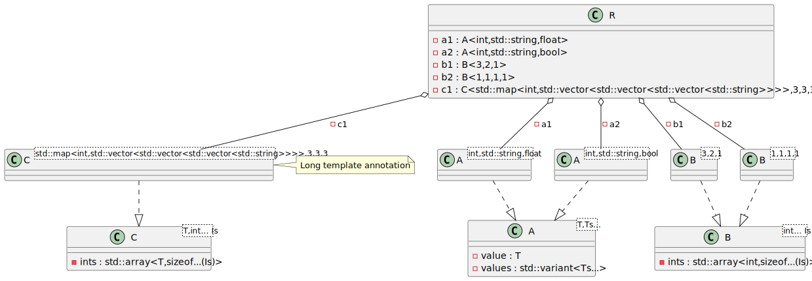

# t00012 - Advanced template instantiations
## Config
```yaml
compilation_database_dir: ..
output_directory: puml
diagrams:
  t00012_class:
    type: class
    glob:
      - ../../tests/t00012/t00012.cc
    using_namespace:
      - clanguml::t00012
    include:
      namespaces:
        - clanguml::t00012
    plantuml:
      after:
        - 'note right of @A(C<std::map<int,std::vector<std::vector<std::vector<std::string>>>>,3,3,3>) : Long template annotation'

```
## Source code
File t00012.cc
```cpp
#include <algorithm>
#include <array>
#include <map>
#include <string>
#include <variant>
#include <vector>

namespace clanguml {
namespace t00012 {

template <typename T, typename... Ts> class A {
    T value;
    std::variant<Ts...> values;
};

template <int... Is> class B {
    std::array<int, sizeof...(Is)> ints;
};

template <typename T, int... Is> class C {
    std::array<T, sizeof...(Is)> ints;
};

class R {
    A<int, std::string, float> a1;
    A<int, std::string, bool> a2;

    B<3, 2, 1> b1;
    B<1, 1, 1, 1> b2;

    C<std::map<int, std::vector<std::vector<std::vector<std::string>>>>, 3, 3,
        3>
        c1;
};
} // namespace t00012
} // namespace clanguml

```
## Generated UML diagrams

## Generated JSON models
```json
{
  "diagram_type": "class",
  "elements": [
    {
      "bases": [],
      "display_name": "clanguml::t00012::A<T,Ts...>",
      "id": "1773299890023132282",
      "is_abstract": false,
      "is_nested": false,
      "is_struct": false,
      "is_template": true,
      "is_union": false,
      "members": [
        {
          "access": "private",
          "is_static": false,
          "name": "value",
          "source_location": {
            "column": 7,
            "file": "../../tests/t00012/t00012.cc",
            "line": 12,
            "translation_unit": "../../tests/t00012/t00012.cc"
          },
          "type": "T"
        },
        {
          "access": "private",
          "is_static": false,
          "name": "values",
          "source_location": {
            "column": 25,
            "file": "../../tests/t00012/t00012.cc",
            "line": 13,
            "translation_unit": "../../tests/t00012/t00012.cc"
          },
          "type": "std::variant<Ts...>"
        }
      ],
      "methods": [],
      "name": "A",
      "namespace": "clanguml::t00012",
      "source_location": {
        "column": 45,
        "file": "../../tests/t00012/t00012.cc",
        "line": 11,
        "translation_unit": "../../tests/t00012/t00012.cc"
      },
      "template_parameters": [
        {
          "is_variadic": false,
          "kind": "template_type",
          "name": "T",
          "template_parameters": []
        },
        {
          "is_variadic": true,
          "kind": "template_type",
          "name": "Ts...",
          "template_parameters": []
        }
      ],
      "type": "class"
    },
    {
      "bases": [],
      "display_name": "clanguml::t00012::B<int... Is>",
      "id": "2061171077567279746",
      "is_abstract": false,
      "is_nested": false,
      "is_struct": false,
      "is_template": true,
      "is_union": false,
      "members": [
        {
          "access": "private",
          "is_static": false,
          "name": "ints",
          "source_location": {
            "column": 36,
            "file": "../../tests/t00012/t00012.cc",
            "line": 17,
            "translation_unit": "../../tests/t00012/t00012.cc"
          },
          "type": "std::array<int,sizeof...(Is)>"
        }
      ],
      "methods": [],
      "name": "B",
      "namespace": "clanguml::t00012",
      "source_location": {
        "column": 28,
        "file": "../../tests/t00012/t00012.cc",
        "line": 16,
        "translation_unit": "../../tests/t00012/t00012.cc"
      },
      "template_parameters": [
        {
          "is_variadic": true,
          "kind": "non_type_template",
          "name": "Is",
          "template_parameters": [],
          "type": "int..."
        }
      ],
      "type": "class"
    },
    {
      "bases": [],
      "display_name": "clanguml::t00012::C<T,int... Is>",
      "id": "627809578407650629",
      "is_abstract": false,
      "is_nested": false,
      "is_struct": false,
      "is_template": true,
      "is_union": false,
      "members": [
        {
          "access": "private",
          "is_static": false,
          "name": "ints",
          "source_location": {
            "column": 34,
            "file": "../../tests/t00012/t00012.cc",
            "line": 21,
            "translation_unit": "../../tests/t00012/t00012.cc"
          },
          "type": "std::array<T,sizeof...(Is)>"
        }
      ],
      "methods": [],
      "name": "C",
      "namespace": "clanguml::t00012",
      "source_location": {
        "column": 40,
        "file": "../../tests/t00012/t00012.cc",
        "line": 20,
        "translation_unit": "../../tests/t00012/t00012.cc"
      },
      "template_parameters": [
        {
          "is_variadic": false,
          "kind": "template_type",
          "name": "T",
          "template_parameters": []
        },
        {
          "is_variadic": true,
          "kind": "non_type_template",
          "name": "Is",
          "template_parameters": [],
          "type": "int..."
        }
      ],
      "type": "class"
    },
    {
      "bases": [],
      "display_name": "clanguml::t00012::A<int,std::string,float>",
      "id": "286972398942005457",
      "is_abstract": false,
      "is_nested": false,
      "is_struct": false,
      "is_template": true,
      "is_union": false,
      "members": [],
      "methods": [],
      "name": "A",
      "namespace": "clanguml::t00012",
      "source_location": {
        "column": 45,
        "file": "../../tests/t00012/t00012.cc",
        "line": 11,
        "translation_unit": "../../tests/t00012/t00012.cc"
      },
      "template_parameters": [
        {
          "is_variadic": false,
          "kind": "argument",
          "template_parameters": [],
          "type": "int"
        },
        {
          "is_variadic": false,
          "kind": "argument",
          "template_parameters": [],
          "type": "std::string"
        },
        {
          "is_variadic": false,
          "kind": "argument",
          "template_parameters": [],
          "type": "float"
        }
      ],
      "type": "class"
    },
    {
      "bases": [],
      "display_name": "clanguml::t00012::A<int,std::string,bool>",
      "id": "299466181098300963",
      "is_abstract": false,
      "is_nested": false,
      "is_struct": false,
      "is_template": true,
      "is_union": false,
      "members": [],
      "methods": [],
      "name": "A",
      "namespace": "clanguml::t00012",
      "source_location": {
        "column": 45,
        "file": "../../tests/t00012/t00012.cc",
        "line": 11,
        "translation_unit": "../../tests/t00012/t00012.cc"
      },
      "template_parameters": [
        {
          "is_variadic": false,
          "kind": "argument",
          "template_parameters": [],
          "type": "int"
        },
        {
          "is_variadic": false,
          "kind": "argument",
          "template_parameters": [],
          "type": "std::string"
        },
        {
          "is_variadic": false,
          "kind": "argument",
          "template_parameters": [],
          "type": "bool"
        }
      ],
      "type": "class"
    },
    {
      "bases": [],
      "display_name": "clanguml::t00012::B<3,2,1>",
      "id": "489063277971613593",
      "is_abstract": false,
      "is_nested": false,
      "is_struct": false,
      "is_template": true,
      "is_union": false,
      "members": [],
      "methods": [],
      "name": "B",
      "namespace": "clanguml::t00012",
      "source_location": {
        "column": 28,
        "file": "../../tests/t00012/t00012.cc",
        "line": 16,
        "translation_unit": "../../tests/t00012/t00012.cc"
      },
      "template_parameters": [
        {
          "is_variadic": false,
          "kind": "argument",
          "template_parameters": [],
          "type": "3"
        },
        {
          "is_variadic": false,
          "kind": "argument",
          "template_parameters": [],
          "type": "2"
        },
        {
          "is_variadic": false,
          "kind": "argument",
          "template_parameters": [],
          "type": "1"
        }
      ],
      "type": "class"
    },
    {
      "bases": [],
      "display_name": "clanguml::t00012::B<1,1,1,1>",
      "id": "14232362483200599",
      "is_abstract": false,
      "is_nested": false,
      "is_struct": false,
      "is_template": true,
      "is_union": false,
      "members": [],
      "methods": [],
      "name": "B",
      "namespace": "clanguml::t00012",
      "source_location": {
        "column": 28,
        "file": "../../tests/t00012/t00012.cc",
        "line": 16,
        "translation_unit": "../../tests/t00012/t00012.cc"
      },
      "template_parameters": [
        {
          "is_variadic": false,
          "kind": "argument",
          "template_parameters": [],
          "type": "1"
        },
        {
          "is_variadic": false,
          "kind": "argument",
          "template_parameters": [],
          "type": "1"
        },
        {
          "is_variadic": false,
          "kind": "argument",
          "template_parameters": [],
          "type": "1"
        },
        {
          "is_variadic": false,
          "kind": "argument",
          "template_parameters": [],
          "type": "1"
        }
      ],
      "type": "class"
    },
    {
      "bases": [],
      "display_name": "clanguml::t00012::C<std::map<int,std::vector<std::vector<std::vector<std::string>>>>,3,3,3>",
      "id": "1478239414632239754",
      "is_abstract": false,
      "is_nested": false,
      "is_struct": false,
      "is_template": true,
      "is_union": false,
      "members": [],
      "methods": [],
      "name": "C",
      "namespace": "clanguml::t00012",
      "source_location": {
        "column": 40,
        "file": "../../tests/t00012/t00012.cc",
        "line": 20,
        "translation_unit": "../../tests/t00012/t00012.cc"
      },
      "template_parameters": [
        {
          "is_variadic": false,
          "kind": "argument",
          "template_parameters": [
            {
              "is_variadic": false,
              "kind": "argument",
              "template_parameters": [],
              "type": "int"
            },
            {
              "is_variadic": false,
              "kind": "argument",
              "template_parameters": [
                {
                  "is_variadic": false,
                  "kind": "argument",
                  "template_parameters": [
                    {
                      "is_variadic": false,
                      "kind": "argument",
                      "template_parameters": [
                        {
                          "is_variadic": false,
                          "kind": "argument",
                          "template_parameters": [],
                          "type": "std::string"
                        }
                      ],
                      "type": "std::vector"
                    }
                  ],
                  "type": "std::vector"
                }
              ],
              "type": "std::vector"
            }
          ],
          "type": "std::map"
        },
        {
          "is_variadic": false,
          "kind": "argument",
          "template_parameters": [],
          "type": "3"
        },
        {
          "is_variadic": false,
          "kind": "argument",
          "template_parameters": [],
          "type": "3"
        },
        {
          "is_variadic": false,
          "kind": "argument",
          "template_parameters": [],
          "type": "3"
        }
      ],
      "type": "class"
    },
    {
      "bases": [],
      "display_name": "clanguml::t00012::R",
      "id": "559263385732885469",
      "is_abstract": false,
      "is_nested": false,
      "is_struct": false,
      "is_template": false,
      "is_union": false,
      "members": [
        {
          "access": "private",
          "is_static": false,
          "name": "a1",
          "source_location": {
            "column": 32,
            "file": "../../tests/t00012/t00012.cc",
            "line": 25,
            "translation_unit": "../../tests/t00012/t00012.cc"
          },
          "type": "A<int,std::string,float>"
        },
        {
          "access": "private",
          "is_static": false,
          "name": "a2",
          "source_location": {
            "column": 31,
            "file": "../../tests/t00012/t00012.cc",
            "line": 26,
            "translation_unit": "../../tests/t00012/t00012.cc"
          },
          "type": "A<int,std::string,bool>"
        },
        {
          "access": "private",
          "is_static": false,
          "name": "b1",
          "source_location": {
            "column": 16,
            "file": "../../tests/t00012/t00012.cc",
            "line": 28,
            "translation_unit": "../../tests/t00012/t00012.cc"
          },
          "type": "B<3,2,1>"
        },
        {
          "access": "private",
          "is_static": false,
          "name": "b2",
          "source_location": {
            "column": 19,
            "file": "../../tests/t00012/t00012.cc",
            "line": 29,
            "translation_unit": "../../tests/t00012/t00012.cc"
          },
          "type": "B<1,1,1,1>"
        },
        {
          "access": "private",
          "is_static": false,
          "name": "c1",
          "source_location": {
            "column": 9,
            "file": "../../tests/t00012/t00012.cc",
            "line": 33,
            "translation_unit": "../../tests/t00012/t00012.cc"
          },
          "type": "C<std::map<int,std::vector<std::vector<std::vector<std::string>>>>,3,3,3>"
        }
      ],
      "methods": [],
      "name": "R",
      "namespace": "clanguml::t00012",
      "source_location": {
        "column": 7,
        "file": "../../tests/t00012/t00012.cc",
        "line": 24,
        "translation_unit": "../../tests/t00012/t00012.cc"
      },
      "template_parameters": [],
      "type": "class"
    }
  ],
  "metadata": {
    "clang_uml_version": "0.3.8-32-ge830195",
    "llvm_version": "Ubuntu clang version 15.0.7",
    "schema_version": 1
  },
  "name": "t00012_class",
  "relationships": [
    {
      "access": "public",
      "destination": "1773299890023132282",
      "source": "286972398942005457",
      "type": "instantiation"
    },
    {
      "access": "public",
      "destination": "1773299890023132282",
      "source": "299466181098300963",
      "type": "instantiation"
    },
    {
      "access": "public",
      "destination": "2061171077567279746",
      "source": "489063277971613593",
      "type": "instantiation"
    },
    {
      "access": "public",
      "destination": "2061171077567279746",
      "source": "14232362483200599",
      "type": "instantiation"
    },
    {
      "access": "public",
      "destination": "627809578407650629",
      "source": "1478239414632239754",
      "type": "instantiation"
    },
    {
      "access": "private",
      "destination": "286972398942005457",
      "label": "a1",
      "source": "559263385732885469",
      "type": "aggregation"
    },
    {
      "access": "private",
      "destination": "299466181098300963",
      "label": "a2",
      "source": "559263385732885469",
      "type": "aggregation"
    },
    {
      "access": "private",
      "destination": "489063277971613593",
      "label": "b1",
      "source": "559263385732885469",
      "type": "aggregation"
    },
    {
      "access": "private",
      "destination": "14232362483200599",
      "label": "b2",
      "source": "559263385732885469",
      "type": "aggregation"
    },
    {
      "access": "private",
      "destination": "1478239414632239754",
      "label": "c1",
      "source": "559263385732885469",
      "type": "aggregation"
    }
  ],
  "using_namespace": "clanguml::t00012"
}
```
