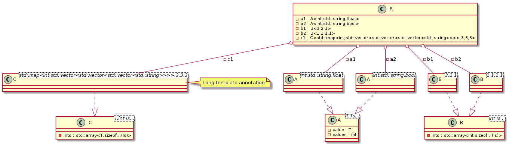

# t00012 - Advanced template instantiations
## Config
```yaml
compilation_database_dir: ..
output_directory: puml
diagrams:
  t00012_class:
    type: class
    glob:
      - ../../tests/t00012/t00012.cc
    using_namespace:
      - clanguml::t00012
    include:
      namespaces:
        - clanguml::t00012
    plantuml:
      after:
        - 'note right of @A(C<std::map<int,std::vector<std::vector<std::vector<std::string>>>>,3,3,3>) : Long template annotation'

```
## Source code
```cpp
#include <algorithm>
#include <map>
#include <numeric>
#include <string>
#include <variant>
#include <vector>

namespace clanguml {
namespace t00012 {

template <typename T, typename... Ts> class A {
    T value;
    std::variant<Ts...> values;
};

template <int... Is> class B {
    std::array<int, sizeof...(Is)> ints;
};

template <typename T, int... Is> class C {
    std::array<T, sizeof...(Is)> ints;
};

class R {
    A<int, std::string, float> a1;
    A<int, std::string, bool> a2;

    B<3, 2, 1> b1;
    B<1, 1, 1, 1> b2;

    C<std::map<int, std::vector<std::vector<std::vector<std::string>>>>, 3, 3,
        3>
        c1;
};
}
}

```
## Generated UML diagrams

