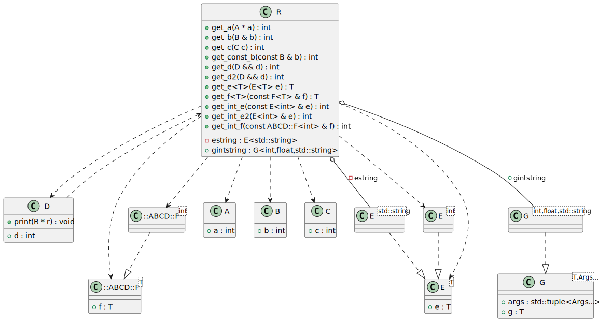

# t00013 - Template instantiation relationships
## Config
```yaml
diagrams:
  t00013_class:
    type: class
    glob:
      - t00013.cc
    using_namespace: clanguml::t00013
    include:
      namespaces:
        - clanguml::t00013
        - ABCD

```
## Source code
File `tests/t00013/t00013.cc`
```cpp
#include <algorithm>
#include <map>
#include <numeric>
#include <string>

namespace ABCD {
template <typename T> struct F {
    T f;
};
}
namespace clanguml {
namespace t00013 {

struct A {
    int a;
};

struct B {
    int b;
};

struct C {
    int c;
};

class R;

struct D {
    int d;
    void print(R *r) { }
};

template <typename T> struct E {
    T e;
};

template <typename T, typename... Args> struct G {
    T g;
    std::tuple<Args...> args;
};

using namespace ABCD;
class R {
public:
    int get_a(A *a) { return a->a; }
    int get_b(B &b) { return b.b; }
    int get_const_b(const B &b) { return b.b; }
    int get_c(C c) { return c.c; }
    int get_d(D &&d) { return d.d; }
    // Dependency relationship should be rendered only once
    int get_d2(D &&d) { return d.d; }

    template <typename T> T get_e(E<T> e) { return e.e; }
    int get_int_e(const E<int> &e) { return e.e; }
    int get_int_e2(E<int> &e) { return e.e; }

    template <typename T> T get_f(const F<T> &f) { return f.f; }
    int get_int_f(const F<int> &f) { return f.f; }

    G<int, float, std::string> gintstring;

private:
    mutable E<std::string> estring;
};
} // namespace t00013
} // namespace clanguml

```
## Generated PlantUML diagrams

## Generated Mermaid diagrams

## Generated JSON models
```json
{
  "diagram_type": "class",
  "elements": [
    {
      "bases": [],
      "display_name": "ABCD::F<T>",
      "id": "952770730316239752",
      "is_abstract": false,
      "is_nested": false,
      "is_struct": true,
      "is_template": true,
      "is_union": false,
      "members": [
        {
          "access": "public",
          "is_static": false,
          "name": "f",
          "source_location": {
            "column": 7,
            "file": "t00013.cc",
            "line": 8,
            "translation_unit": "t00013.cc"
          },
          "type": "T"
        }
      ],
      "methods": [],
      "name": "F",
      "namespace": "ABCD",
      "source_location": {
        "column": 30,
        "file": "t00013.cc",
        "line": 7,
        "translation_unit": "t00013.cc"
      },
      "template_parameters": [
        {
          "is_variadic": false,
          "kind": "template_type",
          "name": "T",
          "template_parameters": []
        }
      ],
      "type": "class"
    },
    {
      "bases": [],
      "display_name": "ABCD::F<int>",
      "id": "2304215469403389354",
      "is_abstract": false,
      "is_nested": false,
      "is_struct": false,
      "is_template": true,
      "is_union": false,
      "members": [],
      "methods": [],
      "name": "F",
      "namespace": "ABCD",
      "source_location": {
        "column": 30,
        "file": "t00013.cc",
        "line": 7,
        "translation_unit": "t00013.cc"
      },
      "template_parameters": [
        {
          "is_variadic": false,
          "kind": "argument",
          "template_parameters": [],
          "type": "int"
        }
      ],
      "type": "class"
    },
    {
      "bases": [],
      "display_name": "A",
      "id": "519995486237427479",
      "is_abstract": false,
      "is_nested": false,
      "is_struct": true,
      "is_template": false,
      "is_union": false,
      "members": [
        {
          "access": "public",
          "is_static": false,
          "name": "a",
          "source_location": {
            "column": 9,
            "file": "t00013.cc",
            "line": 15,
            "translation_unit": "t00013.cc"
          },
          "type": "int"
        }
      ],
      "methods": [],
      "name": "A",
      "namespace": "clanguml::t00013",
      "source_location": {
        "column": 8,
        "file": "t00013.cc",
        "line": 14,
        "translation_unit": "t00013.cc"
      },
      "template_parameters": [],
      "type": "class"
    },
    {
      "bases": [],
      "display_name": "B",
      "id": "1177487653597650440",
      "is_abstract": false,
      "is_nested": false,
      "is_struct": true,
      "is_template": false,
      "is_union": false,
      "members": [
        {
          "access": "public",
          "is_static": false,
          "name": "b",
          "source_location": {
            "column": 9,
            "file": "t00013.cc",
            "line": 19,
            "translation_unit": "t00013.cc"
          },
          "type": "int"
        }
      ],
      "methods": [],
      "name": "B",
      "namespace": "clanguml::t00013",
      "source_location": {
        "column": 8,
        "file": "t00013.cc",
        "line": 18,
        "translation_unit": "t00013.cc"
      },
      "template_parameters": [],
      "type": "class"
    },
    {
      "bases": [],
      "display_name": "C",
      "id": "1028245818073128358",
      "is_abstract": false,
      "is_nested": false,
      "is_struct": true,
      "is_template": false,
      "is_union": false,
      "members": [
        {
          "access": "public",
          "is_static": false,
          "name": "c",
          "source_location": {
            "column": 9,
            "file": "t00013.cc",
            "line": 23,
            "translation_unit": "t00013.cc"
          },
          "type": "int"
        }
      ],
      "methods": [],
      "name": "C",
      "namespace": "clanguml::t00013",
      "source_location": {
        "column": 8,
        "file": "t00013.cc",
        "line": 22,
        "translation_unit": "t00013.cc"
      },
      "template_parameters": [],
      "type": "class"
    },
    {
      "bases": [],
      "display_name": "D",
      "id": "409373870621931875",
      "is_abstract": false,
      "is_nested": false,
      "is_struct": true,
      "is_template": false,
      "is_union": false,
      "members": [
        {
          "access": "public",
          "is_static": false,
          "name": "d",
          "source_location": {
            "column": 9,
            "file": "t00013.cc",
            "line": 29,
            "translation_unit": "t00013.cc"
          },
          "type": "int"
        }
      ],
      "methods": [
        {
          "access": "public",
          "display_name": "print",
          "is_const": false,
          "is_consteval": false,
          "is_constexpr": false,
          "is_constructor": false,
          "is_copy_assignment": false,
          "is_coroutine": false,
          "is_defaulted": false,
          "is_deleted": false,
          "is_move_assignment": false,
          "is_noexcept": false,
          "is_operator": false,
          "is_pure_virtual": false,
          "is_static": false,
          "is_virtual": false,
          "name": "print",
          "parameters": [
            {
              "name": "r",
              "type": "R *"
            }
          ],
          "source_location": {
            "column": 10,
            "file": "t00013.cc",
            "line": 30,
            "translation_unit": "t00013.cc"
          },
          "template_parameters": [],
          "type": "void"
        }
      ],
      "name": "D",
      "namespace": "clanguml::t00013",
      "source_location": {
        "column": 8,
        "file": "t00013.cc",
        "line": 28,
        "translation_unit": "t00013.cc"
      },
      "template_parameters": [],
      "type": "class"
    },
    {
      "bases": [],
      "display_name": "E<T>",
      "id": "864055993755439230",
      "is_abstract": false,
      "is_nested": false,
      "is_struct": true,
      "is_template": true,
      "is_union": false,
      "members": [
        {
          "access": "public",
          "is_static": false,
          "name": "e",
          "source_location": {
            "column": 7,
            "file": "t00013.cc",
            "line": 34,
            "translation_unit": "t00013.cc"
          },
          "type": "T"
        }
      ],
      "methods": [],
      "name": "E",
      "namespace": "clanguml::t00013",
      "source_location": {
        "column": 30,
        "file": "t00013.cc",
        "line": 33,
        "translation_unit": "t00013.cc"
      },
      "template_parameters": [
        {
          "is_variadic": false,
          "kind": "template_type",
          "name": "T",
          "template_parameters": []
        }
      ],
      "type": "class"
    },
    {
      "bases": [],
      "display_name": "G<T,Args...>",
      "id": "205927019127027617",
      "is_abstract": false,
      "is_nested": false,
      "is_struct": true,
      "is_template": true,
      "is_union": false,
      "members": [
        {
          "access": "public",
          "is_static": false,
          "name": "g",
          "source_location": {
            "column": 7,
            "file": "t00013.cc",
            "line": 38,
            "translation_unit": "t00013.cc"
          },
          "type": "T"
        },
        {
          "access": "public",
          "is_static": false,
          "name": "args",
          "source_location": {
            "column": 25,
            "file": "t00013.cc",
            "line": 39,
            "translation_unit": "t00013.cc"
          },
          "type": "std::tuple<Args...>"
        }
      ],
      "methods": [],
      "name": "G",
      "namespace": "clanguml::t00013",
      "source_location": {
        "column": 48,
        "file": "t00013.cc",
        "line": 37,
        "translation_unit": "t00013.cc"
      },
      "template_parameters": [
        {
          "is_variadic": false,
          "kind": "template_type",
          "name": "T",
          "template_parameters": []
        },
        {
          "is_variadic": true,
          "kind": "template_type",
          "name": "Args...",
          "template_parameters": []
        }
      ],
      "type": "class"
    },
    {
      "bases": [],
      "display_name": "E<int>",
      "id": "1977486318799565722",
      "is_abstract": false,
      "is_nested": false,
      "is_struct": false,
      "is_template": true,
      "is_union": false,
      "members": [],
      "methods": [],
      "name": "E",
      "namespace": "clanguml::t00013",
      "source_location": {
        "column": 30,
        "file": "t00013.cc",
        "line": 33,
        "translation_unit": "t00013.cc"
      },
      "template_parameters": [
        {
          "is_variadic": false,
          "kind": "argument",
          "template_parameters": [],
          "type": "int"
        }
      ],
      "type": "class"
    },
    {
      "bases": [],
      "display_name": "G<int,float,std::string>",
      "id": "1526733274613822014",
      "is_abstract": false,
      "is_nested": false,
      "is_struct": false,
      "is_template": true,
      "is_union": false,
      "members": [],
      "methods": [],
      "name": "G",
      "namespace": "clanguml::t00013",
      "source_location": {
        "column": 48,
        "file": "t00013.cc",
        "line": 37,
        "translation_unit": "t00013.cc"
      },
      "template_parameters": [
        {
          "is_variadic": false,
          "kind": "argument",
          "template_parameters": [],
          "type": "int"
        },
        {
          "is_variadic": false,
          "kind": "argument",
          "template_parameters": [],
          "type": "float"
        },
        {
          "is_variadic": false,
          "kind": "argument",
          "template_parameters": [],
          "type": "std::string"
        }
      ],
      "type": "class"
    },
    {
      "bases": [],
      "display_name": "E<std::string>",
      "id": "531523220915557686",
      "is_abstract": false,
      "is_nested": false,
      "is_struct": false,
      "is_template": true,
      "is_union": false,
      "members": [],
      "methods": [],
      "name": "E",
      "namespace": "clanguml::t00013",
      "source_location": {
        "column": 30,
        "file": "t00013.cc",
        "line": 33,
        "translation_unit": "t00013.cc"
      },
      "template_parameters": [
        {
          "is_variadic": false,
          "kind": "argument",
          "template_parameters": [],
          "type": "std::string"
        }
      ],
      "type": "class"
    },
    {
      "bases": [],
      "display_name": "R",
      "id": "2198686676355573844",
      "is_abstract": false,
      "is_nested": false,
      "is_struct": false,
      "is_template": false,
      "is_union": false,
      "members": [
        {
          "access": "public",
          "is_static": false,
          "name": "gintstring",
          "source_location": {
            "column": 32,
            "file": "t00013.cc",
            "line": 60,
            "translation_unit": "t00013.cc"
          },
          "type": "G<int,float,std::string>"
        },
        {
          "access": "private",
          "is_static": false,
          "name": "estring",
          "source_location": {
            "column": 28,
            "file": "t00013.cc",
            "line": 63,
            "translation_unit": "t00013.cc"
          },
          "type": "E<std::string>"
        }
      ],
      "methods": [
        {
          "access": "public",
          "display_name": "get_a",
          "is_const": false,
          "is_consteval": false,
          "is_constexpr": false,
          "is_constructor": false,
          "is_copy_assignment": false,
          "is_coroutine": false,
          "is_defaulted": false,
          "is_deleted": false,
          "is_move_assignment": false,
          "is_noexcept": false,
          "is_operator": false,
          "is_pure_virtual": false,
          "is_static": false,
          "is_virtual": false,
          "name": "get_a",
          "parameters": [
            {
              "name": "a",
              "type": "A *"
            }
          ],
          "source_location": {
            "column": 9,
            "file": "t00013.cc",
            "line": 45,
            "translation_unit": "t00013.cc"
          },
          "template_parameters": [],
          "type": "int"
        },
        {
          "access": "public",
          "display_name": "get_b",
          "is_const": false,
          "is_consteval": false,
          "is_constexpr": false,
          "is_constructor": false,
          "is_copy_assignment": false,
          "is_coroutine": false,
          "is_defaulted": false,
          "is_deleted": false,
          "is_move_assignment": false,
          "is_noexcept": false,
          "is_operator": false,
          "is_pure_virtual": false,
          "is_static": false,
          "is_virtual": false,
          "name": "get_b",
          "parameters": [
            {
              "name": "b",
              "type": "B &"
            }
          ],
          "source_location": {
            "column": 9,
            "file": "t00013.cc",
            "line": 46,
            "translation_unit": "t00013.cc"
          },
          "template_parameters": [],
          "type": "int"
        },
        {
          "access": "public",
          "display_name": "get_const_b",
          "is_const": false,
          "is_consteval": false,
          "is_constexpr": false,
          "is_constructor": false,
          "is_copy_assignment": false,
          "is_coroutine": false,
          "is_defaulted": false,
          "is_deleted": false,
          "is_move_assignment": false,
          "is_noexcept": false,
          "is_operator": false,
          "is_pure_virtual": false,
          "is_static": false,
          "is_virtual": false,
          "name": "get_const_b",
          "parameters": [
            {
              "name": "b",
              "type": "const B &"
            }
          ],
          "source_location": {
            "column": 9,
            "file": "t00013.cc",
            "line": 47,
            "translation_unit": "t00013.cc"
          },
          "template_parameters": [],
          "type": "int"
        },
        {
          "access": "public",
          "display_name": "get_c",
          "is_const": false,
          "is_consteval": false,
          "is_constexpr": false,
          "is_constructor": false,
          "is_copy_assignment": false,
          "is_coroutine": false,
          "is_defaulted": false,
          "is_deleted": false,
          "is_move_assignment": false,
          "is_noexcept": false,
          "is_operator": false,
          "is_pure_virtual": false,
          "is_static": false,
          "is_virtual": false,
          "name": "get_c",
          "parameters": [
            {
              "name": "c",
              "type": "C"
            }
          ],
          "source_location": {
            "column": 9,
            "file": "t00013.cc",
            "line": 48,
            "translation_unit": "t00013.cc"
          },
          "template_parameters": [],
          "type": "int"
        },
        {
          "access": "public",
          "display_name": "get_d",
          "is_const": false,
          "is_consteval": false,
          "is_constexpr": false,
          "is_constructor": false,
          "is_copy_assignment": false,
          "is_coroutine": false,
          "is_defaulted": false,
          "is_deleted": false,
          "is_move_assignment": false,
          "is_noexcept": false,
          "is_operator": false,
          "is_pure_virtual": false,
          "is_static": false,
          "is_virtual": false,
          "name": "get_d",
          "parameters": [
            {
              "name": "d",
              "type": "D &&"
            }
          ],
          "source_location": {
            "column": 9,
            "file": "t00013.cc",
            "line": 49,
            "translation_unit": "t00013.cc"
          },
          "template_parameters": [],
          "type": "int"
        },
        {
          "access": "public",
          "display_name": "get_d2",
          "is_const": false,
          "is_consteval": false,
          "is_constexpr": false,
          "is_constructor": false,
          "is_copy_assignment": false,
          "is_coroutine": false,
          "is_defaulted": false,
          "is_deleted": false,
          "is_move_assignment": false,
          "is_noexcept": false,
          "is_operator": false,
          "is_pure_virtual": false,
          "is_static": false,
          "is_virtual": false,
          "name": "get_d2",
          "parameters": [
            {
              "name": "d",
              "type": "D &&"
            }
          ],
          "source_location": {
            "column": 9,
            "file": "t00013.cc",
            "line": 51,
            "translation_unit": "t00013.cc"
          },
          "template_parameters": [],
          "type": "int"
        },
        {
          "access": "public",
          "display_name": "get_int_e",
          "is_const": false,
          "is_consteval": false,
          "is_constexpr": false,
          "is_constructor": false,
          "is_copy_assignment": false,
          "is_coroutine": false,
          "is_defaulted": false,
          "is_deleted": false,
          "is_move_assignment": false,
          "is_noexcept": false,
          "is_operator": false,
          "is_pure_virtual": false,
          "is_static": false,
          "is_virtual": false,
          "name": "get_int_e",
          "parameters": [
            {
              "name": "e",
              "type": "const clanguml::t00013::E<int> &"
            }
          ],
          "source_location": {
            "column": 9,
            "file": "t00013.cc",
            "line": 54,
            "translation_unit": "t00013.cc"
          },
          "template_parameters": [],
          "type": "int"
        },
        {
          "access": "public",
          "display_name": "get_int_e2",
          "is_const": false,
          "is_consteval": false,
          "is_constexpr": false,
          "is_constructor": false,
          "is_copy_assignment": false,
          "is_coroutine": false,
          "is_defaulted": false,
          "is_deleted": false,
          "is_move_assignment": false,
          "is_noexcept": false,
          "is_operator": false,
          "is_pure_virtual": false,
          "is_static": false,
          "is_virtual": false,
          "name": "get_int_e2",
          "parameters": [
            {
              "name": "e",
              "type": "clanguml::t00013::E<int> &"
            }
          ],
          "source_location": {
            "column": 9,
            "file": "t00013.cc",
            "line": 55,
            "translation_unit": "t00013.cc"
          },
          "template_parameters": [],
          "type": "int"
        },
        {
          "access": "public",
          "display_name": "get_int_f",
          "is_const": false,
          "is_consteval": false,
          "is_constexpr": false,
          "is_constructor": false,
          "is_copy_assignment": false,
          "is_coroutine": false,
          "is_defaulted": false,
          "is_deleted": false,
          "is_move_assignment": false,
          "is_noexcept": false,
          "is_operator": false,
          "is_pure_virtual": false,
          "is_static": false,
          "is_virtual": false,
          "name": "get_int_f",
          "parameters": [
            {
              "name": "f",
              "type": "const ABCD::F<int> &"
            }
          ],
          "source_location": {
            "column": 9,
            "file": "t00013.cc",
            "line": 58,
            "translation_unit": "t00013.cc"
          },
          "template_parameters": [],
          "type": "int"
        },
        {
          "access": "public",
          "display_name": "get_e<T>",
          "is_const": false,
          "is_consteval": false,
          "is_constexpr": false,
          "is_constructor": false,
          "is_copy_assignment": false,
          "is_coroutine": false,
          "is_defaulted": false,
          "is_deleted": false,
          "is_move_assignment": false,
          "is_noexcept": false,
          "is_operator": false,
          "is_pure_virtual": false,
          "is_static": false,
          "is_virtual": false,
          "name": "get_e",
          "parameters": [
            {
              "name": "e",
              "type": "E<T>"
            }
          ],
          "template_parameters": [
            {
              "is_variadic": false,
              "kind": "template_type",
              "name": "T",
              "template_parameters": []
            }
          ],
          "type": "T"
        },
        {
          "access": "public",
          "display_name": "get_f<T>",
          "is_const": false,
          "is_consteval": false,
          "is_constexpr": false,
          "is_constructor": false,
          "is_copy_assignment": false,
          "is_coroutine": false,
          "is_defaulted": false,
          "is_deleted": false,
          "is_move_assignment": false,
          "is_noexcept": false,
          "is_operator": false,
          "is_pure_virtual": false,
          "is_static": false,
          "is_virtual": false,
          "name": "get_f",
          "parameters": [
            {
              "name": "f",
              "type": "const F<T> &"
            }
          ],
          "template_parameters": [
            {
              "is_variadic": false,
              "kind": "template_type",
              "name": "T",
              "template_parameters": []
            }
          ],
          "type": "T"
        }
      ],
      "name": "R",
      "namespace": "clanguml::t00013",
      "source_location": {
        "column": 7,
        "file": "t00013.cc",
        "line": 43,
        "translation_unit": "t00013.cc"
      },
      "template_parameters": [],
      "type": "class"
    }
  ],
  "name": "t00013_class",
  "package_type": "namespace",
  "relationships": [
    {
      "access": "public",
      "destination": "952770730316239752",
      "source": "2304215469403389354",
      "type": "instantiation"
    },
    {
      "access": "public",
      "destination": "2198686676355573844",
      "source": "409373870621931875",
      "type": "dependency"
    },
    {
      "access": "public",
      "destination": "864055993755439230",
      "source": "1977486318799565722",
      "type": "instantiation"
    },
    {
      "access": "public",
      "destination": "205927019127027617",
      "source": "1526733274613822014",
      "type": "instantiation"
    },
    {
      "access": "public",
      "destination": "864055993755439230",
      "source": "531523220915557686",
      "type": "instantiation"
    },
    {
      "access": "public",
      "destination": "519995486237427479",
      "source": "2198686676355573844",
      "type": "dependency"
    },
    {
      "access": "public",
      "destination": "1177487653597650440",
      "source": "2198686676355573844",
      "type": "dependency"
    },
    {
      "access": "public",
      "destination": "1028245818073128358",
      "source": "2198686676355573844",
      "type": "dependency"
    },
    {
      "access": "public",
      "destination": "409373870621931875",
      "source": "2198686676355573844",
      "type": "dependency"
    },
    {
      "access": "public",
      "destination": "1977486318799565722",
      "source": "2198686676355573844",
      "type": "dependency"
    },
    {
      "access": "public",
      "destination": "864055993755439230",
      "source": "2198686676355573844",
      "type": "dependency"
    },
    {
      "access": "public",
      "destination": "2304215469403389354",
      "source": "2198686676355573844",
      "type": "dependency"
    },
    {
      "access": "public",
      "destination": "952770730316239752",
      "source": "2198686676355573844",
      "type": "dependency"
    },
    {
      "access": "public",
      "destination": "864055993755439230",
      "source": "2198686676355573844",
      "type": "dependency"
    },
    {
      "access": "public",
      "destination": "952770730316239752",
      "source": "2198686676355573844",
      "type": "dependency"
    },
    {
      "access": "public",
      "destination": "1526733274613822014",
      "label": "gintstring",
      "source": "2198686676355573844",
      "type": "aggregation"
    },
    {
      "access": "private",
      "destination": "531523220915557686",
      "label": "estring",
      "source": "2198686676355573844",
      "type": "aggregation"
    }
  ],
  "using_namespace": "clanguml::t00013"
}
```
