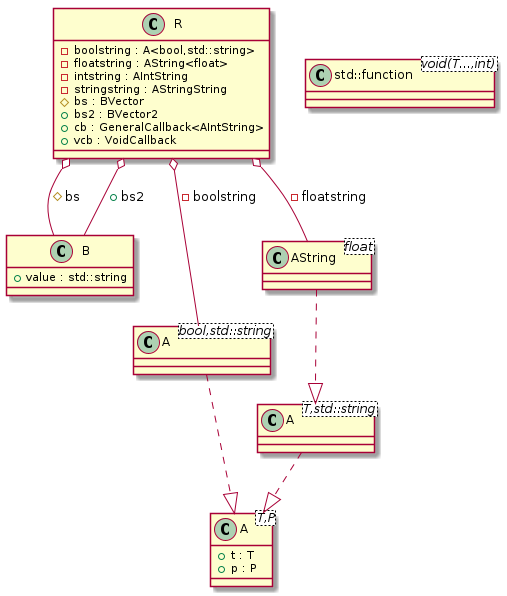

# t00014 - Alias template instantiation
## Config
```yaml
compilation_database_dir: ..
output_directory: puml
diagrams:
  t00014_class:
    type: class
    glob:
      - ../../tests/t00014/t00014.cc
    using_namespace:
      - clanguml::t00014
    include:
      namespaces:
        - clanguml::t00014

```
## Source code
```cpp
#include <algorithm>
#include <ios>
#include <map>
#include <numeric>
#include <string>
#include <type_traits>
#include <variant>
#include <vector>

/**
 * These should not be include as they are not
 * in ns clanguml::t00014
 */
template <typename T> struct clanguml_t00014_A {
    T value;
};

using clanguml_t00014_AString = clanguml_t00014_A<std::string>;

namespace clanguml {
namespace t00014 {

template <typename T, typename P> struct A {
    T t;
    P p;
};

template <typename T> using AString = A<T, std::string>;

struct B {
    std::string value;
};

using BVector = std::vector<B>;
using BVector2 = BVector;

using AIntString = AString<int>;
using AStringString = AString<std::string>;
using BStringString = AStringString;

class R {
    //clang-uml: tinst A<T, std::string>
    A<bool, std::string> boolstring;
    AString<float> floatstring;
    AIntString intstring;
    AStringString stringstring;
    BVector bs;
    BVector2 bs2;
};
}
}

```
## Generated UML diagrams

