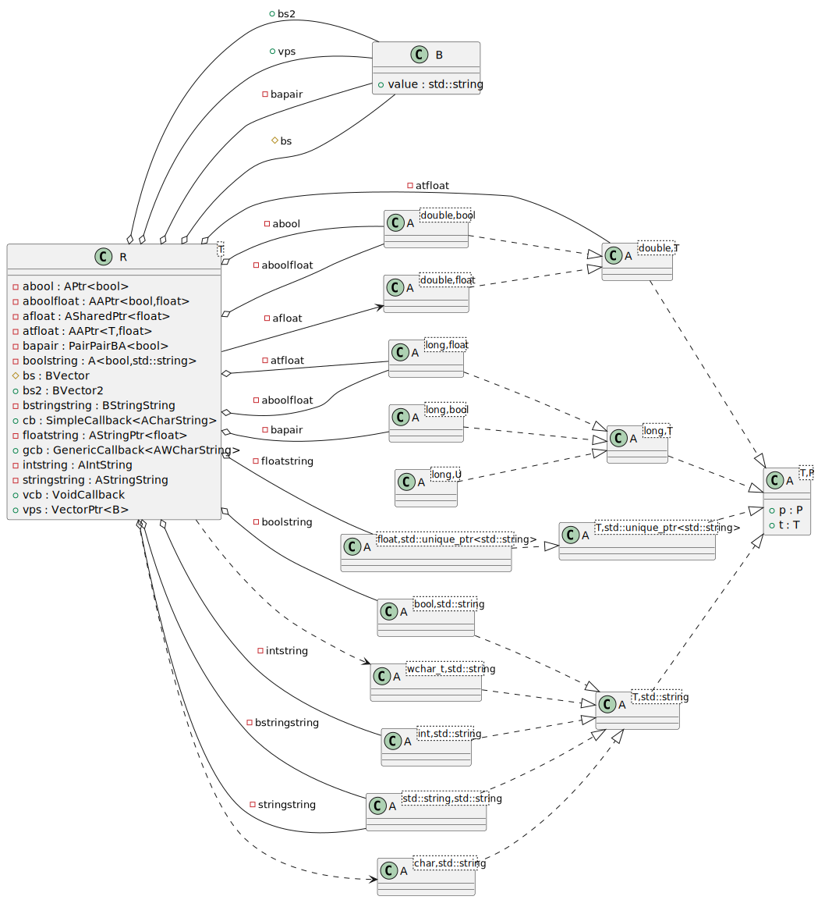

# t00014 - Alias template instantiation
## Config
```yaml
diagrams:
  t00014_class:
    type: class
    glob:
      - t00014.cc
    using_namespace: clanguml::t00014
    include:
      namespaces:
        - clanguml::t00014
    plantuml:
      before:
        - left to right direction
    mermaid:
      before:
        - direction LR
```
## Source code
File `tests/t00014/t00014.cc`
```cpp
#include <functional>
#include <map>
#include <memory>
#include <string>
#include <variant>
#include <vector>

/**
 * These should not be include as they are not
 * in ns clanguml::t00014
 */
template <typename T> struct clanguml_t00014_A {
    T value;
};

using clanguml_t00014_AString = clanguml_t00014_A<std::string>;

namespace clanguml {
namespace t00014 {

template <typename T, typename P> struct A {
    T t;
    P p;
};

struct B {
    std::string value;
};

template <typename T> using AString = A<T, std::string>;
template <typename T> using AStringPtr = A<T, std::unique_ptr<std::string>>;
template <typename T> using ASStringPtr = A<T, std::shared_ptr<std::string>>;

template <typename T>
using PairPairBA = std::pair<std::pair<B, A<long, T>>, long>;

template <class T> using VectorPtr = std::unique_ptr<std::vector<T>>;
template <class T> using APtr = std::unique_ptr<A<double, T>>;
template <class T> using ASharedPtr = std::shared_ptr<A<double, T>>;

template <class T, class U>
using AAPtr = std::unique_ptr<std::pair<A<double, T>, A<long, U>>>;

template <typename T> using SimpleCallback = std::function<void(T, int)>;
template <typename... T> using GenericCallback = std::function<void(T..., int)>;
using VoidCallback = GenericCallback<void *>;

using BVector = std::vector<B>;
using BVector2 = BVector;

using AIntString = AString<int>;
using ACharString = AString<char>;

using AStringString = AString<std::string>;
using BStringString = AStringString;

template <typename T> class R {
    using AWCharString = AString<wchar_t>;

    PairPairBA<bool> bapair;

    APtr<bool> abool;
    AAPtr<bool, float> aboolfloat;
    ASharedPtr<float> afloat;
    A<bool, std::string> boolstring;
    AStringPtr<float> floatstring;
    AIntString intstring;
    AStringString stringstring;
    BStringString bstringstring;
    AAPtr<T, float> atfloat;

protected:
    BVector bs;

public:
    BVector2 bs2;
    SimpleCallback<ACharString> cb;
    GenericCallback<AWCharString> gcb;
    VoidCallback vcb;
    VectorPtr<B> vps;
};
} // namespace t00014
} // namespace clanguml

```
## Generated PlantUML diagrams

## Generated Mermaid diagrams

## Generated JSON models
```json
{
  "diagram_type": "class",
  "elements": [
    {
      "bases": [],
      "display_name": "A<T,P>",
      "id": "2979766272116436457",
      "is_abstract": false,
      "is_nested": false,
      "is_struct": true,
      "is_template": true,
      "is_union": false,
      "members": [
        {
          "access": "public",
          "is_static": false,
          "name": "t",
          "source_location": {
            "column": 7,
            "file": "t00014.cc",
            "line": 22,
            "translation_unit": "t00014.cc"
          },
          "type": "T"
        },
        {
          "access": "public",
          "is_static": false,
          "name": "p",
          "source_location": {
            "column": 7,
            "file": "t00014.cc",
            "line": 23,
            "translation_unit": "t00014.cc"
          },
          "type": "P"
        }
      ],
      "methods": [],
      "name": "A",
      "namespace": "clanguml::t00014",
      "source_location": {
        "column": 42,
        "file": "t00014.cc",
        "line": 21,
        "translation_unit": "t00014.cc"
      },
      "template_parameters": [
        {
          "is_variadic": false,
          "kind": "template_type",
          "name": "T",
          "template_parameters": []
        },
        {
          "is_variadic": false,
          "kind": "template_type",
          "name": "P",
          "template_parameters": []
        }
      ],
      "type": "class"
    },
    {
      "bases": [],
      "display_name": "B",
      "id": "16165505373984323151",
      "is_abstract": false,
      "is_nested": false,
      "is_struct": true,
      "is_template": false,
      "is_union": false,
      "members": [
        {
          "access": "public",
          "is_static": false,
          "name": "value",
          "source_location": {
            "column": 17,
            "file": "t00014.cc",
            "line": 27,
            "translation_unit": "t00014.cc"
          },
          "type": "std::string"
        }
      ],
      "methods": [],
      "name": "B",
      "namespace": "clanguml::t00014",
      "source_location": {
        "column": 8,
        "file": "t00014.cc",
        "line": 26,
        "translation_unit": "t00014.cc"
      },
      "template_parameters": [],
      "type": "class"
    },
    {
      "bases": [],
      "display_name": "A<T,std::string>",
      "id": "11313795019122162349",
      "is_abstract": false,
      "is_nested": false,
      "is_struct": false,
      "is_template": true,
      "is_union": false,
      "members": [],
      "methods": [],
      "name": "A",
      "namespace": "clanguml::t00014",
      "source_location": {
        "column": 23,
        "file": "t00014.cc",
        "line": 30,
        "translation_unit": "t00014.cc"
      },
      "template_parameters": [
        {
          "is_variadic": false,
          "kind": "template_type",
          "name": "T",
          "template_parameters": []
        },
        {
          "is_variadic": false,
          "kind": "argument",
          "template_parameters": [],
          "type": "std::string"
        }
      ],
      "type": "class"
    },
    {
      "bases": [],
      "display_name": "A<T,std::unique_ptr<std::string>>",
      "id": "6750991112847611286",
      "is_abstract": false,
      "is_nested": false,
      "is_struct": false,
      "is_template": true,
      "is_union": false,
      "members": [],
      "methods": [],
      "name": "A",
      "namespace": "clanguml::t00014",
      "source_location": {
        "column": 23,
        "file": "t00014.cc",
        "line": 31,
        "translation_unit": "t00014.cc"
      },
      "template_parameters": [
        {
          "is_variadic": false,
          "kind": "template_type",
          "name": "T",
          "template_parameters": []
        },
        {
          "is_variadic": false,
          "kind": "argument",
          "template_parameters": [
            {
              "is_variadic": false,
              "kind": "argument",
              "template_parameters": [],
              "type": "std::string"
            }
          ],
          "type": "std::unique_ptr"
        }
      ],
      "type": "class"
    },
    {
      "bases": [],
      "display_name": "A<T,std::shared_ptr<std::string>>",
      "id": "74967831327636655",
      "is_abstract": false,
      "is_nested": false,
      "is_struct": false,
      "is_template": true,
      "is_union": false,
      "members": [],
      "methods": [],
      "name": "A",
      "namespace": "clanguml::t00014",
      "source_location": {
        "column": 23,
        "file": "t00014.cc",
        "line": 32,
        "translation_unit": "t00014.cc"
      },
      "template_parameters": [
        {
          "is_variadic": false,
          "kind": "template_type",
          "name": "T",
          "template_parameters": []
        },
        {
          "is_variadic": false,
          "kind": "argument",
          "template_parameters": [
            {
              "is_variadic": false,
              "kind": "argument",
              "template_parameters": [],
              "type": "std::string"
            }
          ],
          "type": "std::shared_ptr"
        }
      ],
      "type": "class"
    },
    {
      "bases": [],
      "display_name": "A<long,T>",
      "id": "17923657219128723729",
      "is_abstract": false,
      "is_nested": false,
      "is_struct": true,
      "is_template": true,
      "is_union": false,
      "members": [],
      "methods": [],
      "name": "A",
      "namespace": "clanguml::t00014",
      "source_location": {
        "column": 7,
        "file": "t00014.cc",
        "line": 35,
        "translation_unit": "t00014.cc"
      },
      "template_parameters": [
        {
          "is_variadic": false,
          "kind": "argument",
          "template_parameters": [],
          "type": "long"
        },
        {
          "is_variadic": false,
          "kind": "template_type",
          "name": "T",
          "template_parameters": []
        }
      ],
      "type": "class"
    },
    {
      "bases": [],
      "display_name": "A<double,T>",
      "id": "6260223631508736488",
      "is_abstract": false,
      "is_nested": false,
      "is_struct": true,
      "is_template": true,
      "is_union": false,
      "members": [],
      "methods": [],
      "name": "A",
      "namespace": "clanguml::t00014",
      "source_location": {
        "column": 26,
        "file": "t00014.cc",
        "line": 38,
        "translation_unit": "t00014.cc"
      },
      "template_parameters": [
        {
          "is_variadic": false,
          "kind": "argument",
          "template_parameters": [],
          "type": "double"
        },
        {
          "is_variadic": false,
          "kind": "template_type",
          "name": "T",
          "template_parameters": []
        }
      ],
      "type": "class"
    },
    {
      "bases": [],
      "display_name": "A<long,U>",
      "id": "3782664373954316451",
      "is_abstract": false,
      "is_nested": false,
      "is_struct": true,
      "is_template": true,
      "is_union": false,
      "members": [],
      "methods": [],
      "name": "A",
      "namespace": "clanguml::t00014",
      "source_location": {
        "column": 7,
        "file": "t00014.cc",
        "line": 42,
        "translation_unit": "t00014.cc"
      },
      "template_parameters": [
        {
          "is_variadic": false,
          "kind": "argument",
          "template_parameters": [],
          "type": "long"
        },
        {
          "is_variadic": false,
          "kind": "template_type",
          "name": "U",
          "template_parameters": []
        }
      ],
      "type": "class"
    },
    {
      "bases": [],
      "display_name": "A<long,bool>",
      "id": "9511932831718272320",
      "is_abstract": false,
      "is_nested": false,
      "is_struct": true,
      "is_template": true,
      "is_union": false,
      "members": [],
      "methods": [],
      "name": "A",
      "namespace": "clanguml::t00014",
      "source_location": {
        "column": 22,
        "file": "t00014.cc",
        "line": 60,
        "translation_unit": "t00014.cc"
      },
      "template_parameters": [
        {
          "is_variadic": false,
          "kind": "argument",
          "template_parameters": [],
          "type": "long"
        },
        {
          "is_variadic": false,
          "kind": "argument",
          "template_parameters": [],
          "type": "bool"
        }
      ],
      "type": "class"
    },
    {
      "bases": [],
      "display_name": "A<double,bool>",
      "id": "11026662072017428382",
      "is_abstract": false,
      "is_nested": false,
      "is_struct": true,
      "is_template": true,
      "is_union": false,
      "members": [],
      "methods": [],
      "name": "A",
      "namespace": "clanguml::t00014",
      "source_location": {
        "column": 16,
        "file": "t00014.cc",
        "line": 62,
        "translation_unit": "t00014.cc"
      },
      "template_parameters": [
        {
          "is_variadic": false,
          "kind": "argument",
          "template_parameters": [],
          "type": "double"
        },
        {
          "is_variadic": false,
          "kind": "argument",
          "template_parameters": [],
          "type": "bool"
        }
      ],
      "type": "class"
    },
    {
      "bases": [],
      "display_name": "A<long,float>",
      "id": "9095497341964011977",
      "is_abstract": false,
      "is_nested": false,
      "is_struct": true,
      "is_template": true,
      "is_union": false,
      "members": [],
      "methods": [],
      "name": "A",
      "namespace": "clanguml::t00014",
      "source_location": {
        "column": 24,
        "file": "t00014.cc",
        "line": 63,
        "translation_unit": "t00014.cc"
      },
      "template_parameters": [
        {
          "is_variadic": false,
          "kind": "argument",
          "template_parameters": [],
          "type": "long"
        },
        {
          "is_variadic": false,
          "kind": "argument",
          "template_parameters": [],
          "type": "float"
        }
      ],
      "type": "class"
    },
    {
      "bases": [],
      "display_name": "A<double,float>",
      "id": "1307006622100318437",
      "is_abstract": false,
      "is_nested": false,
      "is_struct": true,
      "is_template": true,
      "is_union": false,
      "members": [],
      "methods": [],
      "name": "A",
      "namespace": "clanguml::t00014",
      "source_location": {
        "column": 23,
        "file": "t00014.cc",
        "line": 64,
        "translation_unit": "t00014.cc"
      },
      "template_parameters": [
        {
          "is_variadic": false,
          "kind": "argument",
          "template_parameters": [],
          "type": "double"
        },
        {
          "is_variadic": false,
          "kind": "argument",
          "template_parameters": [],
          "type": "float"
        }
      ],
      "type": "class"
    },
    {
      "bases": [],
      "display_name": "A<bool,std::string>",
      "id": "14682652206030417999",
      "is_abstract": false,
      "is_nested": false,
      "is_struct": false,
      "is_template": true,
      "is_union": false,
      "members": [],
      "methods": [],
      "name": "A",
      "namespace": "clanguml::t00014",
      "source_location": {
        "column": 26,
        "file": "t00014.cc",
        "line": 65,
        "translation_unit": "t00014.cc"
      },
      "template_parameters": [
        {
          "is_variadic": false,
          "kind": "argument",
          "template_parameters": [],
          "type": "bool"
        },
        {
          "is_variadic": false,
          "kind": "argument",
          "template_parameters": [],
          "type": "std::string"
        }
      ],
      "type": "class"
    },
    {
      "bases": [],
      "display_name": "A<float,std::unique_ptr<std::string>>",
      "id": "2232468326267554461",
      "is_abstract": false,
      "is_nested": false,
      "is_struct": false,
      "is_template": true,
      "is_union": false,
      "members": [],
      "methods": [],
      "name": "A",
      "namespace": "clanguml::t00014",
      "source_location": {
        "column": 23,
        "file": "t00014.cc",
        "line": 66,
        "translation_unit": "t00014.cc"
      },
      "template_parameters": [
        {
          "is_variadic": false,
          "kind": "argument",
          "template_parameters": [],
          "type": "float"
        },
        {
          "is_variadic": false,
          "kind": "argument",
          "template_parameters": [
            {
              "is_variadic": false,
              "kind": "argument",
              "template_parameters": [],
              "type": "std::string"
            }
          ],
          "type": "std::unique_ptr"
        }
      ],
      "type": "class"
    },
    {
      "bases": [],
      "display_name": "A<int,std::string>",
      "id": "4455476395256717226",
      "is_abstract": false,
      "is_nested": false,
      "is_struct": false,
      "is_template": true,
      "is_union": false,
      "members": [],
      "methods": [],
      "name": "A",
      "namespace": "clanguml::t00014",
      "source_location": {
        "column": 16,
        "file": "t00014.cc",
        "line": 67,
        "translation_unit": "t00014.cc"
      },
      "template_parameters": [
        {
          "is_variadic": false,
          "kind": "argument",
          "template_parameters": [],
          "type": "int"
        },
        {
          "is_variadic": false,
          "kind": "argument",
          "template_parameters": [],
          "type": "std::string"
        }
      ],
      "type": "class"
    },
    {
      "bases": [],
      "display_name": "A<std::string,std::string>",
      "id": "3481734391107212171",
      "is_abstract": false,
      "is_nested": false,
      "is_struct": false,
      "is_template": true,
      "is_union": false,
      "members": [],
      "methods": [],
      "name": "A",
      "namespace": "clanguml::t00014",
      "source_location": {
        "column": 19,
        "file": "t00014.cc",
        "line": 68,
        "translation_unit": "t00014.cc"
      },
      "template_parameters": [
        {
          "is_variadic": false,
          "kind": "argument",
          "template_parameters": [],
          "type": "std::string"
        },
        {
          "is_variadic": false,
          "kind": "argument",
          "template_parameters": [],
          "type": "std::string"
        }
      ],
      "type": "class"
    },
    {
      "bases": [],
      "display_name": "A<char,std::string>",
      "id": "1022746816287484141",
      "is_abstract": false,
      "is_nested": false,
      "is_struct": false,
      "is_template": true,
      "is_union": false,
      "members": [],
      "methods": [],
      "name": "A",
      "namespace": "clanguml::t00014",
      "source_location": {
        "column": 33,
        "file": "t00014.cc",
        "line": 77,
        "translation_unit": "t00014.cc"
      },
      "template_parameters": [
        {
          "is_variadic": false,
          "kind": "argument",
          "template_parameters": [],
          "type": "char"
        },
        {
          "is_variadic": false,
          "kind": "argument",
          "template_parameters": [],
          "type": "std::string"
        }
      ],
      "type": "class"
    },
    {
      "bases": [],
      "display_name": "A<wchar_t,std::string>",
      "id": "16832072274854468335",
      "is_abstract": false,
      "is_nested": false,
      "is_struct": false,
      "is_template": true,
      "is_union": false,
      "members": [],
      "methods": [],
      "name": "A",
      "namespace": "clanguml::t00014",
      "source_location": {
        "column": 35,
        "file": "t00014.cc",
        "line": 78,
        "translation_unit": "t00014.cc"
      },
      "template_parameters": [
        {
          "is_variadic": false,
          "kind": "argument",
          "template_parameters": [],
          "type": "wchar_t"
        },
        {
          "is_variadic": false,
          "kind": "argument",
          "template_parameters": [],
          "type": "std::string"
        }
      ],
      "type": "class"
    },
    {
      "bases": [],
      "display_name": "R<T>",
      "id": "2885989716582767497",
      "is_abstract": false,
      "is_nested": false,
      "is_struct": false,
      "is_template": true,
      "is_union": false,
      "members": [
        {
          "access": "private",
          "is_static": false,
          "name": "bapair",
          "source_location": {
            "column": 22,
            "file": "t00014.cc",
            "line": 60,
            "translation_unit": "t00014.cc"
          },
          "type": "PairPairBA<bool>"
        },
        {
          "access": "private",
          "is_static": false,
          "name": "abool",
          "source_location": {
            "column": 16,
            "file": "t00014.cc",
            "line": 62,
            "translation_unit": "t00014.cc"
          },
          "type": "APtr<bool>"
        },
        {
          "access": "private",
          "is_static": false,
          "name": "aboolfloat",
          "source_location": {
            "column": 24,
            "file": "t00014.cc",
            "line": 63,
            "translation_unit": "t00014.cc"
          },
          "type": "AAPtr<bool,float>"
        },
        {
          "access": "private",
          "is_static": false,
          "name": "afloat",
          "source_location": {
            "column": 23,
            "file": "t00014.cc",
            "line": 64,
            "translation_unit": "t00014.cc"
          },
          "type": "ASharedPtr<float>"
        },
        {
          "access": "private",
          "is_static": false,
          "name": "boolstring",
          "source_location": {
            "column": 26,
            "file": "t00014.cc",
            "line": 65,
            "translation_unit": "t00014.cc"
          },
          "type": "A<bool,std::string>"
        },
        {
          "access": "private",
          "is_static": false,
          "name": "floatstring",
          "source_location": {
            "column": 23,
            "file": "t00014.cc",
            "line": 66,
            "translation_unit": "t00014.cc"
          },
          "type": "AStringPtr<float>"
        },
        {
          "access": "private",
          "is_static": false,
          "name": "intstring",
          "source_location": {
            "column": 16,
            "file": "t00014.cc",
            "line": 67,
            "translation_unit": "t00014.cc"
          },
          "type": "AIntString"
        },
        {
          "access": "private",
          "is_static": false,
          "name": "stringstring",
          "source_location": {
            "column": 19,
            "file": "t00014.cc",
            "line": 68,
            "translation_unit": "t00014.cc"
          },
          "type": "AStringString"
        },
        {
          "access": "private",
          "is_static": false,
          "name": "bstringstring",
          "source_location": {
            "column": 19,
            "file": "t00014.cc",
            "line": 69,
            "translation_unit": "t00014.cc"
          },
          "type": "BStringString"
        },
        {
          "access": "private",
          "is_static": false,
          "name": "atfloat",
          "source_location": {
            "column": 21,
            "file": "t00014.cc",
            "line": 70,
            "translation_unit": "t00014.cc"
          },
          "type": "AAPtr<T,float>"
        },
        {
          "access": "protected",
          "is_static": false,
          "name": "bs",
          "source_location": {
            "column": 13,
            "file": "t00014.cc",
            "line": 73,
            "translation_unit": "t00014.cc"
          },
          "type": "BVector"
        },
        {
          "access": "public",
          "is_static": false,
          "name": "bs2",
          "source_location": {
            "column": 14,
            "file": "t00014.cc",
            "line": 76,
            "translation_unit": "t00014.cc"
          },
          "type": "BVector2"
        },
        {
          "access": "public",
          "is_static": false,
          "name": "cb",
          "source_location": {
            "column": 33,
            "file": "t00014.cc",
            "line": 77,
            "translation_unit": "t00014.cc"
          },
          "type": "SimpleCallback<ACharString>"
        },
        {
          "access": "public",
          "is_static": false,
          "name": "gcb",
          "source_location": {
            "column": 35,
            "file": "t00014.cc",
            "line": 78,
            "translation_unit": "t00014.cc"
          },
          "type": "GenericCallback<AWCharString>"
        },
        {
          "access": "public",
          "is_static": false,
          "name": "vcb",
          "source_location": {
            "column": 18,
            "file": "t00014.cc",
            "line": 79,
            "translation_unit": "t00014.cc"
          },
          "type": "VoidCallback"
        },
        {
          "access": "public",
          "is_static": false,
          "name": "vps",
          "source_location": {
            "column": 18,
            "file": "t00014.cc",
            "line": 80,
            "translation_unit": "t00014.cc"
          },
          "type": "VectorPtr<B>"
        }
      ],
      "methods": [],
      "name": "R",
      "namespace": "clanguml::t00014",
      "source_location": {
        "column": 29,
        "file": "t00014.cc",
        "line": 57,
        "translation_unit": "t00014.cc"
      },
      "template_parameters": [
        {
          "is_variadic": false,
          "kind": "template_type",
          "name": "T",
          "template_parameters": []
        }
      ],
      "type": "class"
    }
  ],
  "name": "t00014_class",
  "package_type": "namespace",
  "relationships": [
    {
      "access": "public",
      "destination": "2979766272116436457",
      "source": "11313795019122162349",
      "type": "instantiation"
    },
    {
      "access": "public",
      "destination": "2979766272116436457",
      "source": "6750991112847611286",
      "type": "instantiation"
    },
    {
      "access": "public",
      "destination": "2979766272116436457",
      "source": "74967831327636655",
      "type": "instantiation"
    },
    {
      "access": "public",
      "destination": "2979766272116436457",
      "source": "17923657219128723729",
      "type": "instantiation"
    },
    {
      "access": "public",
      "destination": "2979766272116436457",
      "source": "6260223631508736488",
      "type": "instantiation"
    },
    {
      "access": "public",
      "destination": "17923657219128723729",
      "source": "3782664373954316451",
      "type": "instantiation"
    },
    {
      "access": "public",
      "destination": "17923657219128723729",
      "source": "9511932831718272320",
      "type": "instantiation"
    },
    {
      "access": "public",
      "destination": "6260223631508736488",
      "source": "11026662072017428382",
      "type": "instantiation"
    },
    {
      "access": "public",
      "destination": "17923657219128723729",
      "source": "9095497341964011977",
      "type": "instantiation"
    },
    {
      "access": "public",
      "destination": "6260223631508736488",
      "source": "1307006622100318437",
      "type": "instantiation"
    },
    {
      "access": "public",
      "destination": "11313795019122162349",
      "source": "14682652206030417999",
      "type": "instantiation"
    },
    {
      "access": "public",
      "destination": "6750991112847611286",
      "source": "2232468326267554461",
      "type": "instantiation"
    },
    {
      "access": "public",
      "destination": "11313795019122162349",
      "source": "4455476395256717226",
      "type": "instantiation"
    },
    {
      "access": "public",
      "destination": "11313795019122162349",
      "source": "3481734391107212171",
      "type": "instantiation"
    },
    {
      "access": "public",
      "destination": "11313795019122162349",
      "source": "1022746816287484141",
      "type": "instantiation"
    },
    {
      "access": "public",
      "destination": "11313795019122162349",
      "source": "16832072274854468335",
      "type": "instantiation"
    },
    {
      "access": "private",
      "destination": "16165505373984323151",
      "label": "bapair",
      "source": "2885989716582767497",
      "type": "aggregation"
    },
    {
      "access": "private",
      "destination": "9511932831718272320",
      "label": "bapair",
      "source": "2885989716582767497",
      "type": "aggregation"
    },
    {
      "access": "private",
      "destination": "11026662072017428382",
      "label": "abool",
      "source": "2885989716582767497",
      "type": "aggregation"
    },
    {
      "access": "private",
      "destination": "11026662072017428382",
      "label": "aboolfloat",
      "source": "2885989716582767497",
      "type": "aggregation"
    },
    {
      "access": "private",
      "destination": "9095497341964011977",
      "label": "aboolfloat",
      "source": "2885989716582767497",
      "type": "aggregation"
    },
    {
      "access": "private",
      "destination": "1307006622100318437",
      "label": "afloat",
      "source": "2885989716582767497",
      "type": "association"
    },
    {
      "access": "private",
      "destination": "14682652206030417999",
      "label": "boolstring",
      "source": "2885989716582767497",
      "type": "aggregation"
    },
    {
      "access": "private",
      "destination": "2232468326267554461",
      "label": "floatstring",
      "source": "2885989716582767497",
      "type": "aggregation"
    },
    {
      "access": "private",
      "destination": "4455476395256717226",
      "label": "intstring",
      "source": "2885989716582767497",
      "type": "aggregation"
    },
    {
      "access": "private",
      "destination": "3481734391107212171",
      "label": "stringstring",
      "source": "2885989716582767497",
      "type": "aggregation"
    },
    {
      "access": "private",
      "destination": "3481734391107212171",
      "label": "bstringstring",
      "source": "2885989716582767497",
      "type": "aggregation"
    },
    {
      "access": "private",
      "destination": "6260223631508736488",
      "label": "atfloat",
      "source": "2885989716582767497",
      "type": "aggregation"
    },
    {
      "access": "private",
      "destination": "9095497341964011977",
      "label": "atfloat",
      "source": "2885989716582767497",
      "type": "aggregation"
    },
    {
      "access": "protected",
      "destination": "16165505373984323151",
      "label": "bs",
      "source": "2885989716582767497",
      "type": "aggregation"
    },
    {
      "access": "public",
      "destination": "16165505373984323151",
      "label": "bs2",
      "source": "2885989716582767497",
      "type": "aggregation"
    },
    {
      "access": "public",
      "destination": "1022746816287484141",
      "source": "2885989716582767497",
      "type": "dependency"
    },
    {
      "access": "public",
      "destination": "1022746816287484141",
      "label": "cb",
      "source": "2885989716582767497",
      "type": "dependency"
    },
    {
      "access": "public",
      "destination": "16832072274854468335",
      "source": "2885989716582767497",
      "type": "dependency"
    },
    {
      "access": "public",
      "destination": "16832072274854468335",
      "label": "gcb",
      "source": "2885989716582767497",
      "type": "dependency"
    },
    {
      "access": "public",
      "destination": "16165505373984323151",
      "label": "vps",
      "source": "2885989716582767497",
      "type": "aggregation"
    }
  ],
  "using_namespace": "clanguml::t00014"
}
```
## Generated GraphML models
```xml
<?xml version="1.0"?>
<graphml xmlns="http://graphml.graphdrawing.org/xmlns" xmlns:xsi="http://www.w3.org/2001/XMLSchema-instance" xsi:schemaLocation="http://graphml.graphdrawing.org/xmlns http://graphml.graphdrawing.org/xmlns/1.0/graphml.xsd">
 <key attr.name="id" attr.type="string" for="graph" id="gd0" />
 <key attr.name="diagram_type" attr.type="string" for="graph" id="gd1" />
 <key attr.name="name" attr.type="string" for="graph" id="gd2" />
 <key attr.name="using_namespace" attr.type="string" for="graph" id="gd3" />
 <key attr.name="id" attr.type="string" for="node" id="nd0" />
 <key attr.name="type" attr.type="string" for="node" id="nd1" />
 <key attr.name="name" attr.type="string" for="node" id="nd2" />
 <key attr.name="stereotype" attr.type="string" for="node" id="nd3" />
 <key attr.name="url" attr.type="string" for="node" id="nd4" />
 <key attr.name="tooltip" attr.type="string" for="node" id="nd5" />
 <key attr.name="is_template" attr.type="boolean" for="node" id="nd6" />
 <key attr.name="type" attr.type="string" for="edge" id="ed0" />
 <key attr.name="access" attr.type="string" for="edge" id="ed1" />
 <key attr.name="label" attr.type="string" for="edge" id="ed2" />
 <key attr.name="url" attr.type="string" for="edge" id="ed3" />
 <graph id="g0" edgedefault="directed" parse.nodeids="canonical" parse.edgeids="canonical" parse.order="nodesfirst">
  <data key="gd3">clanguml::t00014</data>
  <node id="n0">
   <data key="nd1">class</data>
   <data key="nd2"><![CDATA[A<T,P>]]></data>
   <data key="nd6">true</data>
  </node>
  <node id="n1">
   <data key="nd1">class</data>
   <data key="nd2"><![CDATA[B]]></data>
   <data key="nd6">false</data>
  </node>
  <node id="n2">
   <data key="nd1">class</data>
   <data key="nd2"><![CDATA[A<T,std::string>]]></data>
   <data key="nd6">true</data>
  </node>
  <node id="n3">
   <data key="nd1">class</data>
   <data key="nd2"><![CDATA[A<T,std::unique_ptr<std::string>>]]></data>
   <data key="nd6">true</data>
  </node>
  <node id="n4">
   <data key="nd1">class</data>
   <data key="nd2"><![CDATA[A<T,std::shared_ptr<std::string>>]]></data>
   <data key="nd6">true</data>
  </node>
  <node id="n5">
   <data key="nd1">class</data>
   <data key="nd2"><![CDATA[A<long,T>]]></data>
   <data key="nd6">true</data>
  </node>
  <node id="n6">
   <data key="nd1">class</data>
   <data key="nd2"><![CDATA[A<double,T>]]></data>
   <data key="nd6">true</data>
  </node>
  <node id="n7">
   <data key="nd1">class</data>
   <data key="nd2"><![CDATA[A<long,U>]]></data>
   <data key="nd6">true</data>
  </node>
  <node id="n8">
   <data key="nd1">class</data>
   <data key="nd2"><![CDATA[A<long,bool>]]></data>
   <data key="nd6">true</data>
  </node>
  <node id="n9">
   <data key="nd1">class</data>
   <data key="nd2"><![CDATA[A<double,bool>]]></data>
   <data key="nd6">true</data>
  </node>
  <node id="n10">
   <data key="nd1">class</data>
   <data key="nd2"><![CDATA[A<long,float>]]></data>
   <data key="nd6">true</data>
  </node>
  <node id="n11">
   <data key="nd1">class</data>
   <data key="nd2"><![CDATA[A<double,float>]]></data>
   <data key="nd6">true</data>
  </node>
  <node id="n12">
   <data key="nd1">class</data>
   <data key="nd2"><![CDATA[A<bool,std::string>]]></data>
   <data key="nd6">true</data>
  </node>
  <node id="n13">
   <data key="nd1">class</data>
   <data key="nd2"><![CDATA[A<float,std::unique_ptr<std::string>>]]></data>
   <data key="nd6">true</data>
  </node>
  <node id="n14">
   <data key="nd1">class</data>
   <data key="nd2"><![CDATA[A<int,std::string>]]></data>
   <data key="nd6">true</data>
  </node>
  <node id="n15">
   <data key="nd1">class</data>
   <data key="nd2"><![CDATA[A<std::string,std::string>]]></data>
   <data key="nd6">true</data>
  </node>
  <node id="n16">
   <data key="nd1">class</data>
   <data key="nd2"><![CDATA[A<char,std::string>]]></data>
   <data key="nd6">true</data>
  </node>
  <node id="n17">
   <data key="nd1">class</data>
   <data key="nd2"><![CDATA[A<wchar_t,std::string>]]></data>
   <data key="nd6">true</data>
  </node>
  <node id="n18">
   <data key="nd1">class</data>
   <data key="nd2"><![CDATA[R<T>]]></data>
   <data key="nd6">true</data>
  </node>
  <edge id="e0" source="n2" target="n0">
   <data key="ed0">instantiation</data>
   <data key="ed1">public</data>
  </edge>
  <edge id="e1" source="n3" target="n0">
   <data key="ed0">instantiation</data>
   <data key="ed1">public</data>
  </edge>
  <edge id="e2" source="n4" target="n0">
   <data key="ed0">instantiation</data>
   <data key="ed1">public</data>
  </edge>
  <edge id="e3" source="n5" target="n0">
   <data key="ed0">instantiation</data>
   <data key="ed1">public</data>
  </edge>
  <edge id="e4" source="n6" target="n0">
   <data key="ed0">instantiation</data>
   <data key="ed1">public</data>
  </edge>
  <edge id="e5" source="n7" target="n5">
   <data key="ed0">instantiation</data>
   <data key="ed1">public</data>
  </edge>
  <edge id="e6" source="n8" target="n5">
   <data key="ed0">instantiation</data>
   <data key="ed1">public</data>
  </edge>
  <edge id="e7" source="n9" target="n6">
   <data key="ed0">instantiation</data>
   <data key="ed1">public</data>
  </edge>
  <edge id="e8" source="n10" target="n5">
   <data key="ed0">instantiation</data>
   <data key="ed1">public</data>
  </edge>
  <edge id="e9" source="n11" target="n6">
   <data key="ed0">instantiation</data>
   <data key="ed1">public</data>
  </edge>
  <edge id="e10" source="n12" target="n2">
   <data key="ed0">instantiation</data>
   <data key="ed1">public</data>
  </edge>
  <edge id="e11" source="n13" target="n3">
   <data key="ed0">instantiation</data>
   <data key="ed1">public</data>
  </edge>
  <edge id="e12" source="n14" target="n2">
   <data key="ed0">instantiation</data>
   <data key="ed1">public</data>
  </edge>
  <edge id="e13" source="n15" target="n2">
   <data key="ed0">instantiation</data>
   <data key="ed1">public</data>
  </edge>
  <edge id="e14" source="n16" target="n2">
   <data key="ed0">instantiation</data>
   <data key="ed1">public</data>
  </edge>
  <edge id="e15" source="n17" target="n2">
   <data key="ed0">instantiation</data>
   <data key="ed1">public</data>
  </edge>
  <edge id="e16" source="n18" target="n1">
   <data key="ed0">aggregation</data>
   <data key="ed2">bapair</data>
   <data key="ed1">private</data>
  </edge>
  <edge id="e17" source="n18" target="n8">
   <data key="ed0">aggregation</data>
   <data key="ed2">bapair</data>
   <data key="ed1">private</data>
  </edge>
  <edge id="e18" source="n18" target="n9">
   <data key="ed0">aggregation</data>
   <data key="ed2">abool</data>
   <data key="ed1">private</data>
  </edge>
  <edge id="e19" source="n18" target="n9">
   <data key="ed0">aggregation</data>
   <data key="ed2">aboolfloat</data>
   <data key="ed1">private</data>
  </edge>
  <edge id="e20" source="n18" target="n10">
   <data key="ed0">aggregation</data>
   <data key="ed2">aboolfloat</data>
   <data key="ed1">private</data>
  </edge>
  <edge id="e21" source="n18" target="n11">
   <data key="ed0">association</data>
   <data key="ed2">afloat</data>
   <data key="ed1">private</data>
  </edge>
  <edge id="e22" source="n18" target="n12">
   <data key="ed0">aggregation</data>
   <data key="ed2">boolstring</data>
   <data key="ed1">private</data>
  </edge>
  <edge id="e23" source="n18" target="n13">
   <data key="ed0">aggregation</data>
   <data key="ed2">floatstring</data>
   <data key="ed1">private</data>
  </edge>
  <edge id="e24" source="n18" target="n14">
   <data key="ed0">aggregation</data>
   <data key="ed2">intstring</data>
   <data key="ed1">private</data>
  </edge>
  <edge id="e25" source="n18" target="n15">
   <data key="ed0">aggregation</data>
   <data key="ed2">stringstring</data>
   <data key="ed1">private</data>
  </edge>
  <edge id="e26" source="n18" target="n15">
   <data key="ed0">aggregation</data>
   <data key="ed2">bstringstring</data>
   <data key="ed1">private</data>
  </edge>
  <edge id="e27" source="n18" target="n6">
   <data key="ed0">aggregation</data>
   <data key="ed2">atfloat</data>
   <data key="ed1">private</data>
  </edge>
  <edge id="e28" source="n18" target="n10">
   <data key="ed0">aggregation</data>
   <data key="ed2">atfloat</data>
   <data key="ed1">private</data>
  </edge>
  <edge id="e29" source="n18" target="n1">
   <data key="ed0">aggregation</data>
   <data key="ed2">bs</data>
   <data key="ed1">protected</data>
  </edge>
  <edge id="e30" source="n18" target="n1">
   <data key="ed0">aggregation</data>
   <data key="ed2">bs2</data>
   <data key="ed1">public</data>
  </edge>
  <edge id="e31" source="n18" target="n16">
   <data key="ed0">dependency</data>
   <data key="ed1">public</data>
  </edge>
  <edge id="e32" source="n18" target="n16">
   <data key="ed0">dependency</data>
   <data key="ed2">cb</data>
   <data key="ed1">public</data>
  </edge>
  <edge id="e33" source="n18" target="n17">
   <data key="ed0">dependency</data>
   <data key="ed1">public</data>
  </edge>
  <edge id="e34" source="n18" target="n17">
   <data key="ed0">dependency</data>
   <data key="ed2">gcb</data>
   <data key="ed1">public</data>
  </edge>
  <edge id="e35" source="n18" target="n1">
   <data key="ed0">aggregation</data>
   <data key="ed2">vps</data>
   <data key="ed1">public</data>
  </edge>
 </graph>
</graphml>

```
