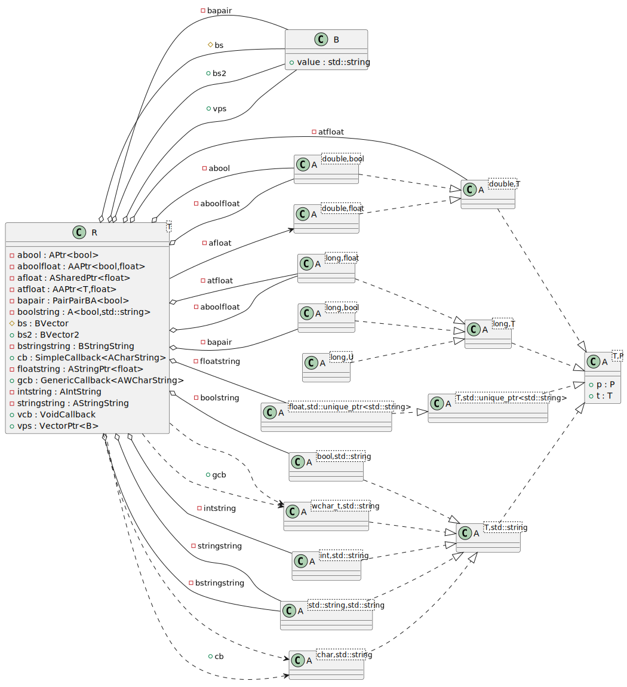

# t00014 - Alias template instantiation
## Config
```yaml
compilation_database_dir: ..
output_directory: puml
diagrams:
  t00014_class:
    type: class
    glob:
      - ../../tests/t00014/t00014.cc
    using_namespace:
      - clanguml::t00014
    include:
      namespaces:
        - clanguml::t00014
    plantuml:
      before:
        - left to right direction
```
## Source code
File t00014.cc
```cpp
#include <functional>
#include <map>
#include <memory>
#include <string>
#include <variant>
#include <vector>

/**
 * These should not be include as they are not
 * in ns clanguml::t00014
 */
template <typename T> struct clanguml_t00014_A {
    T value;
};

using clanguml_t00014_AString = clanguml_t00014_A<std::string>;

namespace clanguml {
namespace t00014 {

template <typename T, typename P> struct A {
    T t;
    P p;
};

struct B {
    std::string value;
};

template <typename T> using AString = A<T, std::string>;
template <typename T> using AStringPtr = A<T, std::unique_ptr<std::string>>;

template <typename T>
using PairPairBA = std::pair<std::pair<B, A<long, T>>, long>;

template <class T> using VectorPtr = std::unique_ptr<std::vector<T>>;
template <class T> using APtr = std::unique_ptr<A<double, T>>;
template <class T> using ASharedPtr = std::shared_ptr<A<double, T>>;

template <class T, class U>
using AAPtr = std::unique_ptr<std::pair<A<double, T>, A<long, U>>>;

template <typename T> using SimpleCallback = std::function<void(T, int)>;
template <typename... T> using GenericCallback = std::function<void(T..., int)>;
using VoidCallback = GenericCallback<void *>;

using BVector = std::vector<B>;
using BVector2 = BVector;

using AIntString = AString<int>;
using ACharString = AString<char>;

using AStringString = AString<std::string>;
using BStringString = AStringString;

template <typename T> class R {
    using AWCharString = AString<wchar_t>;

    PairPairBA<bool> bapair;

    APtr<bool> abool;
    AAPtr<bool, float> aboolfloat;
    ASharedPtr<float> afloat;
    A<bool, std::string> boolstring;
    AStringPtr<float> floatstring;
    AIntString intstring;
    AStringString stringstring;
    BStringString bstringstring;
    AAPtr<T, float> atfloat;

protected:
    BVector bs;

public:
    BVector2 bs2;
    SimpleCallback<ACharString> cb;
    GenericCallback<AWCharString> gcb;
    VoidCallback vcb;
    VectorPtr<B> vps;
};
} // namespace t00014
} // namespace clanguml

```
## Generated UML diagrams

## Generated JSON models
```json
{
  "diagram_type": "class",
  "elements": [
    {
      "bases": [],
      "display_name": "clanguml::t00014::A<T,P>",
      "id": "765890579167335652",
      "is_abstract": false,
      "is_nested": false,
      "is_struct": true,
      "is_template": true,
      "is_union": false,
      "members": [
        {
          "access": "public",
          "is_static": false,
          "name": "t",
          "source_location": {
            "file": "../../tests/t00014/t00014.cc",
            "line": 22
          },
          "type": "T"
        },
        {
          "access": "public",
          "is_static": false,
          "name": "p",
          "source_location": {
            "file": "../../tests/t00014/t00014.cc",
            "line": 23
          },
          "type": "P"
        }
      ],
      "methods": [],
      "name": "A",
      "namespace": "clanguml::t00014",
      "source_location": {
        "file": "../../tests/t00014/t00014.cc",
        "line": 21
      },
      "template_parameters": [
        {
          "is_variadic": false,
          "kind": "template_type",
          "name": "T",
          "template_parameters": []
        },
        {
          "is_variadic": false,
          "kind": "template_type",
          "name": "P",
          "template_parameters": []
        }
      ],
      "type": "class"
    },
    {
      "bases": [],
      "display_name": "clanguml::t00014::B",
      "id": "934136012292043506",
      "is_abstract": false,
      "is_nested": false,
      "is_struct": true,
      "is_template": false,
      "is_union": false,
      "members": [
        {
          "access": "public",
          "is_static": false,
          "name": "value",
          "source_location": {
            "file": "../../tests/t00014/t00014.cc",
            "line": 27
          },
          "type": "std::string"
        }
      ],
      "methods": [],
      "name": "B",
      "namespace": "clanguml::t00014",
      "source_location": {
        "file": "../../tests/t00014/t00014.cc",
        "line": 26
      },
      "template_parameters": [],
      "type": "class"
    },
    {
      "bases": [],
      "display_name": "clanguml::t00014::A<T,std::string>",
      "id": "2186387853087008570",
      "is_abstract": false,
      "is_nested": false,
      "is_struct": false,
      "is_template": true,
      "is_union": false,
      "members": [],
      "methods": [],
      "name": "A",
      "namespace": "clanguml::t00014",
      "source_location": {
        "file": "../../tests/t00014/t00014.cc",
        "line": 21
      },
      "template_parameters": [
        {
          "is_variadic": false,
          "kind": "template_type",
          "name": "T",
          "template_parameters": []
        },
        {
          "is_variadic": false,
          "kind": "argument",
          "template_parameters": [],
          "type": "std::string"
        }
      ],
      "type": "class"
    },
    {
      "bases": [],
      "display_name": "clanguml::t00014::A<T,std::unique_ptr<std::string>>",
      "id": "947292733740993297",
      "is_abstract": false,
      "is_nested": false,
      "is_struct": false,
      "is_template": true,
      "is_union": false,
      "members": [],
      "methods": [],
      "name": "A",
      "namespace": "clanguml::t00014",
      "source_location": {
        "file": "../../tests/t00014/t00014.cc",
        "line": 21
      },
      "template_parameters": [
        {
          "is_variadic": false,
          "kind": "template_type",
          "name": "T",
          "template_parameters": []
        },
        {
          "is_variadic": false,
          "kind": "argument",
          "template_parameters": [
            {
              "is_variadic": false,
              "kind": "argument",
              "template_parameters": [],
              "type": "std::string"
            }
          ],
          "type": "std::unique_ptr"
        }
      ],
      "type": "class"
    },
    {
      "bases": [],
      "display_name": "clanguml::t00014::A<long,T>",
      "id": "1700006390494465667",
      "is_abstract": false,
      "is_nested": false,
      "is_struct": false,
      "is_template": true,
      "is_union": false,
      "members": [],
      "methods": [],
      "name": "A",
      "namespace": "clanguml::t00014",
      "source_location": {
        "file": "../../../../../../usr/include/c++/12/bits/stl_iterator.h",
        "line": 2547
      },
      "template_parameters": [
        {
          "is_variadic": false,
          "kind": "argument",
          "template_parameters": [],
          "type": "long"
        },
        {
          "is_variadic": false,
          "kind": "template_type",
          "name": "T",
          "template_parameters": []
        }
      ],
      "type": "class"
    },
    {
      "bases": [],
      "display_name": "clanguml::t00014::A<double,T>",
      "id": "2017665567517853203",
      "is_abstract": false,
      "is_nested": false,
      "is_struct": false,
      "is_template": true,
      "is_union": false,
      "members": [],
      "methods": [],
      "name": "A",
      "namespace": "clanguml::t00014",
      "source_location": {
        "file": "../../../../../../usr/include/c++/12/bits/unique_ptr.h",
        "line": 269
      },
      "template_parameters": [
        {
          "is_variadic": false,
          "kind": "argument",
          "template_parameters": [],
          "type": "double"
        },
        {
          "is_variadic": false,
          "kind": "template_type",
          "name": "T",
          "template_parameters": []
        }
      ],
      "type": "class"
    },
    {
      "bases": [],
      "display_name": "clanguml::t00014::A<long,U>",
      "id": "906557320263235873",
      "is_abstract": false,
      "is_nested": false,
      "is_struct": false,
      "is_template": true,
      "is_union": false,
      "members": [],
      "methods": [],
      "name": "A",
      "namespace": "clanguml::t00014",
      "source_location": {
        "file": "../../../../../../usr/include/c++/12/bits/stl_iterator.h",
        "line": 2547
      },
      "template_parameters": [
        {
          "is_variadic": false,
          "kind": "argument",
          "template_parameters": [],
          "type": "long"
        },
        {
          "is_variadic": false,
          "kind": "template_type",
          "name": "U",
          "template_parameters": []
        }
      ],
      "type": "class"
    },
    {
      "bases": [],
      "display_name": "clanguml::t00014::A<long,bool>",
      "id": "378898020828430636",
      "is_abstract": false,
      "is_nested": false,
      "is_struct": false,
      "is_template": true,
      "is_union": false,
      "members": [],
      "methods": [],
      "name": "A",
      "namespace": "clanguml::t00014",
      "source_location": {
        "file": "../../../../../../usr/include/c++/12/bits/stl_iterator.h",
        "line": 2547
      },
      "template_parameters": [
        {
          "is_variadic": false,
          "kind": "argument",
          "template_parameters": [],
          "type": "long"
        },
        {
          "is_variadic": false,
          "kind": "argument",
          "template_parameters": [],
          "type": "bool"
        }
      ],
      "type": "class"
    },
    {
      "bases": [],
      "display_name": "clanguml::t00014::A<double,bool>",
      "id": "2082013375525130414",
      "is_abstract": false,
      "is_nested": false,
      "is_struct": false,
      "is_template": true,
      "is_union": false,
      "members": [],
      "methods": [],
      "name": "A",
      "namespace": "clanguml::t00014",
      "source_location": {
        "file": "../../../../../../usr/include/c++/12/bits/unique_ptr.h",
        "line": 269
      },
      "template_parameters": [
        {
          "is_variadic": false,
          "kind": "argument",
          "template_parameters": [],
          "type": "double"
        },
        {
          "is_variadic": false,
          "kind": "argument",
          "template_parameters": [],
          "type": "bool"
        }
      ],
      "type": "class"
    },
    {
      "bases": [],
      "display_name": "clanguml::t00014::A<long,float>",
      "id": "51978493292659230",
      "is_abstract": false,
      "is_nested": false,
      "is_struct": false,
      "is_template": true,
      "is_union": false,
      "members": [],
      "methods": [],
      "name": "A",
      "namespace": "clanguml::t00014",
      "source_location": {
        "file": "../../../../../../usr/include/c++/12/bits/stl_iterator.h",
        "line": 2547
      },
      "template_parameters": [
        {
          "is_variadic": false,
          "kind": "argument",
          "template_parameters": [],
          "type": "long"
        },
        {
          "is_variadic": false,
          "kind": "argument",
          "template_parameters": [],
          "type": "float"
        }
      ],
      "type": "class"
    },
    {
      "bases": [],
      "display_name": "clanguml::t00014::A<double,float>",
      "id": "197769253782961588",
      "is_abstract": false,
      "is_nested": false,
      "is_struct": false,
      "is_template": true,
      "is_union": false,
      "members": [],
      "methods": [],
      "name": "A",
      "namespace": "clanguml::t00014",
      "source_location": {
        "file": "../../../../../../usr/include/c++/12/bits/shared_ptr.h",
        "line": 175
      },
      "template_parameters": [
        {
          "is_variadic": false,
          "kind": "argument",
          "template_parameters": [],
          "type": "double"
        },
        {
          "is_variadic": false,
          "kind": "argument",
          "template_parameters": [],
          "type": "float"
        }
      ],
      "type": "class"
    },
    {
      "bases": [],
      "display_name": "clanguml::t00014::A<bool,std::string>",
      "id": "895940711566401184",
      "is_abstract": false,
      "is_nested": false,
      "is_struct": false,
      "is_template": true,
      "is_union": false,
      "members": [],
      "methods": [],
      "name": "A",
      "namespace": "clanguml::t00014",
      "source_location": {
        "file": "../../tests/t00014/t00014.cc",
        "line": 21
      },
      "template_parameters": [
        {
          "is_variadic": false,
          "kind": "argument",
          "template_parameters": [],
          "type": "bool"
        },
        {
          "is_variadic": false,
          "kind": "argument",
          "template_parameters": [],
          "type": "std::string"
        }
      ],
      "type": "class"
    },
    {
      "bases": [],
      "display_name": "clanguml::t00014::A<float,std::unique_ptr<std::string>>",
      "id": "1751732625010742161",
      "is_abstract": false,
      "is_nested": false,
      "is_struct": false,
      "is_template": true,
      "is_union": false,
      "members": [],
      "methods": [],
      "name": "A",
      "namespace": "clanguml::t00014",
      "source_location": {
        "file": "../../tests/t00014/t00014.cc",
        "line": 21
      },
      "template_parameters": [
        {
          "is_variadic": false,
          "kind": "argument",
          "template_parameters": [],
          "type": "float"
        },
        {
          "is_variadic": false,
          "kind": "argument",
          "template_parameters": [
            {
              "is_variadic": false,
              "kind": "argument",
              "template_parameters": [],
              "type": "std::string"
            }
          ],
          "type": "std::unique_ptr"
        }
      ],
      "type": "class"
    },
    {
      "bases": [],
      "display_name": "clanguml::t00014::A<int,std::string>",
      "id": "887121441210847583",
      "is_abstract": false,
      "is_nested": false,
      "is_struct": false,
      "is_template": true,
      "is_union": false,
      "members": [],
      "methods": [],
      "name": "A",
      "namespace": "clanguml::t00014",
      "source_location": {
        "file": "../../tests/t00014/t00014.cc",
        "line": 21
      },
      "template_parameters": [
        {
          "is_variadic": false,
          "kind": "argument",
          "template_parameters": [],
          "type": "int"
        },
        {
          "is_variadic": false,
          "kind": "argument",
          "template_parameters": [],
          "type": "std::string"
        }
      ],
      "type": "class"
    },
    {
      "bases": [],
      "display_name": "clanguml::t00014::A<std::string,std::string>",
      "id": "1119452495635561975",
      "is_abstract": false,
      "is_nested": false,
      "is_struct": false,
      "is_template": true,
      "is_union": false,
      "members": [],
      "methods": [],
      "name": "A",
      "namespace": "clanguml::t00014",
      "source_location": {
        "file": "../../tests/t00014/t00014.cc",
        "line": 21
      },
      "template_parameters": [
        {
          "is_variadic": false,
          "kind": "argument",
          "template_parameters": [],
          "type": "std::string"
        },
        {
          "is_variadic": false,
          "kind": "argument",
          "template_parameters": [],
          "type": "std::string"
        }
      ],
      "type": "class"
    },
    {
      "bases": [],
      "display_name": "clanguml::t00014::A<char,std::string>",
      "id": "340562099063642390",
      "is_abstract": false,
      "is_nested": false,
      "is_struct": true,
      "is_template": false,
      "is_union": false,
      "members": [],
      "methods": [],
      "name": "A",
      "namespace": "clanguml::t00014",
      "source_location": {
        "file": "../../../../../../usr/include/c++/12/bits/std_function.h",
        "line": 111
      },
      "template_parameters": [
        {
          "is_variadic": false,
          "kind": "argument",
          "template_parameters": [],
          "type": "char"
        },
        {
          "is_variadic": false,
          "kind": "argument",
          "template_parameters": [],
          "type": "std::string"
        }
      ],
      "type": "class"
    },
    {
      "bases": [],
      "display_name": "clanguml::t00014::A<wchar_t,std::string>",
      "id": "1388877149159894665",
      "is_abstract": false,
      "is_nested": false,
      "is_struct": true,
      "is_template": false,
      "is_union": false,
      "members": [],
      "methods": [],
      "name": "A",
      "namespace": "clanguml::t00014",
      "source_location": {
        "file": "../../../../../../usr/include/c++/12/bits/std_function.h",
        "line": 111
      },
      "template_parameters": [
        {
          "is_variadic": false,
          "kind": "argument",
          "template_parameters": [],
          "type": "wchar_t"
        },
        {
          "is_variadic": false,
          "kind": "argument",
          "template_parameters": [],
          "type": "std::string"
        }
      ],
      "type": "class"
    },
    {
      "bases": [],
      "display_name": "clanguml::t00014::R<T>",
      "id": "1758213171584933144",
      "is_abstract": false,
      "is_nested": false,
      "is_struct": false,
      "is_template": true,
      "is_union": false,
      "members": [
        {
          "access": "private",
          "is_static": false,
          "name": "bapair",
          "source_location": {
            "file": "../../tests/t00014/t00014.cc",
            "line": 59
          },
          "type": "PairPairBA<bool>"
        },
        {
          "access": "private",
          "is_static": false,
          "name": "abool",
          "source_location": {
            "file": "../../tests/t00014/t00014.cc",
            "line": 61
          },
          "type": "APtr<bool>"
        },
        {
          "access": "private",
          "is_static": false,
          "name": "aboolfloat",
          "source_location": {
            "file": "../../tests/t00014/t00014.cc",
            "line": 62
          },
          "type": "AAPtr<bool,float>"
        },
        {
          "access": "private",
          "is_static": false,
          "name": "afloat",
          "source_location": {
            "file": "../../tests/t00014/t00014.cc",
            "line": 63
          },
          "type": "ASharedPtr<float>"
        },
        {
          "access": "private",
          "is_static": false,
          "name": "boolstring",
          "source_location": {
            "file": "../../tests/t00014/t00014.cc",
            "line": 64
          },
          "type": "A<bool,std::string>"
        },
        {
          "access": "private",
          "is_static": false,
          "name": "floatstring",
          "source_location": {
            "file": "../../tests/t00014/t00014.cc",
            "line": 65
          },
          "type": "AStringPtr<float>"
        },
        {
          "access": "private",
          "is_static": false,
          "name": "intstring",
          "source_location": {
            "file": "../../tests/t00014/t00014.cc",
            "line": 66
          },
          "type": "clanguml::t00014::AIntString"
        },
        {
          "access": "private",
          "is_static": false,
          "name": "stringstring",
          "source_location": {
            "file": "../../tests/t00014/t00014.cc",
            "line": 67
          },
          "type": "clanguml::t00014::AStringString"
        },
        {
          "access": "private",
          "is_static": false,
          "name": "bstringstring",
          "source_location": {
            "file": "../../tests/t00014/t00014.cc",
            "line": 68
          },
          "type": "clanguml::t00014::BStringString"
        },
        {
          "access": "private",
          "is_static": false,
          "name": "atfloat",
          "source_location": {
            "file": "../../tests/t00014/t00014.cc",
            "line": 69
          },
          "type": "AAPtr<T,float>"
        },
        {
          "access": "protected",
          "is_static": false,
          "name": "bs",
          "source_location": {
            "file": "../../tests/t00014/t00014.cc",
            "line": 72
          },
          "type": "clanguml::t00014::BVector"
        },
        {
          "access": "public",
          "is_static": false,
          "name": "bs2",
          "source_location": {
            "file": "../../tests/t00014/t00014.cc",
            "line": 75
          },
          "type": "clanguml::t00014::BVector2"
        },
        {
          "access": "public",
          "is_static": false,
          "name": "cb",
          "source_location": {
            "file": "../../tests/t00014/t00014.cc",
            "line": 76
          },
          "type": "SimpleCallback<clanguml::t00014::ACharString>"
        },
        {
          "access": "public",
          "is_static": false,
          "name": "gcb",
          "source_location": {
            "file": "../../tests/t00014/t00014.cc",
            "line": 77
          },
          "type": "GenericCallback<clanguml::t00014::R::AWCharString>"
        },
        {
          "access": "public",
          "is_static": false,
          "name": "vcb",
          "source_location": {
            "file": "../../tests/t00014/t00014.cc",
            "line": 78
          },
          "type": "clanguml::t00014::VoidCallback"
        },
        {
          "access": "public",
          "is_static": false,
          "name": "vps",
          "source_location": {
            "file": "../../tests/t00014/t00014.cc",
            "line": 79
          },
          "type": "VectorPtr<clanguml::t00014::B>"
        }
      ],
      "methods": [],
      "name": "R",
      "namespace": "clanguml::t00014",
      "source_location": {
        "file": "../../tests/t00014/t00014.cc",
        "line": 56
      },
      "template_parameters": [
        {
          "is_variadic": false,
          "kind": "template_type",
          "name": "T",
          "template_parameters": []
        }
      ],
      "type": "class"
    }
  ],
  "metadata": {
    "clang_uml_version": "0.3.6-11-g75d1daa",
    "llvm_version": "Ubuntu clang version 15.0.6",
    "schema_version": 1
  },
  "name": "t00014_class",
  "relationships": [
    {
      "access": "public",
      "destination": "765890579167335652",
      "source": "2186387853087008570",
      "type": "instantiation"
    },
    {
      "access": "public",
      "destination": "765890579167335652",
      "source": "947292733740993297",
      "type": "instantiation"
    },
    {
      "access": "public",
      "destination": "765890579167335652",
      "source": "1700006390494465667",
      "type": "instantiation"
    },
    {
      "access": "public",
      "destination": "765890579167335652",
      "source": "2017665567517853203",
      "type": "instantiation"
    },
    {
      "access": "public",
      "destination": "1700006390494465667",
      "source": "906557320263235873",
      "type": "instantiation"
    },
    {
      "access": "public",
      "destination": "1700006390494465667",
      "source": "378898020828430636",
      "type": "instantiation"
    },
    {
      "access": "public",
      "destination": "2017665567517853203",
      "source": "2082013375525130414",
      "type": "instantiation"
    },
    {
      "access": "public",
      "destination": "1700006390494465667",
      "source": "51978493292659230",
      "type": "instantiation"
    },
    {
      "access": "public",
      "destination": "2017665567517853203",
      "source": "197769253782961588",
      "type": "instantiation"
    },
    {
      "access": "public",
      "destination": "2186387853087008570",
      "source": "895940711566401184",
      "type": "instantiation"
    },
    {
      "access": "public",
      "destination": "947292733740993297",
      "source": "1751732625010742161",
      "type": "instantiation"
    },
    {
      "access": "public",
      "destination": "2186387853087008570",
      "source": "887121441210847583",
      "type": "instantiation"
    },
    {
      "access": "public",
      "destination": "2186387853087008570",
      "source": "1119452495635561975",
      "type": "instantiation"
    },
    {
      "access": "public",
      "destination": "2186387853087008570",
      "source": "340562099063642390",
      "type": "instantiation"
    },
    {
      "access": "public",
      "destination": "2186387853087008570",
      "source": "1388877149159894665",
      "type": "instantiation"
    },
    {
      "access": "public",
      "destination": "378898020828430636",
      "source": "1758213171584933144",
      "type": "dependency"
    },
    {
      "access": "private",
      "destination": "934136012292043506",
      "label": "bapair",
      "source": "1758213171584933144",
      "type": "aggregation"
    },
    {
      "access": "private",
      "destination": "378898020828430636",
      "label": "bapair",
      "source": "1758213171584933144",
      "type": "aggregation"
    },
    {
      "access": "public",
      "destination": "2082013375525130414",
      "source": "1758213171584933144",
      "type": "dependency"
    },
    {
      "access": "private",
      "destination": "2082013375525130414",
      "label": "abool",
      "source": "1758213171584933144",
      "type": "aggregation"
    },
    {
      "access": "public",
      "destination": "51978493292659230",
      "source": "1758213171584933144",
      "type": "dependency"
    },
    {
      "access": "private",
      "destination": "2082013375525130414",
      "label": "aboolfloat",
      "source": "1758213171584933144",
      "type": "aggregation"
    },
    {
      "access": "private",
      "destination": "51978493292659230",
      "label": "aboolfloat",
      "source": "1758213171584933144",
      "type": "aggregation"
    },
    {
      "access": "public",
      "destination": "197769253782961588",
      "source": "1758213171584933144",
      "type": "dependency"
    },
    {
      "access": "private",
      "destination": "197769253782961588",
      "label": "afloat",
      "source": "1758213171584933144",
      "type": "association"
    },
    {
      "access": "private",
      "destination": "895940711566401184",
      "label": "boolstring",
      "source": "1758213171584933144",
      "type": "aggregation"
    },
    {
      "access": "private",
      "destination": "1751732625010742161",
      "label": "floatstring",
      "source": "1758213171584933144",
      "type": "aggregation"
    },
    {
      "access": "private",
      "destination": "887121441210847583",
      "label": "intstring",
      "source": "1758213171584933144",
      "type": "aggregation"
    },
    {
      "access": "private",
      "destination": "1119452495635561975",
      "label": "stringstring",
      "source": "1758213171584933144",
      "type": "aggregation"
    },
    {
      "access": "private",
      "destination": "1119452495635561975",
      "label": "bstringstring",
      "source": "1758213171584933144",
      "type": "aggregation"
    },
    {
      "access": "public",
      "destination": "2017665567517853203",
      "source": "1758213171584933144",
      "type": "dependency"
    },
    {
      "access": "private",
      "destination": "2017665567517853203",
      "label": "atfloat",
      "source": "1758213171584933144",
      "type": "aggregation"
    },
    {
      "access": "private",
      "destination": "51978493292659230",
      "label": "atfloat",
      "source": "1758213171584933144",
      "type": "aggregation"
    },
    {
      "access": "protected",
      "destination": "934136012292043506",
      "label": "bs",
      "source": "1758213171584933144",
      "type": "aggregation"
    },
    {
      "access": "public",
      "destination": "934136012292043506",
      "label": "bs2",
      "source": "1758213171584933144",
      "type": "aggregation"
    },
    {
      "access": "public",
      "destination": "340562099063642390",
      "source": "1758213171584933144",
      "type": "dependency"
    },
    {
      "access": "public",
      "destination": "1388877149159894665",
      "source": "1758213171584933144",
      "type": "dependency"
    },
    {
      "access": "public",
      "destination": "934136012292043506",
      "label": "vps",
      "source": "1758213171584933144",
      "type": "aggregation"
    }
  ],
  "using_namespace": "clanguml::t00014"
}
```
