# t00015 - Namespace fun
## Config
```yaml
diagrams:
  t00015_class:
    type: class
    glob:
      - t00015.cc
    using_namespace: clanguml::t00015
    include:
      namespaces:
        - clanguml::t00015

```
## Source code
File `tests/t00015/t00015.cc`
```cpp
namespace clanguml {
namespace t00015 {

namespace ns1 {
inline namespace ns2_v1_0_0 {
class A { };
}

namespace ns2_v0_9_0 {
class [[deprecated]] A { };
}

namespace {
class Anon final : public A { };
}
} // namespace ns1

namespace ns3 {

namespace ns1::ns2 {
class Anon : public t00015::ns1::A { };
}

class B : public ns1::ns2::Anon { };
}
} // namespace t00015
} // namespace clanguml

```
## Generated PlantUML diagrams

## Generated Mermaid diagrams

## Generated JSON models
```json
{
  "diagram_type": "class",
  "elements": [
    {
      "bases": [],
      "display_name": "ns1::A",
      "id": "11285559110441195627",
      "is_abstract": false,
      "is_nested": false,
      "is_struct": false,
      "is_template": false,
      "is_union": false,
      "members": [],
      "methods": [],
      "name": "A",
      "namespace": "clanguml::t00015::ns1",
      "source_location": {
        "column": 7,
        "file": "t00015.cc",
        "line": 6,
        "translation_unit": "t00015.cc"
      },
      "template_parameters": [],
      "type": "class"
    },
    {
      "bases": [],
      "display_name": "ns1::ns2_v0_9_0::A",
      "id": "3884421184392710906",
      "is_abstract": false,
      "is_nested": false,
      "is_struct": false,
      "is_template": false,
      "is_union": false,
      "members": [],
      "methods": [],
      "name": "A",
      "namespace": "clanguml::t00015::ns1::ns2_v0_9_0",
      "source_location": {
        "column": 22,
        "file": "t00015.cc",
        "line": 10,
        "translation_unit": "t00015.cc"
      },
      "template_parameters": [],
      "type": "class"
    },
    {
      "bases": [
        {
          "access": "public",
          "id": "11285559110441195627",
          "is_virtual": false
        }
      ],
      "display_name": "ns1::Anon",
      "id": "8485849058996602634",
      "is_abstract": false,
      "is_nested": false,
      "is_struct": false,
      "is_template": false,
      "is_union": false,
      "members": [],
      "methods": [],
      "name": "Anon",
      "namespace": "clanguml::t00015::ns1",
      "source_location": {
        "column": 7,
        "file": "t00015.cc",
        "line": 14,
        "translation_unit": "t00015.cc"
      },
      "template_parameters": [],
      "type": "class"
    },
    {
      "bases": [
        {
          "access": "public",
          "id": "11285559110441195627",
          "is_virtual": false
        }
      ],
      "display_name": "ns3::ns1::ns2::Anon",
      "id": "14380170306833269036",
      "is_abstract": false,
      "is_nested": false,
      "is_struct": false,
      "is_template": false,
      "is_union": false,
      "members": [],
      "methods": [],
      "name": "Anon",
      "namespace": "clanguml::t00015::ns3::ns1::ns2",
      "source_location": {
        "column": 7,
        "file": "t00015.cc",
        "line": 21,
        "translation_unit": "t00015.cc"
      },
      "template_parameters": [],
      "type": "class"
    },
    {
      "bases": [
        {
          "access": "public",
          "id": "14380170306833269036",
          "is_virtual": false
        }
      ],
      "display_name": "ns3::B",
      "id": "6967059102554848740",
      "is_abstract": false,
      "is_nested": false,
      "is_struct": false,
      "is_template": false,
      "is_union": false,
      "members": [],
      "methods": [],
      "name": "B",
      "namespace": "clanguml::t00015::ns3",
      "source_location": {
        "column": 7,
        "file": "t00015.cc",
        "line": 24,
        "translation_unit": "t00015.cc"
      },
      "template_parameters": [],
      "type": "class"
    }
  ],
  "name": "t00015_class",
  "package_type": "namespace",
  "relationships": [
    {
      "access": "public",
      "destination": "11285559110441195627",
      "source": "8485849058996602634",
      "type": "extension"
    },
    {
      "access": "public",
      "destination": "11285559110441195627",
      "source": "14380170306833269036",
      "type": "extension"
    },
    {
      "access": "public",
      "destination": "14380170306833269036",
      "source": "6967059102554848740",
      "type": "extension"
    }
  ],
  "using_namespace": "clanguml::t00015"
}
```
## Generated GraphML models
```xml
<?xml version="1.0"?>
<graphml xmlns="http://graphml.graphdrawing.org/xmlns" xmlns:xsi="http://www.w3.org/2001/XMLSchema-instance" xsi:schemaLocation="http://graphml.graphdrawing.org/xmlns http://graphml.graphdrawing.org/xmlns/1.0/graphml.xsd">
 <key attr.name="id" attr.type="string" for="graph" id="gd0" />
 <key attr.name="diagram_type" attr.type="string" for="graph" id="gd1" />
 <key attr.name="name" attr.type="string" for="graph" id="gd2" />
 <key attr.name="using_namespace" attr.type="string" for="graph" id="gd3" />
 <key attr.name="id" attr.type="string" for="node" id="nd0" />
 <key attr.name="type" attr.type="string" for="node" id="nd1" />
 <key attr.name="name" attr.type="string" for="node" id="nd2" />
 <key attr.name="stereotype" attr.type="string" for="node" id="nd3" />
 <key attr.name="url" attr.type="string" for="node" id="nd4" />
 <key attr.name="tooltip" attr.type="string" for="node" id="nd5" />
 <key attr.name="is_template" attr.type="boolean" for="node" id="nd6" />
 <key attr.name="type" attr.type="string" for="edge" id="ed0" />
 <key attr.name="access" attr.type="string" for="edge" id="ed1" />
 <key attr.name="label" attr.type="string" for="edge" id="ed2" />
 <key attr.name="url" attr.type="string" for="edge" id="ed3" />
 <graph id="g0" edgedefault="directed" parse.nodeids="canonical" parse.edgeids="canonical" parse.order="nodesfirst">
  <data key="gd3">clanguml::t00015</data>
  <node id="n0">
   <data key="nd1">class</data>
   <data key="nd2"><![CDATA[ns1::A]]></data>
   <data key="nd6">false</data>
   <data key="nd4">https://github.com/bkryza/clang-uml/blob/ca93ebc700c4d8ac5504d33adbb899f44e90a1a4/tests/t00015/t00015.cc#L6</data>
   <data key="nd5">A</data>
  </node>
  <node id="n1">
   <data key="nd1">class</data>
   <data key="nd2"><![CDATA[ns1::ns2_v0_9_0::A]]></data>
   <data key="nd6">false</data>
   <data key="nd4">https://github.com/bkryza/clang-uml/blob/ca93ebc700c4d8ac5504d33adbb899f44e90a1a4/tests/t00015/t00015.cc#L10</data>
   <data key="nd5">A</data>
  </node>
  <node id="n2">
   <data key="nd1">class</data>
   <data key="nd2"><![CDATA[ns1::Anon]]></data>
   <data key="nd6">false</data>
   <data key="nd4">https://github.com/bkryza/clang-uml/blob/ca93ebc700c4d8ac5504d33adbb899f44e90a1a4/tests/t00015/t00015.cc#L14</data>
   <data key="nd5">Anon</data>
  </node>
  <node id="n3">
   <data key="nd1">class</data>
   <data key="nd2"><![CDATA[ns3::ns1::ns2::Anon]]></data>
   <data key="nd6">false</data>
   <data key="nd4">https://github.com/bkryza/clang-uml/blob/ca93ebc700c4d8ac5504d33adbb899f44e90a1a4/tests/t00015/t00015.cc#L21</data>
   <data key="nd5">Anon</data>
  </node>
  <node id="n4">
   <data key="nd1">class</data>
   <data key="nd2"><![CDATA[ns3::B]]></data>
   <data key="nd6">false</data>
   <data key="nd4">https://github.com/bkryza/clang-uml/blob/ca93ebc700c4d8ac5504d33adbb899f44e90a1a4/tests/t00015/t00015.cc#L24</data>
   <data key="nd5">B</data>
  </node>
  <edge id="e0" source="n2" target="n0">
   <data key="ed0">extension</data>
   <data key="ed1">public</data>
  </edge>
  <edge id="e1" source="n3" target="n0">
   <data key="ed0">extension</data>
   <data key="ed1">public</data>
  </edge>
  <edge id="e2" source="n4" target="n3">
   <data key="ed0">extension</data>
   <data key="ed1">public</data>
  </edge>
 </graph>
</graphml>

```
