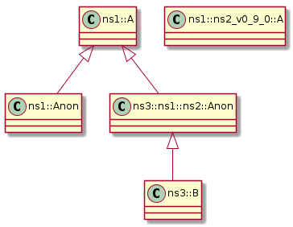

# t00015 - Namespace fun
## Config
```yaml
compilation_database_dir: ..
output_directory: puml
diagrams:
  t00015_class:
    type: class
    glob:
      - ../../tests/t00015/t00015.cc
    using_namespace:
      - clanguml::t00015
    include:
      namespaces:
        - clanguml::t00015

```
## Source code
File t00015.cc
```cpp
namespace clanguml {
namespace t00015 {

namespace ns1 {
inline namespace ns2_v1_0_0 {
class A {
};
}

namespace ns2_v0_9_0 {
class [[deprecated]] A {};
}

namespace {
class Anon final : public A {
};
}
}

namespace ns3 {

namespace ns1::ns2 {
class Anon : public t00015::ns1::A {
};
}

class B : public ns1::ns2::Anon {
};
}
}
}

```
## Generated UML diagrams

