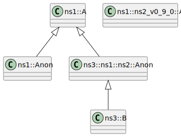

# t00015 - Namespace fun
## Config
```yaml
compilation_database_dir: ..
output_directory: puml
diagrams:
  t00015_class:
    type: class
    glob:
      - ../../tests/t00015/t00015.cc
    using_namespace:
      - clanguml::t00015
    include:
      namespaces:
        - clanguml::t00015

```
## Source code
File t00015.cc
```cpp
namespace clanguml {
namespace t00015 {

namespace ns1 {
inline namespace ns2_v1_0_0 {
class A { };
}

namespace ns2_v0_9_0 {
class [[deprecated]] A { };
}

namespace {
class Anon final : public A { };
}
} // namespace ns1

namespace ns3 {

namespace ns1::ns2 {
class Anon : public t00015::ns1::A { };
}

class B : public ns1::ns2::Anon { };
}
} // namespace t00015
} // namespace clanguml

```
## Generated UML diagrams

## Generated JSON models
```json
{
  "diagram_type": "class",
  "elements": [
    {
      "bases": [],
      "display_name": "clanguml::t00015::ns1::A",
      "id": "1410694888805149453",
      "is_abstract": false,
      "is_nested": false,
      "is_struct": false,
      "is_template": false,
      "is_union": false,
      "members": [],
      "methods": [],
      "name": "A",
      "namespace": "clanguml::t00015::ns1",
      "source_location": {
        "file": "../../tests/t00015/t00015.cc",
        "line": 6
      },
      "template_parameters": [],
      "type": "class"
    },
    {
      "bases": [],
      "display_name": "clanguml::t00015::ns1::ns2_v0_9_0::A",
      "id": "485552648049088863",
      "is_abstract": false,
      "is_nested": false,
      "is_struct": false,
      "is_template": false,
      "is_union": false,
      "members": [],
      "methods": [],
      "name": "A",
      "namespace": "clanguml::t00015::ns1::ns2_v0_9_0",
      "source_location": {
        "file": "../../tests/t00015/t00015.cc",
        "line": 10
      },
      "template_parameters": [],
      "type": "class"
    },
    {
      "bases": [
        {
          "access": "public",
          "id": "1410694888805149453",
          "is_virtual": false,
          "name": "clanguml::t00015::ns1::A"
        }
      ],
      "display_name": "clanguml::t00015::ns1::Anon",
      "id": "1060731132374575329",
      "is_abstract": false,
      "is_nested": false,
      "is_struct": false,
      "is_template": false,
      "is_union": false,
      "members": [],
      "methods": [],
      "name": "Anon",
      "namespace": "clanguml::t00015::ns1",
      "source_location": {
        "file": "../../tests/t00015/t00015.cc",
        "line": 14
      },
      "template_parameters": [],
      "type": "class"
    },
    {
      "bases": [
        {
          "access": "public",
          "id": "1410694888805149453",
          "is_virtual": false,
          "name": "clanguml::t00015::ns1::A"
        }
      ],
      "display_name": "clanguml::t00015::ns3::ns1::ns2::Anon",
      "id": "1797521288354158629",
      "is_abstract": false,
      "is_nested": false,
      "is_struct": false,
      "is_template": false,
      "is_union": false,
      "members": [],
      "methods": [],
      "name": "Anon",
      "namespace": "clanguml::t00015::ns3::ns1::ns2",
      "source_location": {
        "file": "../../tests/t00015/t00015.cc",
        "line": 21
      },
      "template_parameters": [],
      "type": "class"
    },
    {
      "bases": [
        {
          "access": "public",
          "id": "1797521288354158629",
          "is_virtual": false,
          "name": "clanguml::t00015::ns3::ns1::ns2::Anon"
        }
      ],
      "display_name": "clanguml::t00015::ns3::B",
      "id": "870882387819356092",
      "is_abstract": false,
      "is_nested": false,
      "is_struct": false,
      "is_template": false,
      "is_union": false,
      "members": [],
      "methods": [],
      "name": "B",
      "namespace": "clanguml::t00015::ns3",
      "source_location": {
        "file": "../../tests/t00015/t00015.cc",
        "line": 24
      },
      "template_parameters": [],
      "type": "class"
    }
  ],
  "metadata": {
    "clang_uml_version": "0.3.5",
    "llvm_version": "Ubuntu clang version 15.0.6",
    "schema_version": 1
  },
  "name": "t00015_class",
  "relationships": [
    {
      "access": "public",
      "destination": "1410694888805149453",
      "source": "1060731132374575329",
      "type": "extension"
    },
    {
      "access": "public",
      "destination": "1410694888805149453",
      "source": "1797521288354158629",
      "type": "extension"
    },
    {
      "access": "public",
      "destination": "1797521288354158629",
      "source": "870882387819356092",
      "type": "extension"
    }
  ],
  "using_namespace": "clanguml::t00015"
}
```
