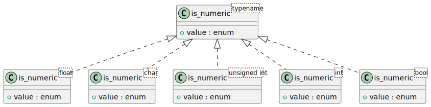

# t00016 - Unnamed enums and empty templates
## Config
```yaml
diagrams:
  t00016_class:
    type: class
    glob:
      - t00016.cc
    using_namespace: clanguml::t00016
    plantuml:
      style:
        instantiation: up
    include:
      namespaces:
        - clanguml::t00016

```
## Source code
File `tests/t00016/t00016.cc`
```cpp
namespace clanguml {
namespace t00016 {

template <typename> struct is_numeric {
    enum { value = false };
};

template <> struct is_numeric<float> {
    enum { value = true };
};

template <> struct is_numeric<char> {
    enum { value = true };
};

template <> struct is_numeric<unsigned int> {
    enum { value = true };
};

template <> struct is_numeric<int> {
    enum { value = true };
};

template <> struct is_numeric<bool> {
    enum { value = false };
};
} // namespace t00016
} // namespace clanguml

```
## Generated PlantUML diagrams

## Generated Mermaid diagrams

## Generated JSON models
```json
{
  "diagram_type": "class",
  "elements": [
    {
      "bases": [],
      "display_name": "is_numeric<typename>",
      "id": "7462850660467683116",
      "is_abstract": false,
      "is_nested": false,
      "is_struct": true,
      "is_template": true,
      "is_union": false,
      "members": [
        {
          "access": "public",
          "is_static": false,
          "name": "value",
          "type": "enum"
        }
      ],
      "methods": [],
      "name": "is_numeric",
      "namespace": "clanguml::t00016",
      "source_location": {
        "column": 28,
        "file": "t00016.cc",
        "line": 4,
        "translation_unit": "t00016.cc"
      },
      "template_parameters": [
        {
          "is_variadic": false,
          "kind": "template_type",
          "name": "typename",
          "template_parameters": []
        }
      ],
      "type": "class"
    },
    {
      "bases": [],
      "display_name": "is_numeric<float>",
      "id": "764946365186193592",
      "is_abstract": false,
      "is_nested": false,
      "is_struct": true,
      "is_template": true,
      "is_union": false,
      "members": [
        {
          "access": "public",
          "is_static": false,
          "name": "value",
          "type": "enum"
        }
      ],
      "methods": [],
      "name": "is_numeric",
      "namespace": "clanguml::t00016",
      "source_location": {
        "column": 20,
        "file": "t00016.cc",
        "line": 8,
        "translation_unit": "t00016.cc"
      },
      "template_parameters": [
        {
          "is_variadic": false,
          "kind": "argument",
          "template_parameters": [],
          "type": "float"
        }
      ],
      "type": "class"
    },
    {
      "bases": [],
      "display_name": "is_numeric<char>",
      "id": "7833035054326093824",
      "is_abstract": false,
      "is_nested": false,
      "is_struct": true,
      "is_template": true,
      "is_union": false,
      "members": [
        {
          "access": "public",
          "is_static": false,
          "name": "value",
          "type": "enum"
        }
      ],
      "methods": [],
      "name": "is_numeric",
      "namespace": "clanguml::t00016",
      "source_location": {
        "column": 20,
        "file": "t00016.cc",
        "line": 12,
        "translation_unit": "t00016.cc"
      },
      "template_parameters": [
        {
          "is_variadic": false,
          "kind": "argument",
          "template_parameters": [],
          "type": "char"
        }
      ],
      "type": "class"
    },
    {
      "bases": [],
      "display_name": "is_numeric<unsigned int>",
      "id": "16726301520218734694",
      "is_abstract": false,
      "is_nested": false,
      "is_struct": true,
      "is_template": true,
      "is_union": false,
      "members": [
        {
          "access": "public",
          "is_static": false,
          "name": "value",
          "type": "enum"
        }
      ],
      "methods": [],
      "name": "is_numeric",
      "namespace": "clanguml::t00016",
      "source_location": {
        "column": 20,
        "file": "t00016.cc",
        "line": 16,
        "translation_unit": "t00016.cc"
      },
      "template_parameters": [
        {
          "is_variadic": false,
          "kind": "argument",
          "template_parameters": [],
          "type": "unsigned int"
        }
      ],
      "type": "class"
    },
    {
      "bases": [],
      "display_name": "is_numeric<int>",
      "id": "4004824601899568602",
      "is_abstract": false,
      "is_nested": false,
      "is_struct": true,
      "is_template": true,
      "is_union": false,
      "members": [
        {
          "access": "public",
          "is_static": false,
          "name": "value",
          "type": "enum"
        }
      ],
      "methods": [],
      "name": "is_numeric",
      "namespace": "clanguml::t00016",
      "source_location": {
        "column": 20,
        "file": "t00016.cc",
        "line": 20,
        "translation_unit": "t00016.cc"
      },
      "template_parameters": [
        {
          "is_variadic": false,
          "kind": "argument",
          "template_parameters": [],
          "type": "int"
        }
      ],
      "type": "class"
    },
    {
      "bases": [],
      "display_name": "is_numeric<bool>",
      "id": "16890534700107359361",
      "is_abstract": false,
      "is_nested": false,
      "is_struct": true,
      "is_template": true,
      "is_union": false,
      "members": [
        {
          "access": "public",
          "is_static": false,
          "name": "value",
          "type": "enum"
        }
      ],
      "methods": [],
      "name": "is_numeric",
      "namespace": "clanguml::t00016",
      "source_location": {
        "column": 20,
        "file": "t00016.cc",
        "line": 24,
        "translation_unit": "t00016.cc"
      },
      "template_parameters": [
        {
          "is_variadic": false,
          "kind": "argument",
          "template_parameters": [],
          "type": "bool"
        }
      ],
      "type": "class"
    }
  ],
  "name": "t00016_class",
  "package_type": "namespace",
  "relationships": [
    {
      "access": "public",
      "destination": "7462850660467683116",
      "source": "764946365186193592",
      "type": "instantiation"
    },
    {
      "access": "public",
      "destination": "7462850660467683116",
      "source": "7833035054326093824",
      "type": "instantiation"
    },
    {
      "access": "public",
      "destination": "7462850660467683116",
      "source": "16726301520218734694",
      "type": "instantiation"
    },
    {
      "access": "public",
      "destination": "7462850660467683116",
      "source": "4004824601899568602",
      "type": "instantiation"
    },
    {
      "access": "public",
      "destination": "7462850660467683116",
      "source": "16890534700107359361",
      "type": "instantiation"
    }
  ],
  "using_namespace": "clanguml::t00016"
}
```
## Generated GraphML models
```xml
<?xml version="1.0"?>
<graphml xmlns="http://graphml.graphdrawing.org/xmlns" xmlns:xsi="http://www.w3.org/2001/XMLSchema-instance" xsi:schemaLocation="http://graphml.graphdrawing.org/xmlns http://graphml.graphdrawing.org/xmlns/1.0/graphml.xsd">
 <key attr.name="id" attr.type="string" for="graph" id="gd0" />
 <key attr.name="diagram_type" attr.type="string" for="graph" id="gd1" />
 <key attr.name="name" attr.type="string" for="graph" id="gd2" />
 <key attr.name="using_namespace" attr.type="string" for="graph" id="gd3" />
 <key attr.name="id" attr.type="string" for="node" id="nd0" />
 <key attr.name="type" attr.type="string" for="node" id="nd1" />
 <key attr.name="name" attr.type="string" for="node" id="nd2" />
 <key attr.name="stereotype" attr.type="string" for="node" id="nd3" />
 <key attr.name="url" attr.type="string" for="node" id="nd4" />
 <key attr.name="tooltip" attr.type="string" for="node" id="nd5" />
 <key attr.name="is_template" attr.type="boolean" for="node" id="nd6" />
 <key attr.name="type" attr.type="string" for="edge" id="ed0" />
 <key attr.name="access" attr.type="string" for="edge" id="ed1" />
 <key attr.name="label" attr.type="string" for="edge" id="ed2" />
 <key attr.name="url" attr.type="string" for="edge" id="ed3" />
 <graph id="g0" edgedefault="directed" parse.nodeids="canonical" parse.edgeids="canonical" parse.order="nodesfirst">
  <data key="gd3">clanguml::t00016</data>
  <node id="n0">
   <data key="nd1">class</data>
   <data key="nd2"><![CDATA[is_numeric<typename>]]></data>
   <data key="nd6">true</data>
   <data key="nd4">https://github.com/bkryza/clang-uml/blob/1fa698c8f418c67d7d8c4f8e23c3e56636a93f97/tests/t00016/t00016.cc#L4</data>
   <data key="nd5">is_numeric</data>
  </node>
  <node id="n1">
   <data key="nd1">class</data>
   <data key="nd2"><![CDATA[is_numeric<float>]]></data>
   <data key="nd6">true</data>
   <data key="nd4">https://github.com/bkryza/clang-uml/blob/1fa698c8f418c67d7d8c4f8e23c3e56636a93f97/tests/t00016/t00016.cc#L8</data>
   <data key="nd5">is_numeric</data>
  </node>
  <node id="n2">
   <data key="nd1">class</data>
   <data key="nd2"><![CDATA[is_numeric<char>]]></data>
   <data key="nd6">true</data>
   <data key="nd4">https://github.com/bkryza/clang-uml/blob/1fa698c8f418c67d7d8c4f8e23c3e56636a93f97/tests/t00016/t00016.cc#L12</data>
   <data key="nd5">is_numeric</data>
  </node>
  <node id="n3">
   <data key="nd1">class</data>
   <data key="nd2"><![CDATA[is_numeric<unsigned int>]]></data>
   <data key="nd6">true</data>
   <data key="nd4">https://github.com/bkryza/clang-uml/blob/1fa698c8f418c67d7d8c4f8e23c3e56636a93f97/tests/t00016/t00016.cc#L16</data>
   <data key="nd5">is_numeric</data>
  </node>
  <node id="n4">
   <data key="nd1">class</data>
   <data key="nd2"><![CDATA[is_numeric<int>]]></data>
   <data key="nd6">true</data>
   <data key="nd4">https://github.com/bkryza/clang-uml/blob/1fa698c8f418c67d7d8c4f8e23c3e56636a93f97/tests/t00016/t00016.cc#L20</data>
   <data key="nd5">is_numeric</data>
  </node>
  <node id="n5">
   <data key="nd1">class</data>
   <data key="nd2"><![CDATA[is_numeric<bool>]]></data>
   <data key="nd6">true</data>
   <data key="nd4">https://github.com/bkryza/clang-uml/blob/1fa698c8f418c67d7d8c4f8e23c3e56636a93f97/tests/t00016/t00016.cc#L24</data>
   <data key="nd5">is_numeric</data>
  </node>
  <edge id="e0" source="n1" target="n0">
   <data key="ed0">instantiation</data>
   <data key="ed1">public</data>
  </edge>
  <edge id="e1" source="n2" target="n0">
   <data key="ed0">instantiation</data>
   <data key="ed1">public</data>
  </edge>
  <edge id="e2" source="n3" target="n0">
   <data key="ed0">instantiation</data>
   <data key="ed1">public</data>
  </edge>
  <edge id="e3" source="n4" target="n0">
   <data key="ed0">instantiation</data>
   <data key="ed1">public</data>
  </edge>
  <edge id="e4" source="n5" target="n0">
   <data key="ed0">instantiation</data>
   <data key="ed1">public</data>
  </edge>
 </graph>
</graphml>

```
