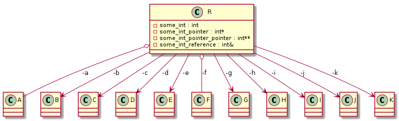

# t00017 - Test include relations also as members flag
## Config
```yaml
compilation_database_dir: ..
output_directory: puml
diagrams:
  t00017_class:
    type: class
    include_relations_also_as_members: false
    glob:
      - ../../tests/t00017/t00017.cc
    using_namespace:
      - clanguml::t00017
    include:
      namespaces:
        - clanguml::t00017

```
## Source code
File t00017.cc
```cpp
#include <utility>

namespace clanguml {
namespace t00017 {
class A {
};

class B {
};

class C {
};

class D {
};

class E {
};

class F {
};

class G {
};

class H {
};

class I {
};

class J {
};

class K {
};

class R {
    explicit R(int &some_int, C &cc, const E &ee, F &&ff, I *&ii)
        : some_int_reference{some_int}
        , c{cc}
        , e{ee}
        , f{std::move(ff)}
        , i{ii}
    {
    }

private:
    int some_int;
    int *some_int_pointer;
    int **some_int_pointer_pointer;
    int &some_int_reference;
    A a;
    B *b;
    C &c;
    const D *d;
    const E &e;
    F &&f;
    G **g;
    H ***h;
    I *&i;
    volatile J *j;
    mutable K *k;
};
}
}

```
## Generated UML diagrams

