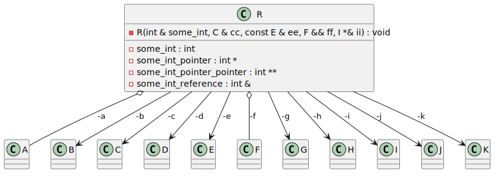

# t00017 - Test include relations also as members flag
## Config
```yaml
diagrams:
  t00017_class:
    type: class
    include_relations_also_as_members: false
    glob:
      - t00017.cc
    using_namespace: clanguml::t00017
    include:
      namespaces:
        - clanguml::t00017

```
## Source code
File `tests/t00017/t00017.cc`
```cpp
#include <utility>

namespace clanguml {
namespace t00017 {
class A { };

class B { };

class C { };

class D { };

class E { };

class F { };

class G { };

class H { };

class I { };

class J { };

class K { };

class R {
    explicit R(int &some_int, C &cc, const E &ee, F &&ff, I *&ii)
        : some_int_reference{some_int}
        , c{cc}
        , e{ee}
        , f{std::move(ff)}
        , i{ii}
    {
    }

private:
    int some_int;
    int *some_int_pointer;
    int **some_int_pointer_pointer;
    int &some_int_reference;
    A a;
    B *b;
    C &c;
    const D *d;
    const E &e;
    F &&f;
    G **g;
    H ***h;
    I *&i;
    volatile J *j;
    mutable K *k;
};
} // namespace t00017
} // namespace clanguml

```
## Generated PlantUML diagrams

## Generated Mermaid diagrams

## Generated JSON models
```json
{
  "diagram_type": "class",
  "elements": [
    {
      "bases": [],
      "display_name": "A",
      "id": "3582716305901830050",
      "is_abstract": false,
      "is_nested": false,
      "is_struct": false,
      "is_template": false,
      "is_union": false,
      "members": [],
      "methods": [],
      "name": "A",
      "namespace": "clanguml::t00017",
      "source_location": {
        "column": 7,
        "file": "t00017.cc",
        "line": 5,
        "translation_unit": "t00017.cc"
      },
      "template_parameters": [],
      "type": "class"
    },
    {
      "bases": [],
      "display_name": "B",
      "id": "14533982945890699658",
      "is_abstract": false,
      "is_nested": false,
      "is_struct": false,
      "is_template": false,
      "is_union": false,
      "members": [],
      "methods": [],
      "name": "B",
      "namespace": "clanguml::t00017",
      "source_location": {
        "column": 7,
        "file": "t00017.cc",
        "line": 7,
        "translation_unit": "t00017.cc"
      },
      "template_parameters": [],
      "type": "class"
    },
    {
      "bases": [],
      "display_name": "C",
      "id": "9112307839615470637",
      "is_abstract": false,
      "is_nested": false,
      "is_struct": false,
      "is_template": false,
      "is_union": false,
      "members": [],
      "methods": [],
      "name": "C",
      "namespace": "clanguml::t00017",
      "source_location": {
        "column": 7,
        "file": "t00017.cc",
        "line": 9,
        "translation_unit": "t00017.cc"
      },
      "template_parameters": [],
      "type": "class"
    },
    {
      "bases": [],
      "display_name": "D",
      "id": "7780908759075965333",
      "is_abstract": false,
      "is_nested": false,
      "is_struct": false,
      "is_template": false,
      "is_union": false,
      "members": [],
      "methods": [],
      "name": "D",
      "namespace": "clanguml::t00017",
      "source_location": {
        "column": 7,
        "file": "t00017.cc",
        "line": 11,
        "translation_unit": "t00017.cc"
      },
      "template_parameters": [],
      "type": "class"
    },
    {
      "bases": [],
      "display_name": "E",
      "id": "13933921556061569664",
      "is_abstract": false,
      "is_nested": false,
      "is_struct": false,
      "is_template": false,
      "is_union": false,
      "members": [],
      "methods": [],
      "name": "E",
      "namespace": "clanguml::t00017",
      "source_location": {
        "column": 7,
        "file": "t00017.cc",
        "line": 13,
        "translation_unit": "t00017.cc"
      },
      "template_parameters": [],
      "type": "class"
    },
    {
      "bases": [],
      "display_name": "F",
      "id": "12699656337484767121",
      "is_abstract": false,
      "is_nested": false,
      "is_struct": false,
      "is_template": false,
      "is_union": false,
      "members": [],
      "methods": [],
      "name": "F",
      "namespace": "clanguml::t00017",
      "source_location": {
        "column": 7,
        "file": "t00017.cc",
        "line": 15,
        "translation_unit": "t00017.cc"
      },
      "template_parameters": [],
      "type": "class"
    },
    {
      "bases": [],
      "display_name": "G",
      "id": "8537906258161044273",
      "is_abstract": false,
      "is_nested": false,
      "is_struct": false,
      "is_template": false,
      "is_union": false,
      "members": [],
      "methods": [],
      "name": "G",
      "namespace": "clanguml::t00017",
      "source_location": {
        "column": 7,
        "file": "t00017.cc",
        "line": 17,
        "translation_unit": "t00017.cc"
      },
      "template_parameters": [],
      "type": "class"
    },
    {
      "bases": [],
      "display_name": "H",
      "id": "4730342379030749470",
      "is_abstract": false,
      "is_nested": false,
      "is_struct": false,
      "is_template": false,
      "is_union": false,
      "members": [],
      "methods": [],
      "name": "H",
      "namespace": "clanguml::t00017",
      "source_location": {
        "column": 7,
        "file": "t00017.cc",
        "line": 19,
        "translation_unit": "t00017.cc"
      },
      "template_parameters": [],
      "type": "class"
    },
    {
      "bases": [],
      "display_name": "I",
      "id": "3508947993881363041",
      "is_abstract": false,
      "is_nested": false,
      "is_struct": false,
      "is_template": false,
      "is_union": false,
      "members": [],
      "methods": [],
      "name": "I",
      "namespace": "clanguml::t00017",
      "source_location": {
        "column": 7,
        "file": "t00017.cc",
        "line": 21,
        "translation_unit": "t00017.cc"
      },
      "template_parameters": [],
      "type": "class"
    },
    {
      "bases": [],
      "display_name": "J",
      "id": "11327011142816104892",
      "is_abstract": false,
      "is_nested": false,
      "is_struct": false,
      "is_template": false,
      "is_union": false,
      "members": [],
      "methods": [],
      "name": "J",
      "namespace": "clanguml::t00017",
      "source_location": {
        "column": 7,
        "file": "t00017.cc",
        "line": 23,
        "translation_unit": "t00017.cc"
      },
      "template_parameters": [],
      "type": "class"
    },
    {
      "bases": [],
      "display_name": "K",
      "id": "1011799438760475247",
      "is_abstract": false,
      "is_nested": false,
      "is_struct": false,
      "is_template": false,
      "is_union": false,
      "members": [],
      "methods": [],
      "name": "K",
      "namespace": "clanguml::t00017",
      "source_location": {
        "column": 7,
        "file": "t00017.cc",
        "line": 25,
        "translation_unit": "t00017.cc"
      },
      "template_parameters": [],
      "type": "class"
    },
    {
      "bases": [],
      "display_name": "R",
      "id": "8257392420334791563",
      "is_abstract": false,
      "is_nested": false,
      "is_struct": false,
      "is_template": false,
      "is_union": false,
      "members": [
        {
          "access": "private",
          "is_static": false,
          "name": "some_int",
          "source_location": {
            "column": 9,
            "file": "t00017.cc",
            "line": 38,
            "translation_unit": "t00017.cc"
          },
          "type": "int"
        },
        {
          "access": "private",
          "is_static": false,
          "name": "some_int_pointer",
          "source_location": {
            "column": 10,
            "file": "t00017.cc",
            "line": 39,
            "translation_unit": "t00017.cc"
          },
          "type": "int *"
        },
        {
          "access": "private",
          "is_static": false,
          "name": "some_int_pointer_pointer",
          "source_location": {
            "column": 11,
            "file": "t00017.cc",
            "line": 40,
            "translation_unit": "t00017.cc"
          },
          "type": "int **"
        },
        {
          "access": "private",
          "is_static": false,
          "name": "some_int_reference",
          "source_location": {
            "column": 10,
            "file": "t00017.cc",
            "line": 41,
            "translation_unit": "t00017.cc"
          },
          "type": "int &"
        },
        {
          "access": "private",
          "is_static": false,
          "name": "a",
          "source_location": {
            "column": 7,
            "file": "t00017.cc",
            "line": 42,
            "translation_unit": "t00017.cc"
          },
          "type": "A"
        },
        {
          "access": "private",
          "is_static": false,
          "name": "b",
          "source_location": {
            "column": 8,
            "file": "t00017.cc",
            "line": 43,
            "translation_unit": "t00017.cc"
          },
          "type": "B *"
        },
        {
          "access": "private",
          "is_static": false,
          "name": "c",
          "source_location": {
            "column": 8,
            "file": "t00017.cc",
            "line": 44,
            "translation_unit": "t00017.cc"
          },
          "type": "C &"
        },
        {
          "access": "private",
          "is_static": false,
          "name": "d",
          "source_location": {
            "column": 14,
            "file": "t00017.cc",
            "line": 45,
            "translation_unit": "t00017.cc"
          },
          "type": "const D *"
        },
        {
          "access": "private",
          "is_static": false,
          "name": "e",
          "source_location": {
            "column": 14,
            "file": "t00017.cc",
            "line": 46,
            "translation_unit": "t00017.cc"
          },
          "type": "const E &"
        },
        {
          "access": "private",
          "is_static": false,
          "name": "f",
          "source_location": {
            "column": 9,
            "file": "t00017.cc",
            "line": 47,
            "translation_unit": "t00017.cc"
          },
          "type": "F &&"
        },
        {
          "access": "private",
          "is_static": false,
          "name": "g",
          "source_location": {
            "column": 9,
            "file": "t00017.cc",
            "line": 48,
            "translation_unit": "t00017.cc"
          },
          "type": "G **"
        },
        {
          "access": "private",
          "is_static": false,
          "name": "h",
          "source_location": {
            "column": 10,
            "file": "t00017.cc",
            "line": 49,
            "translation_unit": "t00017.cc"
          },
          "type": "H ***"
        },
        {
          "access": "private",
          "is_static": false,
          "name": "i",
          "source_location": {
            "column": 9,
            "file": "t00017.cc",
            "line": 50,
            "translation_unit": "t00017.cc"
          },
          "type": "I *&"
        },
        {
          "access": "private",
          "is_static": false,
          "name": "j",
          "source_location": {
            "column": 17,
            "file": "t00017.cc",
            "line": 51,
            "translation_unit": "t00017.cc"
          },
          "type": "volatile J *"
        },
        {
          "access": "private",
          "is_static": false,
          "name": "k",
          "source_location": {
            "column": 16,
            "file": "t00017.cc",
            "line": 52,
            "translation_unit": "t00017.cc"
          },
          "type": "K *"
        }
      ],
      "methods": [
        {
          "access": "private",
          "display_name": "R",
          "is_const": false,
          "is_consteval": false,
          "is_constexpr": false,
          "is_constructor": true,
          "is_copy_assignment": false,
          "is_coroutine": false,
          "is_defaulted": false,
          "is_deleted": false,
          "is_move_assignment": false,
          "is_noexcept": false,
          "is_operator": false,
          "is_pure_virtual": false,
          "is_static": false,
          "is_virtual": false,
          "name": "R",
          "parameters": [
            {
              "name": "some_int",
              "type": "int &"
            },
            {
              "name": "cc",
              "type": "C &"
            },
            {
              "name": "ee",
              "type": "const E &"
            },
            {
              "name": "ff",
              "type": "F &&"
            },
            {
              "name": "ii",
              "type": "I *&"
            }
          ],
          "source_location": {
            "column": 14,
            "file": "t00017.cc",
            "line": 28,
            "translation_unit": "t00017.cc"
          },
          "template_parameters": [],
          "type": "void"
        }
      ],
      "name": "R",
      "namespace": "clanguml::t00017",
      "source_location": {
        "column": 7,
        "file": "t00017.cc",
        "line": 27,
        "translation_unit": "t00017.cc"
      },
      "template_parameters": [],
      "type": "class"
    }
  ],
  "name": "t00017_class",
  "package_type": "namespace",
  "relationships": [
    {
      "access": "private",
      "destination": "3582716305901830050",
      "label": "a",
      "source": "8257392420334791563",
      "type": "aggregation"
    },
    {
      "access": "private",
      "destination": "14533982945890699658",
      "label": "b",
      "source": "8257392420334791563",
      "type": "association"
    },
    {
      "access": "private",
      "destination": "9112307839615470637",
      "label": "c",
      "source": "8257392420334791563",
      "type": "association"
    },
    {
      "access": "private",
      "destination": "7780908759075965333",
      "label": "d",
      "source": "8257392420334791563",
      "type": "association"
    },
    {
      "access": "private",
      "destination": "13933921556061569664",
      "label": "e",
      "source": "8257392420334791563",
      "type": "association"
    },
    {
      "access": "private",
      "destination": "12699656337484767121",
      "label": "f",
      "source": "8257392420334791563",
      "type": "aggregation"
    },
    {
      "access": "private",
      "destination": "8537906258161044273",
      "label": "g",
      "source": "8257392420334791563",
      "type": "association"
    },
    {
      "access": "private",
      "destination": "4730342379030749470",
      "label": "h",
      "source": "8257392420334791563",
      "type": "association"
    },
    {
      "access": "private",
      "destination": "3508947993881363041",
      "label": "i",
      "source": "8257392420334791563",
      "type": "association"
    },
    {
      "access": "private",
      "destination": "11327011142816104892",
      "label": "j",
      "source": "8257392420334791563",
      "type": "association"
    },
    {
      "access": "private",
      "destination": "1011799438760475247",
      "label": "k",
      "source": "8257392420334791563",
      "type": "association"
    }
  ],
  "using_namespace": "clanguml::t00017"
}
```
## Generated GraphML models
```xml
<?xml version="1.0"?>
<graphml xmlns="http://graphml.graphdrawing.org/xmlns" xmlns:xsi="http://www.w3.org/2001/XMLSchema-instance" xsi:schemaLocation="http://graphml.graphdrawing.org/xmlns http://graphml.graphdrawing.org/xmlns/1.0/graphml.xsd">
 <key attr.name="id" attr.type="string" for="graph" id="gd0" />
 <key attr.name="diagram_type" attr.type="string" for="graph" id="gd1" />
 <key attr.name="name" attr.type="string" for="graph" id="gd2" />
 <key attr.name="using_namespace" attr.type="string" for="graph" id="gd3" />
 <key attr.name="id" attr.type="string" for="node" id="nd0" />
 <key attr.name="type" attr.type="string" for="node" id="nd1" />
 <key attr.name="name" attr.type="string" for="node" id="nd2" />
 <key attr.name="stereotype" attr.type="string" for="node" id="nd3" />
 <key attr.name="url" attr.type="string" for="node" id="nd4" />
 <key attr.name="tooltip" attr.type="string" for="node" id="nd5" />
 <key attr.name="is_template" attr.type="boolean" for="node" id="nd6" />
 <key attr.name="type" attr.type="string" for="edge" id="ed0" />
 <key attr.name="access" attr.type="string" for="edge" id="ed1" />
 <key attr.name="label" attr.type="string" for="edge" id="ed2" />
 <key attr.name="url" attr.type="string" for="edge" id="ed3" />
 <graph id="g0" edgedefault="directed" parse.nodeids="canonical" parse.edgeids="canonical" parse.order="nodesfirst">
  <data key="gd3">clanguml::t00017</data>
  <node id="n0">
   <data key="nd1">class</data>
   <data key="nd2"><![CDATA[A]]></data>
   <data key="nd6">false</data>
  </node>
  <node id="n1">
   <data key="nd1">class</data>
   <data key="nd2"><![CDATA[B]]></data>
   <data key="nd6">false</data>
  </node>
  <node id="n2">
   <data key="nd1">class</data>
   <data key="nd2"><![CDATA[C]]></data>
   <data key="nd6">false</data>
  </node>
  <node id="n3">
   <data key="nd1">class</data>
   <data key="nd2"><![CDATA[D]]></data>
   <data key="nd6">false</data>
  </node>
  <node id="n4">
   <data key="nd1">class</data>
   <data key="nd2"><![CDATA[E]]></data>
   <data key="nd6">false</data>
  </node>
  <node id="n5">
   <data key="nd1">class</data>
   <data key="nd2"><![CDATA[F]]></data>
   <data key="nd6">false</data>
  </node>
  <node id="n6">
   <data key="nd1">class</data>
   <data key="nd2"><![CDATA[G]]></data>
   <data key="nd6">false</data>
  </node>
  <node id="n7">
   <data key="nd1">class</data>
   <data key="nd2"><![CDATA[H]]></data>
   <data key="nd6">false</data>
  </node>
  <node id="n8">
   <data key="nd1">class</data>
   <data key="nd2"><![CDATA[I]]></data>
   <data key="nd6">false</data>
  </node>
  <node id="n9">
   <data key="nd1">class</data>
   <data key="nd2"><![CDATA[J]]></data>
   <data key="nd6">false</data>
  </node>
  <node id="n10">
   <data key="nd1">class</data>
   <data key="nd2"><![CDATA[K]]></data>
   <data key="nd6">false</data>
  </node>
  <node id="n11">
   <data key="nd1">class</data>
   <data key="nd2"><![CDATA[R]]></data>
   <data key="nd6">false</data>
  </node>
  <edge id="e0" source="n11" target="n0">
   <data key="ed0">aggregation</data>
   <data key="ed2">a</data>
   <data key="ed1">private</data>
  </edge>
  <edge id="e1" source="n11" target="n1">
   <data key="ed0">association</data>
   <data key="ed2">b</data>
   <data key="ed1">private</data>
  </edge>
  <edge id="e2" source="n11" target="n2">
   <data key="ed0">association</data>
   <data key="ed2">c</data>
   <data key="ed1">private</data>
  </edge>
  <edge id="e3" source="n11" target="n3">
   <data key="ed0">association</data>
   <data key="ed2">d</data>
   <data key="ed1">private</data>
  </edge>
  <edge id="e4" source="n11" target="n4">
   <data key="ed0">association</data>
   <data key="ed2">e</data>
   <data key="ed1">private</data>
  </edge>
  <edge id="e5" source="n11" target="n5">
   <data key="ed0">aggregation</data>
   <data key="ed2">f</data>
   <data key="ed1">private</data>
  </edge>
  <edge id="e6" source="n11" target="n6">
   <data key="ed0">association</data>
   <data key="ed2">g</data>
   <data key="ed1">private</data>
  </edge>
  <edge id="e7" source="n11" target="n7">
   <data key="ed0">association</data>
   <data key="ed2">h</data>
   <data key="ed1">private</data>
  </edge>
  <edge id="e8" source="n11" target="n8">
   <data key="ed0">association</data>
   <data key="ed2">i</data>
   <data key="ed1">private</data>
  </edge>
  <edge id="e9" source="n11" target="n9">
   <data key="ed0">association</data>
   <data key="ed2">j</data>
   <data key="ed1">private</data>
  </edge>
  <edge id="e10" source="n11" target="n10">
   <data key="ed0">association</data>
   <data key="ed2">k</data>
   <data key="ed1">private</data>
  </edge>
 </graph>
</graphml>

```
