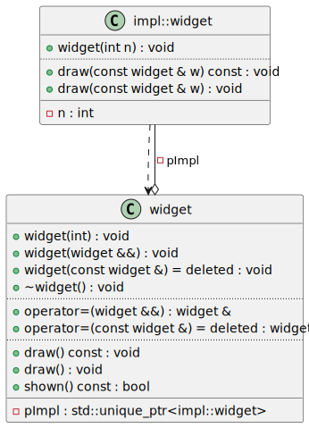

# t00018 - Pimpl pattern
## Config
```yaml
diagrams:
  t00018_class:
    type: class
    glob:
      - "*.cc"
    using_namespace: clanguml::t00018
    include:
      namespaces:
        - clanguml::t00018

```
## Source code
File `tests/t00018/t00018.h`
```cpp
#pragma once

#ifndef _MSC_VER
#include <experimental/propagate_const>
#endif
#include <iostream>
#include <memory>

namespace clanguml {
namespace t00018 {

namespace impl {
class widget;
}

// Pimpl example based on https://en.cppreference.com/w/cpp/language/pimpl
class widget {
    std::unique_ptr<impl::widget> pImpl;

public:
    void draw() const;
    void draw();
    bool shown() const { return true; }
    widget(int);
    ~widget();

    widget(widget &&);

    widget(const widget &) = delete;
    widget &operator=(widget &&);
    widget &operator=(const widget &) = delete;
};
}
}

```
File `tests/t00018/t00018_impl.h`
```cpp
#pragma once

#include "t00018.h"

namespace clanguml {
namespace t00018 {
namespace impl {

class widget {
    int n;

public:
    void draw(const clanguml::t00018::widget &w) const;
    void draw(const clanguml::t00018::widget &w);
    widget(int n);
};
}
}
}

```
File `tests/t00018/t00018.cc`
```cpp
#include "t00018.h"
#include "t00018_impl.h"

namespace clanguml {
namespace t00018 {

void widget::draw() const { pImpl->draw(*this); }

void widget::draw() { pImpl->draw(*this); }

widget::widget(int n)
    : pImpl{std::make_unique<impl::widget>(n)}
{
}

widget::widget(widget &&) = default;

widget::~widget() = default;

widget &widget::operator=(widget &&) = default;
} // namespace t00018
} // namespace clanguml

```
File `tests/t00018/t00018_impl.cc`
```cpp
#include "t00018_impl.h"
#include "t00018.h"

namespace clanguml {
namespace t00018 {
namespace impl {

widget::widget(int n)
    : n(n)
{
}

void widget::draw(const clanguml::t00018::widget &w) const
{
    if (w.shown())
        std::cout << "drawing a const widget " << n << '\n';
}

void widget::draw(const clanguml::t00018::widget &w)
{
    if (w.shown())
        std::cout << "drawing a non-const widget " << n << '\n';
}
} // namespace impl
} // namespace t00018
} // namespace clanguml

```
## Generated PlantUML diagrams

## Generated Mermaid diagrams

## Generated JSON models
```json
{
  "diagram_type": "class",
  "elements": [
    {
      "bases": [],
      "display_name": "impl::widget",
      "id": "130502639682787993",
      "is_abstract": false,
      "is_nested": false,
      "is_struct": false,
      "is_template": false,
      "is_union": false,
      "members": [
        {
          "access": "private",
          "is_static": false,
          "name": "n",
          "source_location": {
            "column": 9,
            "file": "t00018_impl.h",
            "line": 10,
            "translation_unit": "t00018.cc"
          },
          "type": "int"
        }
      ],
      "methods": [
        {
          "access": "public",
          "display_name": "draw",
          "is_const": true,
          "is_consteval": false,
          "is_constexpr": false,
          "is_constructor": false,
          "is_copy_assignment": false,
          "is_coroutine": false,
          "is_defaulted": false,
          "is_deleted": false,
          "is_move_assignment": false,
          "is_noexcept": false,
          "is_operator": false,
          "is_pure_virtual": false,
          "is_static": false,
          "is_virtual": false,
          "name": "draw",
          "parameters": [
            {
              "name": "w",
              "type": "const clanguml::t00018::widget &"
            }
          ],
          "source_location": {
            "column": 10,
            "file": "t00018_impl.h",
            "line": 13,
            "translation_unit": "t00018.cc"
          },
          "template_parameters": [],
          "type": "void"
        },
        {
          "access": "public",
          "display_name": "draw",
          "is_const": false,
          "is_consteval": false,
          "is_constexpr": false,
          "is_constructor": false,
          "is_copy_assignment": false,
          "is_coroutine": false,
          "is_defaulted": false,
          "is_deleted": false,
          "is_move_assignment": false,
          "is_noexcept": false,
          "is_operator": false,
          "is_pure_virtual": false,
          "is_static": false,
          "is_virtual": false,
          "name": "draw",
          "parameters": [
            {
              "name": "w",
              "type": "const clanguml::t00018::widget &"
            }
          ],
          "source_location": {
            "column": 10,
            "file": "t00018_impl.h",
            "line": 14,
            "translation_unit": "t00018.cc"
          },
          "template_parameters": [],
          "type": "void"
        },
        {
          "access": "public",
          "display_name": "widget",
          "is_const": false,
          "is_consteval": false,
          "is_constexpr": false,
          "is_constructor": true,
          "is_copy_assignment": false,
          "is_coroutine": false,
          "is_defaulted": false,
          "is_deleted": false,
          "is_move_assignment": false,
          "is_noexcept": false,
          "is_operator": false,
          "is_pure_virtual": false,
          "is_static": false,
          "is_virtual": false,
          "name": "widget",
          "parameters": [
            {
              "name": "n",
              "type": "int"
            }
          ],
          "source_location": {
            "column": 5,
            "file": "t00018_impl.h",
            "line": 15,
            "translation_unit": "t00018.cc"
          },
          "template_parameters": [],
          "type": "void"
        }
      ],
      "name": "widget",
      "namespace": "clanguml::t00018::impl",
      "source_location": {
        "column": 7,
        "file": "t00018_impl.h",
        "line": 9,
        "translation_unit": "t00018.cc"
      },
      "template_parameters": [],
      "type": "class"
    },
    {
      "bases": [],
      "display_name": "widget",
      "id": "1005661284373854088",
      "is_abstract": false,
      "is_nested": false,
      "is_struct": false,
      "is_template": false,
      "is_union": false,
      "members": [
        {
          "access": "private",
          "is_static": false,
          "name": "pImpl",
          "source_location": {
            "column": 35,
            "file": "t00018.h",
            "line": 18,
            "translation_unit": "t00018.cc"
          },
          "type": "std::unique_ptr<impl::widget>"
        }
      ],
      "methods": [
        {
          "access": "public",
          "display_name": "draw",
          "is_const": true,
          "is_consteval": false,
          "is_constexpr": false,
          "is_constructor": false,
          "is_copy_assignment": false,
          "is_coroutine": false,
          "is_defaulted": false,
          "is_deleted": false,
          "is_move_assignment": false,
          "is_noexcept": false,
          "is_operator": false,
          "is_pure_virtual": false,
          "is_static": false,
          "is_virtual": false,
          "name": "draw",
          "parameters": [],
          "source_location": {
            "column": 10,
            "file": "t00018.h",
            "line": 21,
            "translation_unit": "t00018.cc"
          },
          "template_parameters": [],
          "type": "void"
        },
        {
          "access": "public",
          "display_name": "draw",
          "is_const": false,
          "is_consteval": false,
          "is_constexpr": false,
          "is_constructor": false,
          "is_copy_assignment": false,
          "is_coroutine": false,
          "is_defaulted": false,
          "is_deleted": false,
          "is_move_assignment": false,
          "is_noexcept": false,
          "is_operator": false,
          "is_pure_virtual": false,
          "is_static": false,
          "is_virtual": false,
          "name": "draw",
          "parameters": [],
          "source_location": {
            "column": 10,
            "file": "t00018.h",
            "line": 22,
            "translation_unit": "t00018.cc"
          },
          "template_parameters": [],
          "type": "void"
        },
        {
          "access": "public",
          "display_name": "shown",
          "is_const": true,
          "is_consteval": false,
          "is_constexpr": false,
          "is_constructor": false,
          "is_copy_assignment": false,
          "is_coroutine": false,
          "is_defaulted": false,
          "is_deleted": false,
          "is_move_assignment": false,
          "is_noexcept": false,
          "is_operator": false,
          "is_pure_virtual": false,
          "is_static": false,
          "is_virtual": false,
          "name": "shown",
          "parameters": [],
          "source_location": {
            "column": 10,
            "file": "t00018.h",
            "line": 23,
            "translation_unit": "t00018.cc"
          },
          "template_parameters": [],
          "type": "bool"
        },
        {
          "access": "public",
          "display_name": "widget",
          "is_const": false,
          "is_consteval": false,
          "is_constexpr": false,
          "is_constructor": true,
          "is_copy_assignment": false,
          "is_coroutine": false,
          "is_defaulted": false,
          "is_deleted": false,
          "is_move_assignment": false,
          "is_noexcept": false,
          "is_operator": false,
          "is_pure_virtual": false,
          "is_static": false,
          "is_virtual": false,
          "name": "widget",
          "parameters": [
            {
              "name": "",
              "type": "int"
            }
          ],
          "source_location": {
            "column": 5,
            "file": "t00018.h",
            "line": 24,
            "translation_unit": "t00018.cc"
          },
          "template_parameters": [],
          "type": "void"
        },
        {
          "access": "public",
          "display_name": "~widget",
          "is_const": false,
          "is_consteval": false,
          "is_constexpr": false,
          "is_constructor": false,
          "is_copy_assignment": false,
          "is_coroutine": false,
          "is_defaulted": false,
          "is_deleted": false,
          "is_move_assignment": false,
          "is_noexcept": false,
          "is_operator": false,
          "is_pure_virtual": false,
          "is_static": false,
          "is_virtual": false,
          "name": "~widget",
          "parameters": [],
          "source_location": {
            "column": 5,
            "file": "t00018.h",
            "line": 25,
            "translation_unit": "t00018.cc"
          },
          "template_parameters": [],
          "type": "void"
        },
        {
          "access": "public",
          "display_name": "widget",
          "is_const": false,
          "is_consteval": false,
          "is_constexpr": false,
          "is_constructor": true,
          "is_copy_assignment": false,
          "is_coroutine": false,
          "is_defaulted": false,
          "is_deleted": false,
          "is_move_assignment": false,
          "is_noexcept": false,
          "is_operator": false,
          "is_pure_virtual": false,
          "is_static": false,
          "is_virtual": false,
          "name": "widget",
          "parameters": [
            {
              "name": "",
              "type": "widget &&"
            }
          ],
          "source_location": {
            "column": 5,
            "file": "t00018.h",
            "line": 27,
            "translation_unit": "t00018.cc"
          },
          "template_parameters": [],
          "type": "void"
        },
        {
          "access": "public",
          "display_name": "widget",
          "is_const": false,
          "is_consteval": false,
          "is_constexpr": false,
          "is_constructor": true,
          "is_copy_assignment": false,
          "is_coroutine": false,
          "is_defaulted": false,
          "is_deleted": true,
          "is_move_assignment": false,
          "is_noexcept": false,
          "is_operator": false,
          "is_pure_virtual": false,
          "is_static": false,
          "is_virtual": false,
          "name": "widget",
          "parameters": [
            {
              "name": "",
              "type": "const widget &"
            }
          ],
          "source_location": {
            "column": 5,
            "file": "t00018.h",
            "line": 29,
            "translation_unit": "t00018.cc"
          },
          "template_parameters": [],
          "type": "void"
        },
        {
          "access": "public",
          "display_name": "operator=",
          "is_const": false,
          "is_consteval": false,
          "is_constexpr": false,
          "is_constructor": false,
          "is_copy_assignment": false,
          "is_coroutine": false,
          "is_defaulted": false,
          "is_deleted": false,
          "is_move_assignment": true,
          "is_noexcept": false,
          "is_operator": true,
          "is_pure_virtual": false,
          "is_static": false,
          "is_virtual": false,
          "name": "operator=",
          "parameters": [
            {
              "name": "",
              "type": "widget &&"
            }
          ],
          "source_location": {
            "column": 13,
            "file": "t00018.h",
            "line": 30,
            "translation_unit": "t00018.cc"
          },
          "template_parameters": [],
          "type": "widget &"
        },
        {
          "access": "public",
          "display_name": "operator=",
          "is_const": false,
          "is_consteval": false,
          "is_constexpr": false,
          "is_constructor": false,
          "is_copy_assignment": true,
          "is_coroutine": false,
          "is_defaulted": false,
          "is_deleted": true,
          "is_move_assignment": false,
          "is_noexcept": false,
          "is_operator": true,
          "is_pure_virtual": false,
          "is_static": false,
          "is_virtual": false,
          "name": "operator=",
          "parameters": [
            {
              "name": "",
              "type": "const widget &"
            }
          ],
          "source_location": {
            "column": 13,
            "file": "t00018.h",
            "line": 31,
            "translation_unit": "t00018.cc"
          },
          "template_parameters": [],
          "type": "widget &"
        }
      ],
      "name": "widget",
      "namespace": "clanguml::t00018",
      "source_location": {
        "column": 7,
        "file": "t00018.h",
        "line": 17,
        "translation_unit": "t00018.cc"
      },
      "template_parameters": [],
      "type": "class"
    }
  ],
  "name": "t00018_class",
  "package_type": "namespace",
  "relationships": [
    {
      "access": "public",
      "destination": "1005661284373854088",
      "source": "130502639682787993",
      "type": "dependency"
    },
    {
      "access": "private",
      "destination": "130502639682787993",
      "label": "pImpl",
      "source": "1005661284373854088",
      "type": "aggregation"
    }
  ],
  "using_namespace": "clanguml::t00018"
}
```
