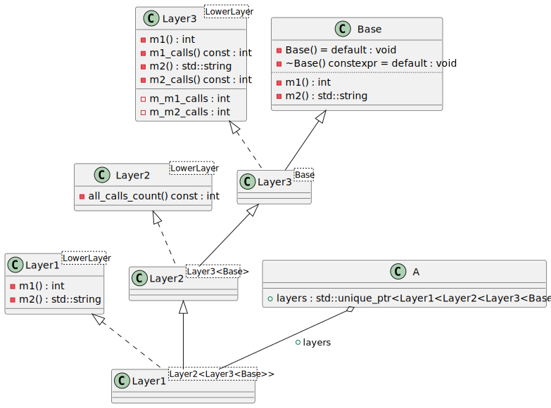

# t00019 - Layercake pattern
## Config
```yaml
diagrams:
  t00019_class:
    type: class
    glob:
      - "*.cc"
    generate_template_argument_dependencies: false
    using_namespace: clanguml::t00019
    plantuml:
      style:
        instantiation: up
    include:
      namespaces:
        - clanguml::t00019

```
## Source code
File `tests/t00019/t00019_layer1.h`
```cpp
#pragma once

#include <iostream>
#include <string>

namespace clanguml {
namespace t00019 {

template <typename LowerLayer> class Layer1 : public LowerLayer {

    using LowerLayer::LowerLayer;

    int m1() override
    {
        std::cout << "m1 called\n";
        return LowerLayer::m1();
    }

    std::string m2() override
    {
        std::cout << "m2 called\n";
        return LowerLayer::m2();
    }
};
}
}

```
File `tests/t00019/t00019.cc`
```cpp
#include "t00019_base.h"
#include "t00019_layer1.h"
#include "t00019_layer2.h"
#include "t00019_layer3.h"

#include <memory>

namespace clanguml {
namespace t00019 {

class A {
public:
    std::unique_ptr<Layer1<Layer2<Layer3<Base>>>> layers;
};
}
}

```
File `tests/t00019/t00019_layer2.h`
```cpp
#pragma once

namespace clanguml {
namespace t00019 {

template <typename LowerLayer> class Layer2 : public LowerLayer {

    using LowerLayer::LowerLayer;

    using LowerLayer::m1;

    using LowerLayer::m2;

    int all_calls_count() const
    {
        return LowerLayer::m1_calls() + LowerLayer::m2_calls();
    }
};
}
}

```
File `tests/t00019/t00019_layer3.h`
```cpp
#pragma once

#include <string>

namespace clanguml {
namespace t00019 {

template <typename LowerLayer> class Layer3 : public LowerLayer {

    using LowerLayer::LowerLayer;

    virtual int m1() override
    {
        m_m1_calls++;
        return LowerLayer::m1();
    }

    virtual std::string m2() override
    {
        m_m2_calls++;
        return LowerLayer::m2();
    }

    int m1_calls() const { return m_m1_calls; }

    int m2_calls() const { return m_m2_calls; }

private:
    int m_m1_calls{};
    int m_m2_calls{};
};
}
}

```
File `tests/t00019/t00019_base.h`
```cpp
#pragma once

#include <string>

namespace clanguml {
namespace t00019 {

class Base {

    Base() = default;

    virtual ~Base() = default;

    virtual int m1() { return 2; }

    virtual std::string m2() { return "two"; }
};
}
}

```
## Generated PlantUML diagrams

## Generated Mermaid diagrams

## Generated JSON models
```json
{
  "diagram_type": "class",
  "elements": [
    {
      "bases": [],
      "display_name": "Base",
      "id": "261668487476634123",
      "is_abstract": false,
      "is_nested": false,
      "is_struct": false,
      "is_template": false,
      "is_union": false,
      "members": [],
      "methods": [
        {
          "access": "private",
          "display_name": "Base",
          "is_const": false,
          "is_consteval": false,
          "is_constexpr": false,
          "is_constructor": true,
          "is_copy_assignment": false,
          "is_coroutine": false,
          "is_defaulted": true,
          "is_deleted": false,
          "is_move_assignment": false,
          "is_noexcept": false,
          "is_operator": false,
          "is_pure_virtual": false,
          "is_static": false,
          "is_virtual": false,
          "name": "Base",
          "parameters": [],
          "source_location": {
            "column": 5,
            "file": "t00019_base.h",
            "line": 10,
            "translation_unit": "t00019.cc"
          },
          "template_parameters": [],
          "type": "void"
        },
        {
          "access": "private",
          "display_name": "~Base",
          "is_const": false,
          "is_consteval": false,
          "is_constexpr": true,
          "is_constructor": false,
          "is_copy_assignment": false,
          "is_coroutine": false,
          "is_defaulted": true,
          "is_deleted": false,
          "is_move_assignment": false,
          "is_noexcept": false,
          "is_operator": false,
          "is_pure_virtual": false,
          "is_static": false,
          "is_virtual": true,
          "name": "~Base",
          "parameters": [],
          "source_location": {
            "column": 13,
            "file": "t00019_base.h",
            "line": 12,
            "translation_unit": "t00019.cc"
          },
          "template_parameters": [],
          "type": "void"
        },
        {
          "access": "private",
          "display_name": "m1",
          "is_const": false,
          "is_consteval": false,
          "is_constexpr": false,
          "is_constructor": false,
          "is_copy_assignment": false,
          "is_coroutine": false,
          "is_defaulted": false,
          "is_deleted": false,
          "is_move_assignment": false,
          "is_noexcept": false,
          "is_operator": false,
          "is_pure_virtual": false,
          "is_static": false,
          "is_virtual": true,
          "name": "m1",
          "parameters": [],
          "source_location": {
            "column": 17,
            "file": "t00019_base.h",
            "line": 14,
            "translation_unit": "t00019.cc"
          },
          "template_parameters": [],
          "type": "int"
        },
        {
          "access": "private",
          "display_name": "m2",
          "is_const": false,
          "is_consteval": false,
          "is_constexpr": false,
          "is_constructor": false,
          "is_copy_assignment": false,
          "is_coroutine": false,
          "is_defaulted": false,
          "is_deleted": false,
          "is_move_assignment": false,
          "is_noexcept": false,
          "is_operator": false,
          "is_pure_virtual": false,
          "is_static": false,
          "is_virtual": true,
          "name": "m2",
          "parameters": [],
          "source_location": {
            "column": 25,
            "file": "t00019_base.h",
            "line": 16,
            "translation_unit": "t00019.cc"
          },
          "template_parameters": [],
          "type": "std::string"
        }
      ],
      "name": "Base",
      "namespace": "clanguml::t00019",
      "source_location": {
        "column": 7,
        "file": "t00019_base.h",
        "line": 8,
        "translation_unit": "t00019.cc"
      },
      "template_parameters": [],
      "type": "class"
    },
    {
      "bases": [],
      "display_name": "Layer1<LowerLayer>",
      "id": "902631298537519271",
      "is_abstract": false,
      "is_nested": false,
      "is_struct": false,
      "is_template": true,
      "is_union": false,
      "members": [],
      "methods": [
        {
          "access": "private",
          "display_name": "m1",
          "is_const": false,
          "is_consteval": false,
          "is_constexpr": false,
          "is_constructor": false,
          "is_copy_assignment": false,
          "is_coroutine": false,
          "is_defaulted": false,
          "is_deleted": false,
          "is_move_assignment": false,
          "is_noexcept": false,
          "is_operator": false,
          "is_pure_virtual": false,
          "is_static": false,
          "is_virtual": false,
          "name": "m1",
          "parameters": [],
          "source_location": {
            "column": 9,
            "file": "t00019_layer1.h",
            "line": 13,
            "translation_unit": "t00019.cc"
          },
          "template_parameters": [],
          "type": "int"
        },
        {
          "access": "private",
          "display_name": "m2",
          "is_const": false,
          "is_consteval": false,
          "is_constexpr": false,
          "is_constructor": false,
          "is_copy_assignment": false,
          "is_coroutine": false,
          "is_defaulted": false,
          "is_deleted": false,
          "is_move_assignment": false,
          "is_noexcept": false,
          "is_operator": false,
          "is_pure_virtual": false,
          "is_static": false,
          "is_virtual": false,
          "name": "m2",
          "parameters": [],
          "source_location": {
            "column": 17,
            "file": "t00019_layer1.h",
            "line": 19,
            "translation_unit": "t00019.cc"
          },
          "template_parameters": [],
          "type": "std::string"
        }
      ],
      "name": "Layer1",
      "namespace": "clanguml::t00019",
      "source_location": {
        "column": 38,
        "file": "t00019_layer1.h",
        "line": 9,
        "translation_unit": "t00019.cc"
      },
      "template_parameters": [
        {
          "is_variadic": false,
          "kind": "template_type",
          "name": "LowerLayer",
          "template_parameters": []
        }
      ],
      "type": "class"
    },
    {
      "bases": [],
      "display_name": "Layer2<LowerLayer>",
      "id": "1115150925302580647",
      "is_abstract": false,
      "is_nested": false,
      "is_struct": false,
      "is_template": true,
      "is_union": false,
      "members": [],
      "methods": [
        {
          "access": "private",
          "display_name": "all_calls_count",
          "is_const": true,
          "is_consteval": false,
          "is_constexpr": false,
          "is_constructor": false,
          "is_copy_assignment": false,
          "is_coroutine": false,
          "is_defaulted": false,
          "is_deleted": false,
          "is_move_assignment": false,
          "is_noexcept": false,
          "is_operator": false,
          "is_pure_virtual": false,
          "is_static": false,
          "is_virtual": false,
          "name": "all_calls_count",
          "parameters": [],
          "source_location": {
            "column": 9,
            "file": "t00019_layer2.h",
            "line": 14,
            "translation_unit": "t00019.cc"
          },
          "template_parameters": [],
          "type": "int"
        }
      ],
      "name": "Layer2",
      "namespace": "clanguml::t00019",
      "source_location": {
        "column": 38,
        "file": "t00019_layer2.h",
        "line": 6,
        "translation_unit": "t00019.cc"
      },
      "template_parameters": [
        {
          "is_variadic": false,
          "kind": "template_type",
          "name": "LowerLayer",
          "template_parameters": []
        }
      ],
      "type": "class"
    },
    {
      "bases": [],
      "display_name": "Layer3<LowerLayer>",
      "id": "1853410560073854945",
      "is_abstract": false,
      "is_nested": false,
      "is_struct": false,
      "is_template": true,
      "is_union": false,
      "members": [
        {
          "access": "private",
          "is_static": false,
          "name": "m_m1_calls",
          "source_location": {
            "column": 9,
            "file": "t00019_layer3.h",
            "line": 29,
            "translation_unit": "t00019.cc"
          },
          "type": "int"
        },
        {
          "access": "private",
          "is_static": false,
          "name": "m_m2_calls",
          "source_location": {
            "column": 9,
            "file": "t00019_layer3.h",
            "line": 30,
            "translation_unit": "t00019.cc"
          },
          "type": "int"
        }
      ],
      "methods": [
        {
          "access": "private",
          "display_name": "m1",
          "is_const": false,
          "is_consteval": false,
          "is_constexpr": false,
          "is_constructor": false,
          "is_copy_assignment": false,
          "is_coroutine": false,
          "is_defaulted": false,
          "is_deleted": false,
          "is_move_assignment": false,
          "is_noexcept": false,
          "is_operator": false,
          "is_pure_virtual": false,
          "is_static": false,
          "is_virtual": true,
          "name": "m1",
          "parameters": [],
          "source_location": {
            "column": 17,
            "file": "t00019_layer3.h",
            "line": 12,
            "translation_unit": "t00019.cc"
          },
          "template_parameters": [],
          "type": "int"
        },
        {
          "access": "private",
          "display_name": "m2",
          "is_const": false,
          "is_consteval": false,
          "is_constexpr": false,
          "is_constructor": false,
          "is_copy_assignment": false,
          "is_coroutine": false,
          "is_defaulted": false,
          "is_deleted": false,
          "is_move_assignment": false,
          "is_noexcept": false,
          "is_operator": false,
          "is_pure_virtual": false,
          "is_static": false,
          "is_virtual": true,
          "name": "m2",
          "parameters": [],
          "source_location": {
            "column": 25,
            "file": "t00019_layer3.h",
            "line": 18,
            "translation_unit": "t00019.cc"
          },
          "template_parameters": [],
          "type": "std::string"
        },
        {
          "access": "private",
          "display_name": "m1_calls",
          "is_const": true,
          "is_consteval": false,
          "is_constexpr": false,
          "is_constructor": false,
          "is_copy_assignment": false,
          "is_coroutine": false,
          "is_defaulted": false,
          "is_deleted": false,
          "is_move_assignment": false,
          "is_noexcept": false,
          "is_operator": false,
          "is_pure_virtual": false,
          "is_static": false,
          "is_virtual": false,
          "name": "m1_calls",
          "parameters": [],
          "source_location": {
            "column": 9,
            "file": "t00019_layer3.h",
            "line": 24,
            "translation_unit": "t00019.cc"
          },
          "template_parameters": [],
          "type": "int"
        },
        {
          "access": "private",
          "display_name": "m2_calls",
          "is_const": true,
          "is_consteval": false,
          "is_constexpr": false,
          "is_constructor": false,
          "is_copy_assignment": false,
          "is_coroutine": false,
          "is_defaulted": false,
          "is_deleted": false,
          "is_move_assignment": false,
          "is_noexcept": false,
          "is_operator": false,
          "is_pure_virtual": false,
          "is_static": false,
          "is_virtual": false,
          "name": "m2_calls",
          "parameters": [],
          "source_location": {
            "column": 9,
            "file": "t00019_layer3.h",
            "line": 26,
            "translation_unit": "t00019.cc"
          },
          "template_parameters": [],
          "type": "int"
        }
      ],
      "name": "Layer3",
      "namespace": "clanguml::t00019",
      "source_location": {
        "column": 38,
        "file": "t00019_layer3.h",
        "line": 8,
        "translation_unit": "t00019.cc"
      },
      "template_parameters": [
        {
          "is_variadic": false,
          "kind": "template_type",
          "name": "LowerLayer",
          "template_parameters": []
        }
      ],
      "type": "class"
    },
    {
      "bases": [
        {
          "access": "public",
          "id": "261668487476634123",
          "is_virtual": false,
          "name": "clanguml::t00019::Base"
        }
      ],
      "display_name": "Layer3<Base>",
      "id": "972890420743280319",
      "is_abstract": false,
      "is_nested": false,
      "is_struct": false,
      "is_template": true,
      "is_union": false,
      "members": [],
      "methods": [],
      "name": "Layer3",
      "namespace": "clanguml::t00019",
      "source_location": {
        "column": 11,
        "file": "",
        "line": 269,
        "translation_unit": "t00019.cc"
      },
      "template_parameters": [
        {
          "is_variadic": false,
          "kind": "argument",
          "template_parameters": [],
          "type": "Base"
        }
      ],
      "type": "class"
    },
    {
      "bases": [
        {
          "access": "public",
          "id": "972890420743280319",
          "is_virtual": false,
          "name": "clanguml::t00019::Layer3<clanguml::t00019::Base>"
        }
      ],
      "display_name": "Layer2<Layer3<Base>>",
      "id": "129784999866998870",
      "is_abstract": false,
      "is_nested": false,
      "is_struct": false,
      "is_template": true,
      "is_union": false,
      "members": [],
      "methods": [],
      "name": "Layer2",
      "namespace": "clanguml::t00019",
      "source_location": {
        "column": 11,
        "file": "",
        "line": 269,
        "translation_unit": "t00019.cc"
      },
      "template_parameters": [
        {
          "is_variadic": false,
          "kind": "argument",
          "template_parameters": [
            {
              "is_variadic": false,
              "kind": "argument",
              "template_parameters": [],
              "type": "clanguml::t00019::Base"
            }
          ],
          "type": "Layer3"
        }
      ],
      "type": "class"
    },
    {
      "bases": [
        {
          "access": "public",
          "id": "129784999866998870",
          "is_virtual": false,
          "name": "clanguml::t00019::Layer2<clanguml::t00019::Layer3<clanguml::t00019::Base>>"
        }
      ],
      "display_name": "Layer1<Layer2<Layer3<Base>>>",
      "id": "659076058325663708",
      "is_abstract": false,
      "is_nested": false,
      "is_struct": false,
      "is_template": true,
      "is_union": false,
      "members": [],
      "methods": [],
      "name": "Layer1",
      "namespace": "clanguml::t00019",
      "source_location": {
        "column": 11,
        "file": "",
        "line": 269,
        "translation_unit": "t00019.cc"
      },
      "template_parameters": [
        {
          "is_variadic": false,
          "kind": "argument",
          "template_parameters": [
            {
              "is_variadic": false,
              "kind": "argument",
              "template_parameters": [
                {
                  "is_variadic": false,
                  "kind": "argument",
                  "template_parameters": [],
                  "type": "clanguml::t00019::Base"
                }
              ],
              "type": "clanguml::t00019::Layer3"
            }
          ],
          "type": "Layer2"
        }
      ],
      "type": "class"
    },
    {
      "bases": [],
      "display_name": "A",
      "id": "1015164998787089197",
      "is_abstract": false,
      "is_nested": false,
      "is_struct": false,
      "is_template": false,
      "is_union": false,
      "members": [
        {
          "access": "public",
          "is_static": false,
          "name": "layers",
          "source_location": {
            "column": 51,
            "file": "t00019.cc",
            "line": 13,
            "translation_unit": "t00019.cc"
          },
          "type": "std::unique_ptr<Layer1<Layer2<Layer3<Base>>>>"
        }
      ],
      "methods": [],
      "name": "A",
      "namespace": "clanguml::t00019",
      "source_location": {
        "column": 7,
        "file": "t00019.cc",
        "line": 11,
        "translation_unit": "t00019.cc"
      },
      "template_parameters": [],
      "type": "class"
    }
  ],
  "name": "t00019_class",
  "package_type": "namespace",
  "relationships": [
    {
      "access": "public",
      "destination": "1853410560073854945",
      "source": "972890420743280319",
      "type": "instantiation"
    },
    {
      "access": "public",
      "destination": "261668487476634123",
      "source": "972890420743280319",
      "type": "extension"
    },
    {
      "access": "public",
      "destination": "1115150925302580647",
      "source": "129784999866998870",
      "type": "instantiation"
    },
    {
      "access": "public",
      "destination": "972890420743280319",
      "source": "129784999866998870",
      "type": "extension"
    },
    {
      "access": "public",
      "destination": "902631298537519271",
      "source": "659076058325663708",
      "type": "instantiation"
    },
    {
      "access": "public",
      "destination": "129784999866998870",
      "source": "659076058325663708",
      "type": "extension"
    },
    {
      "access": "public",
      "destination": "659076058325663708",
      "label": "layers",
      "source": "1015164998787089197",
      "type": "aggregation"
    }
  ],
  "using_namespace": "clanguml::t00019"
}
```
