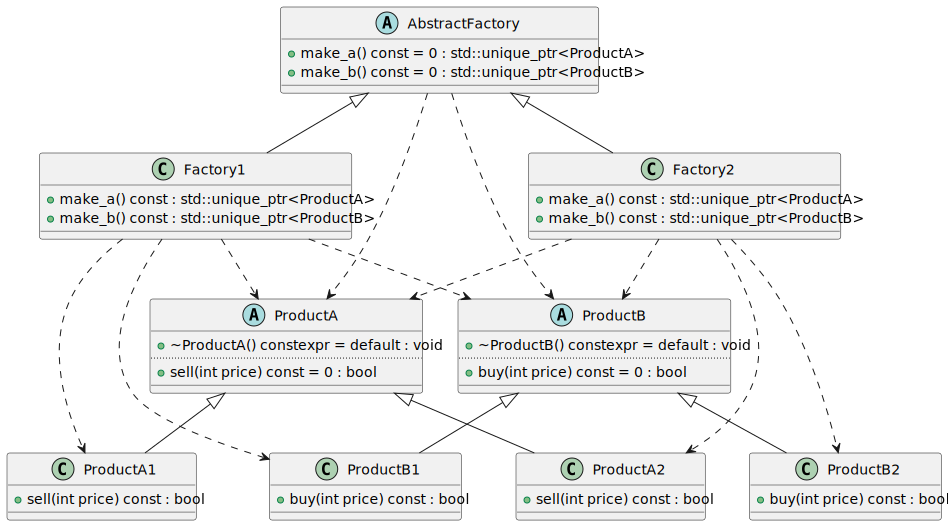

# t00020 - Abstract factory pattern
## Config
```yaml
compilation_database_dir: ..
output_directory: diagrams
diagrams:
  t00020_class:
    type: class
    glob:
      - ../../tests/t00020/t00020.cc
    using_namespace:
      - clanguml::t00020
    include:
      namespaces:
        - clanguml::t00020
    plantuml:
      after:
        - '@A(ProductA1) <.. @A(Factory1)'
        - '@A(ProductB1) <.. @A(Factory1)'
        - '{{ alias("ProductA2") }} <.. {{ alias("Factory2") }}'
        - '{{ alias("ProductB2") }} <.. {{ alias("Factory2") }}'

```
## Source code
File t00020.cc
```cpp
#include <memory>

namespace clanguml {
namespace t00020 {

class ProductA {
public:
    virtual ~ProductA() = default;
    virtual bool sell(int price) const = 0;
};

class ProductA1 : public ProductA {
public:
    bool sell(int price) const override { return price > 1000; }
};

class ProductA2 : public ProductA {
public:
    bool sell(int price) const override { return price > 2000; }
};

class ProductB {
public:
    virtual ~ProductB() = default;
    virtual bool buy(int price) const = 0;
};

class ProductB1 : public ProductB {
public:
    bool buy(int price) const override { return price < 1000; }
};

class ProductB2 : public ProductB {
public:
    bool buy(int price) const override { return price < 2000; }
};

class AbstractFactory {
public:
    virtual std::unique_ptr<ProductA> make_a() const = 0;
    virtual std::unique_ptr<ProductB> make_b() const = 0;
};

class Factory1 : public AbstractFactory {
public:
    std::unique_ptr<ProductA> make_a() const override
    {
        return std::make_unique<ProductA1>();
    }

    std::unique_ptr<ProductB> make_b() const override
    {
        return std::make_unique<ProductB1>();
    }
};

class Factory2 : public AbstractFactory {
public:
    std::unique_ptr<ProductA> make_a() const override
    {
        return std::make_unique<ProductA2>();
    }

    std::unique_ptr<ProductB> make_b() const override
    {
        return std::make_unique<ProductB2>();
    }
};
} // namespace t00020
} // namespace clanguml

```
## Generated PlantUML diagrams

## Generated Mermaid diagrams

## Generated JSON models
```json
{
  "diagram_type": "class",
  "elements": [
    {
      "bases": [],
      "display_name": "clanguml::t00020::ProductA",
      "id": "425267229659464944",
      "is_abstract": true,
      "is_nested": false,
      "is_struct": false,
      "is_template": false,
      "is_union": false,
      "members": [],
      "methods": [
        {
          "access": "public",
          "is_const": false,
          "is_consteval": false,
          "is_constexpr": true,
          "is_constructor": false,
          "is_copy_assignment": false,
          "is_defaulted": true,
          "is_deleted": false,
          "is_move_assignment": false,
          "is_noexcept": false,
          "is_operator": false,
          "is_pure_virtual": false,
          "is_static": false,
          "is_virtual": true,
          "name": "~ProductA",
          "parameters": [],
          "source_location": {
            "column": 13,
            "file": "../../tests/t00020/t00020.cc",
            "line": 8,
            "translation_unit": "../../tests/t00020/t00020.cc"
          },
          "type": "void"
        },
        {
          "access": "public",
          "is_const": true,
          "is_consteval": false,
          "is_constexpr": false,
          "is_constructor": false,
          "is_copy_assignment": false,
          "is_defaulted": false,
          "is_deleted": false,
          "is_move_assignment": false,
          "is_noexcept": false,
          "is_operator": false,
          "is_pure_virtual": true,
          "is_static": false,
          "is_virtual": true,
          "name": "sell",
          "parameters": [
            {
              "name": "price",
              "type": "int"
            }
          ],
          "source_location": {
            "column": 18,
            "file": "../../tests/t00020/t00020.cc",
            "line": 9,
            "translation_unit": "../../tests/t00020/t00020.cc"
          },
          "type": "bool"
        }
      ],
      "name": "ProductA",
      "namespace": "clanguml::t00020",
      "source_location": {
        "column": 7,
        "file": "../../tests/t00020/t00020.cc",
        "line": 6,
        "translation_unit": "../../tests/t00020/t00020.cc"
      },
      "template_parameters": [],
      "type": "class"
    },
    {
      "bases": [
        {
          "access": "public",
          "id": "425267229659464944",
          "is_virtual": false,
          "name": "clanguml::t00020::ProductA"
        }
      ],
      "display_name": "clanguml::t00020::ProductA1",
      "id": "1756496029797864207",
      "is_abstract": false,
      "is_nested": false,
      "is_struct": false,
      "is_template": false,
      "is_union": false,
      "members": [],
      "methods": [
        {
          "access": "public",
          "is_const": true,
          "is_consteval": false,
          "is_constexpr": false,
          "is_constructor": false,
          "is_copy_assignment": false,
          "is_defaulted": false,
          "is_deleted": false,
          "is_move_assignment": false,
          "is_noexcept": false,
          "is_operator": false,
          "is_pure_virtual": false,
          "is_static": false,
          "is_virtual": true,
          "name": "sell",
          "parameters": [
            {
              "name": "price",
              "type": "int"
            }
          ],
          "source_location": {
            "column": 10,
            "file": "../../tests/t00020/t00020.cc",
            "line": 14,
            "translation_unit": "../../tests/t00020/t00020.cc"
          },
          "type": "bool"
        }
      ],
      "name": "ProductA1",
      "namespace": "clanguml::t00020",
      "source_location": {
        "column": 7,
        "file": "../../tests/t00020/t00020.cc",
        "line": 12,
        "translation_unit": "../../tests/t00020/t00020.cc"
      },
      "template_parameters": [],
      "type": "class"
    },
    {
      "bases": [
        {
          "access": "public",
          "id": "425267229659464944",
          "is_virtual": false,
          "name": "clanguml::t00020::ProductA"
        }
      ],
      "display_name": "clanguml::t00020::ProductA2",
      "id": "1531708592885216981",
      "is_abstract": false,
      "is_nested": false,
      "is_struct": false,
      "is_template": false,
      "is_union": false,
      "members": [],
      "methods": [
        {
          "access": "public",
          "is_const": true,
          "is_consteval": false,
          "is_constexpr": false,
          "is_constructor": false,
          "is_copy_assignment": false,
          "is_defaulted": false,
          "is_deleted": false,
          "is_move_assignment": false,
          "is_noexcept": false,
          "is_operator": false,
          "is_pure_virtual": false,
          "is_static": false,
          "is_virtual": true,
          "name": "sell",
          "parameters": [
            {
              "name": "price",
              "type": "int"
            }
          ],
          "source_location": {
            "column": 10,
            "file": "../../tests/t00020/t00020.cc",
            "line": 19,
            "translation_unit": "../../tests/t00020/t00020.cc"
          },
          "type": "bool"
        }
      ],
      "name": "ProductA2",
      "namespace": "clanguml::t00020",
      "source_location": {
        "column": 7,
        "file": "../../tests/t00020/t00020.cc",
        "line": 17,
        "translation_unit": "../../tests/t00020/t00020.cc"
      },
      "template_parameters": [],
      "type": "class"
    },
    {
      "bases": [],
      "display_name": "clanguml::t00020::ProductB",
      "id": "2235759006374865842",
      "is_abstract": true,
      "is_nested": false,
      "is_struct": false,
      "is_template": false,
      "is_union": false,
      "members": [],
      "methods": [
        {
          "access": "public",
          "is_const": false,
          "is_consteval": false,
          "is_constexpr": true,
          "is_constructor": false,
          "is_copy_assignment": false,
          "is_defaulted": true,
          "is_deleted": false,
          "is_move_assignment": false,
          "is_noexcept": false,
          "is_operator": false,
          "is_pure_virtual": false,
          "is_static": false,
          "is_virtual": true,
          "name": "~ProductB",
          "parameters": [],
          "source_location": {
            "column": 13,
            "file": "../../tests/t00020/t00020.cc",
            "line": 24,
            "translation_unit": "../../tests/t00020/t00020.cc"
          },
          "type": "void"
        },
        {
          "access": "public",
          "is_const": true,
          "is_consteval": false,
          "is_constexpr": false,
          "is_constructor": false,
          "is_copy_assignment": false,
          "is_defaulted": false,
          "is_deleted": false,
          "is_move_assignment": false,
          "is_noexcept": false,
          "is_operator": false,
          "is_pure_virtual": true,
          "is_static": false,
          "is_virtual": true,
          "name": "buy",
          "parameters": [
            {
              "name": "price",
              "type": "int"
            }
          ],
          "source_location": {
            "column": 18,
            "file": "../../tests/t00020/t00020.cc",
            "line": 25,
            "translation_unit": "../../tests/t00020/t00020.cc"
          },
          "type": "bool"
        }
      ],
      "name": "ProductB",
      "namespace": "clanguml::t00020",
      "source_location": {
        "column": 7,
        "file": "../../tests/t00020/t00020.cc",
        "line": 22,
        "translation_unit": "../../tests/t00020/t00020.cc"
      },
      "template_parameters": [],
      "type": "class"
    },
    {
      "bases": [
        {
          "access": "public",
          "id": "2235759006374865842",
          "is_virtual": false,
          "name": "clanguml::t00020::ProductB"
        }
      ],
      "display_name": "clanguml::t00020::ProductB1",
      "id": "1465493024233223845",
      "is_abstract": false,
      "is_nested": false,
      "is_struct": false,
      "is_template": false,
      "is_union": false,
      "members": [],
      "methods": [
        {
          "access": "public",
          "is_const": true,
          "is_consteval": false,
          "is_constexpr": false,
          "is_constructor": false,
          "is_copy_assignment": false,
          "is_defaulted": false,
          "is_deleted": false,
          "is_move_assignment": false,
          "is_noexcept": false,
          "is_operator": false,
          "is_pure_virtual": false,
          "is_static": false,
          "is_virtual": true,
          "name": "buy",
          "parameters": [
            {
              "name": "price",
              "type": "int"
            }
          ],
          "source_location": {
            "column": 10,
            "file": "../../tests/t00020/t00020.cc",
            "line": 30,
            "translation_unit": "../../tests/t00020/t00020.cc"
          },
          "type": "bool"
        }
      ],
      "name": "ProductB1",
      "namespace": "clanguml::t00020",
      "source_location": {
        "column": 7,
        "file": "../../tests/t00020/t00020.cc",
        "line": 28,
        "translation_unit": "../../tests/t00020/t00020.cc"
      },
      "template_parameters": [],
      "type": "class"
    },
    {
      "bases": [
        {
          "access": "public",
          "id": "2235759006374865842",
          "is_virtual": false,
          "name": "clanguml::t00020::ProductB"
        }
      ],
      "display_name": "clanguml::t00020::ProductB2",
      "id": "2154665562370057871",
      "is_abstract": false,
      "is_nested": false,
      "is_struct": false,
      "is_template": false,
      "is_union": false,
      "members": [],
      "methods": [
        {
          "access": "public",
          "is_const": true,
          "is_consteval": false,
          "is_constexpr": false,
          "is_constructor": false,
          "is_copy_assignment": false,
          "is_defaulted": false,
          "is_deleted": false,
          "is_move_assignment": false,
          "is_noexcept": false,
          "is_operator": false,
          "is_pure_virtual": false,
          "is_static": false,
          "is_virtual": true,
          "name": "buy",
          "parameters": [
            {
              "name": "price",
              "type": "int"
            }
          ],
          "source_location": {
            "column": 10,
            "file": "../../tests/t00020/t00020.cc",
            "line": 35,
            "translation_unit": "../../tests/t00020/t00020.cc"
          },
          "type": "bool"
        }
      ],
      "name": "ProductB2",
      "namespace": "clanguml::t00020",
      "source_location": {
        "column": 7,
        "file": "../../tests/t00020/t00020.cc",
        "line": 33,
        "translation_unit": "../../tests/t00020/t00020.cc"
      },
      "template_parameters": [],
      "type": "class"
    },
    {
      "bases": [],
      "display_name": "clanguml::t00020::AbstractFactory",
      "id": "1705546469218961425",
      "is_abstract": true,
      "is_nested": false,
      "is_struct": false,
      "is_template": false,
      "is_union": false,
      "members": [],
      "methods": [
        {
          "access": "public",
          "is_const": true,
          "is_consteval": false,
          "is_constexpr": false,
          "is_constructor": false,
          "is_copy_assignment": false,
          "is_defaulted": false,
          "is_deleted": false,
          "is_move_assignment": false,
          "is_noexcept": false,
          "is_operator": false,
          "is_pure_virtual": true,
          "is_static": false,
          "is_virtual": true,
          "name": "make_a",
          "parameters": [],
          "source_location": {
            "column": 39,
            "file": "../../tests/t00020/t00020.cc",
            "line": 40,
            "translation_unit": "../../tests/t00020/t00020.cc"
          },
          "type": "std::unique_ptr<ProductA>"
        },
        {
          "access": "public",
          "is_const": true,
          "is_consteval": false,
          "is_constexpr": false,
          "is_constructor": false,
          "is_copy_assignment": false,
          "is_defaulted": false,
          "is_deleted": false,
          "is_move_assignment": false,
          "is_noexcept": false,
          "is_operator": false,
          "is_pure_virtual": true,
          "is_static": false,
          "is_virtual": true,
          "name": "make_b",
          "parameters": [],
          "source_location": {
            "column": 39,
            "file": "../../tests/t00020/t00020.cc",
            "line": 41,
            "translation_unit": "../../tests/t00020/t00020.cc"
          },
          "type": "std::unique_ptr<ProductB>"
        }
      ],
      "name": "AbstractFactory",
      "namespace": "clanguml::t00020",
      "source_location": {
        "column": 7,
        "file": "../../tests/t00020/t00020.cc",
        "line": 38,
        "translation_unit": "../../tests/t00020/t00020.cc"
      },
      "template_parameters": [],
      "type": "class"
    },
    {
      "bases": [
        {
          "access": "public",
          "id": "1705546469218961425",
          "is_virtual": false,
          "name": "clanguml::t00020::AbstractFactory"
        }
      ],
      "display_name": "clanguml::t00020::Factory1",
      "id": "692346848484854107",
      "is_abstract": false,
      "is_nested": false,
      "is_struct": false,
      "is_template": false,
      "is_union": false,
      "members": [],
      "methods": [
        {
          "access": "public",
          "is_const": true,
          "is_consteval": false,
          "is_constexpr": false,
          "is_constructor": false,
          "is_copy_assignment": false,
          "is_defaulted": false,
          "is_deleted": false,
          "is_move_assignment": false,
          "is_noexcept": false,
          "is_operator": false,
          "is_pure_virtual": false,
          "is_static": false,
          "is_virtual": true,
          "name": "make_a",
          "parameters": [],
          "source_location": {
            "column": 31,
            "file": "../../tests/t00020/t00020.cc",
            "line": 46,
            "translation_unit": "../../tests/t00020/t00020.cc"
          },
          "type": "std::unique_ptr<ProductA>"
        },
        {
          "access": "public",
          "is_const": true,
          "is_consteval": false,
          "is_constexpr": false,
          "is_constructor": false,
          "is_copy_assignment": false,
          "is_defaulted": false,
          "is_deleted": false,
          "is_move_assignment": false,
          "is_noexcept": false,
          "is_operator": false,
          "is_pure_virtual": false,
          "is_static": false,
          "is_virtual": true,
          "name": "make_b",
          "parameters": [],
          "source_location": {
            "column": 31,
            "file": "../../tests/t00020/t00020.cc",
            "line": 51,
            "translation_unit": "../../tests/t00020/t00020.cc"
          },
          "type": "std::unique_ptr<ProductB>"
        }
      ],
      "name": "Factory1",
      "namespace": "clanguml::t00020",
      "source_location": {
        "column": 7,
        "file": "../../tests/t00020/t00020.cc",
        "line": 44,
        "translation_unit": "../../tests/t00020/t00020.cc"
      },
      "template_parameters": [],
      "type": "class"
    },
    {
      "bases": [
        {
          "access": "public",
          "id": "1705546469218961425",
          "is_virtual": false,
          "name": "clanguml::t00020::AbstractFactory"
        }
      ],
      "display_name": "clanguml::t00020::Factory2",
      "id": "1566325870805013023",
      "is_abstract": false,
      "is_nested": false,
      "is_struct": false,
      "is_template": false,
      "is_union": false,
      "members": [],
      "methods": [
        {
          "access": "public",
          "is_const": true,
          "is_consteval": false,
          "is_constexpr": false,
          "is_constructor": false,
          "is_copy_assignment": false,
          "is_defaulted": false,
          "is_deleted": false,
          "is_move_assignment": false,
          "is_noexcept": false,
          "is_operator": false,
          "is_pure_virtual": false,
          "is_static": false,
          "is_virtual": true,
          "name": "make_a",
          "parameters": [],
          "source_location": {
            "column": 31,
            "file": "../../tests/t00020/t00020.cc",
            "line": 59,
            "translation_unit": "../../tests/t00020/t00020.cc"
          },
          "type": "std::unique_ptr<ProductA>"
        },
        {
          "access": "public",
          "is_const": true,
          "is_consteval": false,
          "is_constexpr": false,
          "is_constructor": false,
          "is_copy_assignment": false,
          "is_defaulted": false,
          "is_deleted": false,
          "is_move_assignment": false,
          "is_noexcept": false,
          "is_operator": false,
          "is_pure_virtual": false,
          "is_static": false,
          "is_virtual": true,
          "name": "make_b",
          "parameters": [],
          "source_location": {
            "column": 31,
            "file": "../../tests/t00020/t00020.cc",
            "line": 64,
            "translation_unit": "../../tests/t00020/t00020.cc"
          },
          "type": "std::unique_ptr<ProductB>"
        }
      ],
      "name": "Factory2",
      "namespace": "clanguml::t00020",
      "source_location": {
        "column": 7,
        "file": "../../tests/t00020/t00020.cc",
        "line": 57,
        "translation_unit": "../../tests/t00020/t00020.cc"
      },
      "template_parameters": [],
      "type": "class"
    }
  ],
  "metadata": {
    "clang_uml_version": "0.3.9-11-g4a19c8b",
    "llvm_version": "Ubuntu clang version 16.0.1 (++20230328073357+42d1b276f779-1~exp1~20230328073502.65)",
    "schema_version": 1
  },
  "name": "t00020_class",
  "relationships": [
    {
      "access": "public",
      "destination": "425267229659464944",
      "source": "1756496029797864207",
      "type": "extension"
    },
    {
      "access": "public",
      "destination": "425267229659464944",
      "source": "1531708592885216981",
      "type": "extension"
    },
    {
      "access": "public",
      "destination": "2235759006374865842",
      "source": "1465493024233223845",
      "type": "extension"
    },
    {
      "access": "public",
      "destination": "2235759006374865842",
      "source": "2154665562370057871",
      "type": "extension"
    },
    {
      "access": "public",
      "destination": "425267229659464944",
      "source": "1705546469218961425",
      "type": "dependency"
    },
    {
      "access": "public",
      "destination": "2235759006374865842",
      "source": "1705546469218961425",
      "type": "dependency"
    },
    {
      "access": "public",
      "destination": "425267229659464944",
      "source": "692346848484854107",
      "type": "dependency"
    },
    {
      "access": "public",
      "destination": "2235759006374865842",
      "source": "692346848484854107",
      "type": "dependency"
    },
    {
      "access": "public",
      "destination": "1705546469218961425",
      "source": "692346848484854107",
      "type": "extension"
    },
    {
      "access": "public",
      "destination": "425267229659464944",
      "source": "1566325870805013023",
      "type": "dependency"
    },
    {
      "access": "public",
      "destination": "2235759006374865842",
      "source": "1566325870805013023",
      "type": "dependency"
    },
    {
      "access": "public",
      "destination": "1705546469218961425",
      "source": "1566325870805013023",
      "type": "extension"
    }
  ],
  "using_namespace": "clanguml::t00020"
}
```
