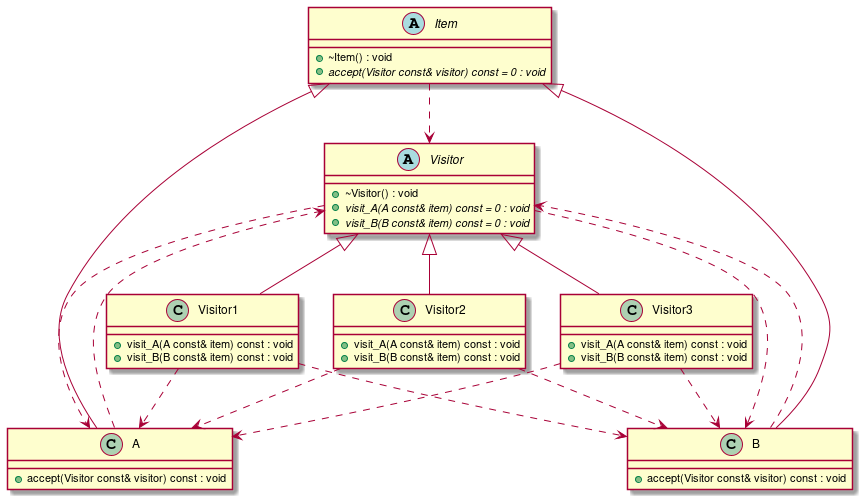

# t00021 - Visitor pattern
## Config
```yaml
compilation_database_dir: ..
output_directory: puml
diagrams:
  t00021_class:
    type: class
    glob:
      - ../../tests/t00021/t00021.cc
    using_namespace:
      - clanguml::t00021
    include:
      namespaces:
        - clanguml::t00021

```
## Source code
File t00021.cc
```cpp
#include <memory>

namespace clanguml {
namespace t00021 {

class A;
class B;

class Visitor {
public:
    virtual ~Visitor() = default;
    virtual void visit_A(const A &item) const = 0;
    virtual void visit_B(const B &item) const = 0;
};

class Visitor1 : public Visitor {
public:
    void visit_A(const A &item) const override { }
    void visit_B(const B &item) const override { }
};

class Visitor2 : public Visitor {
public:
    void visit_A(const A &item) const override { }
    void visit_B(const B &item) const override { }
};

class Visitor3 : public Visitor {
public:
    void visit_A(const A &item) const override { }
    void visit_B(const B &item) const override { }
};

class Item {
public:
    virtual ~Item() = default;
    virtual void accept(const Visitor &visitor) const = 0;
};

class A : public Item {
public:
    void accept(const Visitor &visitor) const override { }
};

class B : public Item {
public:
    void accept(const Visitor &visitor) const override { }
};
}
}

```
## Generated UML diagrams

