# t00021 - Visitor pattern
## Config
```yaml
compilation_database_dir: ..
output_directory: diagrams
diagrams:
  t00021_class:
    type: class
    glob:
      - ../../tests/t00021/t00021.cc
    using_namespace:
      - clanguml::t00021
    include:
      namespaces:
        - clanguml::t00021

```
## Source code
File t00021.cc
```cpp
#include <memory>

namespace clanguml {
namespace t00021 {

class A;
class B;

class Visitor {
public:
    virtual ~Visitor() = default;
    virtual void visit_A(const A &item) const = 0;
    virtual void visit_B(const B &item) const = 0;
};

class Visitor1 : public Visitor {
public:
    void visit_A(const A &item) const override { }
    void visit_B(const B &item) const override { }
};

class Visitor2 : public Visitor {
public:
    void visit_A(const A &item) const override { }
    void visit_B(const B &item) const override { }
};

class Visitor3 : public Visitor {
public:
    void visit_A(const A &item) const override { }
    void visit_B(const B &item) const override { }
};

class Item {
public:
    virtual ~Item() = default;
    virtual void accept(const Visitor &visitor) const = 0;
};

class A : public Item {
public:
    void accept(const Visitor &visitor) const override { }
};

class B : public Item {
public:
    void accept(const Visitor &visitor) const override { }
};
} // namespace t00021
} // namespace clanguml

```
## Generated PlantUML diagrams

## Generated Mermaid diagrams

## Generated JSON models
```json
{
  "diagram_type": "class",
  "elements": [
    {
      "bases": [],
      "display_name": "clanguml::t00021::Visitor",
      "id": "1668671110672744395",
      "is_abstract": true,
      "is_nested": false,
      "is_struct": false,
      "is_template": false,
      "is_union": false,
      "members": [],
      "methods": [
        {
          "access": "public",
          "is_const": false,
          "is_consteval": false,
          "is_constexpr": true,
          "is_constructor": false,
          "is_copy_assignment": false,
          "is_defaulted": true,
          "is_deleted": false,
          "is_move_assignment": false,
          "is_noexcept": false,
          "is_operator": false,
          "is_pure_virtual": false,
          "is_static": false,
          "is_virtual": true,
          "name": "~Visitor",
          "parameters": [],
          "source_location": {
            "column": 13,
            "file": "../../tests/t00021/t00021.cc",
            "line": 11,
            "translation_unit": "../../tests/t00021/t00021.cc"
          },
          "type": "void"
        },
        {
          "access": "public",
          "is_const": true,
          "is_consteval": false,
          "is_constexpr": false,
          "is_constructor": false,
          "is_copy_assignment": false,
          "is_defaulted": false,
          "is_deleted": false,
          "is_move_assignment": false,
          "is_noexcept": false,
          "is_operator": false,
          "is_pure_virtual": true,
          "is_static": false,
          "is_virtual": true,
          "name": "visit_A",
          "parameters": [
            {
              "name": "item",
              "type": "const A &"
            }
          ],
          "source_location": {
            "column": 18,
            "file": "../../tests/t00021/t00021.cc",
            "line": 12,
            "translation_unit": "../../tests/t00021/t00021.cc"
          },
          "type": "void"
        },
        {
          "access": "public",
          "is_const": true,
          "is_consteval": false,
          "is_constexpr": false,
          "is_constructor": false,
          "is_copy_assignment": false,
          "is_defaulted": false,
          "is_deleted": false,
          "is_move_assignment": false,
          "is_noexcept": false,
          "is_operator": false,
          "is_pure_virtual": true,
          "is_static": false,
          "is_virtual": true,
          "name": "visit_B",
          "parameters": [
            {
              "name": "item",
              "type": "const B &"
            }
          ],
          "source_location": {
            "column": 18,
            "file": "../../tests/t00021/t00021.cc",
            "line": 13,
            "translation_unit": "../../tests/t00021/t00021.cc"
          },
          "type": "void"
        }
      ],
      "name": "Visitor",
      "namespace": "clanguml::t00021",
      "source_location": {
        "column": 7,
        "file": "../../tests/t00021/t00021.cc",
        "line": 9,
        "translation_unit": "../../tests/t00021/t00021.cc"
      },
      "template_parameters": [],
      "type": "class"
    },
    {
      "bases": [
        {
          "access": "public",
          "id": "1668671110672744395",
          "is_virtual": false,
          "name": "clanguml::t00021::Visitor"
        }
      ],
      "display_name": "clanguml::t00021::Visitor1",
      "id": "1028369219400401946",
      "is_abstract": false,
      "is_nested": false,
      "is_struct": false,
      "is_template": false,
      "is_union": false,
      "members": [],
      "methods": [
        {
          "access": "public",
          "is_const": true,
          "is_consteval": false,
          "is_constexpr": false,
          "is_constructor": false,
          "is_copy_assignment": false,
          "is_defaulted": false,
          "is_deleted": false,
          "is_move_assignment": false,
          "is_noexcept": false,
          "is_operator": false,
          "is_pure_virtual": false,
          "is_static": false,
          "is_virtual": true,
          "name": "visit_A",
          "parameters": [
            {
              "name": "item",
              "type": "const A &"
            }
          ],
          "source_location": {
            "column": 10,
            "file": "../../tests/t00021/t00021.cc",
            "line": 18,
            "translation_unit": "../../tests/t00021/t00021.cc"
          },
          "type": "void"
        },
        {
          "access": "public",
          "is_const": true,
          "is_consteval": false,
          "is_constexpr": false,
          "is_constructor": false,
          "is_copy_assignment": false,
          "is_defaulted": false,
          "is_deleted": false,
          "is_move_assignment": false,
          "is_noexcept": false,
          "is_operator": false,
          "is_pure_virtual": false,
          "is_static": false,
          "is_virtual": true,
          "name": "visit_B",
          "parameters": [
            {
              "name": "item",
              "type": "const B &"
            }
          ],
          "source_location": {
            "column": 10,
            "file": "../../tests/t00021/t00021.cc",
            "line": 19,
            "translation_unit": "../../tests/t00021/t00021.cc"
          },
          "type": "void"
        }
      ],
      "name": "Visitor1",
      "namespace": "clanguml::t00021",
      "source_location": {
        "column": 7,
        "file": "../../tests/t00021/t00021.cc",
        "line": 16,
        "translation_unit": "../../tests/t00021/t00021.cc"
      },
      "template_parameters": [],
      "type": "class"
    },
    {
      "bases": [
        {
          "access": "public",
          "id": "1668671110672744395",
          "is_virtual": false,
          "name": "clanguml::t00021::Visitor"
        }
      ],
      "display_name": "clanguml::t00021::Visitor2",
      "id": "1710373315476287130",
      "is_abstract": false,
      "is_nested": false,
      "is_struct": false,
      "is_template": false,
      "is_union": false,
      "members": [],
      "methods": [
        {
          "access": "public",
          "is_const": true,
          "is_consteval": false,
          "is_constexpr": false,
          "is_constructor": false,
          "is_copy_assignment": false,
          "is_defaulted": false,
          "is_deleted": false,
          "is_move_assignment": false,
          "is_noexcept": false,
          "is_operator": false,
          "is_pure_virtual": false,
          "is_static": false,
          "is_virtual": true,
          "name": "visit_A",
          "parameters": [
            {
              "name": "item",
              "type": "const A &"
            }
          ],
          "source_location": {
            "column": 10,
            "file": "../../tests/t00021/t00021.cc",
            "line": 24,
            "translation_unit": "../../tests/t00021/t00021.cc"
          },
          "type": "void"
        },
        {
          "access": "public",
          "is_const": true,
          "is_consteval": false,
          "is_constexpr": false,
          "is_constructor": false,
          "is_copy_assignment": false,
          "is_defaulted": false,
          "is_deleted": false,
          "is_move_assignment": false,
          "is_noexcept": false,
          "is_operator": false,
          "is_pure_virtual": false,
          "is_static": false,
          "is_virtual": true,
          "name": "visit_B",
          "parameters": [
            {
              "name": "item",
              "type": "const B &"
            }
          ],
          "source_location": {
            "column": 10,
            "file": "../../tests/t00021/t00021.cc",
            "line": 25,
            "translation_unit": "../../tests/t00021/t00021.cc"
          },
          "type": "void"
        }
      ],
      "name": "Visitor2",
      "namespace": "clanguml::t00021",
      "source_location": {
        "column": 7,
        "file": "../../tests/t00021/t00021.cc",
        "line": 22,
        "translation_unit": "../../tests/t00021/t00021.cc"
      },
      "template_parameters": [],
      "type": "class"
    },
    {
      "bases": [
        {
          "access": "public",
          "id": "1668671110672744395",
          "is_virtual": false,
          "name": "clanguml::t00021::Visitor"
        }
      ],
      "display_name": "clanguml::t00021::Visitor3",
      "id": "1399026228179178025",
      "is_abstract": false,
      "is_nested": false,
      "is_struct": false,
      "is_template": false,
      "is_union": false,
      "members": [],
      "methods": [
        {
          "access": "public",
          "is_const": true,
          "is_consteval": false,
          "is_constexpr": false,
          "is_constructor": false,
          "is_copy_assignment": false,
          "is_defaulted": false,
          "is_deleted": false,
          "is_move_assignment": false,
          "is_noexcept": false,
          "is_operator": false,
          "is_pure_virtual": false,
          "is_static": false,
          "is_virtual": true,
          "name": "visit_A",
          "parameters": [
            {
              "name": "item",
              "type": "const A &"
            }
          ],
          "source_location": {
            "column": 10,
            "file": "../../tests/t00021/t00021.cc",
            "line": 30,
            "translation_unit": "../../tests/t00021/t00021.cc"
          },
          "type": "void"
        },
        {
          "access": "public",
          "is_const": true,
          "is_consteval": false,
          "is_constexpr": false,
          "is_constructor": false,
          "is_copy_assignment": false,
          "is_defaulted": false,
          "is_deleted": false,
          "is_move_assignment": false,
          "is_noexcept": false,
          "is_operator": false,
          "is_pure_virtual": false,
          "is_static": false,
          "is_virtual": true,
          "name": "visit_B",
          "parameters": [
            {
              "name": "item",
              "type": "const B &"
            }
          ],
          "source_location": {
            "column": 10,
            "file": "../../tests/t00021/t00021.cc",
            "line": 31,
            "translation_unit": "../../tests/t00021/t00021.cc"
          },
          "type": "void"
        }
      ],
      "name": "Visitor3",
      "namespace": "clanguml::t00021",
      "source_location": {
        "column": 7,
        "file": "../../tests/t00021/t00021.cc",
        "line": 28,
        "translation_unit": "../../tests/t00021/t00021.cc"
      },
      "template_parameters": [],
      "type": "class"
    },
    {
      "bases": [],
      "display_name": "clanguml::t00021::Item",
      "id": "1491568826758947722",
      "is_abstract": true,
      "is_nested": false,
      "is_struct": false,
      "is_template": false,
      "is_union": false,
      "members": [],
      "methods": [
        {
          "access": "public",
          "is_const": false,
          "is_consteval": false,
          "is_constexpr": true,
          "is_constructor": false,
          "is_copy_assignment": false,
          "is_defaulted": true,
          "is_deleted": false,
          "is_move_assignment": false,
          "is_noexcept": false,
          "is_operator": false,
          "is_pure_virtual": false,
          "is_static": false,
          "is_virtual": true,
          "name": "~Item",
          "parameters": [],
          "source_location": {
            "column": 13,
            "file": "../../tests/t00021/t00021.cc",
            "line": 36,
            "translation_unit": "../../tests/t00021/t00021.cc"
          },
          "type": "void"
        },
        {
          "access": "public",
          "is_const": true,
          "is_consteval": false,
          "is_constexpr": false,
          "is_constructor": false,
          "is_copy_assignment": false,
          "is_defaulted": false,
          "is_deleted": false,
          "is_move_assignment": false,
          "is_noexcept": false,
          "is_operator": false,
          "is_pure_virtual": true,
          "is_static": false,
          "is_virtual": true,
          "name": "accept",
          "parameters": [
            {
              "name": "visitor",
              "type": "const Visitor &"
            }
          ],
          "source_location": {
            "column": 18,
            "file": "../../tests/t00021/t00021.cc",
            "line": 37,
            "translation_unit": "../../tests/t00021/t00021.cc"
          },
          "type": "void"
        }
      ],
      "name": "Item",
      "namespace": "clanguml::t00021",
      "source_location": {
        "column": 7,
        "file": "../../tests/t00021/t00021.cc",
        "line": 34,
        "translation_unit": "../../tests/t00021/t00021.cc"
      },
      "template_parameters": [],
      "type": "class"
    },
    {
      "bases": [
        {
          "access": "public",
          "id": "1491568826758947722",
          "is_virtual": false,
          "name": "clanguml::t00021::Item"
        }
      ],
      "display_name": "clanguml::t00021::A",
      "id": "1494142745564026823",
      "is_abstract": false,
      "is_nested": false,
      "is_struct": false,
      "is_template": false,
      "is_union": false,
      "members": [],
      "methods": [
        {
          "access": "public",
          "is_const": true,
          "is_consteval": false,
          "is_constexpr": false,
          "is_constructor": false,
          "is_copy_assignment": false,
          "is_defaulted": false,
          "is_deleted": false,
          "is_move_assignment": false,
          "is_noexcept": false,
          "is_operator": false,
          "is_pure_virtual": false,
          "is_static": false,
          "is_virtual": true,
          "name": "accept",
          "parameters": [
            {
              "name": "visitor",
              "type": "const Visitor &"
            }
          ],
          "source_location": {
            "column": 10,
            "file": "../../tests/t00021/t00021.cc",
            "line": 42,
            "translation_unit": "../../tests/t00021/t00021.cc"
          },
          "type": "void"
        }
      ],
      "name": "A",
      "namespace": "clanguml::t00021",
      "source_location": {
        "column": 7,
        "file": "../../tests/t00021/t00021.cc",
        "line": 40,
        "translation_unit": "../../tests/t00021/t00021.cc"
      },
      "template_parameters": [],
      "type": "class"
    },
    {
      "bases": [
        {
          "access": "public",
          "id": "1491568826758947722",
          "is_virtual": false,
          "name": "clanguml::t00021::Item"
        }
      ],
      "display_name": "clanguml::t00021::B",
      "id": "1452948650450999568",
      "is_abstract": false,
      "is_nested": false,
      "is_struct": false,
      "is_template": false,
      "is_union": false,
      "members": [],
      "methods": [
        {
          "access": "public",
          "is_const": true,
          "is_consteval": false,
          "is_constexpr": false,
          "is_constructor": false,
          "is_copy_assignment": false,
          "is_defaulted": false,
          "is_deleted": false,
          "is_move_assignment": false,
          "is_noexcept": false,
          "is_operator": false,
          "is_pure_virtual": false,
          "is_static": false,
          "is_virtual": true,
          "name": "accept",
          "parameters": [
            {
              "name": "visitor",
              "type": "const Visitor &"
            }
          ],
          "source_location": {
            "column": 10,
            "file": "../../tests/t00021/t00021.cc",
            "line": 47,
            "translation_unit": "../../tests/t00021/t00021.cc"
          },
          "type": "void"
        }
      ],
      "name": "B",
      "namespace": "clanguml::t00021",
      "source_location": {
        "column": 7,
        "file": "../../tests/t00021/t00021.cc",
        "line": 45,
        "translation_unit": "../../tests/t00021/t00021.cc"
      },
      "template_parameters": [],
      "type": "class"
    }
  ],
  "metadata": {
    "clang_uml_version": "0.3.9-23-g7e22b0b",
    "llvm_version": "Ubuntu clang version 16.0.1 (++20230328073357+42d1b276f779-1~exp1~20230328073502.65)",
    "schema_version": 1
  },
  "name": "t00021_class",
  "relationships": [
    {
      "access": "public",
      "destination": "1494142745564026823",
      "source": "1668671110672744395",
      "type": "dependency"
    },
    {
      "access": "public",
      "destination": "1452948650450999568",
      "source": "1668671110672744395",
      "type": "dependency"
    },
    {
      "access": "public",
      "destination": "1494142745564026823",
      "source": "1028369219400401946",
      "type": "dependency"
    },
    {
      "access": "public",
      "destination": "1452948650450999568",
      "source": "1028369219400401946",
      "type": "dependency"
    },
    {
      "access": "public",
      "destination": "1668671110672744395",
      "source": "1028369219400401946",
      "type": "extension"
    },
    {
      "access": "public",
      "destination": "1494142745564026823",
      "source": "1710373315476287130",
      "type": "dependency"
    },
    {
      "access": "public",
      "destination": "1452948650450999568",
      "source": "1710373315476287130",
      "type": "dependency"
    },
    {
      "access": "public",
      "destination": "1668671110672744395",
      "source": "1710373315476287130",
      "type": "extension"
    },
    {
      "access": "public",
      "destination": "1494142745564026823",
      "source": "1399026228179178025",
      "type": "dependency"
    },
    {
      "access": "public",
      "destination": "1452948650450999568",
      "source": "1399026228179178025",
      "type": "dependency"
    },
    {
      "access": "public",
      "destination": "1668671110672744395",
      "source": "1399026228179178025",
      "type": "extension"
    },
    {
      "access": "public",
      "destination": "1668671110672744395",
      "source": "1491568826758947722",
      "type": "dependency"
    },
    {
      "access": "public",
      "destination": "1668671110672744395",
      "source": "1494142745564026823",
      "type": "dependency"
    },
    {
      "access": "public",
      "destination": "1491568826758947722",
      "source": "1494142745564026823",
      "type": "extension"
    },
    {
      "access": "public",
      "destination": "1668671110672744395",
      "source": "1452948650450999568",
      "type": "dependency"
    },
    {
      "access": "public",
      "destination": "1491568826758947722",
      "source": "1452948650450999568",
      "type": "extension"
    }
  ],
  "using_namespace": "clanguml::t00021"
}
```
