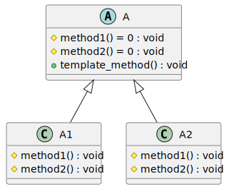

# t00022 - Template method pattern
## Config
```yaml
diagrams:
  t00022_class:
    type: class
    glob:
      - t00022.cc
    using_namespace: clanguml::t00022
    include:
      namespaces:
        - clanguml::t00022

```
## Source code
File `tests/t00022/t00022.cc`
```cpp
#include <memory>

namespace clanguml {
namespace t00022 {

class A {
public:
    void template_method()
    {
        method1();
        method2();
    }

protected:
    virtual void method1() = 0;
    virtual void method2() = 0;
};

class A1 : public A {
protected:
    void method1() override { }
    void method2() override { }
};

class A2 : public A {
protected:
    void method1() override { }
    void method2() override { }
};
} // namespace t00022
} // namespace clanguml

```
## Generated PlantUML diagrams

## Generated Mermaid diagrams

## Generated JSON models
```json
{
  "diagram_type": "class",
  "elements": [
    {
      "bases": [],
      "display_name": "A",
      "id": "2012435893382068755",
      "is_abstract": true,
      "is_nested": false,
      "is_struct": false,
      "is_template": false,
      "is_union": false,
      "members": [],
      "methods": [
        {
          "access": "public",
          "display_name": "template_method",
          "is_const": false,
          "is_consteval": false,
          "is_constexpr": false,
          "is_constructor": false,
          "is_copy_assignment": false,
          "is_coroutine": false,
          "is_defaulted": false,
          "is_deleted": false,
          "is_move_assignment": false,
          "is_noexcept": false,
          "is_operator": false,
          "is_pure_virtual": false,
          "is_static": false,
          "is_virtual": false,
          "name": "template_method",
          "parameters": [],
          "source_location": {
            "column": 10,
            "file": "t00022.cc",
            "line": 8,
            "translation_unit": "t00022.cc"
          },
          "template_parameters": [],
          "type": "void"
        },
        {
          "access": "protected",
          "display_name": "method1",
          "is_const": false,
          "is_consteval": false,
          "is_constexpr": false,
          "is_constructor": false,
          "is_copy_assignment": false,
          "is_coroutine": false,
          "is_defaulted": false,
          "is_deleted": false,
          "is_move_assignment": false,
          "is_noexcept": false,
          "is_operator": false,
          "is_pure_virtual": true,
          "is_static": false,
          "is_virtual": true,
          "name": "method1",
          "parameters": [],
          "source_location": {
            "column": 18,
            "file": "t00022.cc",
            "line": 15,
            "translation_unit": "t00022.cc"
          },
          "template_parameters": [],
          "type": "void"
        },
        {
          "access": "protected",
          "display_name": "method2",
          "is_const": false,
          "is_consteval": false,
          "is_constexpr": false,
          "is_constructor": false,
          "is_copy_assignment": false,
          "is_coroutine": false,
          "is_defaulted": false,
          "is_deleted": false,
          "is_move_assignment": false,
          "is_noexcept": false,
          "is_operator": false,
          "is_pure_virtual": true,
          "is_static": false,
          "is_virtual": true,
          "name": "method2",
          "parameters": [],
          "source_location": {
            "column": 18,
            "file": "t00022.cc",
            "line": 16,
            "translation_unit": "t00022.cc"
          },
          "template_parameters": [],
          "type": "void"
        }
      ],
      "name": "A",
      "namespace": "clanguml::t00022",
      "source_location": {
        "column": 7,
        "file": "t00022.cc",
        "line": 6,
        "translation_unit": "t00022.cc"
      },
      "template_parameters": [],
      "type": "class"
    },
    {
      "bases": [
        {
          "access": "public",
          "id": "2012435893382068755",
          "is_virtual": false,
          "name": "clanguml::t00022::A"
        }
      ],
      "display_name": "A1",
      "id": "2282061426381077447",
      "is_abstract": false,
      "is_nested": false,
      "is_struct": false,
      "is_template": false,
      "is_union": false,
      "members": [],
      "methods": [
        {
          "access": "protected",
          "display_name": "method1",
          "is_const": false,
          "is_consteval": false,
          "is_constexpr": false,
          "is_constructor": false,
          "is_copy_assignment": false,
          "is_coroutine": false,
          "is_defaulted": false,
          "is_deleted": false,
          "is_move_assignment": false,
          "is_noexcept": false,
          "is_operator": false,
          "is_pure_virtual": false,
          "is_static": false,
          "is_virtual": true,
          "name": "method1",
          "parameters": [],
          "source_location": {
            "column": 10,
            "file": "t00022.cc",
            "line": 21,
            "translation_unit": "t00022.cc"
          },
          "template_parameters": [],
          "type": "void"
        },
        {
          "access": "protected",
          "display_name": "method2",
          "is_const": false,
          "is_consteval": false,
          "is_constexpr": false,
          "is_constructor": false,
          "is_copy_assignment": false,
          "is_coroutine": false,
          "is_defaulted": false,
          "is_deleted": false,
          "is_move_assignment": false,
          "is_noexcept": false,
          "is_operator": false,
          "is_pure_virtual": false,
          "is_static": false,
          "is_virtual": true,
          "name": "method2",
          "parameters": [],
          "source_location": {
            "column": 10,
            "file": "t00022.cc",
            "line": 22,
            "translation_unit": "t00022.cc"
          },
          "template_parameters": [],
          "type": "void"
        }
      ],
      "name": "A1",
      "namespace": "clanguml::t00022",
      "source_location": {
        "column": 7,
        "file": "t00022.cc",
        "line": 19,
        "translation_unit": "t00022.cc"
      },
      "template_parameters": [],
      "type": "class"
    },
    {
      "bases": [
        {
          "access": "public",
          "id": "2012435893382068755",
          "is_virtual": false,
          "name": "clanguml::t00022::A"
        }
      ],
      "display_name": "A2",
      "id": "158819862916671538",
      "is_abstract": false,
      "is_nested": false,
      "is_struct": false,
      "is_template": false,
      "is_union": false,
      "members": [],
      "methods": [
        {
          "access": "protected",
          "display_name": "method1",
          "is_const": false,
          "is_consteval": false,
          "is_constexpr": false,
          "is_constructor": false,
          "is_copy_assignment": false,
          "is_coroutine": false,
          "is_defaulted": false,
          "is_deleted": false,
          "is_move_assignment": false,
          "is_noexcept": false,
          "is_operator": false,
          "is_pure_virtual": false,
          "is_static": false,
          "is_virtual": true,
          "name": "method1",
          "parameters": [],
          "source_location": {
            "column": 10,
            "file": "t00022.cc",
            "line": 27,
            "translation_unit": "t00022.cc"
          },
          "template_parameters": [],
          "type": "void"
        },
        {
          "access": "protected",
          "display_name": "method2",
          "is_const": false,
          "is_consteval": false,
          "is_constexpr": false,
          "is_constructor": false,
          "is_copy_assignment": false,
          "is_coroutine": false,
          "is_defaulted": false,
          "is_deleted": false,
          "is_move_assignment": false,
          "is_noexcept": false,
          "is_operator": false,
          "is_pure_virtual": false,
          "is_static": false,
          "is_virtual": true,
          "name": "method2",
          "parameters": [],
          "source_location": {
            "column": 10,
            "file": "t00022.cc",
            "line": 28,
            "translation_unit": "t00022.cc"
          },
          "template_parameters": [],
          "type": "void"
        }
      ],
      "name": "A2",
      "namespace": "clanguml::t00022",
      "source_location": {
        "column": 7,
        "file": "t00022.cc",
        "line": 25,
        "translation_unit": "t00022.cc"
      },
      "template_parameters": [],
      "type": "class"
    }
  ],
  "name": "t00022_class",
  "package_type": "namespace",
  "relationships": [
    {
      "access": "public",
      "destination": "2012435893382068755",
      "source": "2282061426381077447",
      "type": "extension"
    },
    {
      "access": "public",
      "destination": "2012435893382068755",
      "source": "158819862916671538",
      "type": "extension"
    }
  ],
  "using_namespace": "clanguml::t00022"
}
```
