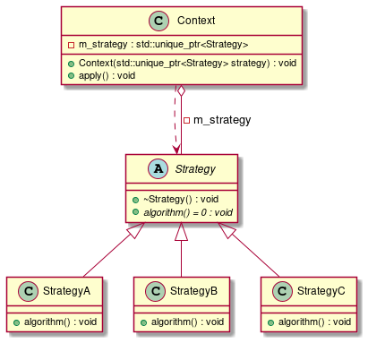

# t00023 - Strategy pattern
## Config
```yaml
compilation_database_dir: ..
output_directory: puml
diagrams:
  t00023_class:
    type: class
    glob:
      - ../../tests/t00023/t00023.cc
    using_namespace:
      - clanguml::t00023
    include:
      namespaces:
        - clanguml::t00023

```
## Source code
File t00023.cc
```cpp
#include <memory>

namespace clanguml {
namespace t00023 {

class Strategy {
public:
    virtual ~Strategy() = default;
    virtual void algorithm() = 0;
};

class StrategyA : public Strategy {
public:
    void algorithm() override {}
};

class StrategyB : public Strategy {
public:
    void algorithm() override {}
};

class StrategyC : public Strategy {
public:
    void algorithm() override {}
};

class Context {
public:
    Context(std::unique_ptr<Strategy> strategy)
        : m_strategy(std::move(strategy))
    {
    }

    void apply() { m_strategy->algorithm(); }

private:
    std::unique_ptr<Strategy> m_strategy;
};
}
}

```
## Generated UML diagrams

