# t00023 - Strategy pattern
## Config
```yaml
diagrams:
  t00023_class:
    type: class
    glob:
      - t00023.cc
    using_namespace: clanguml::t00023
    include:
      namespaces:
        - clanguml::t00023

```
## Source code
File `tests/t00023/t00023.cc`
```cpp
#include <memory>

namespace clanguml {
namespace t00023 {

class Strategy {
public:
    virtual ~Strategy() = default;
    virtual void algorithm() = 0;
};

class StrategyA : public Strategy {
public:
    void algorithm() override { }
};

class StrategyB : public Strategy {
public:
    void algorithm() override { }
};

class StrategyC : public Strategy {
public:
    void algorithm() override { }
};

class Context {
public:
    Context(std::unique_ptr<Strategy> strategy)
        : m_strategy(std::move(strategy))
    {
    }

    void apply() { m_strategy->algorithm(); }

private:
    std::unique_ptr<Strategy> m_strategy;
};
} // namespace t00023
} // namespace clanguml

```
## Generated PlantUML diagrams

## Generated Mermaid diagrams

## Generated JSON models
```json
{
  "diagram_type": "class",
  "elements": [
    {
      "bases": [],
      "display_name": "Strategy",
      "id": "11758861571510735814",
      "is_abstract": true,
      "is_nested": false,
      "is_struct": false,
      "is_template": false,
      "is_union": false,
      "members": [],
      "methods": [
        {
          "access": "public",
          "display_name": "~Strategy",
          "is_const": false,
          "is_consteval": false,
          "is_constexpr": true,
          "is_constructor": false,
          "is_copy_assignment": false,
          "is_coroutine": false,
          "is_defaulted": true,
          "is_deleted": false,
          "is_move_assignment": false,
          "is_noexcept": false,
          "is_operator": false,
          "is_pure_virtual": false,
          "is_static": false,
          "is_virtual": true,
          "name": "~Strategy",
          "parameters": [],
          "source_location": {
            "column": 13,
            "file": "t00023.cc",
            "line": 8,
            "translation_unit": "t00023.cc"
          },
          "template_parameters": [],
          "type": "void"
        },
        {
          "access": "public",
          "display_name": "algorithm",
          "is_const": false,
          "is_consteval": false,
          "is_constexpr": false,
          "is_constructor": false,
          "is_copy_assignment": false,
          "is_coroutine": false,
          "is_defaulted": false,
          "is_deleted": false,
          "is_move_assignment": false,
          "is_noexcept": false,
          "is_operator": false,
          "is_pure_virtual": true,
          "is_static": false,
          "is_virtual": true,
          "name": "algorithm",
          "parameters": [],
          "source_location": {
            "column": 18,
            "file": "t00023.cc",
            "line": 9,
            "translation_unit": "t00023.cc"
          },
          "template_parameters": [],
          "type": "void"
        }
      ],
      "name": "Strategy",
      "namespace": "clanguml::t00023",
      "source_location": {
        "column": 7,
        "file": "t00023.cc",
        "line": 6,
        "translation_unit": "t00023.cc"
      },
      "template_parameters": [],
      "type": "class"
    },
    {
      "bases": [
        {
          "access": "public",
          "id": "11758861571510735814",
          "is_virtual": false,
          "name": "clanguml::t00023::Strategy"
        }
      ],
      "display_name": "StrategyA",
      "id": "9964264606557083084",
      "is_abstract": false,
      "is_nested": false,
      "is_struct": false,
      "is_template": false,
      "is_union": false,
      "members": [],
      "methods": [
        {
          "access": "public",
          "display_name": "algorithm",
          "is_const": false,
          "is_consteval": false,
          "is_constexpr": false,
          "is_constructor": false,
          "is_copy_assignment": false,
          "is_coroutine": false,
          "is_defaulted": false,
          "is_deleted": false,
          "is_move_assignment": false,
          "is_noexcept": false,
          "is_operator": false,
          "is_pure_virtual": false,
          "is_static": false,
          "is_virtual": true,
          "name": "algorithm",
          "parameters": [],
          "source_location": {
            "column": 10,
            "file": "t00023.cc",
            "line": 14,
            "translation_unit": "t00023.cc"
          },
          "template_parameters": [],
          "type": "void"
        }
      ],
      "name": "StrategyA",
      "namespace": "clanguml::t00023",
      "source_location": {
        "column": 7,
        "file": "t00023.cc",
        "line": 12,
        "translation_unit": "t00023.cc"
      },
      "template_parameters": [],
      "type": "class"
    },
    {
      "bases": [
        {
          "access": "public",
          "id": "11758861571510735814",
          "is_virtual": false,
          "name": "clanguml::t00023::Strategy"
        }
      ],
      "display_name": "StrategyB",
      "id": "2119891255197167",
      "is_abstract": false,
      "is_nested": false,
      "is_struct": false,
      "is_template": false,
      "is_union": false,
      "members": [],
      "methods": [
        {
          "access": "public",
          "display_name": "algorithm",
          "is_const": false,
          "is_consteval": false,
          "is_constexpr": false,
          "is_constructor": false,
          "is_copy_assignment": false,
          "is_coroutine": false,
          "is_defaulted": false,
          "is_deleted": false,
          "is_move_assignment": false,
          "is_noexcept": false,
          "is_operator": false,
          "is_pure_virtual": false,
          "is_static": false,
          "is_virtual": true,
          "name": "algorithm",
          "parameters": [],
          "source_location": {
            "column": 10,
            "file": "t00023.cc",
            "line": 19,
            "translation_unit": "t00023.cc"
          },
          "template_parameters": [],
          "type": "void"
        }
      ],
      "name": "StrategyB",
      "namespace": "clanguml::t00023",
      "source_location": {
        "column": 7,
        "file": "t00023.cc",
        "line": 17,
        "translation_unit": "t00023.cc"
      },
      "template_parameters": [],
      "type": "class"
    },
    {
      "bases": [
        {
          "access": "public",
          "id": "11758861571510735814",
          "is_virtual": false,
          "name": "clanguml::t00023::Strategy"
        }
      ],
      "display_name": "StrategyC",
      "id": "1398361409547864717",
      "is_abstract": false,
      "is_nested": false,
      "is_struct": false,
      "is_template": false,
      "is_union": false,
      "members": [],
      "methods": [
        {
          "access": "public",
          "display_name": "algorithm",
          "is_const": false,
          "is_consteval": false,
          "is_constexpr": false,
          "is_constructor": false,
          "is_copy_assignment": false,
          "is_coroutine": false,
          "is_defaulted": false,
          "is_deleted": false,
          "is_move_assignment": false,
          "is_noexcept": false,
          "is_operator": false,
          "is_pure_virtual": false,
          "is_static": false,
          "is_virtual": true,
          "name": "algorithm",
          "parameters": [],
          "source_location": {
            "column": 10,
            "file": "t00023.cc",
            "line": 24,
            "translation_unit": "t00023.cc"
          },
          "template_parameters": [],
          "type": "void"
        }
      ],
      "name": "StrategyC",
      "namespace": "clanguml::t00023",
      "source_location": {
        "column": 7,
        "file": "t00023.cc",
        "line": 22,
        "translation_unit": "t00023.cc"
      },
      "template_parameters": [],
      "type": "class"
    },
    {
      "bases": [],
      "display_name": "Context",
      "id": "16308752103835832406",
      "is_abstract": false,
      "is_nested": false,
      "is_struct": false,
      "is_template": false,
      "is_union": false,
      "members": [
        {
          "access": "private",
          "is_static": false,
          "name": "m_strategy",
          "source_location": {
            "column": 31,
            "file": "t00023.cc",
            "line": 37,
            "translation_unit": "t00023.cc"
          },
          "type": "std::unique_ptr<Strategy>"
        }
      ],
      "methods": [
        {
          "access": "public",
          "display_name": "Context",
          "is_const": false,
          "is_consteval": false,
          "is_constexpr": false,
          "is_constructor": true,
          "is_copy_assignment": false,
          "is_coroutine": false,
          "is_defaulted": false,
          "is_deleted": false,
          "is_move_assignment": false,
          "is_noexcept": false,
          "is_operator": false,
          "is_pure_virtual": false,
          "is_static": false,
          "is_virtual": false,
          "name": "Context",
          "parameters": [
            {
              "name": "strategy",
              "type": "std::unique_ptr<Strategy>"
            }
          ],
          "source_location": {
            "column": 5,
            "file": "t00023.cc",
            "line": 29,
            "translation_unit": "t00023.cc"
          },
          "template_parameters": [],
          "type": "void"
        },
        {
          "access": "public",
          "display_name": "apply",
          "is_const": false,
          "is_consteval": false,
          "is_constexpr": false,
          "is_constructor": false,
          "is_copy_assignment": false,
          "is_coroutine": false,
          "is_defaulted": false,
          "is_deleted": false,
          "is_move_assignment": false,
          "is_noexcept": false,
          "is_operator": false,
          "is_pure_virtual": false,
          "is_static": false,
          "is_virtual": false,
          "name": "apply",
          "parameters": [],
          "source_location": {
            "column": 10,
            "file": "t00023.cc",
            "line": 34,
            "translation_unit": "t00023.cc"
          },
          "template_parameters": [],
          "type": "void"
        }
      ],
      "name": "Context",
      "namespace": "clanguml::t00023",
      "source_location": {
        "column": 7,
        "file": "t00023.cc",
        "line": 27,
        "translation_unit": "t00023.cc"
      },
      "template_parameters": [],
      "type": "class"
    }
  ],
  "name": "t00023_class",
  "package_type": "namespace",
  "relationships": [
    {
      "access": "public",
      "destination": "11758861571510735814",
      "source": "9964264606557083084",
      "type": "extension"
    },
    {
      "access": "public",
      "destination": "11758861571510735814",
      "source": "2119891255197167",
      "type": "extension"
    },
    {
      "access": "public",
      "destination": "11758861571510735814",
      "source": "1398361409547864717",
      "type": "extension"
    },
    {
      "access": "private",
      "destination": "11758861571510735814",
      "label": "m_strategy",
      "source": "16308752103835832406",
      "type": "aggregation"
    }
  ],
  "using_namespace": "clanguml::t00023"
}
```
