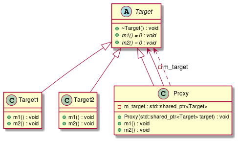

# t00024 - Proxy pattern
## Config
```yaml
compilation_database_dir: ..
output_directory: puml
diagrams:
  t00024_class:
    type: class
    glob:
      - ../../tests/t00024/t00024.cc
    using_namespace:
      - clanguml::t00024
    include:
      namespaces:
        - clanguml::t00024

```
## Source code
File t00024.cc
```cpp
#include <memory>

namespace clanguml {
namespace t00024 {

class Target {
public:
    virtual ~Target() = 0;

    virtual void m1() = 0;
    virtual void m2() = 0;
};

class Target1 : public Target {
public:
    void m1() override { }
    void m2() override { }
};

class Target2 : public Target {
public:
    void m1() override { }
    void m2() override { }
};

class Proxy : public Target {
public:
    Proxy(std::shared_ptr<Target> target)
        : m_target{std::move(target)}
    {
    }
    void m1() override { m_target->m1(); }
    void m2() override { m_target->m2(); }

private:
    std::shared_ptr<Target> m_target;
};
}
}

```
## Generated UML diagrams

