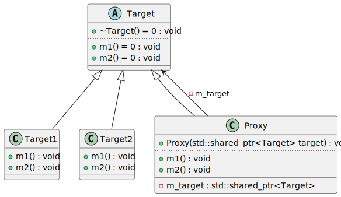

# t00024 - Proxy pattern
## Config
```yaml
diagrams:
  t00024_class:
    type: class
    glob:
      - t00024.cc
    using_namespace: clanguml::t00024
    include:
      namespaces:
        - clanguml::t00024

```
## Source code
File `tests/t00024/t00024.cc`
```cpp
#include <memory>

namespace clanguml {
namespace t00024 {

class Target {
public:
    virtual ~Target() = 0;

    virtual void m1() = 0;
    virtual void m2() = 0;
};

class Target1 : public Target {
public:
    void m1() override { }
    void m2() override { }
};

class Target2 : public Target {
public:
    void m1() override { }
    void m2() override { }
};

class Proxy : public Target {
public:
    Proxy(std::shared_ptr<Target> target)
        : m_target{std::move(target)}
    {
    }
    void m1() override { m_target->m1(); }
    void m2() override { m_target->m2(); }

private:
    std::shared_ptr<Target> m_target;
};
} // namespace t00024
} // namespace clanguml

```
## Generated PlantUML diagrams

## Generated Mermaid diagrams

## Generated JSON models
```json
{
  "diagram_type": "class",
  "elements": [
    {
      "bases": [],
      "display_name": "Target",
      "id": "1116408959993110019",
      "is_abstract": true,
      "is_nested": false,
      "is_struct": false,
      "is_template": false,
      "is_union": false,
      "members": [],
      "methods": [
        {
          "access": "public",
          "display_name": "~Target",
          "is_const": false,
          "is_consteval": false,
          "is_constexpr": false,
          "is_constructor": false,
          "is_copy_assignment": false,
          "is_coroutine": false,
          "is_defaulted": false,
          "is_deleted": false,
          "is_move_assignment": false,
          "is_noexcept": false,
          "is_operator": false,
          "is_pure_virtual": true,
          "is_static": false,
          "is_virtual": true,
          "name": "~Target",
          "parameters": [],
          "source_location": {
            "column": 13,
            "file": "t00024.cc",
            "line": 8,
            "translation_unit": "t00024.cc"
          },
          "template_parameters": [],
          "type": "void"
        },
        {
          "access": "public",
          "display_name": "m1",
          "is_const": false,
          "is_consteval": false,
          "is_constexpr": false,
          "is_constructor": false,
          "is_copy_assignment": false,
          "is_coroutine": false,
          "is_defaulted": false,
          "is_deleted": false,
          "is_move_assignment": false,
          "is_noexcept": false,
          "is_operator": false,
          "is_pure_virtual": true,
          "is_static": false,
          "is_virtual": true,
          "name": "m1",
          "parameters": [],
          "source_location": {
            "column": 18,
            "file": "t00024.cc",
            "line": 10,
            "translation_unit": "t00024.cc"
          },
          "template_parameters": [],
          "type": "void"
        },
        {
          "access": "public",
          "display_name": "m2",
          "is_const": false,
          "is_consteval": false,
          "is_constexpr": false,
          "is_constructor": false,
          "is_copy_assignment": false,
          "is_coroutine": false,
          "is_defaulted": false,
          "is_deleted": false,
          "is_move_assignment": false,
          "is_noexcept": false,
          "is_operator": false,
          "is_pure_virtual": true,
          "is_static": false,
          "is_virtual": true,
          "name": "m2",
          "parameters": [],
          "source_location": {
            "column": 18,
            "file": "t00024.cc",
            "line": 11,
            "translation_unit": "t00024.cc"
          },
          "template_parameters": [],
          "type": "void"
        }
      ],
      "name": "Target",
      "namespace": "clanguml::t00024",
      "source_location": {
        "column": 7,
        "file": "t00024.cc",
        "line": 6,
        "translation_unit": "t00024.cc"
      },
      "template_parameters": [],
      "type": "class"
    },
    {
      "bases": [
        {
          "access": "public",
          "id": "1116408959993110019",
          "is_virtual": false,
          "name": "clanguml::t00024::Target"
        }
      ],
      "display_name": "Target1",
      "id": "669517069151826610",
      "is_abstract": false,
      "is_nested": false,
      "is_struct": false,
      "is_template": false,
      "is_union": false,
      "members": [],
      "methods": [
        {
          "access": "public",
          "display_name": "m1",
          "is_const": false,
          "is_consteval": false,
          "is_constexpr": false,
          "is_constructor": false,
          "is_copy_assignment": false,
          "is_coroutine": false,
          "is_defaulted": false,
          "is_deleted": false,
          "is_move_assignment": false,
          "is_noexcept": false,
          "is_operator": false,
          "is_pure_virtual": false,
          "is_static": false,
          "is_virtual": true,
          "name": "m1",
          "parameters": [],
          "source_location": {
            "column": 10,
            "file": "t00024.cc",
            "line": 16,
            "translation_unit": "t00024.cc"
          },
          "template_parameters": [],
          "type": "void"
        },
        {
          "access": "public",
          "display_name": "m2",
          "is_const": false,
          "is_consteval": false,
          "is_constexpr": false,
          "is_constructor": false,
          "is_copy_assignment": false,
          "is_coroutine": false,
          "is_defaulted": false,
          "is_deleted": false,
          "is_move_assignment": false,
          "is_noexcept": false,
          "is_operator": false,
          "is_pure_virtual": false,
          "is_static": false,
          "is_virtual": true,
          "name": "m2",
          "parameters": [],
          "source_location": {
            "column": 10,
            "file": "t00024.cc",
            "line": 17,
            "translation_unit": "t00024.cc"
          },
          "template_parameters": [],
          "type": "void"
        }
      ],
      "name": "Target1",
      "namespace": "clanguml::t00024",
      "source_location": {
        "column": 7,
        "file": "t00024.cc",
        "line": 14,
        "translation_unit": "t00024.cc"
      },
      "template_parameters": [],
      "type": "class"
    },
    {
      "bases": [
        {
          "access": "public",
          "id": "1116408959993110019",
          "is_virtual": false,
          "name": "clanguml::t00024::Target"
        }
      ],
      "display_name": "Target2",
      "id": "1210513233906695933",
      "is_abstract": false,
      "is_nested": false,
      "is_struct": false,
      "is_template": false,
      "is_union": false,
      "members": [],
      "methods": [
        {
          "access": "public",
          "display_name": "m1",
          "is_const": false,
          "is_consteval": false,
          "is_constexpr": false,
          "is_constructor": false,
          "is_copy_assignment": false,
          "is_coroutine": false,
          "is_defaulted": false,
          "is_deleted": false,
          "is_move_assignment": false,
          "is_noexcept": false,
          "is_operator": false,
          "is_pure_virtual": false,
          "is_static": false,
          "is_virtual": true,
          "name": "m1",
          "parameters": [],
          "source_location": {
            "column": 10,
            "file": "t00024.cc",
            "line": 22,
            "translation_unit": "t00024.cc"
          },
          "template_parameters": [],
          "type": "void"
        },
        {
          "access": "public",
          "display_name": "m2",
          "is_const": false,
          "is_consteval": false,
          "is_constexpr": false,
          "is_constructor": false,
          "is_copy_assignment": false,
          "is_coroutine": false,
          "is_defaulted": false,
          "is_deleted": false,
          "is_move_assignment": false,
          "is_noexcept": false,
          "is_operator": false,
          "is_pure_virtual": false,
          "is_static": false,
          "is_virtual": true,
          "name": "m2",
          "parameters": [],
          "source_location": {
            "column": 10,
            "file": "t00024.cc",
            "line": 23,
            "translation_unit": "t00024.cc"
          },
          "template_parameters": [],
          "type": "void"
        }
      ],
      "name": "Target2",
      "namespace": "clanguml::t00024",
      "source_location": {
        "column": 7,
        "file": "t00024.cc",
        "line": 20,
        "translation_unit": "t00024.cc"
      },
      "template_parameters": [],
      "type": "class"
    },
    {
      "bases": [
        {
          "access": "public",
          "id": "1116408959993110019",
          "is_virtual": false,
          "name": "clanguml::t00024::Target"
        }
      ],
      "display_name": "Proxy",
      "id": "594707401639991215",
      "is_abstract": false,
      "is_nested": false,
      "is_struct": false,
      "is_template": false,
      "is_union": false,
      "members": [
        {
          "access": "private",
          "is_static": false,
          "name": "m_target",
          "source_location": {
            "column": 29,
            "file": "t00024.cc",
            "line": 36,
            "translation_unit": "t00024.cc"
          },
          "type": "std::shared_ptr<Target>"
        }
      ],
      "methods": [
        {
          "access": "public",
          "display_name": "Proxy",
          "is_const": false,
          "is_consteval": false,
          "is_constexpr": false,
          "is_constructor": true,
          "is_copy_assignment": false,
          "is_coroutine": false,
          "is_defaulted": false,
          "is_deleted": false,
          "is_move_assignment": false,
          "is_noexcept": false,
          "is_operator": false,
          "is_pure_virtual": false,
          "is_static": false,
          "is_virtual": false,
          "name": "Proxy",
          "parameters": [
            {
              "name": "target",
              "type": "std::shared_ptr<Target>"
            }
          ],
          "source_location": {
            "column": 5,
            "file": "t00024.cc",
            "line": 28,
            "translation_unit": "t00024.cc"
          },
          "template_parameters": [],
          "type": "void"
        },
        {
          "access": "public",
          "display_name": "m1",
          "is_const": false,
          "is_consteval": false,
          "is_constexpr": false,
          "is_constructor": false,
          "is_copy_assignment": false,
          "is_coroutine": false,
          "is_defaulted": false,
          "is_deleted": false,
          "is_move_assignment": false,
          "is_noexcept": false,
          "is_operator": false,
          "is_pure_virtual": false,
          "is_static": false,
          "is_virtual": true,
          "name": "m1",
          "parameters": [],
          "source_location": {
            "column": 10,
            "file": "t00024.cc",
            "line": 32,
            "translation_unit": "t00024.cc"
          },
          "template_parameters": [],
          "type": "void"
        },
        {
          "access": "public",
          "display_name": "m2",
          "is_const": false,
          "is_consteval": false,
          "is_constexpr": false,
          "is_constructor": false,
          "is_copy_assignment": false,
          "is_coroutine": false,
          "is_defaulted": false,
          "is_deleted": false,
          "is_move_assignment": false,
          "is_noexcept": false,
          "is_operator": false,
          "is_pure_virtual": false,
          "is_static": false,
          "is_virtual": true,
          "name": "m2",
          "parameters": [],
          "source_location": {
            "column": 10,
            "file": "t00024.cc",
            "line": 33,
            "translation_unit": "t00024.cc"
          },
          "template_parameters": [],
          "type": "void"
        }
      ],
      "name": "Proxy",
      "namespace": "clanguml::t00024",
      "source_location": {
        "column": 7,
        "file": "t00024.cc",
        "line": 26,
        "translation_unit": "t00024.cc"
      },
      "template_parameters": [],
      "type": "class"
    }
  ],
  "name": "t00024_class",
  "package_type": "namespace",
  "relationships": [
    {
      "access": "public",
      "destination": "1116408959993110019",
      "source": "669517069151826610",
      "type": "extension"
    },
    {
      "access": "public",
      "destination": "1116408959993110019",
      "source": "1210513233906695933",
      "type": "extension"
    },
    {
      "access": "private",
      "destination": "1116408959993110019",
      "label": "m_target",
      "source": "594707401639991215",
      "type": "association"
    },
    {
      "access": "public",
      "destination": "1116408959993110019",
      "source": "594707401639991215",
      "type": "extension"
    }
  ],
  "using_namespace": "clanguml::t00024"
}
```
