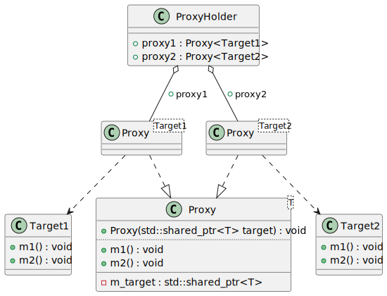

# t00025 - Template proxy pattern
## Config
```yaml
compilation_database_dir: ..
output_directory: puml
diagrams:
  t00025_class:
    type: class
    glob:
      - ../../tests/t00025/t00025.cc
    using_namespace:
      - clanguml::t00025
    include:
      namespaces:
        - clanguml::t00025

```
## Source code
File t00025.cc
```cpp
#include <memory>

namespace clanguml {
namespace t00025 {

class Target1 {
public:
    void m1() { }
    void m2() { }
};

class Target2 {
public:
    void m1() { }
    void m2() { }
};

template <typename T> class Proxy {
public:
    Proxy(std::shared_ptr<T> target)
        : m_target{std::move(target)}
    {
    }
    void m1() { m_target->m1(); }
    void m2() { m_target->m2(); }

private:
    std::shared_ptr<T> m_target;
};

class ProxyHolder {
public:
    Proxy<Target1> proxy1;
    Proxy<Target2> proxy2;
};
} // namespace t00025
} // namespace clanguml

```
## Generated UML diagrams

## Generated JSON models
```json
{
  "diagram_type": "class",
  "elements": [
    {
      "bases": [],
      "display_name": "clanguml::t00025::Target1",
      "id": "1573849034571194138",
      "is_abstract": false,
      "is_nested": false,
      "is_struct": false,
      "is_template": false,
      "is_union": false,
      "members": [],
      "methods": [
        {
          "access": "public",
          "is_const": false,
          "is_consteval": false,
          "is_constexpr": false,
          "is_constructor": false,
          "is_copy_assignment": false,
          "is_defaulted": false,
          "is_deleted": false,
          "is_move_assignment": false,
          "is_noexcept": false,
          "is_operator": false,
          "is_pure_virtual": false,
          "is_static": false,
          "is_virtual": false,
          "name": "m1",
          "parameters": [],
          "source_location": {
            "column": 10,
            "file": "../../tests/t00025/t00025.cc",
            "line": 8,
            "translation_unit": "../../tests/t00025/t00025.cc"
          },
          "type": "void"
        },
        {
          "access": "public",
          "is_const": false,
          "is_consteval": false,
          "is_constexpr": false,
          "is_constructor": false,
          "is_copy_assignment": false,
          "is_defaulted": false,
          "is_deleted": false,
          "is_move_assignment": false,
          "is_noexcept": false,
          "is_operator": false,
          "is_pure_virtual": false,
          "is_static": false,
          "is_virtual": false,
          "name": "m2",
          "parameters": [],
          "source_location": {
            "column": 10,
            "file": "../../tests/t00025/t00025.cc",
            "line": 9,
            "translation_unit": "../../tests/t00025/t00025.cc"
          },
          "type": "void"
        }
      ],
      "name": "Target1",
      "namespace": "clanguml::t00025",
      "source_location": {
        "column": 7,
        "file": "../../tests/t00025/t00025.cc",
        "line": 6,
        "translation_unit": "../../tests/t00025/t00025.cc"
      },
      "template_parameters": [],
      "type": "class"
    },
    {
      "bases": [],
      "display_name": "clanguml::t00025::Target2",
      "id": "751896409461834669",
      "is_abstract": false,
      "is_nested": false,
      "is_struct": false,
      "is_template": false,
      "is_union": false,
      "members": [],
      "methods": [
        {
          "access": "public",
          "is_const": false,
          "is_consteval": false,
          "is_constexpr": false,
          "is_constructor": false,
          "is_copy_assignment": false,
          "is_defaulted": false,
          "is_deleted": false,
          "is_move_assignment": false,
          "is_noexcept": false,
          "is_operator": false,
          "is_pure_virtual": false,
          "is_static": false,
          "is_virtual": false,
          "name": "m1",
          "parameters": [],
          "source_location": {
            "column": 10,
            "file": "../../tests/t00025/t00025.cc",
            "line": 14,
            "translation_unit": "../../tests/t00025/t00025.cc"
          },
          "type": "void"
        },
        {
          "access": "public",
          "is_const": false,
          "is_consteval": false,
          "is_constexpr": false,
          "is_constructor": false,
          "is_copy_assignment": false,
          "is_defaulted": false,
          "is_deleted": false,
          "is_move_assignment": false,
          "is_noexcept": false,
          "is_operator": false,
          "is_pure_virtual": false,
          "is_static": false,
          "is_virtual": false,
          "name": "m2",
          "parameters": [],
          "source_location": {
            "column": 10,
            "file": "../../tests/t00025/t00025.cc",
            "line": 15,
            "translation_unit": "../../tests/t00025/t00025.cc"
          },
          "type": "void"
        }
      ],
      "name": "Target2",
      "namespace": "clanguml::t00025",
      "source_location": {
        "column": 7,
        "file": "../../tests/t00025/t00025.cc",
        "line": 12,
        "translation_unit": "../../tests/t00025/t00025.cc"
      },
      "template_parameters": [],
      "type": "class"
    },
    {
      "bases": [],
      "display_name": "clanguml::t00025::Proxy<T>",
      "id": "1483353300536405088",
      "is_abstract": false,
      "is_nested": false,
      "is_struct": false,
      "is_template": true,
      "is_union": false,
      "members": [
        {
          "access": "private",
          "is_static": false,
          "name": "m_target",
          "source_location": {
            "column": 24,
            "file": "../../tests/t00025/t00025.cc",
            "line": 28,
            "translation_unit": "../../tests/t00025/t00025.cc"
          },
          "type": "std::shared_ptr<T>"
        }
      ],
      "methods": [
        {
          "access": "public",
          "is_const": false,
          "is_consteval": false,
          "is_constexpr": false,
          "is_constructor": true,
          "is_copy_assignment": false,
          "is_defaulted": false,
          "is_deleted": false,
          "is_move_assignment": false,
          "is_noexcept": false,
          "is_operator": false,
          "is_pure_virtual": false,
          "is_static": false,
          "is_virtual": false,
          "name": "Proxy",
          "parameters": [
            {
              "name": "target",
              "type": "std::shared_ptr<T>"
            }
          ],
          "source_location": {
            "column": 5,
            "file": "../../tests/t00025/t00025.cc",
            "line": 20,
            "translation_unit": "../../tests/t00025/t00025.cc"
          },
          "type": "void"
        },
        {
          "access": "public",
          "is_const": false,
          "is_consteval": false,
          "is_constexpr": false,
          "is_constructor": false,
          "is_copy_assignment": false,
          "is_defaulted": false,
          "is_deleted": false,
          "is_move_assignment": false,
          "is_noexcept": false,
          "is_operator": false,
          "is_pure_virtual": false,
          "is_static": false,
          "is_virtual": false,
          "name": "m1",
          "parameters": [],
          "source_location": {
            "column": 10,
            "file": "../../tests/t00025/t00025.cc",
            "line": 24,
            "translation_unit": "../../tests/t00025/t00025.cc"
          },
          "type": "void"
        },
        {
          "access": "public",
          "is_const": false,
          "is_consteval": false,
          "is_constexpr": false,
          "is_constructor": false,
          "is_copy_assignment": false,
          "is_defaulted": false,
          "is_deleted": false,
          "is_move_assignment": false,
          "is_noexcept": false,
          "is_operator": false,
          "is_pure_virtual": false,
          "is_static": false,
          "is_virtual": false,
          "name": "m2",
          "parameters": [],
          "source_location": {
            "column": 10,
            "file": "../../tests/t00025/t00025.cc",
            "line": 25,
            "translation_unit": "../../tests/t00025/t00025.cc"
          },
          "type": "void"
        }
      ],
      "name": "Proxy",
      "namespace": "clanguml::t00025",
      "source_location": {
        "column": 29,
        "file": "../../tests/t00025/t00025.cc",
        "line": 18,
        "translation_unit": "../../tests/t00025/t00025.cc"
      },
      "template_parameters": [
        {
          "is_variadic": false,
          "kind": "template_type",
          "name": "T",
          "template_parameters": []
        }
      ],
      "type": "class"
    },
    {
      "bases": [],
      "display_name": "clanguml::t00025::Proxy<clanguml::t00025::Target1>",
      "id": "1644966842838139424",
      "is_abstract": false,
      "is_nested": false,
      "is_struct": false,
      "is_template": true,
      "is_union": false,
      "members": [],
      "methods": [],
      "name": "Proxy",
      "namespace": "clanguml::t00025",
      "source_location": {
        "column": 29,
        "file": "../../tests/t00025/t00025.cc",
        "line": 18,
        "translation_unit": "../../tests/t00025/t00025.cc"
      },
      "template_parameters": [
        {
          "is_variadic": false,
          "kind": "argument",
          "template_parameters": [],
          "type": "clanguml::t00025::Target1"
        }
      ],
      "type": "class"
    },
    {
      "bases": [],
      "display_name": "clanguml::t00025::Proxy<clanguml::t00025::Target2>",
      "id": "1190103100236298763",
      "is_abstract": false,
      "is_nested": false,
      "is_struct": false,
      "is_template": true,
      "is_union": false,
      "members": [],
      "methods": [],
      "name": "Proxy",
      "namespace": "clanguml::t00025",
      "source_location": {
        "column": 29,
        "file": "../../tests/t00025/t00025.cc",
        "line": 18,
        "translation_unit": "../../tests/t00025/t00025.cc"
      },
      "template_parameters": [
        {
          "is_variadic": false,
          "kind": "argument",
          "template_parameters": [],
          "type": "clanguml::t00025::Target2"
        }
      ],
      "type": "class"
    },
    {
      "bases": [],
      "display_name": "clanguml::t00025::ProxyHolder",
      "id": "1906317303950647748",
      "is_abstract": false,
      "is_nested": false,
      "is_struct": false,
      "is_template": false,
      "is_union": false,
      "members": [
        {
          "access": "public",
          "is_static": false,
          "name": "proxy1",
          "source_location": {
            "column": 20,
            "file": "../../tests/t00025/t00025.cc",
            "line": 33,
            "translation_unit": "../../tests/t00025/t00025.cc"
          },
          "type": "Proxy<clanguml::t00025::Target1>"
        },
        {
          "access": "public",
          "is_static": false,
          "name": "proxy2",
          "source_location": {
            "column": 20,
            "file": "../../tests/t00025/t00025.cc",
            "line": 34,
            "translation_unit": "../../tests/t00025/t00025.cc"
          },
          "type": "Proxy<clanguml::t00025::Target2>"
        }
      ],
      "methods": [],
      "name": "ProxyHolder",
      "namespace": "clanguml::t00025",
      "source_location": {
        "column": 7,
        "file": "../../tests/t00025/t00025.cc",
        "line": 31,
        "translation_unit": "../../tests/t00025/t00025.cc"
      },
      "template_parameters": [],
      "type": "class"
    }
  ],
  "metadata": {
    "clang_uml_version": "0.3.7-49-g3bd8f7f",
    "llvm_version": "Ubuntu clang version 15.0.6",
    "schema_version": 1
  },
  "name": "t00025_class",
  "relationships": [
    {
      "access": "public",
      "destination": "1573849034571194138",
      "source": "1644966842838139424",
      "type": "dependency"
    },
    {
      "access": "public",
      "destination": "1483353300536405088",
      "source": "1644966842838139424",
      "type": "instantiation"
    },
    {
      "access": "public",
      "destination": "751896409461834669",
      "source": "1190103100236298763",
      "type": "dependency"
    },
    {
      "access": "public",
      "destination": "1483353300536405088",
      "source": "1190103100236298763",
      "type": "instantiation"
    },
    {
      "access": "public",
      "destination": "1644966842838139424",
      "label": "proxy1",
      "source": "1906317303950647748",
      "type": "aggregation"
    },
    {
      "access": "public",
      "destination": "1190103100236298763",
      "label": "proxy2",
      "source": "1906317303950647748",
      "type": "aggregation"
    }
  ],
  "using_namespace": "clanguml::t00025"
}
```
