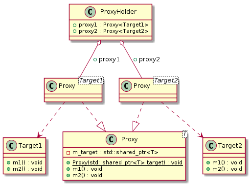

# t00025 - Template proxy pattern
## Config
```yaml
compilation_database_dir: ..
output_directory: puml
diagrams:
  t00025_class:
    type: class
    glob:
      - ../../tests/t00025/t00025.cc
    using_namespace:
      - clanguml::t00025
    include:
      namespaces:
        - clanguml::t00025

```
## Source code
File t00025.cc
```cpp
#include <memory>

namespace clanguml {
namespace t00025 {

class Target1 {
public:
    void m1() {}
    void m2() {}
};

class Target2 {
public:
    void m1() {}
    void m2() {}
};

template <typename T> class Proxy {
public:
    Proxy(std::shared_ptr<T> target)
        : m_target{std::move(target)}
    {
    }
    void m1() { m_target->m1(); }
    void m2() { m_target->m2(); }

private:
    std::shared_ptr<T> m_target;
};

class ProxyHolder {
public:
    Proxy<Target1> proxy1;
    Proxy<Target2> proxy2;
};
}
}

```
## Generated UML diagrams

