# t00025 - Template proxy pattern
## Config
```yaml
diagrams:
  t00025_class:
    type: class
    glob:
      - t00025.cc
    using_namespace: clanguml::t00025
    include:
      namespaces:
        - clanguml::t00025

```
## Source code
File `tests/t00025/t00025.cc`
```cpp
#include <memory>

namespace clanguml {
namespace t00025 {

class Target1 {
public:
    void m1() { }
    void m2() { }
};

class Target2 {
public:
    void m1() { }
    void m2() { }
};

template <typename T> class Proxy {
public:
    Proxy(std::shared_ptr<T> target)
        : m_target{std::move(target)}
    {
    }
    void m1() { m_target->m1(); }
    void m2() { m_target->m2(); }

private:
    std::shared_ptr<T> m_target;
};

class ProxyHolder {
public:
    Proxy<Target1> proxy1;
    Proxy<Target2> proxy2;
};
} // namespace t00025
} // namespace clanguml

```
## Generated PlantUML diagrams

## Generated Mermaid diagrams

## Generated JSON models
```json
{
  "diagram_type": "class",
  "elements": [
    {
      "bases": [],
      "display_name": "Target1",
      "id": "12590792276569553107",
      "is_abstract": false,
      "is_nested": false,
      "is_struct": false,
      "is_template": false,
      "is_union": false,
      "members": [],
      "methods": [
        {
          "access": "public",
          "display_name": "m1",
          "is_const": false,
          "is_consteval": false,
          "is_constexpr": false,
          "is_constructor": false,
          "is_copy_assignment": false,
          "is_coroutine": false,
          "is_defaulted": false,
          "is_deleted": false,
          "is_move_assignment": false,
          "is_noexcept": false,
          "is_operator": false,
          "is_pure_virtual": false,
          "is_static": false,
          "is_virtual": false,
          "name": "m1",
          "parameters": [],
          "source_location": {
            "column": 10,
            "file": "t00025.cc",
            "line": 8,
            "translation_unit": "t00025.cc"
          },
          "template_parameters": [],
          "type": "void"
        },
        {
          "access": "public",
          "display_name": "m2",
          "is_const": false,
          "is_consteval": false,
          "is_constexpr": false,
          "is_constructor": false,
          "is_copy_assignment": false,
          "is_coroutine": false,
          "is_defaulted": false,
          "is_deleted": false,
          "is_move_assignment": false,
          "is_noexcept": false,
          "is_operator": false,
          "is_pure_virtual": false,
          "is_static": false,
          "is_virtual": false,
          "name": "m2",
          "parameters": [],
          "source_location": {
            "column": 10,
            "file": "t00025.cc",
            "line": 9,
            "translation_unit": "t00025.cc"
          },
          "template_parameters": [],
          "type": "void"
        }
      ],
      "name": "Target1",
      "namespace": "clanguml::t00025",
      "source_location": {
        "column": 7,
        "file": "t00025.cc",
        "line": 6,
        "translation_unit": "t00025.cc"
      },
      "template_parameters": [],
      "type": "class"
    },
    {
      "bases": [],
      "display_name": "Target2",
      "id": "6015171275694677358",
      "is_abstract": false,
      "is_nested": false,
      "is_struct": false,
      "is_template": false,
      "is_union": false,
      "members": [],
      "methods": [
        {
          "access": "public",
          "display_name": "m1",
          "is_const": false,
          "is_consteval": false,
          "is_constexpr": false,
          "is_constructor": false,
          "is_copy_assignment": false,
          "is_coroutine": false,
          "is_defaulted": false,
          "is_deleted": false,
          "is_move_assignment": false,
          "is_noexcept": false,
          "is_operator": false,
          "is_pure_virtual": false,
          "is_static": false,
          "is_virtual": false,
          "name": "m1",
          "parameters": [],
          "source_location": {
            "column": 10,
            "file": "t00025.cc",
            "line": 14,
            "translation_unit": "t00025.cc"
          },
          "template_parameters": [],
          "type": "void"
        },
        {
          "access": "public",
          "display_name": "m2",
          "is_const": false,
          "is_consteval": false,
          "is_constexpr": false,
          "is_constructor": false,
          "is_copy_assignment": false,
          "is_coroutine": false,
          "is_defaulted": false,
          "is_deleted": false,
          "is_move_assignment": false,
          "is_noexcept": false,
          "is_operator": false,
          "is_pure_virtual": false,
          "is_static": false,
          "is_virtual": false,
          "name": "m2",
          "parameters": [],
          "source_location": {
            "column": 10,
            "file": "t00025.cc",
            "line": 15,
            "translation_unit": "t00025.cc"
          },
          "template_parameters": [],
          "type": "void"
        }
      ],
      "name": "Target2",
      "namespace": "clanguml::t00025",
      "source_location": {
        "column": 7,
        "file": "t00025.cc",
        "line": 12,
        "translation_unit": "t00025.cc"
      },
      "template_parameters": [],
      "type": "class"
    },
    {
      "bases": [],
      "display_name": "Proxy<T>",
      "id": "11866826404291240710",
      "is_abstract": false,
      "is_nested": false,
      "is_struct": false,
      "is_template": true,
      "is_union": false,
      "members": [
        {
          "access": "private",
          "is_static": false,
          "name": "m_target",
          "source_location": {
            "column": 24,
            "file": "t00025.cc",
            "line": 28,
            "translation_unit": "t00025.cc"
          },
          "type": "std::shared_ptr<T>"
        }
      ],
      "methods": [
        {
          "access": "public",
          "display_name": "Proxy",
          "is_const": false,
          "is_consteval": false,
          "is_constexpr": false,
          "is_constructor": true,
          "is_copy_assignment": false,
          "is_coroutine": false,
          "is_defaulted": false,
          "is_deleted": false,
          "is_move_assignment": false,
          "is_noexcept": false,
          "is_operator": false,
          "is_pure_virtual": false,
          "is_static": false,
          "is_virtual": false,
          "name": "Proxy",
          "parameters": [
            {
              "name": "target",
              "type": "std::shared_ptr<T>"
            }
          ],
          "source_location": {
            "column": 5,
            "file": "t00025.cc",
            "line": 20,
            "translation_unit": "t00025.cc"
          },
          "template_parameters": [],
          "type": "void"
        },
        {
          "access": "public",
          "display_name": "m1",
          "is_const": false,
          "is_consteval": false,
          "is_constexpr": false,
          "is_constructor": false,
          "is_copy_assignment": false,
          "is_coroutine": false,
          "is_defaulted": false,
          "is_deleted": false,
          "is_move_assignment": false,
          "is_noexcept": false,
          "is_operator": false,
          "is_pure_virtual": false,
          "is_static": false,
          "is_virtual": false,
          "name": "m1",
          "parameters": [],
          "source_location": {
            "column": 10,
            "file": "t00025.cc",
            "line": 24,
            "translation_unit": "t00025.cc"
          },
          "template_parameters": [],
          "type": "void"
        },
        {
          "access": "public",
          "display_name": "m2",
          "is_const": false,
          "is_consteval": false,
          "is_constexpr": false,
          "is_constructor": false,
          "is_copy_assignment": false,
          "is_coroutine": false,
          "is_defaulted": false,
          "is_deleted": false,
          "is_move_assignment": false,
          "is_noexcept": false,
          "is_operator": false,
          "is_pure_virtual": false,
          "is_static": false,
          "is_virtual": false,
          "name": "m2",
          "parameters": [],
          "source_location": {
            "column": 10,
            "file": "t00025.cc",
            "line": 25,
            "translation_unit": "t00025.cc"
          },
          "template_parameters": [],
          "type": "void"
        }
      ],
      "name": "Proxy",
      "namespace": "clanguml::t00025",
      "source_location": {
        "column": 29,
        "file": "t00025.cc",
        "line": 18,
        "translation_unit": "t00025.cc"
      },
      "template_parameters": [
        {
          "is_variadic": false,
          "kind": "template_type",
          "name": "T",
          "template_parameters": []
        }
      ],
      "type": "class"
    },
    {
      "bases": [],
      "display_name": "Proxy<Target1>",
      "id": "13159734742705115399",
      "is_abstract": false,
      "is_nested": false,
      "is_struct": false,
      "is_template": true,
      "is_union": false,
      "members": [],
      "methods": [],
      "name": "Proxy",
      "namespace": "clanguml::t00025",
      "source_location": {
        "column": 29,
        "file": "t00025.cc",
        "line": 18,
        "translation_unit": "t00025.cc"
      },
      "template_parameters": [
        {
          "is_variadic": false,
          "kind": "argument",
          "template_parameters": [],
          "type": "Target1"
        }
      ],
      "type": "class"
    },
    {
      "bases": [],
      "display_name": "Proxy<Target2>",
      "id": "9520824801890390106",
      "is_abstract": false,
      "is_nested": false,
      "is_struct": false,
      "is_template": true,
      "is_union": false,
      "members": [],
      "methods": [],
      "name": "Proxy",
      "namespace": "clanguml::t00025",
      "source_location": {
        "column": 29,
        "file": "t00025.cc",
        "line": 18,
        "translation_unit": "t00025.cc"
      },
      "template_parameters": [
        {
          "is_variadic": false,
          "kind": "argument",
          "template_parameters": [],
          "type": "Target2"
        }
      ],
      "type": "class"
    },
    {
      "bases": [],
      "display_name": "ProxyHolder",
      "id": "15250538431605181984",
      "is_abstract": false,
      "is_nested": false,
      "is_struct": false,
      "is_template": false,
      "is_union": false,
      "members": [
        {
          "access": "public",
          "is_static": false,
          "name": "proxy1",
          "source_location": {
            "column": 20,
            "file": "t00025.cc",
            "line": 33,
            "translation_unit": "t00025.cc"
          },
          "type": "Proxy<Target1>"
        },
        {
          "access": "public",
          "is_static": false,
          "name": "proxy2",
          "source_location": {
            "column": 20,
            "file": "t00025.cc",
            "line": 34,
            "translation_unit": "t00025.cc"
          },
          "type": "Proxy<Target2>"
        }
      ],
      "methods": [],
      "name": "ProxyHolder",
      "namespace": "clanguml::t00025",
      "source_location": {
        "column": 7,
        "file": "t00025.cc",
        "line": 31,
        "translation_unit": "t00025.cc"
      },
      "template_parameters": [],
      "type": "class"
    }
  ],
  "name": "t00025_class",
  "package_type": "namespace",
  "relationships": [
    {
      "access": "public",
      "destination": "12590792276569553107",
      "source": "13159734742705115399",
      "type": "dependency"
    },
    {
      "access": "public",
      "destination": "11866826404291240710",
      "source": "13159734742705115399",
      "type": "instantiation"
    },
    {
      "access": "public",
      "destination": "6015171275694677358",
      "source": "9520824801890390106",
      "type": "dependency"
    },
    {
      "access": "public",
      "destination": "11866826404291240710",
      "source": "9520824801890390106",
      "type": "instantiation"
    },
    {
      "access": "public",
      "destination": "13159734742705115399",
      "label": "proxy1",
      "source": "15250538431605181984",
      "type": "aggregation"
    },
    {
      "access": "public",
      "destination": "9520824801890390106",
      "label": "proxy2",
      "source": "15250538431605181984",
      "type": "aggregation"
    }
  ],
  "using_namespace": "clanguml::t00025"
}
```
## Generated GraphML models
```xml
<?xml version="1.0"?>
<graphml xmlns="http://graphml.graphdrawing.org/xmlns" xmlns:xsi="http://www.w3.org/2001/XMLSchema-instance" xsi:schemaLocation="http://graphml.graphdrawing.org/xmlns http://graphml.graphdrawing.org/xmlns/1.0/graphml.xsd">
 <key attr.name="id" attr.type="string" for="graph" id="gd0" />
 <key attr.name="diagram_type" attr.type="string" for="graph" id="gd1" />
 <key attr.name="name" attr.type="string" for="graph" id="gd2" />
 <key attr.name="using_namespace" attr.type="string" for="graph" id="gd3" />
 <key attr.name="id" attr.type="string" for="node" id="nd0" />
 <key attr.name="type" attr.type="string" for="node" id="nd1" />
 <key attr.name="name" attr.type="string" for="node" id="nd2" />
 <key attr.name="stereotype" attr.type="string" for="node" id="nd3" />
 <key attr.name="url" attr.type="string" for="node" id="nd4" />
 <key attr.name="tooltip" attr.type="string" for="node" id="nd5" />
 <key attr.name="is_template" attr.type="boolean" for="node" id="nd6" />
 <key attr.name="type" attr.type="string" for="edge" id="ed0" />
 <key attr.name="access" attr.type="string" for="edge" id="ed1" />
 <key attr.name="label" attr.type="string" for="edge" id="ed2" />
 <key attr.name="url" attr.type="string" for="edge" id="ed3" />
 <graph id="g0" edgedefault="directed" parse.nodeids="canonical" parse.edgeids="canonical" parse.order="nodesfirst">
  <data key="gd3">clanguml::t00025</data>
  <node id="n0">
   <data key="nd1">class</data>
   <data key="nd2"><![CDATA[Target1]]></data>
   <data key="nd6">false</data>
   <data key="nd4">https://github.com/bkryza/clang-uml/blob/1fa698c8f418c67d7d8c4f8e23c3e56636a93f97/tests/t00025/t00025.cc#L6</data>
   <data key="nd5">Target1</data>
  </node>
  <node id="n1">
   <data key="nd1">class</data>
   <data key="nd2"><![CDATA[Target2]]></data>
   <data key="nd6">false</data>
   <data key="nd4">https://github.com/bkryza/clang-uml/blob/1fa698c8f418c67d7d8c4f8e23c3e56636a93f97/tests/t00025/t00025.cc#L12</data>
   <data key="nd5">Target2</data>
  </node>
  <node id="n2">
   <data key="nd1">class</data>
   <data key="nd2"><![CDATA[Proxy<T>]]></data>
   <data key="nd6">true</data>
   <data key="nd4">https://github.com/bkryza/clang-uml/blob/1fa698c8f418c67d7d8c4f8e23c3e56636a93f97/tests/t00025/t00025.cc#L18</data>
   <data key="nd5">Proxy</data>
  </node>
  <node id="n3">
   <data key="nd1">class</data>
   <data key="nd2"><![CDATA[Proxy<Target1>]]></data>
   <data key="nd6">true</data>
   <data key="nd4">https://github.com/bkryza/clang-uml/blob/1fa698c8f418c67d7d8c4f8e23c3e56636a93f97/tests/t00025/t00025.cc#L18</data>
   <data key="nd5">Proxy</data>
  </node>
  <node id="n4">
   <data key="nd1">class</data>
   <data key="nd2"><![CDATA[Proxy<Target2>]]></data>
   <data key="nd6">true</data>
   <data key="nd4">https://github.com/bkryza/clang-uml/blob/1fa698c8f418c67d7d8c4f8e23c3e56636a93f97/tests/t00025/t00025.cc#L18</data>
   <data key="nd5">Proxy</data>
  </node>
  <node id="n5">
   <data key="nd1">class</data>
   <data key="nd2"><![CDATA[ProxyHolder]]></data>
   <data key="nd6">false</data>
   <data key="nd4">https://github.com/bkryza/clang-uml/blob/1fa698c8f418c67d7d8c4f8e23c3e56636a93f97/tests/t00025/t00025.cc#L31</data>
   <data key="nd5">ProxyHolder</data>
  </node>
  <edge id="e0" source="n3" target="n0">
   <data key="ed0">dependency</data>
   <data key="ed1">public</data>
  </edge>
  <edge id="e1" source="n3" target="n2">
   <data key="ed0">instantiation</data>
   <data key="ed1">public</data>
  </edge>
  <edge id="e2" source="n4" target="n1">
   <data key="ed0">dependency</data>
   <data key="ed1">public</data>
  </edge>
  <edge id="e3" source="n4" target="n2">
   <data key="ed0">instantiation</data>
   <data key="ed1">public</data>
  </edge>
  <edge id="e4" source="n5" target="n3">
   <data key="ed0">aggregation</data>
   <data key="ed2">proxy1</data>
   <data key="ed1">public</data>
  </edge>
  <edge id="e5" source="n5" target="n4">
   <data key="ed0">aggregation</data>
   <data key="ed2">proxy2</data>
   <data key="ed1">public</data>
  </edge>
 </graph>
</graphml>

```
