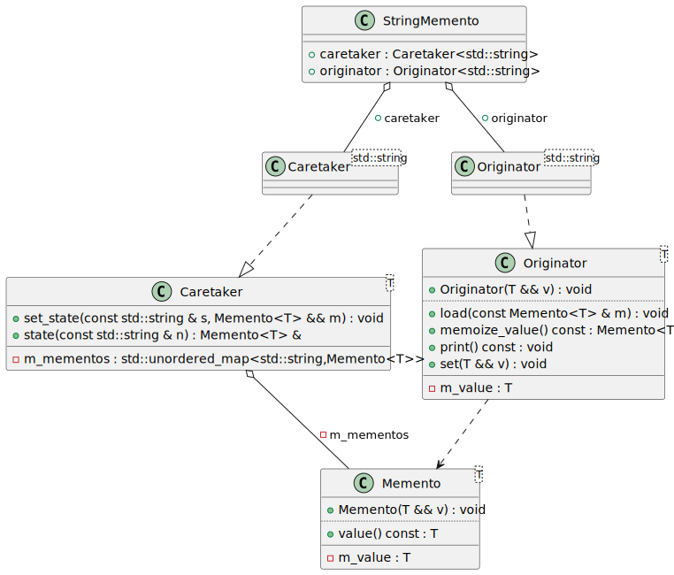

# t00026 - Template memento pattern
## Config
```yaml
compilation_database_dir: ..
output_directory: puml
diagrams:
  t00026_class:
    type: class
    glob:
      - ../../tests/t00026/t00026.cc
    using_namespace:
      - clanguml::t00026
    include:
      namespaces:
        - clanguml::t00026

```
## Source code
File t00026.cc
```cpp
#include <iostream>
#include <memory>
#include <unordered_map>

namespace clanguml {
namespace t00026 {

template <typename T> class Memento {
public:
    Memento(T &&v)
        : m_value(std::forward<T>(v))
    {
    }

    T value() const { return m_value; }

private:
    T m_value;
};

template <typename T> class Originator {
public:
    Originator(T &&v)
        : m_value(std::forward<T>(v))
    {
    }

    Memento<T> memoize_value() const { return Memento<T>{m_value}; }

    void load(const Memento<T> &m) { m_value = m.value(); }

    void print() const { std::cout << m_value << std::endl; }

    void set(T &&v) { m_value = std::forward<T>(v); }

private:
    T m_value;
};

template <typename T> class Caretaker {
public:
    Memento<T> &state(const std::string &n) { return m_mementos.at(n); }

    void set_state(const std::string &s, Memento<T> &&m)
    {
        m_mementos.try_emplace(s, std::move(m));
    }

private:
    std::unordered_map<std::string, Memento<T>> m_mementos;
};

struct StringMemento {
    Caretaker<std::string> caretaker;
    Originator<std::string> originator;
};
} // namespace t00026
} // namespace clanguml

```
## Generated UML diagrams

## Generated JSON models
```json
{
  "diagram_type": "class",
  "elements": [
    {
      "bases": [],
      "display_name": "clanguml::t00026::Memento<T>",
      "id": "1241204213727905390",
      "is_abstract": false,
      "is_nested": false,
      "is_struct": false,
      "is_template": true,
      "is_union": false,
      "members": [
        {
          "access": "private",
          "is_static": false,
          "name": "m_value",
          "source_location": {
            "file": "../../tests/t00026/t00026.cc",
            "line": 18
          },
          "type": "T"
        }
      ],
      "methods": [
        {
          "access": "public",
          "is_const": false,
          "is_defaulted": false,
          "is_implicit": false,
          "is_pure_virtual": false,
          "is_static": false,
          "is_virtual": false,
          "name": "Memento<T>",
          "parameters": [
            {
              "name": "v",
              "type": "T &&"
            }
          ],
          "type": "void"
        },
        {
          "access": "public",
          "is_const": true,
          "is_defaulted": false,
          "is_implicit": false,
          "is_pure_virtual": false,
          "is_static": false,
          "is_virtual": false,
          "name": "value",
          "parameters": [],
          "type": "T"
        }
      ],
      "name": "Memento",
      "namespace": "clanguml::t00026",
      "source_location": {
        "file": "../../tests/t00026/t00026.cc",
        "line": 8
      },
      "template_parameters": [
        {
          "is_variadic": false,
          "kind": "template_type",
          "name": "T",
          "template_parameters": []
        }
      ],
      "type": "class"
    },
    {
      "bases": [],
      "display_name": "clanguml::t00026::Originator<T>",
      "id": "1324770803720816727",
      "is_abstract": false,
      "is_nested": false,
      "is_struct": false,
      "is_template": true,
      "is_union": false,
      "members": [
        {
          "access": "private",
          "is_static": false,
          "name": "m_value",
          "source_location": {
            "file": "../../tests/t00026/t00026.cc",
            "line": 37
          },
          "type": "T"
        }
      ],
      "methods": [
        {
          "access": "public",
          "is_const": false,
          "is_defaulted": false,
          "is_implicit": false,
          "is_pure_virtual": false,
          "is_static": false,
          "is_virtual": false,
          "name": "Originator<T>",
          "parameters": [
            {
              "name": "v",
              "type": "T &&"
            }
          ],
          "type": "void"
        },
        {
          "access": "public",
          "is_const": true,
          "is_defaulted": false,
          "is_implicit": false,
          "is_pure_virtual": false,
          "is_static": false,
          "is_virtual": false,
          "name": "memoize_value",
          "parameters": [],
          "type": "Memento<T>"
        },
        {
          "access": "public",
          "is_const": false,
          "is_defaulted": false,
          "is_implicit": false,
          "is_pure_virtual": false,
          "is_static": false,
          "is_virtual": false,
          "name": "load",
          "parameters": [
            {
              "name": "m",
              "type": "const Memento<T> &"
            }
          ],
          "type": "void"
        },
        {
          "access": "public",
          "is_const": true,
          "is_defaulted": false,
          "is_implicit": false,
          "is_pure_virtual": false,
          "is_static": false,
          "is_virtual": false,
          "name": "print",
          "parameters": [],
          "type": "void"
        },
        {
          "access": "public",
          "is_const": false,
          "is_defaulted": false,
          "is_implicit": false,
          "is_pure_virtual": false,
          "is_static": false,
          "is_virtual": false,
          "name": "set",
          "parameters": [
            {
              "name": "v",
              "type": "T &&"
            }
          ],
          "type": "void"
        }
      ],
      "name": "Originator",
      "namespace": "clanguml::t00026",
      "source_location": {
        "file": "../../tests/t00026/t00026.cc",
        "line": 21
      },
      "template_parameters": [
        {
          "is_variadic": false,
          "kind": "template_type",
          "name": "T",
          "template_parameters": []
        }
      ],
      "type": "class"
    },
    {
      "bases": [],
      "display_name": "clanguml::t00026::Caretaker<T>",
      "id": "2032715387182792204",
      "is_abstract": false,
      "is_nested": false,
      "is_struct": false,
      "is_template": true,
      "is_union": false,
      "members": [
        {
          "access": "private",
          "is_static": false,
          "name": "m_mementos",
          "source_location": {
            "file": "../../tests/t00026/t00026.cc",
            "line": 50
          },
          "type": "std::unordered_map<std::string,Memento<T>>"
        }
      ],
      "methods": [
        {
          "access": "public",
          "is_const": false,
          "is_defaulted": false,
          "is_implicit": false,
          "is_pure_virtual": false,
          "is_static": false,
          "is_virtual": false,
          "name": "state",
          "parameters": [
            {
              "name": "n",
              "type": "const std::string &"
            }
          ],
          "type": "Memento<T> &"
        },
        {
          "access": "public",
          "is_const": false,
          "is_defaulted": false,
          "is_implicit": false,
          "is_pure_virtual": false,
          "is_static": false,
          "is_virtual": false,
          "name": "set_state",
          "parameters": [
            {
              "name": "s",
              "type": "const std::string &"
            },
            {
              "name": "m",
              "type": "Memento<T> &&"
            }
          ],
          "type": "void"
        }
      ],
      "name": "Caretaker",
      "namespace": "clanguml::t00026",
      "source_location": {
        "file": "../../tests/t00026/t00026.cc",
        "line": 40
      },
      "template_parameters": [
        {
          "is_variadic": false,
          "kind": "template_type",
          "name": "T",
          "template_parameters": []
        }
      ],
      "type": "class"
    },
    {
      "bases": [],
      "display_name": "clanguml::t00026::Caretaker<std::string>",
      "id": "1708482137721157489",
      "is_abstract": false,
      "is_nested": false,
      "is_struct": false,
      "is_template": true,
      "is_union": false,
      "members": [],
      "methods": [],
      "name": "Caretaker",
      "namespace": "clanguml::t00026",
      "template_parameters": [
        {
          "is_variadic": false,
          "kind": "argument",
          "template_parameters": [],
          "type": "std::string"
        }
      ],
      "type": "class"
    },
    {
      "bases": [],
      "display_name": "clanguml::t00026::Originator<std::string>",
      "id": "1014247960805363560",
      "is_abstract": false,
      "is_nested": false,
      "is_struct": false,
      "is_template": true,
      "is_union": false,
      "members": [],
      "methods": [],
      "name": "Originator",
      "namespace": "clanguml::t00026",
      "template_parameters": [
        {
          "is_variadic": false,
          "kind": "argument",
          "template_parameters": [],
          "type": "std::string"
        }
      ],
      "type": "class"
    },
    {
      "bases": [],
      "display_name": "clanguml::t00026::StringMemento",
      "id": "851750942915129289",
      "is_abstract": false,
      "is_nested": false,
      "is_struct": true,
      "is_template": false,
      "is_union": false,
      "members": [
        {
          "access": "public",
          "is_static": false,
          "name": "caretaker",
          "source_location": {
            "file": "../../tests/t00026/t00026.cc",
            "line": 54
          },
          "type": "Caretaker<std::string>"
        },
        {
          "access": "public",
          "is_static": false,
          "name": "originator",
          "source_location": {
            "file": "../../tests/t00026/t00026.cc",
            "line": 55
          },
          "type": "Originator<std::string>"
        }
      ],
      "methods": [],
      "name": "StringMemento",
      "namespace": "clanguml::t00026",
      "source_location": {
        "file": "../../tests/t00026/t00026.cc",
        "line": 53
      },
      "template_parameters": [],
      "type": "class"
    }
  ],
  "metadata": {
    "clang_uml_version": "0.3.5",
    "llvm_version": "Ubuntu clang version 15.0.6",
    "schema_version": 1
  },
  "name": "t00026_class",
  "relationships": [
    {
      "access": "public",
      "destination": "1241204213727905390",
      "source": "1324770803720816727",
      "type": "dependency"
    },
    {
      "access": "public",
      "destination": "1241204213727905390",
      "source": "2032715387182792204",
      "type": "dependency"
    },
    {
      "access": "private",
      "destination": "1241204213727905390",
      "label": "m_mementos",
      "source": "2032715387182792204",
      "type": "aggregation"
    },
    {
      "access": "public",
      "destination": "2032715387182792204",
      "source": "1708482137721157489",
      "type": "instantiation"
    },
    {
      "access": "public",
      "destination": "1324770803720816727",
      "source": "1014247960805363560",
      "type": "instantiation"
    },
    {
      "access": "public",
      "destination": "1708482137721157489",
      "label": "caretaker",
      "source": "851750942915129289",
      "type": "aggregation"
    },
    {
      "access": "public",
      "destination": "1014247960805363560",
      "label": "originator",
      "source": "851750942915129289",
      "type": "aggregation"
    }
  ],
  "using_namespace": "clanguml::t00026"
}
```
